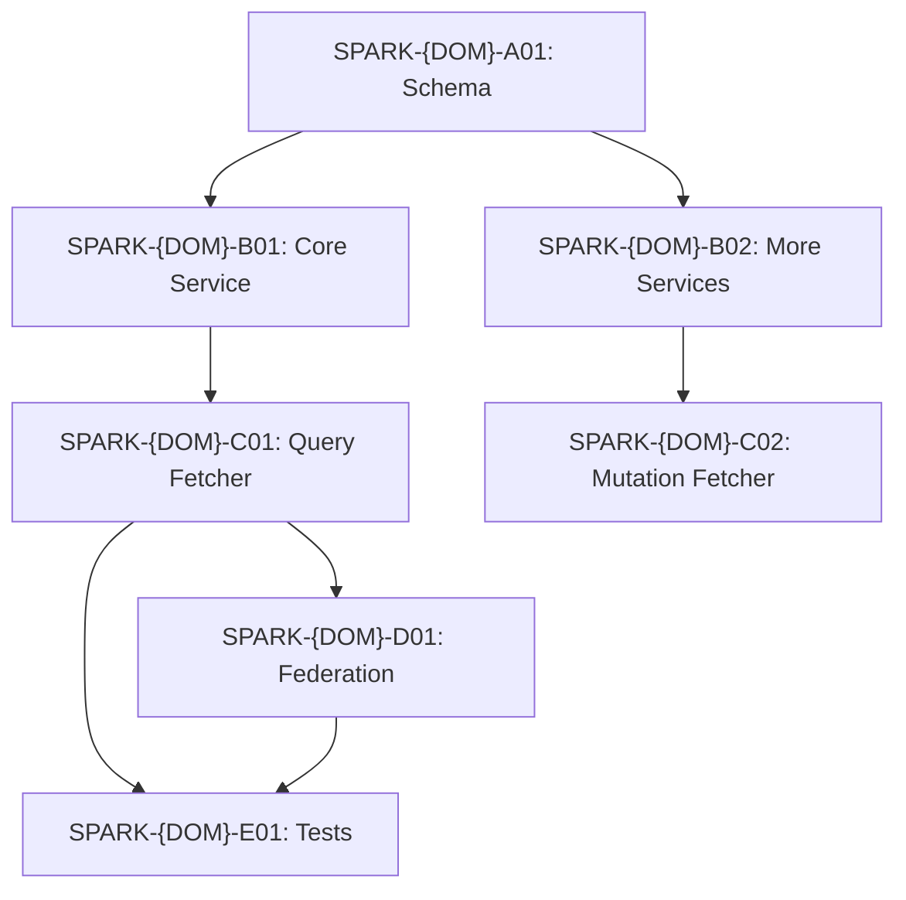

# Skill: Migration Story Generation

## Purpose

Transform completed analysis artifacts into Jira-ready engineering stories. Each story embeds the Phase 2 pseudo-logic as the implementation spec, with acceptance criteria, files to create, test cases, and dependency chains.

Also produces a PO-facing sprint planning summary with effort estimates, sprint sequencing, and capacity planning.

## When to Use

- After completing Phases 1, 2, and 3 for a domain
- When engineering team is ready to start implementation and needs Jira tickets
- When PO needs sprint planning input with effort estimates

## Cannot Run Without

- `output/{domain}/02-resolver-analysis.md` — pseudo-logic populates Current Behavior in every story
- `output/{domain}/03-schema.graphql` — schema referenced by CAT-1 stories
- `output/{domain}/03-schema-analysis.md` — type classification drives CAT-4 stories

**Do not proceed without these files.** Improvising stories without upstream artifacts produces inconsistent acceptance criteria and engineers lose traceability.

## Reference Files to Read First

| For… | Read |
|------|------|
| Universal output conventions (header, status symbols, EXT severity, effort scale) | `reference/output-conventions.md` |
| Story template, granularity rules, ID convention, acceptance-criteria quality bar | `templates/story-format.md` |
| Federation/stitching for CAT-4 stories | `reference/federation-patterns.md` and `skills/stitching-pattern-analysis/SKILL.md` |

---

## Story Categories

| Code | Name | Builds | Depends On |
|------|------|--------|-----------|
| CAT-1 | Schema migration | `.graphqls` in DGS | None |
| CAT-2 | Resolver / data fetcher | `@DgsQuery`, `@DgsMutation`, `@DgsData` classes | CAT-1 + CAT-3 |
| CAT-3 | Service logic | Kotlin service, Feign client, DTOs | CAT-1 |
| CAT-4 | Federation / stitching | Hive Gateway config, entity fetchers | CAT-1 + CAT-2 |
| CAT-5 | Test coverage | Unit, integration, parity tests | CAT-2 + CAT-4 |

---

## Story Granularity Rules

| Rule | Default | Exception |
|------|---------|-----------|
| One story per operation | Each query / mutation = one story | Group ≤ 3 structurally identical CRUD ops |
| Field resolvers | Own story when they make a service call | Trivial pass-throughs bundled into parent query story |
| Service before resolver | CAT-3 service stories before CAT-2 fetcher stories | n/a |
| Schema first | CAT-1 blocks all CAT-2 / CAT-3 | n/a |
| Test stories | One CAT-5 per functional phase | Add a parity-test story per High/Very-High complexity operation |
| **Composite key entity stubs** | **One Phase E story for the stub resolver + one CAT-4 Phase F story per owning subgraph** | **Owning-subgraph CAT-4 stories go in that domain's `04-stories.md`, not the defining domain's. Add `BLOCKED-BY: {domain} migration` placeholders in the defining domain file until those domains are in scope. See `reference/federation-patterns.md` §9.** |

---

## Story ID and Functional Phase Convention

Format: `SPARK-{DOMAIN_ABBREV}-{PHASE_LETTER}{SEQUENCE}`

Stories are grouped by **functional phase** (what they deliver), not by technical category:

- **Phase A — Foundation & Schema** (CAT-1, shared infra, DTOs)
- **Phase B — Core Reads** (highest-priority queries)
- **Phase C — Mutations** (CRUD + side effects)
- **Phase D — Search & Listing** (paginated/filtered queries)
- **Phase E — Complex Operations** (orchestration, ACL, parallel calls, composite key stub resolvers + aggregation facades)
- **Phase F — Federation & Stitching** (CAT-4: entity fetchers, Hive Gateway config, per-subgraph extensions of composite key types)
- **Phase G — Test & Parity** (CAT-5)

Technical category (CAT-1–5) is metadata on each story, not the grouping key.

---

## Acceptance Criteria Quality Bar

Every criterion must be **objectively verifiable** by a reviewer who hasn't seen the story before.

| Rejected | Replace With |
|---------|-------------|
| "Handles errors appropriately" | "Returns null on 404; throws DgsEntityNotFoundException on 500" |
| "Transforms the response correctly" | "Converts snake_case `partner_id` → camelCase `partnerId` via Jackson" |
| "Calls the correct service" | "Calls GET `{base-url}/enterprise_product_development_products/v1/{id}`" |
| "Tests pass" | "Unit test `getBom_returnsNull_on404` passes" |

---

## Step-by-Step Procedure

### Step 1: Generate CAT-1 Schema Stories

One or two stories to add the DGS schema file. Reference `output/{domain}/03-schema.graphql`.

Typically: one story per domain schema file (types + queries + mutations), plus optionally a separate federation config story if `@key` setup is complex.

### Step 2: Generate CAT-3 Service Layer Stories

One story per logical service method group. Each story creates:
- Feign client interface
- Service class with methods
- Request/Response DTO classes
- Jackson case conversion configuration

Group closely related methods (e.g., `getBom` + `getBomByPartnerAndProduct`) if they share the same DTO and Feign client setup.

### Step 3: Generate CAT-2 Resolver Stories

One story per query, mutation, or complex field resolver. Each creates:
- DGS data fetcher class
- DataLoader classes (if batched)
- Entity fetcher (if federated)

### Step 4: Generate CAT-4 Stitching Stories

One story per cross-domain boundary requiring Hive Gateway configuration. Load `stitching-pattern-analysis` skill for implementation patterns.

Source: EXT Service Call Inventory from `02-resolver-analysis.md` and External Type Stubs from `03-schema-analysis.md`.

**Composite Key Entity Sub-Stories (Multi-Subgraph Pattern):**

When a query returns a type classified with `@key(fields: "X Y")` composite key and the `03-schema-analysis.md` shows stub fields annotated `# → {domain} subgraph`, generate sub-stories as follows:

1. One Phase E story (CAT-2 + CAT-3): Defining subgraph stub resolver + aggregation facade (Option D Phase 1).
2. For each owning subgraph listed in the stubs (N subgraphs): one CAT-4 Phase F story in **that domain's story file**. In the current domain's file, add a placeholder story: `SPARK-{DOM}-F{N}: [PLACEHOLDER] Migrate {field(s)} to {Domain} subgraph — BLOCKED-BY: {domain} migration`. Set effort = 1–2d per subgraph.
3. One final CAT-4 story: retire the aggregation facade once all subgraph extensions are live.

This pattern applies to: `getProductTechPackCountV1`, `getProductTechPackBulkCountV1`, and any future query returning a composite-keyed aggregate type. See `reference/federation-patterns.md` §9.

### Step 5: Generate CAT-5 Test Stories

One CAT-5 story per functional phase:
- Unit test suite for service layer methods
- Unit test suite for data fetchers
- Integration test suite
- Parity test suite for High/Very-High complexity operations

### Step 6: Build Dependency Graph



### Step 7: Build Risk Register

| Risk | Likelihood | Impact | Mitigation | Owner |
|------|-----------|--------|------------|-------|

At least one entry per Very High complexity story. Owner must be: PO, Tech Lead, Backend Eng, Platform, or Gateway Team.

### Step 8: Write PO Summary

The PO summary follows `templates/story-format.md` PO Summary section:
- What Are We Building? (2–3 paragraphs, plain English)
- Migration Scope (operation counts table)
- Story Summary by Phase (effort ranges + buffer)
- Key Risk Areas (risk table, no technical detail)
- Decisions Required from PO / Architecture (with due-before dates)
- Dependency Map (text-format dependency tree)
- Recommended Sprint Sequencing (sprint-by-sprint table)
- Capacity Planning (1, 2, 3-engineer team variants)

---

## Capacity Planning Reference

| Team Size | Parallelism | Calendar Time |
|-----------|------------|--------------|
| 1 engineer | None | Full estimated range |
| 2 engineers | Phases A+B in parallel | ~60% of full range |
| 3–4 engineers | A + B + D in parallel | ~40–50% of full range |

Only phases with no shared dependencies can truly parallelize. CAT-1 schema (Phase A) always blocks CAT-2 and CAT-3.

---

## Output Format

Write TWO files following `templates/story-format.md`:

### `output/{domain}/04-stories.md` (Engineer-facing)
```
# {Domain} — Migration Plan & Stories
## 1. Migration Phases Overview (table)
## 2. Dependency Graph (Mermaid)
## 3. Story List (by phase A–Z, full story template per story)
## 4. Risk Register
## Summary (effort totals, critical path)
```

### `output/{domain}/04-po-summary.md` (PO-facing)
```
# {Domain} — PO Sprint Planning Summary
## What Are We Building?
## Migration Scope
## Story Summary by Phase
## Key Risk Areas
## Decisions Required
## Dependency Map
## Recommended Sprint Sequencing
## Capacity Planning
```

PO summary rules:
- No pseudo-logic — plain English only
- Every story from `04-stories.md` appears in the Story Summary table
- Effort uses human labels: Small (1–2d), Medium (3–5d), Large (5–8d), X-Large (8–13d)
- Sprint recommendations assume ~2–3 stories per sprint unless parallelism allows more

---

## Completion Criteria

- [ ] Every query has at least one CAT-2 + one CAT-3 story (or grouped per granularity rules)
- [ ] Every mutation has at least one CAT-2 + one CAT-3 story
- [ ] Every complex field resolver has its own story
- [ ] At least one CAT-1 story references `03-schema.graphql`
- [ ] At least one CAT-4 story per cross-domain boundary in the EXT inventory
- [ ] Every story embeds relevant Phase 2 pseudo-logic in Current Behavior
- [ ] For operations returning a composite key entity: stub resolver story + per-subgraph CAT-4 placeholder stories are present (see granularity rule)
- [ ] Every story uses the mandatory template from `templates/story-format.md` (no missing sections)
- [ ] Every EXT call in story descriptions uses the universal severity tag
- [ ] Acceptance criteria are objectively verifiable (no vague language)
- [ ] Mermaid dependency graph is present
- [ ] Risk Register has at least one entry per High/Very-High complexity story with owner
- [ ] Stories are grouped by functional phase A–Z
- [ ] Effort totals include the +20% buffer
- [ ] `04-stories.md` AND `04-po-summary.md` are both written
- [ ] Every story in `04-stories.md` appears in the PO summary Story table
- [ ] PO summary includes Decisions Required table and sprint sequencing
- [ ] Response footer included

## Pipeline Complete

After this skill, the domain has all 6 artifacts:
1. `01-schema-inventory.md` — what files exist and how they relate
2. `02-resolver-analysis.md` — what the code does (pseudo-logic)
3. `03-schema.graphql` + `03-schema-analysis.md` — the DGS schema contract
4. `04-stories.md` — how to build it (engineer-facing)
5. `04-po-summary.md` — what to build and when (PO-facing sprint plan)
