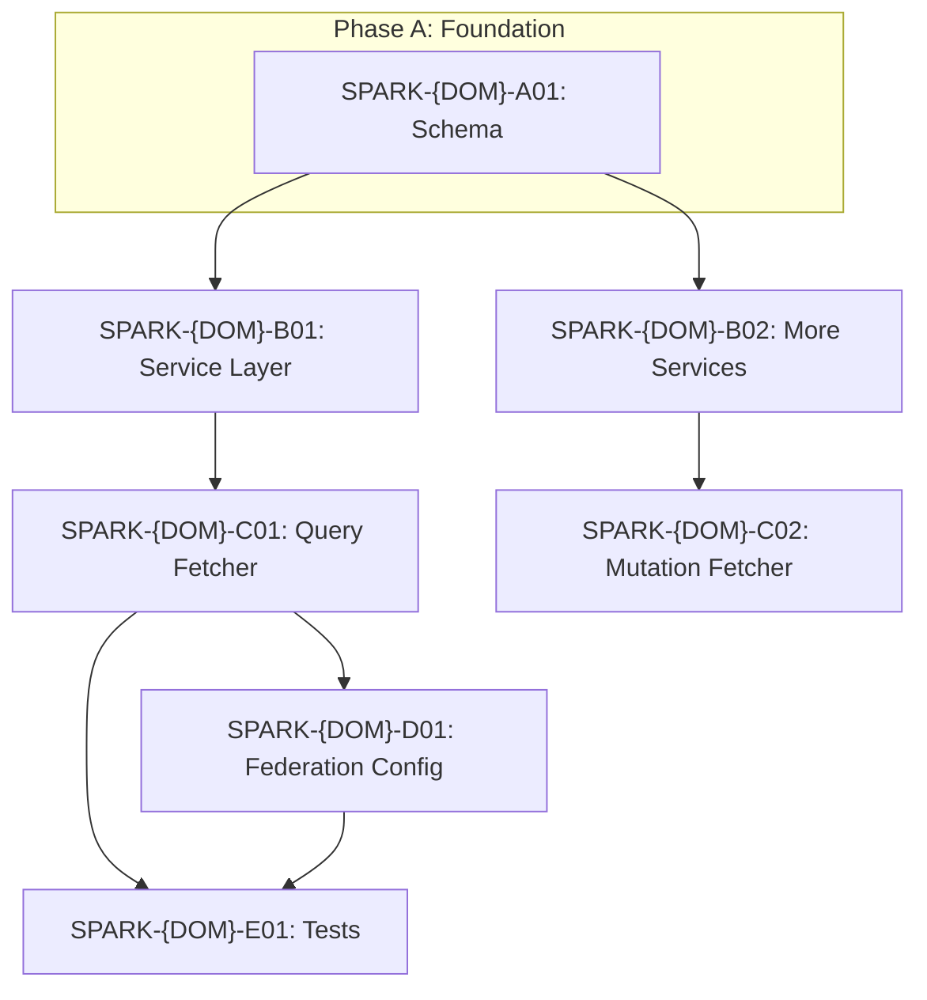

# Template: Migration Stories and PO Summary (`04-stories.md` + `04-po-summary.md`)

This template defines the format for Phase 4 story generation output.

---

## `04-stories.md` — Structure

```markdown
# {Domain Display Name} — Migration Plan & Stories

> **Domain:** `{loader-key}`
> **Target DGS:** `{ServiceClassName}` (repo: `{repo-name}`)
> **Pipeline Version:** 1.1
> **Generated:** {YYYY-MM-DD}
> **Depends on:** [02-resolver-analysis.md](./02-resolver-analysis.md), [03-schema.graphql](./03-schema.graphql), [03-schema-analysis.md](./03-schema-analysis.md)

---

## 1. Migration Phases Overview

| Phase | Name | Story Count | Effort Range | Description |
|-------|------|------------|-------------|-------------|
| A | Foundation & Schema | {n} | {range}d | CAT-1 schema file, shared DTOs, Feign client base |
| B | Core Reads | {n} | {range}d | Highest-priority query data fetchers |
| C | Mutations | {n} | {range}d | CRUD mutations + side effects |
| D | Search & Listing | {n} | {range}d | Paginated/filtered queries |
| E | Complex Operations | {n} | {range}d | Orchestration, ACL, parallel calls |
| F | Federation & Stitching | {n} | {range}d | CAT-4 Hive Gateway + entity fetchers |
| G | Test & Parity | {n} | {range}d | Unit, integration, parity tests |
| **Total** | | **{n}** | **{range}d** (+20% → **{range}d**) | |

---

## 2. Dependency Graph



---

## 3. Story List

[Stories organized by Phase A → G, using the story template below]

---

## 4. Risk Register

| Risk | Likelihood | Impact | Mitigation | Owner |
|------|-----------|--------|------------|-------|

---

## Summary

**Total stories:** {n}
**Total effort (expected):** {range}d (+20% buffer applied)
**Critical path:** Phase A → B → C → F → G
**Parallelism opportunity:** Phases B and D can overlap after Phase A
**Highest risk:** {operation name} — {one-line reason}
```

---

## Individual Story Template (Repeat for Each Story)

Every story uses this exact template. All sections are required.

```markdown
### {STORY-ID} · {Story Title}

**Type:** Story
**Complexity:** {Low | Medium | High | Very High}
**Category:** CAT-{N} — {Category Name}
**Phase:** {Phase Letter: A/B/C/D/E/F/G}

**As a** DGS migration engineer,
**I want** {specific, actionable goal — e.g., "implement the getBom query data fetcher in plm-product DGS"},
**so that** {business or technical benefit — e.g., "the BOM domain is queryable via the federation gateway without going through spark-internal-graphql"}.

---

**Current Behavior (from Phase 2):**
{Copy the relevant pseudo-logic from 02-resolver-analysis.md verbatim or lightly edited.
This IS the implementation spec. Include:
- Full step-by-step logic (numbered)
- REST endpoint details (verb, URL, headers)
- Transformation rules
- Error handling
- EXT Service calls with severity}

---

**EXT Service Calls:**
{None — all calls are to this domain's own backend.}
OR:
- **EXT Service** → key: `{loaderKey}` · url: `{url}` · repo: `{repo}` · severity: 🔴/🟡/🔵
  Purpose: {description}

---

**Target DGS Implementation:**
- Annotation: `{@DgsQuery | @DgsMutation | @DgsData | @DgsEntityFetcher}`
- Data fetcher class: `{ClassName}DataFetcher.kt`
- Service method: `{ServiceClass.methodName}({params})`
- Feign client: `{FeignClientInterface}` calling `{HTTP verb} {URL pattern}`
- ACL token: `{Authorization: Bearer {token} | SPARK-Capability-Token: {token}}`
- Pagination: Spring `Pageable` with defaults `page={n}, size={n}` matching source
- Request mapping: {e.g., "camelCase input → snake_case request body via Jackson"}
- Response mapping: {e.g., "snake_case REST response → camelCase DTO via Jackson"}
- DataLoader: {None | `{DataLoaderName}` keyed on `{keyField}`, max batch size {n}}

---

**Files to Create / Modify:**
- `{dgs-repo}/apps/app/src/main/resources/schema/{domain}.graphqls` — add `{operation}`
- `{dgs-repo}/apps/app/src/main/kotlin/.../dataFetcher/{Domain}DataFetcher.kt` — create
- `{dgs-repo}/apps/app/src/main/kotlin/.../service/{Domain}Service.kt` — add method
- `{dgs-repo}/apps/app/src/main/kotlin/.../model/{TypeName}.kt` — create DTO
- `{dgs-repo}/apps/app/src/test/kotlin/.../dataFetcher/{Domain}DataFetcherTest.kt` — create

---

**Dependencies:**
- {STORY-ID} — {reason this must complete first}

---

**Acceptance Criteria:**
1. GraphQL schema for `{operation}` matches `output/{domain}/03-schema.graphql`.
2. Data fetcher is annotated with `{@DgsQuery|@DgsMutation|@DgsData}` and delegates to the service layer.
3. Service layer makes `{HTTP verb}` call to `{base-url}/{endpoint}` with headers `Authorization` and `{SPARK-Capability-Token if applicable}`.
4. Request transformation: `{specific rule — e.g., "camelCase input fields are converted to snake_case via Jackson NamingStrategies"}`.
5. Response transformation: `{specific rule — e.g., "snake_case REST response is mapped to camelCase DTO via Jackson"}`.
6. {If paginated:} Pagination uses Spring `Pageable` with defaults `page={n}, size={n}` matching source behavior.
7. Error handling: {specific — e.g., "404 → return null; 500 → throw DgsEntityNotFoundException with message {x}"}.
8. {If EXT calls:} EXT calls to `{service}` are handled via `{CAT-4 story ID}`.
9. Unit tests cover happy path and all documented error paths.
10. Integration test verifies end-to-end via DGS test client with realistic test data.
{Add more specific criteria as needed — all must be objectively verifiable}

---

**Test Cases:**
- [ ] Unit: `{testMethodName}` — {what it tests, e.g., "returns Bom object on successful REST call"}
- [ ] Unit: `{testMethodName}` — {error path, e.g., "returns null when REST returns 404"}
- [ ] Unit: `{testMethodName}` — {error path, e.g., "throws exception when REST returns 500"}
- [ ] Integration: `{testMethodName}` — {e.g., "query via DGS test client returns expected fields and structure"}
- [ ] Parity: `{testMethodName}` — {e.g., "DGS response matches spark-internal-graphql response for input {example-id}" — High/VH complexity only}
```

---

## Story Category Reference

| CAT | Name | Builds | Blocked By |
|-----|------|--------|-----------|
| CAT-1 | Schema migration | `.graphqls` file in DGS | Nothing |
| CAT-2 | Resolver / data fetcher | `@DgsQuery`, `@DgsMutation`, `@DgsData` | CAT-1 + CAT-3 |
| CAT-3 | Service logic | Kotlin service, Feign client, DTOs | CAT-1 |
| CAT-4 | Federation / stitching | Hive Gateway config, `@DgsEntityFetcher` | CAT-1 + CAT-2 |
| CAT-5 | Test coverage | Unit, integration, parity | CAT-2 + CAT-4 |

---

## `04-po-summary.md` — Structure

```markdown
# {Domain Display Name} — PO Sprint Planning Summary

> **Domain:** `{loader-key}`
> **Target DGS:** `{ServiceClassName}` (repo: `{repo-name}`)
> **Pipeline Version:** 1.1
> **Generated:** {YYYY-MM-DD}

---

## What Are We Building?

{2–3 paragraphs in plain English — no pseudo-logic, no technical jargon beyond what a PO needs.
Example: "We are migrating the BOM (Bill of Materials) domain from the spark-internal-graphql gateway
to a dedicated DGS microservice. This includes {n} queries and {n} mutations for managing
product material components. The migration will move ownership of BOM data closer to the
plm-product service, reducing the load on the central gateway and enabling teams to evolve
BOM features independently."}

---

## Migration Scope

| Type | Count | Notes |
|------|-------|-------|
| Queries | {n} | |
| Mutations | {n} | |
| External service dependencies | {n} | ({n} 🔴 critical · {n} 🟡 important · {n} 🔵 optional) |
| Total stories | {n} | |
| Estimated total effort | {range}d | +20% buffer included |

---

## Story Summary by Phase

| Phase | Name | Stories | Effort | Blocked By | Ready When |
|-------|------|---------|--------|-----------|-----------|
| A | Foundation & Schema | {n} | {range}d | Nothing | Sprint 1 |
| B | Core Reads | {n} | {range}d | Phase A | Sprint 1–2 |
| C | Mutations | {n} | {range}d | Phase A | Sprint 2 |
| D | Search & Listing | {n} | {range}d | Phases A+B | Sprint 2–3 |
| E | Complex Operations | {n} | {range}d | Phases B+C | Sprint 3 |
| F | Federation & Stitching | {n} | {range}d | Phases B+C | Sprint 3 |
| G | Test & Parity | {n} | {range}d | Phases B+F | Sprint 3–4 |
| **Total** | | **{n}** | **{range}d** | | |

---

## Key Risk Areas

| Risk | Severity | Impact on Timeline | What PO Needs to Know |
|------|---------|-------------------|-----------------------|
| {risk} | High/Medium/Low | {impact} | {plain-English description} |

---

## Decisions Required

Items that block a phase from starting. PO or architect must decide before the due date.

| Decision | Blocks | Needed By | Options | Owner |
|---------|--------|-----------|---------|-------|
| {decision description} | Phase {X} | {date or sprint} | {option A | option B} | PO/Architect |

---

## Dependency Map

```
Phase A (Schema) ────────────────────────────────────────────────►
                  │
                  ├── Phase B (Core Reads) ───────────────────────►
                  │         │
                  │         ├── Phase C (Mutations) ──────────────►
                  │         │
                  │         ├── Phase D (Search) ─────────────────►
                  │         │
                  │         └── Phase F (Federation) ─────────────►
                  │                   │
                  └───────────────────┴── Phase G (Tests) ────────►
```

---

## Recommended Sprint Sequencing

Assumes ~2–3 stories per sprint unless parallelism allows more.

| Sprint | Stories | Focus | Team Size Notes |
|--------|---------|-------|----------------|
| Sprint 1 | {STORY-IDs} | Phase A (schema) | 1–2 engineers |
| Sprint 2 | {STORY-IDs} | Phase B + C starts | 2 engineers can parallelize B and C |
| Sprint 3 | {STORY-IDs} | Phase D + E + F | 3 engineers: one each on D, E, F |
| Sprint 4 | {STORY-IDs} | Phase G (tests) | 1–2 engineers |

---

## Capacity Planning

| Team Size | Approach | Expected Calendar Time |
|-----------|---------|----------------------|
| 1 engineer | Sequential | {range}d |
| 2 engineers | B + C in parallel after A | ~{n}d |
| 3–4 engineers | A completed, B + C + D in parallel | ~{n}d |
```
