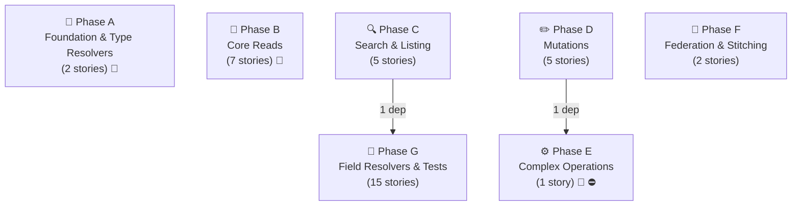
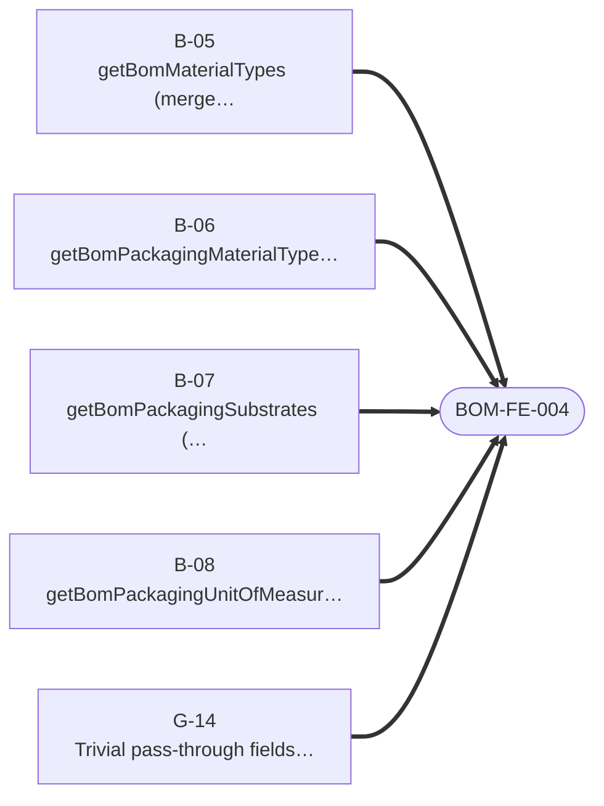
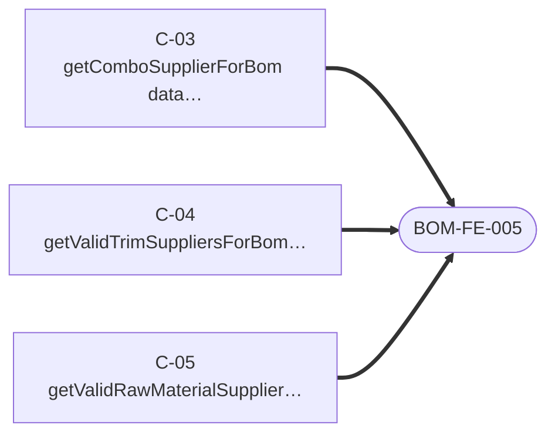
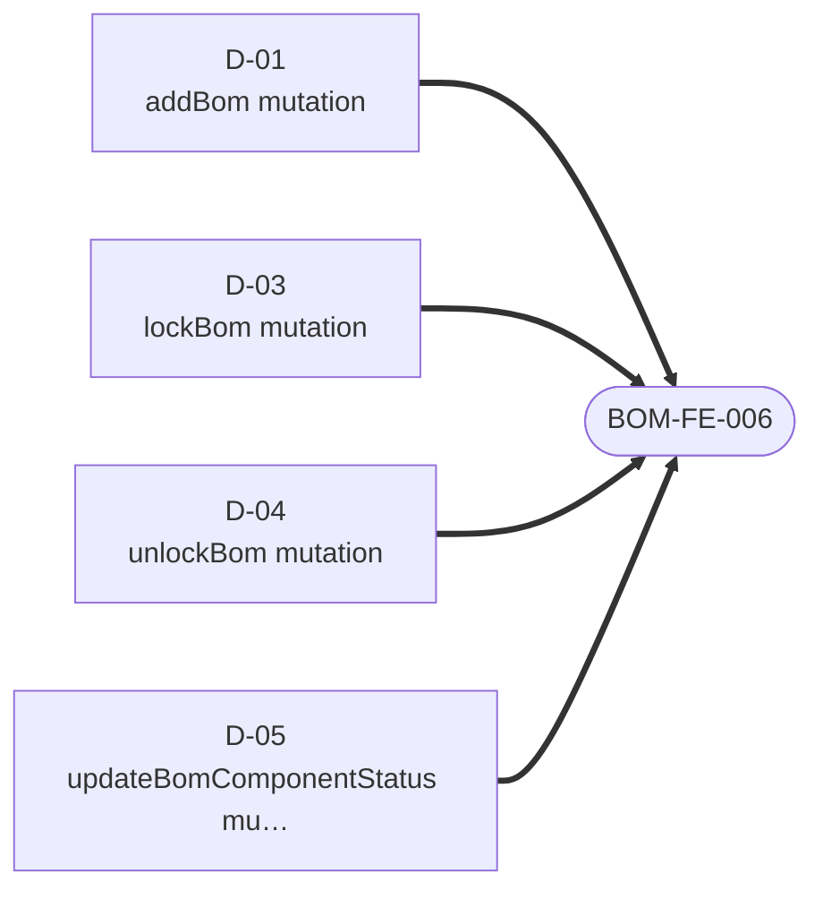
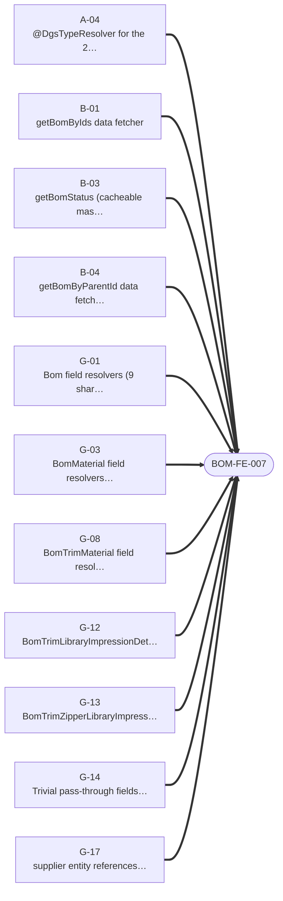

# BOM — Story Dependency Graphs

> Generated 2026-07-21 from `be-04-stories.md` and `fe-08-frontend-stories.md` — regenerate via `generate_story_dependency_graphs.py` (also runs inside `generate_all.py`). Full story text (Current Behaviour, Target implementation, Acceptance Criteria): [bom/be-04-stories.md](../../../output/analysis/bom/be-04-stories.md).

---

## Graph A — Backend Story Dependency (build order)

One box per **phase** (reads, search, mutations, complex ops, federation, field resolvers, entity resolution) — not one box per story, which stops being readable past a couple dozen stories. An arrow between two phase boxes means at least one story in the target phase directly depends on a story in the source phase; the label is how many story-level dependencies that represents. 🔬/⛔ on a box means at least one story in that phase is spike- or cross-subgraph-gated — see the table below for exactly which one.

**Story-level detail** (every story in this domain, its phase, its direct `Depends on:`, and any gate):

| Story | Phase | Depends on | Gate |
|---|---|---|---|
| `A-04` — @DgsTypeResolver for the 2 BOM interfaces | A | — | 🔬 SPIKE-05 |
| `A-05` — Shared CI conformance gate + code → type registry (SPIKE-05) | A | `A-04` | — |
| `B-01` — getBomByIds data fetcher | B | — | — |
| `B-03` — getBomStatus (cacheable master data) | B | — | — |
| `B-04` — getBomByParentId data fetcher | B | — | — |
| `B-05` — getBomMaterialTypes (merge with Material Hub) | B | — | 🔬 SPIKE-06a |
| `B-06` — getBomPackagingMaterialTypes (cacheable) | B | — | — |
| `B-07` — getBomPackagingSubstrates (cacheable) | B | — | — |
| `B-08` — getBomPackagingUnitOfMeasure (cacheable) | B | — | — |
| `C-01` — getBomElastic data fetcher | C | — | — |
| `C-02` — searchMaterialsBom data fetcher | C | — | — |
| `C-03` — getComboSupplierForBom data fetcher | C | — | — |
| `C-04` — getValidTrimSuppliersForBom data fetcher | C | — | — |
| `C-05` — getValidRawMaterialSuppliersForBom data fetcher | C | — | — |
| `D-01` — addBom mutation | D | — | — |
| `D-02` — manageBomWorkspaces mutation | D | — | — |
| `D-03` — lockBom mutation | D | — | — |
| `D-04` — unlockBom mutation | D | — | — |
| `D-05` — updateBomComponentStatus mutation | D | — | — |
| `E-01` — updateBom — 3-step orchestrated write | E | `D-02` | ⛔ BLOCKED-BY product (PRODUCT-BE-E-00, the shared WriteSaga module), 🔬 SPIKE-01 |
| `F-01` — Implement Product.productBoms / boms / packagingBoms (internal) | F | — | — |
| `F-02` — Fill ResourcesCount.bomsCount (internal) | F | — | — |
| `G-01` — Bom field resolvers (9 shared fields) | G | — | — |
| `G-03` — BomMaterial field resolvers (8 fields) | G | — | — |
| `G-04` — BomPackagingMaterial field resolvers (2 fields) | G | — | — |
| `G-05` — BomFabricMaterial field resolvers (4 fields) | G | — | — |
| `G-06` — BomFabricSpecMaterial field resolvers (4 fields) | G | — | — |
| `G-07` — BomCombinationMaterial field resolvers (4 fields) | G | — | — |
| `G-08` — BomTrimMaterial field resolvers (7 fields) — trim size dispatchers | G | — | — |
| `G-09` — BomWashMaterial field resolvers (4 fields) | G | — | — |
| `G-10` — Impression library-resource resolution (shared internal/external branch + MaterialDataLoader) | G | — | — |
| `G-11` — BomFabricLibraryImpressionDetails.libraryResource | G | `G-10` | — |
| `G-12` — BomTrimLibraryImpressionDetails field resolvers (3 fields) | G | `G-10` | — |
| `G-13` — BomTrimZipperLibraryImpressionDetails field resolvers (3 colors) | G | `G-10` | — |
| `G-14` — Trivial pass-through fields (bundle) | G | — | — |
| `G-15` — BomMaterialSearchResult field resolvers (5 fields) | G | `C-02` | — |
| `G-17` — supplier entity references on material rows (recommended, PO-gated) | G | `G-01` | — |

---

## Graph B — Frontend Readiness (what must ship before FE can start)

For the frontend engineer or PO checking whether backend is far enough along: **one small diagram per frontend story**, showing only the backend stories it directly depends on. (Any dependency *those* backend stories have on each other is Graph A's job, not repeated here — that's what kept the old single combined diagram unreadable.) A frontend story cannot start until every backend story pointing at it has shipped.

### BOM-FE-001 · Statically expand BOM fragment factories (pre-cutover)

### BOM-FE-002 · Migrate BOM core reads

### BOM-FE-003 · Migrate BOM search and elastic reads

### BOM-FE-004 · Migrate BOM master-data reads

### BOM-FE-005 · Migrate BOM supplier reads

### BOM-FE-006 · Migrate BOM mutations including `updateBom` saga handling

### BOM-FE-007 · Adopt BOM `supplier` entity references (optional, PO-gated)

---
*Story dependency graphs · bom · generated 2026-07-21.*