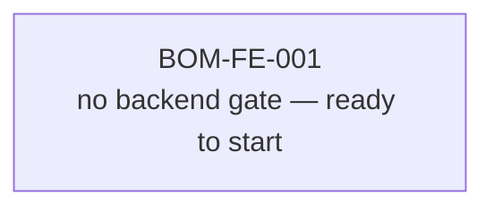
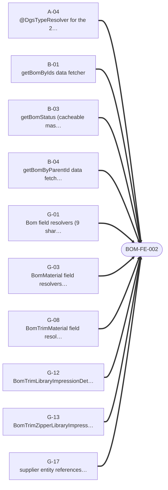
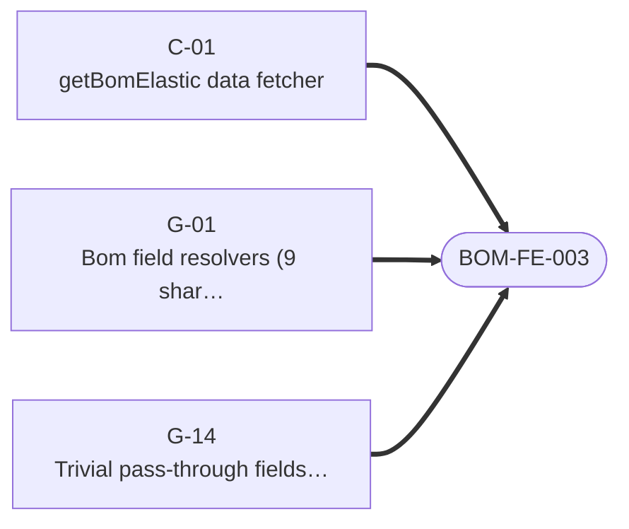

# BOM — Frontend Readiness

> Generated 2026-07-24 from `fe-08-frontend-stories.md` — regenerate via `generate_story_dependency_graphs.py` (also runs inside `generate_all.py`). Full story text (Current Behaviour, Target implementation, Acceptance Criteria): [bom/be-04-stories.md](../../../output/analysis/bom/be-04-stories.md). Backend build-order sequencing: [00-sequencing.md](../../00-sequencing.md).

---

## What must ship before FE can start

For the frontend engineer or PO checking whether backend is far enough along: **one small diagram per frontend story**, showing only the backend stories it directly depends on. A frontend story cannot start until every backend story pointing at it has shipped.

### BOM-FE-001 · Statically expand BOM fragment factories (pre-cutover)

### BOM-FE-002 · Migrate BOM core reads

### BOM-FE-003 · Migrate BOM search and elastic reads

### BOM-FE-004 · Migrate BOM master-data reads

### BOM-FE-005 · Migrate BOM supplier reads

### BOM-FE-006 · Migrate BOM mutations including `updateBom` saga handling

### BOM-FE-007 · Adopt BOM `supplier` entity references (optional, PO-gated)

---
*Story dependency graph · bom · generated 2026-07-24.*