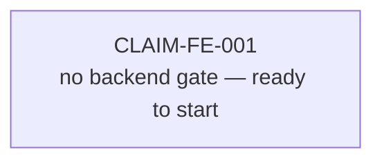
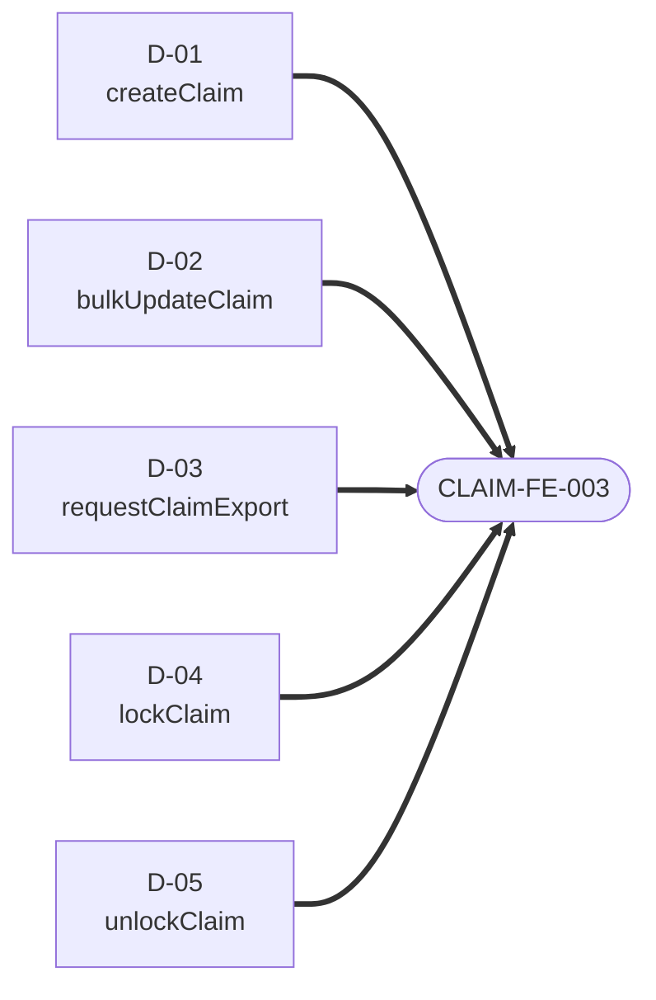
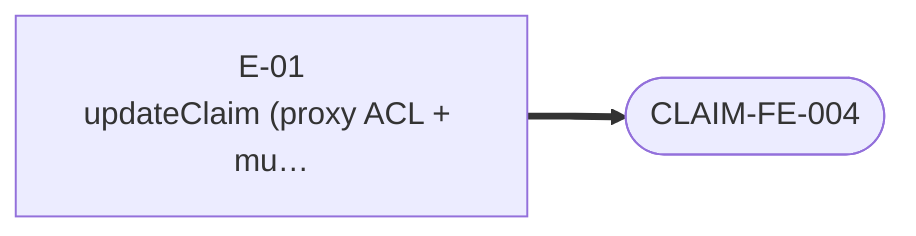

# Claims — Frontend Readiness

> Generated 2026-07-24 from `fe-08-frontend-stories.md` — regenerate via `generate_story_dependency_graphs.py` (also runs inside `generate_all.py`). Full story text (Current Behaviour, Target implementation, Acceptance Criteria): [claims/be-04-stories.md](../../../output/analysis/claims/be-04-stories.md). Backend build-order sequencing: [00-sequencing.md](../../00-sequencing.md).

---

## What must ship before FE can start

For the frontend engineer or PO checking whether backend is far enough along: **one small diagram per frontend story**, showing only the backend stories it directly depends on. A frontend story cannot start until every backend story pointing at it has shipped.

### CLAIM-FE-001 · Split the claim fragment factory and re-target claim fragments

### CLAIM-FE-002 · Migrate claim reads (first cross-subgraph cutover)

### CLAIM-FE-003 · Migrate claim simple mutations and export

### CLAIM-FE-004 · Migrate `updateClaim` multi-step write handling

---
*Story dependency graph · claims · generated 2026-07-24.*