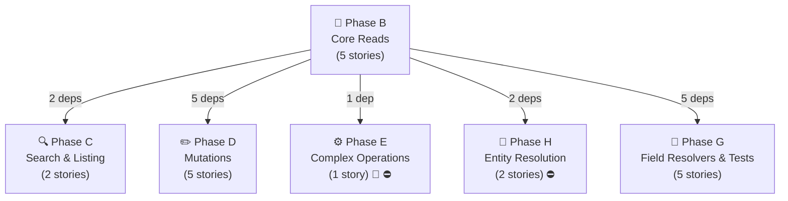
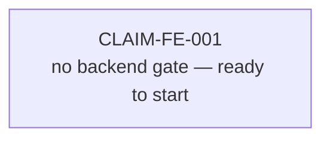
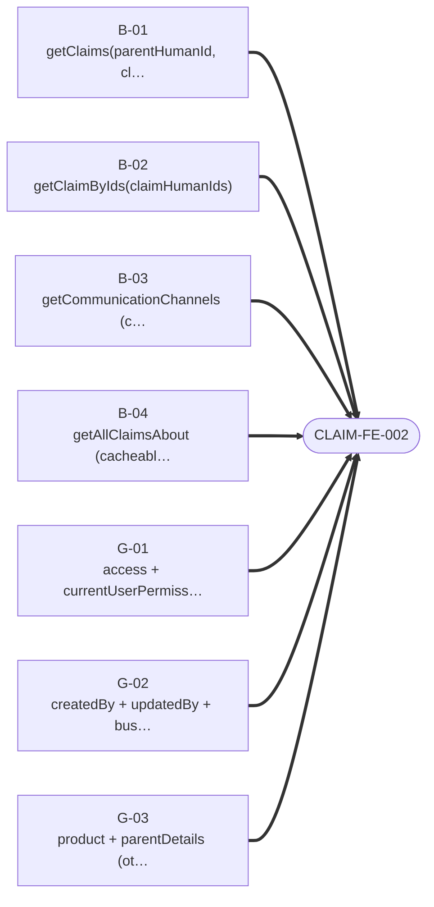

# Claims — Story Dependency Graphs

> Generated 2026-07-21 from `be-04-stories.md` and `fe-08-frontend-stories.md` — regenerate via `generate_story_dependency_graphs.py` (also runs inside `generate_all.py`). Full story text (Current Behaviour, Target implementation, Acceptance Criteria): [claims/be-04-stories.md](../../../output/analysis/claims/be-04-stories.md).

---

## Graph A — Backend Story Dependency (build order)

One box per **phase** (reads, search, mutations, complex ops, federation, field resolvers, entity resolution) — not one box per story, which stops being readable past a couple dozen stories. An arrow between two phase boxes means at least one story in the target phase directly depends on a story in the source phase; the label is how many story-level dependencies that represents. 🔬/⛔ on a box means at least one story in that phase is spike- or cross-subgraph-gated — see the table below for exactly which one.

**Story-level detail** (every story in this domain, its phase, its direct `Depends on:`, and any gate):

| Story | Phase | Depends on | Gate |
|---|---|---|---|
| `B-01` — getClaims(parentHumanId, claimHumanIds, partnerIds) | B | — | — |
| `B-02` — getClaimByIds(claimHumanIds) | B | `B-01` | — |
| `B-03` — getCommunicationChannels (cacheable) | B | `B-01` | — |
| `B-04` — getAllClaimsAbout (cacheable) | B | `B-01` | — |
| `B-05` — getClaimExports | B | `B-01` | — |
| `C-01` — searchGuestFacing(queryParam) | C | `B-01` | — |
| `C-02` — getClaimsElastic(parentHumanId) | C | `B-01` | — |
| `D-01` — createClaim | D | `B-01` | — |
| `D-02` — bulkUpdateClaim | D | `B-01` | — |
| `D-03` — requestClaimExport | D | `B-01` | — |
| `D-04` — lockClaim | D | `B-01` | — |
| `D-05` — unlockClaim | D | `B-01` | — |
| `E-01` — updateClaim (proxy ACL + multi-step write) | E | `B-01` | ⛔ BLOCKED-BY product (PRODUCT-BE-E-00, the shared WriteSaga module), 🔬 SPIKE-01 |
| `G-01` — access + currentUserPermissions + participantDetails | G | `B-01` | — |
| `G-02` — createdBy + updatedBy + businessPartner + designPartner | G | `B-01` | — |
| `G-03` — product + parentDetails (otherClaimBps / systemTeams / droppedPartnerIds) | G | `B-01`, `G-06` | — |
| `G-04` — workspaces + ClaimSubstantiate.substantiatedBy + ClaimDetails.claimName | G | `B-01` | — |
| `G-06` — Shared value-type alignment (@shareable instead of entity stubs) | G | `B-01` | — |
| `H-01` — Product.claims (federation contribution) | H | `B-01` | ⛔ BLOCKED-BY product (PRODUCT-BE-F-14, product-side stub alignment; also waits on the Product entity existing, plm-product Phase A) |
| `H-02` — ResourcesCount.claims (TechPack — claims side of PRODUCT-BE-H-04) | H | `B-01` | ⛔ BLOCKED-BY product (PRODUCT-BE-E-03, TechPack facade; also PRODUCT-BE-F-14 contract alignment) |

---

## Graph B — Frontend Readiness (what must ship before FE can start)

For the frontend engineer or PO checking whether backend is far enough along: **one small diagram per frontend story**, showing only the backend stories it directly depends on. (Any dependency *those* backend stories have on each other is Graph A's job, not repeated here — that's what kept the old single combined diagram unreadable.) A frontend story cannot start until every backend story pointing at it has shipped.

### CLAIM-FE-001 · Split the claim fragment factory and re-target claim fragments

### CLAIM-FE-002 · Migrate claim reads (first cross-subgraph cutover)

### CLAIM-FE-003 · Migrate claim simple mutations and export

### CLAIM-FE-004 · Migrate `updateClaim` multi-step write handling

---
*Story dependency graphs · claims · generated 2026-07-21.*