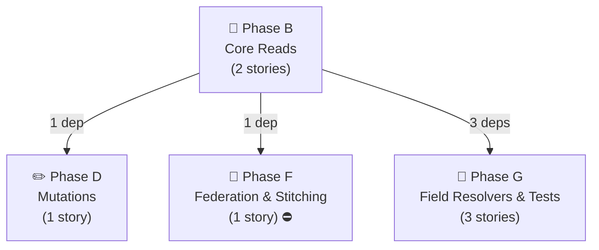

# Impression — Story Dependency Graphs

> Generated 2026-07-21 from `be-04-stories.md` and `fe-08-frontend-stories.md` — regenerate via `generate_story_dependency_graphs.py` (also runs inside `generate_all.py`). Full story text (Current Behaviour, Target implementation, Acceptance Criteria): [impression/be-04-stories.md](../../../output/analysis/impression/be-04-stories.md).

---

## Graph A — Backend Story Dependency (build order)

One box per **phase** (reads, search, mutations, complex ops, federation, field resolvers, entity resolution) — not one box per story, which stops being readable past a couple dozen stories. An arrow between two phase boxes means at least one story in the target phase directly depends on a story in the source phase; the label is how many story-level dependencies that represents. 🔬/⛔ on a box means at least one story in that phase is spike- or cross-subgraph-gated — see the table below for exactly which one.

**Story-level detail** (every story in this domain, its phase, its direct `Depends on:`, and any gate):

| Story | Phase | Depends on | Gate |
|---|---|---|---|
| `B-01` — searchImpressionsByProductId data fetcher | B | — | — |
| `B-02` — getImpressionCountsByProductId data fetcher | B | `B-01` | — |
| `D-01` — updateImpressions mutation | D | `B-01` | — |
| `F-01` — Product.impressions / impressionCounts (internal field resolver) | F | `B-01` | ⛔ BLOCKED-BY product (PRODUCT-BE-B-01, exposes the field this story reads) |
| `G-01` — Impression field resolvers (5 fields) | G | `B-01` | — |
| `G-02` — ImpressionCount.counts aggregation | G | `B-01` | — |
| `G-04` — attachment entity reference (recommended, PO-gated) | G | `B-01` | — |

---

## Graph B — Frontend Readiness (what must ship before FE can start)

For the frontend engineer or PO checking whether backend is far enough along: **one small diagram per frontend story**, showing only the backend stories it directly depends on. (Any dependency *those* backend stories have on each other is Graph A's job, not repeated here — that's what kept the old single combined diagram unreadable.) A frontend story cannot start until every backend story pointing at it has shipped.

### IMPRESSION-FE-001 · Migrate `getBomDataAndImpressions` (with BOM wave)

### IMPRESSION-FE-002 · Migrate `getCarryForwardFormData` (with Product wave)

---
*Story dependency graphs · impression · generated 2026-07-21.*