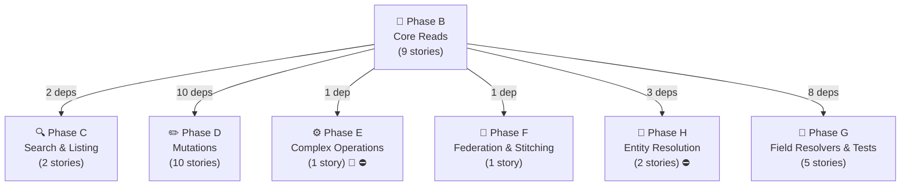
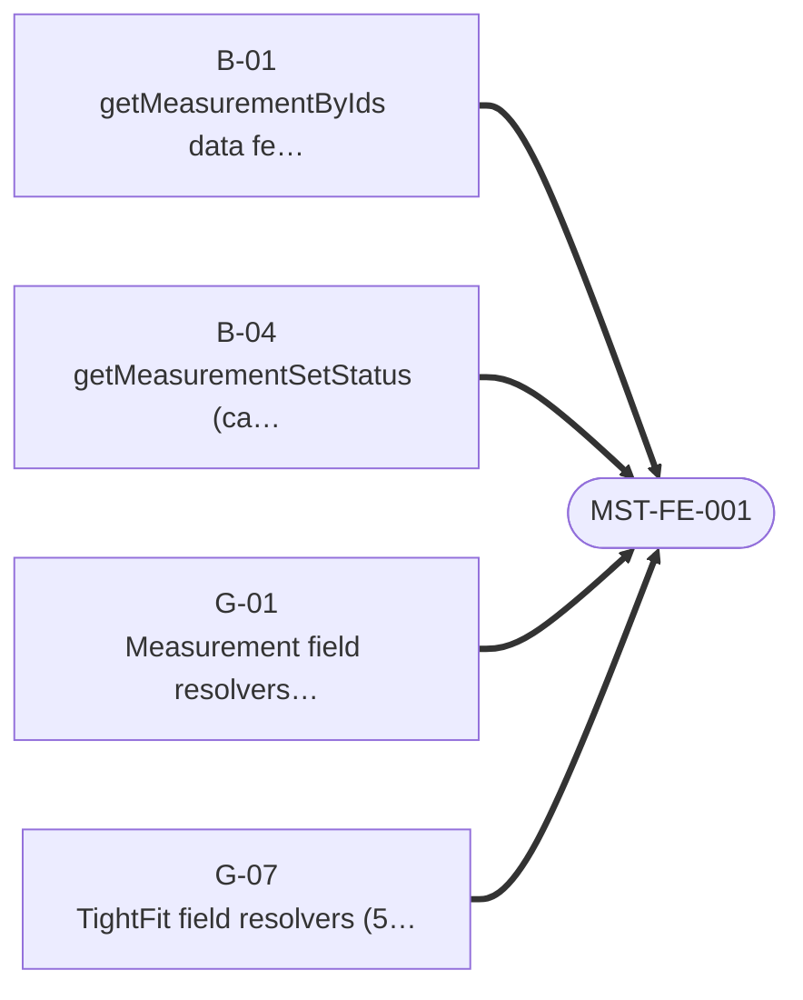
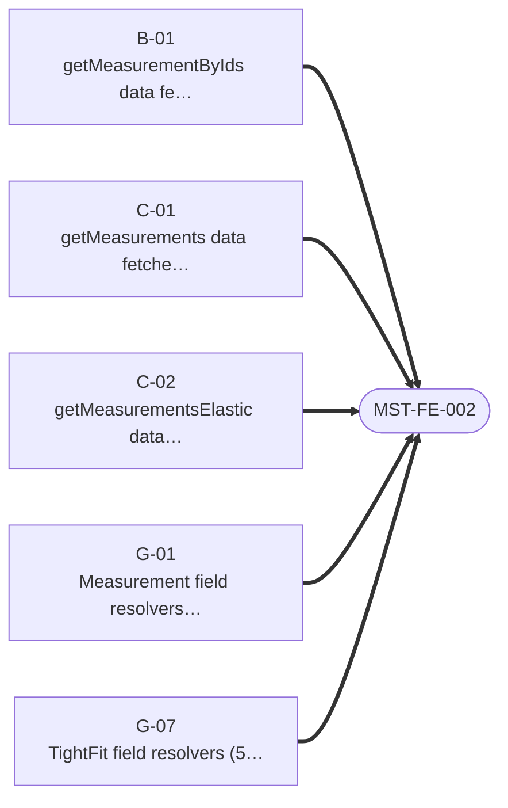
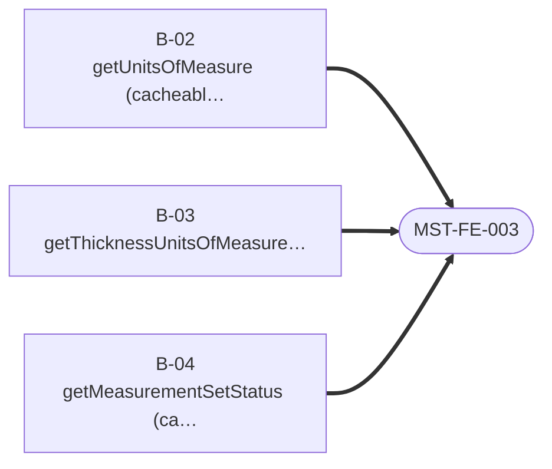
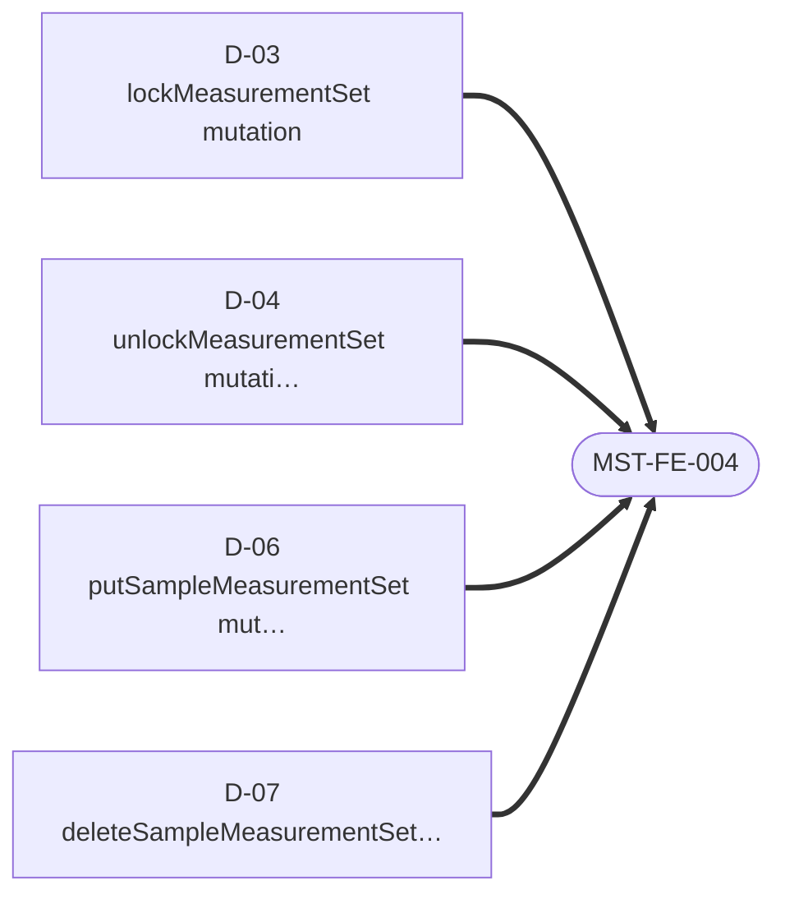

# Measurement — Story Dependency Graphs

> Generated 2026-07-21 from `be-04-stories.md` and `fe-08-frontend-stories.md` — regenerate via `generate_story_dependency_graphs.py` (also runs inside `generate_all.py`). Full story text (Current Behaviour, Target implementation, Acceptance Criteria): [measurement/be-04-stories.md](../../../output/analysis/measurement/be-04-stories.md).

---

## Graph A — Backend Story Dependency (build order)

One box per **phase** (reads, search, mutations, complex ops, federation, field resolvers, entity resolution) — not one box per story, which stops being readable past a couple dozen stories. An arrow between two phase boxes means at least one story in the target phase directly depends on a story in the source phase; the label is how many story-level dependencies that represents. 🔬/⛔ on a box means at least one story in that phase is spike- or cross-subgraph-gated — see the table below for exactly which one.

**Story-level detail** (every story in this domain, its phase, its direct `Depends on:`, and any gate):

| Story | Phase | Depends on | Gate |
|---|---|---|---|
| `B-01` — getMeasurementByIds data fetcher | B | — | — |
| `B-02` — getUnitsOfMeasure (cacheable) | B | `B-01` | — |
| `B-03` — getThicknessUnitsOfMeasure (cacheable) | B | `B-01` | — |
| `B-04` — getMeasurementSetStatus (cacheable) | B | `B-01` | — |
| `B-05` — getSampleMeasurement data fetcher | B | `B-01` | — |
| `B-06` — getMeasurementTemplates + getMeasurementTemplatesByIds data fetchers | B | — | — |
| `B-07` — getSizeTemplates + getSizeCategories + getMaterialTypes data fetchers | B | — | — |
| `B-08` — getTightFits + getTightFitByIdAndVersion data fetchers | B | — | — |
| `B-09` — searchSparkSizes data fetcher (NEXUS + Tag fan-out) | B | — | — |
| `C-01` — getMeasurements data fetcher (relationship + listing) | C | `B-01` | — |
| `C-02` — getMeasurementsElastic data fetcher | C | `B-01` | — |
| `D-01` — addMeasurement mutation | D | `B-01` | — |
| `D-02` — updateMeasurementAccess mutation | D | `B-01` | — |
| `D-03` — lockMeasurementSet mutation | D | `B-01` | — |
| `D-04` — unlockMeasurementSet mutation | D | `B-01` | — |
| `D-05` — updateMeasurementComponentStatus mutation | D | `B-01` | — |
| `D-06` — putSampleMeasurementSet mutation | D | `B-01` | — |
| `D-07` — deleteSampleMeasurementSet mutation | D | `B-01` | — |
| `D-08` — addMeasurementTemplate + updateMeasurementTemplate + deleteMeasurementTemplate mutations | D | `B-06` | — |
| `D-09` — addSizeTemplate + updateSizeTemplate mutations | D | `B-07` | — |
| `D-10` — addTightFit + updateTightFit mutations | D | `B-08` | — |
| `E-01` — updateMeasurement — 2-step orchestrated write | E | `B-01` | ⛔ BLOCKED-BY product (PRODUCT-BE-E-00, the shared WriteSaga module), 🔬 SPIKE-01 |
| `F-01` — Implement Product.measurementSets (internal) | F | `B-01` | — |
| `G-01` — Measurement field resolvers (13 fields) | G | `B-01`, `B-06`, `B-07`, `B-08` | — |
| `G-02` — SampleMeasurementSet field resolvers (2 fields) | G | `B-01` | — |
| `G-05` — MeasurementTemplate field resolvers (5 fields) | G | `B-06` | — |
| `G-06` — SizeTemplate field resolvers (3 fields) | G | `B-07` | — |
| `G-07` — TightFit field resolvers (5 fields) | G | `B-08` | — |
| `H-01` — Contribute sampleMeasurement to the SampleV2 entity | H | `B-01` | ⛔ BLOCKED-BY sample |
| `H-02` — SampleMeasurementSet.sample forward reference (recommended, PO-gated) | H | `B-02`, `B-05` | ⛔ BLOCKED-BY sample |

---

## Graph B — Frontend Readiness (what must ship before FE can start)

For the frontend engineer or PO checking whether backend is far enough along: **one small diagram per frontend story**, showing only the backend stories it directly depends on. (Any dependency *those* backend stories have on each other is Graph A's job, not repeated here — that's what kept the old single combined diagram unreadable.) A frontend story cannot start until every backend story pointing at it has shipped.

### MST-FE-001 · Migrate measurement reads and retire `humanId`

### MST-FE-002 · Migrate measurement list/search reads

### MST-FE-003 · Migrate measurement master-data reads

### MST-FE-004 · Migrate measurement mutations

---
*Story dependency graphs · measurement · generated 2026-07-21.*