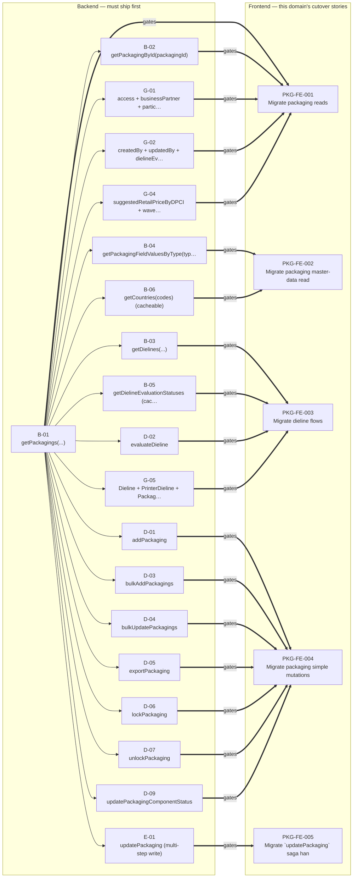

# Packaging — Story Dependency Graphs

> Generated 2026-07-21 from `be-04-stories.md` and `fe-08-frontend-stories.md` — regenerate via `generate_story_dependency_graphs.py` (also runs inside `generate_all.py`). Full story text (Current Behaviour, Target implementation, Acceptance Criteria): [packaging/be-04-stories.md](../../../output/analysis/packaging/be-04-stories.md).

---

## Graph A — Backend Story Dependency (build order)

For the engineer implementing this domain's backend: which story unlocks which. Nodes are grouped into swimlanes by implementation step — everything in one step can be built in parallel once every step before it is done. A dashed arrow from a diamond is a **gate** (a Phase-0 spike or a cross-subgraph block) — read-only context, not something the scheduler enforces.

```mermaid
flowchart TD
  subgraph STEP1["Step 1 — 📖 Core Reads"]
    NB_01["B-01<br/>getPackagings(...)"]
  end
  subgraph STEP2["Step 2 — 📖 Core Reads · 🔍 Search & Listing · ✏️ Mutations · ⚙️ Complex Operations · 🔗 Federation & Stitching · 🧪 Field Resolvers & Tests"]
    NB_02["B-02<br/>getPackagingById(packagingId)"]
    NB_03["B-03<br/>getDielines(...)"]
    NB_04["B-04<br/>getPackagingFieldValuesByType(typ…"]
    NB_05["B-05<br/>getDielineEvaluationStatuses (cac…"]
    NB_06["B-06<br/>getCountries(codes) (cacheable)"]
    NC_01["C-01<br/>getPackagingElastic(parentHumanId)"]
    ND_01["D-01<br/>addPackaging"]
    ND_02["D-02<br/>evaluateDieline"]
    ND_03["D-03<br/>bulkAddPackagings"]
    ND_04["D-04<br/>bulkUpdatePackagings"]
    ND_05["D-05<br/>exportPackaging"]
    ND_06["D-06<br/>lockPackaging"]
    ND_07["D-07<br/>unlockPackaging"]
    ND_08["D-08<br/>cloneFilesForDielines"]
    ND_09["D-09<br/>updatePackagingComponentStatus"]
    NE_01["E-01<br/>updatePackaging (multi-step write)"]
    NF_01["F-01<br/>Product packaging links (internal…"]
    NG_01["G-01<br/>access + businessPartner + partic…"]
    NG_02["G-02<br/>createdBy + updatedBy + dielineEv…"]
    NG_03["G-03<br/>product + workspaces + attachments"]
    NG_04["G-04<br/>suggestedRetailPriceByDPCI + wave…"]
    NG_05["G-05<br/>Dieline + PrinterDieline + Packag…"]
  end
  NB_01 --> NB_02
  NB_01 --> NB_03
  NB_01 --> NB_04
  NB_01 --> NB_05
  NB_01 --> NB_06
  NB_01 --> NC_01
  NB_01 --> ND_01
  NB_01 --> ND_02
  NB_01 --> ND_03
  NB_01 --> ND_04
  NB_01 --> ND_05
  NB_01 --> ND_06
  NB_01 --> ND_07
  NB_01 --> ND_08
  NB_01 --> ND_09
  NB_01 --> NE_01
  NB_01 --> NF_01
  NB_01 --> NG_01
  NB_01 --> NG_02
  NB_01 --> NG_03
  NB_01 --> NG_04
  NB_01 --> NG_05
  G__SPIKE_01{{"🔬 SPIKE-01"}}
  G__SPIKE_01 -.-> NE_01
  G__BLOCKED_BY_product__PRODUCT_BE_E_00__the_shared_WriteSaga_module_{{"⛔ BLOCKED-BY product (PRODUCT-BE-E-00, the shared WriteSaga module)"}}
  G__BLOCKED_BY_product__PRODUCT_BE_E_00__the_shared_WriteSaga_module_ -.-> NE_01
```

---

## Graph B — Frontend Readiness (what must ship before FE can start)

For the frontend engineer or PO checking whether backend is far enough along: the **bold arrows** are the actual gate — a frontend story cannot start until every backend story pointing at it (and, transitively, everything upstream of those) has shipped.

---
*Story dependency graphs · packaging · generated 2026-07-21.*