# Product — Frontend Readiness

> Generated 2026-07-24 from `fe-08-frontend-stories.md` — regenerate via `generate_story_dependency_graphs.py` (also runs inside `generate_all.py`). Full story text (Current Behaviour, Target implementation, Acceptance Criteria): [product/be-04-stories.md](../../../output/analysis/product/be-04-stories.md). Backend build-order sequencing: [00-sequencing.md](../../00-sequencing.md).

---

## What must ship before FE can start

For the frontend engineer or PO checking whether backend is far enough along: **one small diagram per frontend story**, showing only the backend stories it directly depends on. A frontend story cannot start until every backend story pointing at it has shipped.

### PRODUCT-FE-001 · Migrate all `getProduct` documents (single root query, 17 flavors)

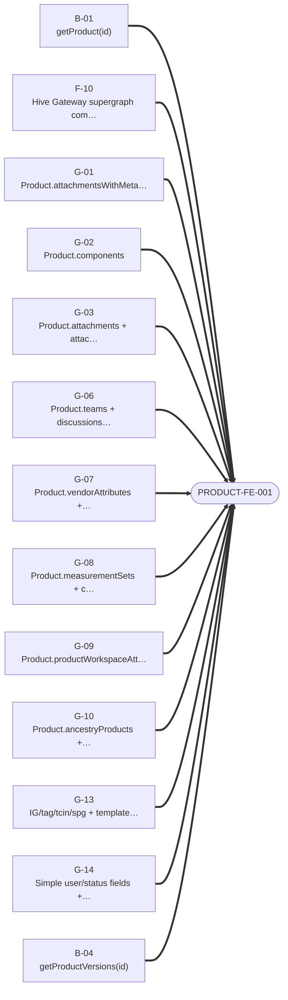

### PRODUCT-FE-002 · Migrate `getProducts` documents (list/search/bulk-create)

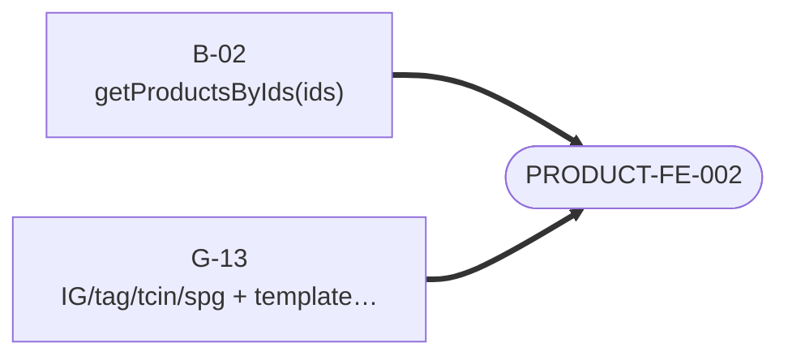

### PRODUCT-FE-003 · Migrate `getProductsByIds` documents (bulk-by-id reads)

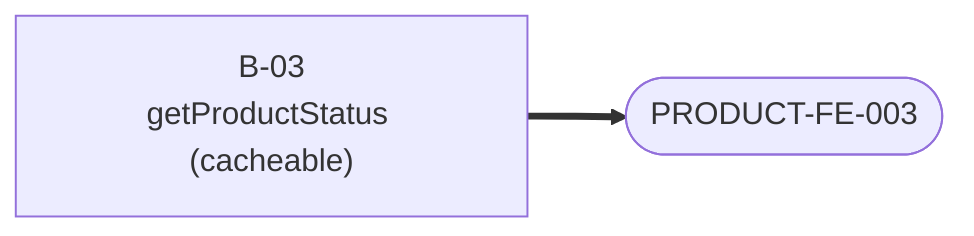

### PRODUCT-FE-004 · Migrate `getProductStatus` documents

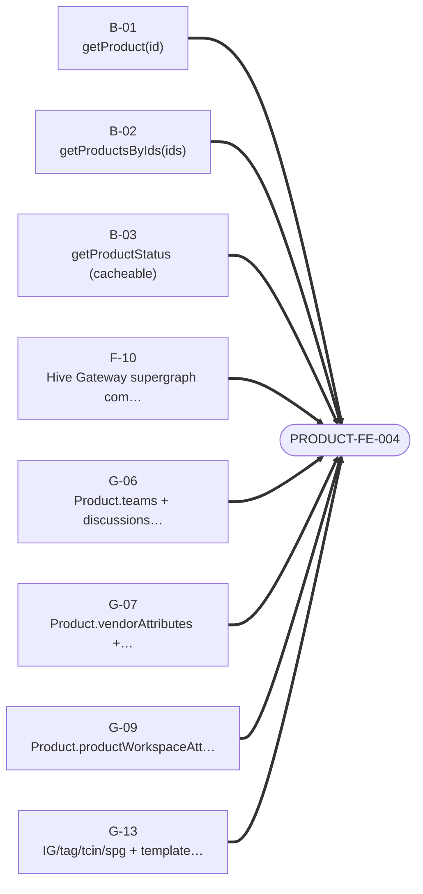

### PRODUCT-FE-005 · Migrate `getProductTemplates` documents

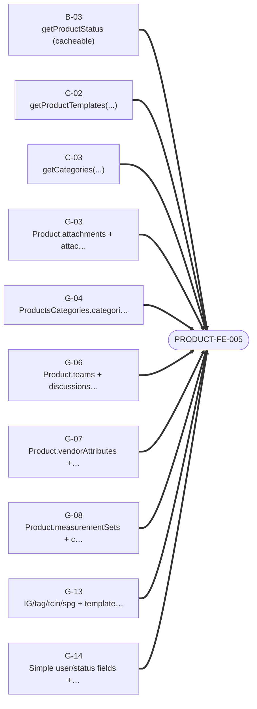

### PRODUCT-FE-006 · Migrate `getCategories` documents

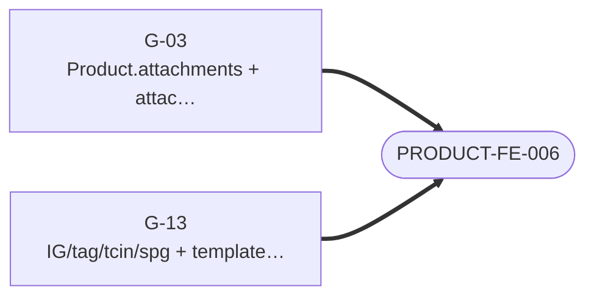

### PRODUCT-FE-007 · Migrate product rules administration

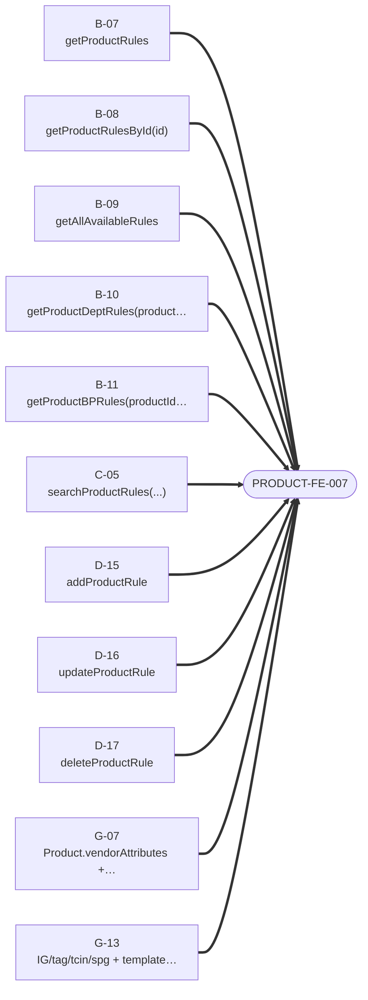

### PRODUCT-FE-008 · Migrate simple product mutations

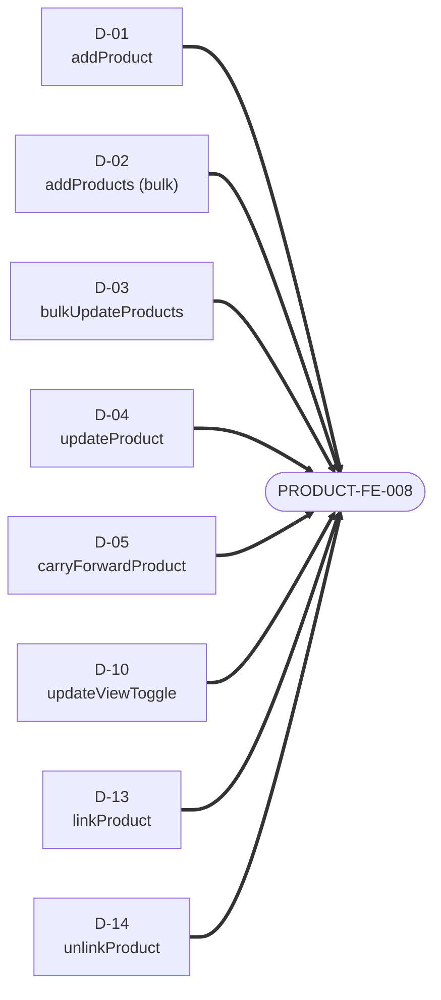

### PRODUCT-FE-009 · Migrate team and partner assignment mutations

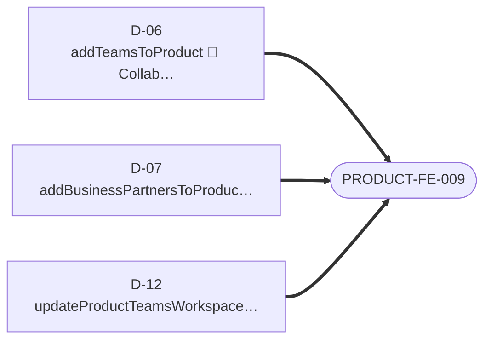

### PRODUCT-FE-010 · Migrate partner drop/undrop orchestration

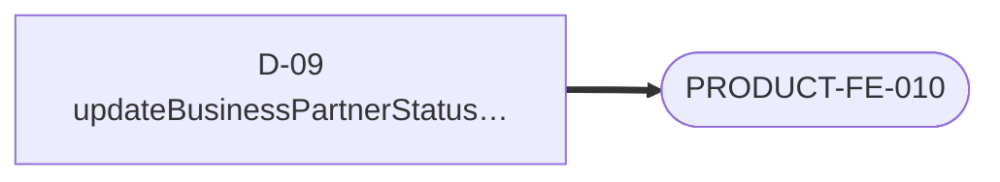

### PRODUCT-FE-011 · Migrate TechPack count queries (facade-then-federate)

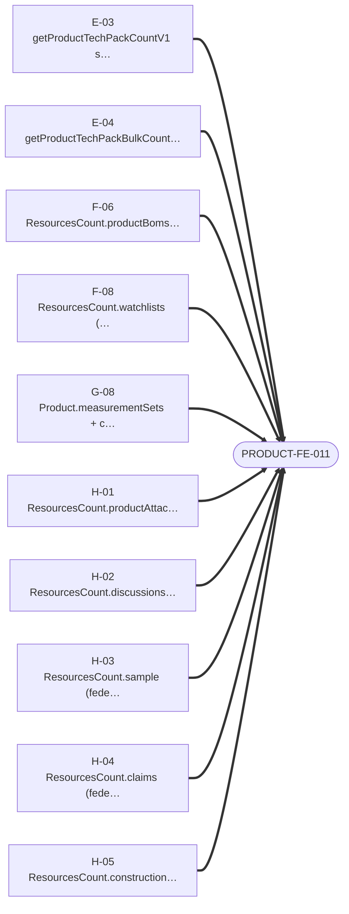

### PRODUCT-FE-012 · Migrate component status mutations and rollup counts

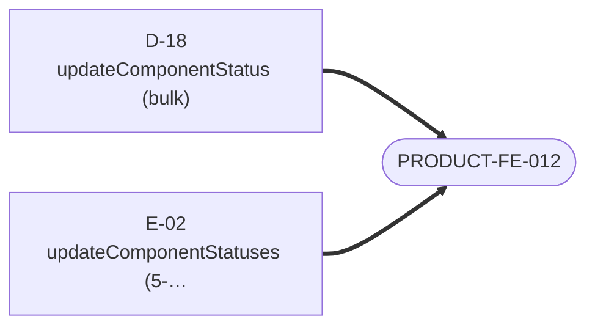

### PRODUCT-FE-013 · Verify fragment type-conditions, `__typename` logic and cache keys against federated type names

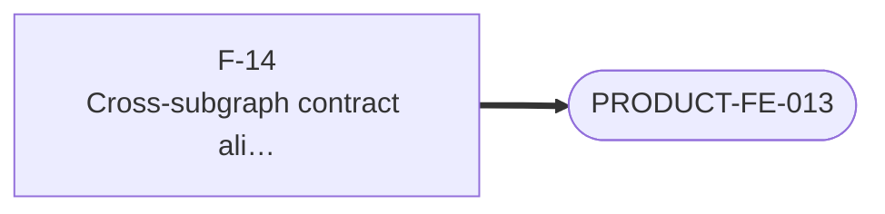

---
*Story dependency graph · product · generated 2026-07-24.*