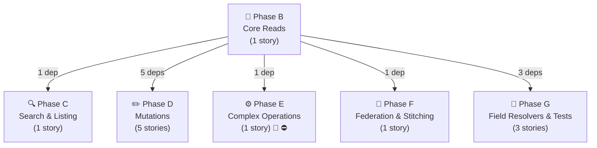
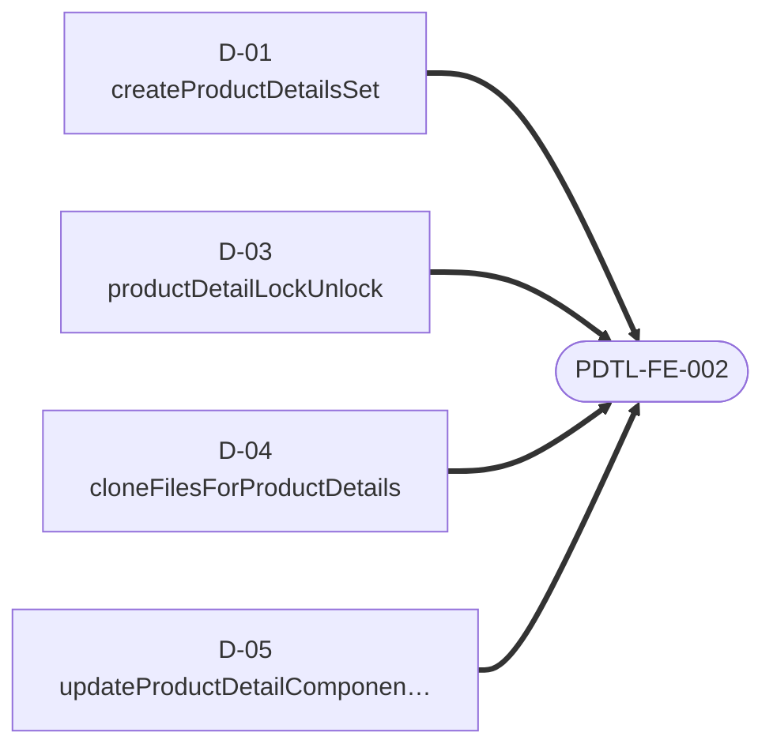

# Product Details — Story Dependency Graphs

> Generated 2026-07-21 from `be-04-stories.md` and `fe-08-frontend-stories.md` — regenerate via `generate_story_dependency_graphs.py` (also runs inside `generate_all.py`). Full story text (Current Behaviour, Target implementation, Acceptance Criteria): [productDetails/be-04-stories.md](../../../output/analysis/productDetails/be-04-stories.md).

---

## Graph A — Backend Story Dependency (build order)

One box per **phase** (reads, search, mutations, complex ops, federation, field resolvers, entity resolution) — not one box per story, which stops being readable past a couple dozen stories. An arrow between two phase boxes means at least one story in the target phase directly depends on a story in the source phase; the label is how many story-level dependencies that represents. 🔬/⛔ on a box means at least one story in that phase is spike- or cross-subgraph-gated — see the table below for exactly which one.

**Story-level detail** (every story in this domain, its phase, its direct `Depends on:`, and any gate):

| Story | Phase | Depends on | Gate |
|---|---|---|---|
| `B-01` — getProductDetailsById(ids) | B | — | — |
| `C-01` — getProductDetailsElastic(resourceId) | C | `B-01` | — |
| `D-01` — createProductDetailsSet | D | `B-01` | — |
| `D-02` — updateProductDetailAccess | D | `B-01` | — |
| `D-03` — productDetailLockUnlock | D | `B-01` | — |
| `D-04` — cloneFilesForProductDetails | D | `B-01` | — |
| `D-05` — updateProductDetailComponentStatus | D | `B-01` | — |
| `E-01` — updateProductDetailsSet (multi-step write) | E | `B-01` | ⛔ BLOCKED-BY product (PRODUCT-BE-E-00, the shared WriteSaga module), 🔬 SPIKE-01 |
| `F-01` — Product.productDetails (internal, same subgraph) | F | `B-01` | — |
| `G-01` — access + currentUserPermissions + participantDetails | G | `B-01` | — |
| `G-02` — product + createdBy + updatedBy + businessPartners + workspaces | G | `B-01` | — |
| `G-03` — attachment + item attachment/constructionSetAttachments + category subCategories | G | `B-01` | — |

---

## Graph B — Frontend Readiness (what must ship before FE can start)

For the frontend engineer or PO checking whether backend is far enough along: **one small diagram per frontend story**, showing only the backend stories it directly depends on. (Any dependency *those* backend stories have on each other is Graph A's job, not repeated here — that's what kept the old single combined diagram unreadable.) A frontend story cannot start until every backend story pointing at it has shipped.

### PDTL-FE-001 · Migrate product-details reads

### PDTL-FE-002 · Migrate product-details simple mutations

### PDTL-FE-003 · Migrate `updateProductDetailsSet` saga handling

---
*Story dependency graphs · productDetails · generated 2026-07-21.*