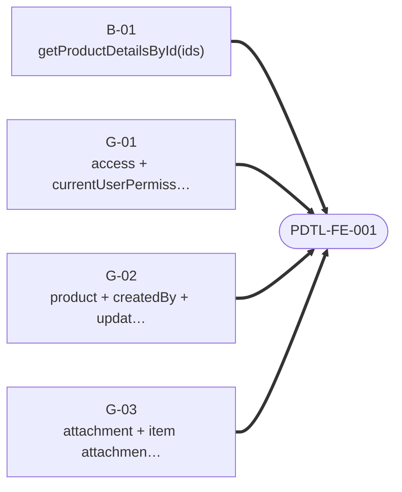

# Product Details — Story Dependency Graphs

> Generated 2026-07-21 from `be-04-stories.md` and `fe-08-frontend-stories.md` — regenerate via `generate_story_dependency_graphs.py` (also runs inside `generate_all.py`). Full story text (Current Behaviour, Target implementation, Acceptance Criteria): [productDetails/be-04-stories.md](../../../output/analysis/productDetails/be-04-stories.md).

---

## Graph A — Backend Story Dependency (build order)

For the engineer implementing this domain's backend: which story unlocks which. Nodes are grouped into swimlanes by **phase** (reads, then search, then mutations, then complex/federation/field-resolver work) — arrows show only the direct `Depends on:` edges. A dashed arrow from a diamond is a **gate** (a Phase-0 spike or a cross-subgraph block) — read-only context, not something the scheduler enforces.

```mermaid
flowchart TD
  subgraph PHB["📖 Phase B — Core Reads"]
    NB_01["B-01<br/>getProductDetailsById(ids)"]
  end
  subgraph PHC["🔍 Phase C — Search & Listing"]
    NC_01["C-01<br/>getProductDetailsElastic(resource…"]
  end
  subgraph PHD["✏️ Phase D — Mutations"]
    ND_01["D-01<br/>createProductDetailsSet"]
    ND_02["D-02<br/>updateProductDetailAccess"]
    ND_03["D-03<br/>productDetailLockUnlock"]
    ND_04["D-04<br/>cloneFilesForProductDetails"]
    ND_05["D-05<br/>updateProductDetailComponentStatus"]
  end
  subgraph PHE["⚙️ Phase E — Complex Operations"]
    NE_01["E-01<br/>updateProductDetailsSet (multi-st…"]
  end
  subgraph PHF["🔗 Phase F — Federation & Stitching"]
    NF_01["F-01<br/>Product.productDetails (internal,…"]
  end
  subgraph PHG["🧪 Phase G — Field Resolvers & Tests"]
    NG_01["G-01<br/>access + currentUserPermissions +…"]
    NG_02["G-02<br/>product + createdBy + updatedBy +…"]
    NG_03["G-03<br/>attachment + item attachment/cons…"]
  end
  NB_01 --> NC_01
  NB_01 --> ND_01
  NB_01 --> ND_02
  NB_01 --> ND_03
  NB_01 --> ND_04
  NB_01 --> ND_05
  NB_01 --> NE_01
  NB_01 --> NF_01
  NB_01 --> NG_01
  NB_01 --> NG_02
  NB_01 --> NG_03
  G__SPIKE_01{{"🔬 SPIKE-01"}}
  G__SPIKE_01 -.-> NE_01
  G__BLOCKED_BY_product__PRODUCT_BE_E_00__the_shared_WriteSaga_module_{{"⛔ BLOCKED-BY product (PRODUCT-BE-E-00, the shared WriteSaga module)"}}
  G__BLOCKED_BY_product__PRODUCT_BE_E_00__the_shared_WriteSaga_module_ -.-> NE_01
```

---

## Graph B — Frontend Readiness (what must ship before FE can start)

For the frontend engineer or PO checking whether backend is far enough along: **one small diagram per frontend story**, showing only the backend stories it directly depends on. (Any dependency *those* backend stories have on each other is Graph A's job, not repeated here — that's what kept the old single combined diagram unreadable.) A frontend story cannot start until every backend story pointing at it has shipped.

### PDTL-FE-001 · Migrate product-details reads

### PDTL-FE-002 · Migrate product-details simple mutations

### PDTL-FE-003 · Migrate `updateProductDetailsSet` saga handling

---
*Story dependency graphs · productDetails · generated 2026-07-21.*