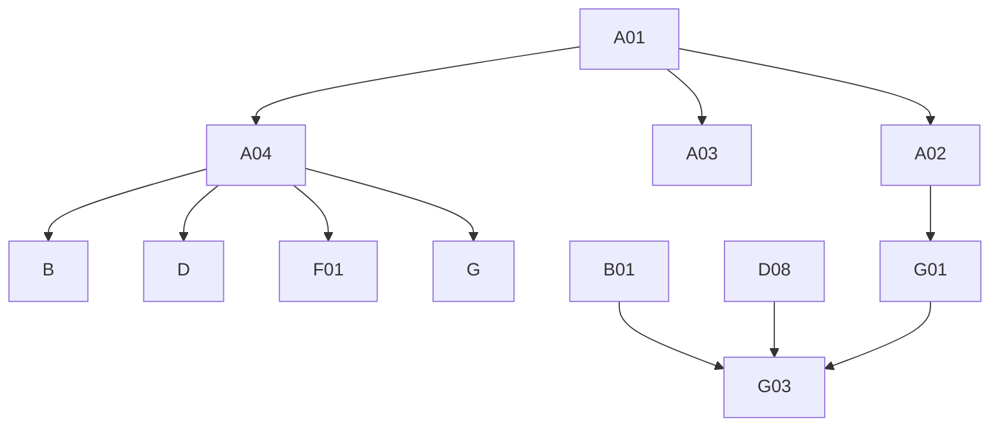

# Phase 4: Migration Plan & Stories — Attachment

> **Domain:** `attachment` · **Target DGS:** `AttachmentService` → separate `plm-attachment` subgraph
> **Pipeline Version:** 2.0 · **Generated:** 2026-06-27
> **Depends on:** [02-resolver-analysis.md](./02-resolver-analysis.md), [03-schema.graphql](./03-schema.graphql), [03-schema-analysis.md](./03-schema-analysis.md), [05-attribute-inventory.md](./05-attribute-inventory.md)
> **Index:** [04-stories-index.yaml](./04-stories-index.yaml)

Each story is self-contained. Full pseudo-logic in [02-resolver-analysis.md](./02-resolver-analysis.md).
**ACL is context-only** (but ACL *writes* in D06/D08 are build work). `attachment` is its **own subgraph**.

## 1. Phases Overview
| Phase | Name | Stories |
|---|---|---|
| A | Foundation & Schema | A01–A04 |
| B | Core Reads | B01–B05 |
| D | Mutations | D01–D14 |
| F | Federation & decisions | F01–F02 |
| G | Field Resolvers & Tests | G01–G03 |

## 2. Dependency Graph


---

## 3. Stories

### Phase A — Foundation & Schema

### SPARK-ATCH-A01 · Schema skeleton + DateTime scalar
```yaml
{id: SPARK-ATCH-A01, operation: "-", type: schema, category: CAT-1, phase: A, complexity: Low, depends_on: [], ext_services: [], files: [plm-attachment/.../schema/attachment.graphqls, plm-attachment/.../config/ScalarConfig.kt], blocked_by: none}
```
**Current Behaviour:** green-field; schema translated from `code/schemas/SPARK_Attachment.txt`.
**Target:** federation v2.3 header, `scalar DateTime → Instant`, empty `extend type Query`/`Mutation`. **Acceptance:** 1. `generateJava` passes. 2. scalar round-trips. **Tests:** ☐ compiles ☐ serde.

### SPARK-ATCH-A02 · Owned types + inputs (normalize snake/camel record shape)
```yaml
{id: SPARK-ATCH-A02, operation: "-", type: schema, category: CAT-1, phase: A, complexity: Medium, depends_on: [SPARK-ATCH-A01], ext_services: [], files: [plm-attachment/.../schema/attachment.graphqls, plm-attachment/.../model/AttachmentDto.kt], blocked_by: none}
```
**Target:** `Attachment` (`@key(fields:"id")`) + ~9 value types + ~12 inputs per [03-schema.graphql](./03-schema.graphql). **Key task:** normalize the **dual record shape** (elastic `snake_case` vs api `camelCase`) at the DTO/Feign boundary (Jackson) so the schema fields are clean — this removes most of the field-resolver coalescing. **Acceptance:** 1. all types/inputs present; nullability matches SDL. 2. one canonical DTO maps both shapes. **Tests:** ☐ validates ☐ snake+camel mapping.

### SPARK-ATCH-A03 · External stubs (platform + other DGS)
```yaml
{id: SPARK-ATCH-A03, operation: "-", type: schema, category: CAT-1, phase: A, complexity: Low, depends_on: [SPARK-ATCH-A01], ext_services: [], files: [plm-attachment/.../schema/attachment.graphqls], blocked_by: none}
```
**Target:** `@extends @external` stubs for `SearchAttachment`, `UserProfileAttributes`, `Tag`,
`AccessControl`, `ResourceMapping`/`SingleResourceMapping`, `VMM_BusinessPartner`. **Acceptance:** 1. compiles; gateway composes. **Tests:** ☐ compiles ☐ stub resolves.

### SPARK-ATCH-A04 · `AttachmentService` Kotlin port (plm-attachment)
```yaml
{id: SPARK-ATCH-A04, operation: "AttachmentService", type: service, category: CAT-3, phase: A, complexity: High, depends_on: [SPARK-ATCH-A01], ext_services: [], files: [plm-attachment/.../service/AttachmentService.kt, plm-attachment/.../client/*Client.kt], blocked_by: none}
```
**Current Behaviour (Phase 2 §Service):** ~30 REST methods on `plm-attachment` (`attachments/v3` + renders/gallery/acl). **Target:** Kotlin service; canonical DTO; preserve the V3-vs-legacy gallery branch. **Acceptance:** 1. methods present (V3 reads/byPost, renders, archive/delete, copy, associate/remove, tags, attributes/bulk(V2), gallery publish/unpublish V3+legacy, teams). **Tests:** ☐ endpoint build ☐ gallery branch.

---

### Phase B — Core Reads

### SPARK-ATCH-B01 · `getAttachmentsV3(ids)`
```yaml
{id: SPARK-ATCH-B01, operation: getAttachmentsV3, type: query, category: CAT-2, phase: B, complexity: Low, depends_on: [SPARK-ATCH-A02, SPARK-ATCH-A04], ext_services: [], files: [plm-attachment/.../dataFetcher/AttachmentQueryDataFetcher.kt], blocked_by: none}
```
**Current Behaviour (Q1):** empty ids → []; (ACL) token → (own) `GET /attachments/v3?humanIds=`. **Target:** `@DgsQuery → [Attachment]`. **Acceptance:** 1. returns attachments; empty ids → []. **Tests:** ☐ happy ☐ empty.

### SPARK-ATCH-B02 · `getAttachmentsByResource(resourceId)`
```yaml
{id: SPARK-ATCH-B02, operation: getAttachmentsByResource, type: query, category: CAT-2, phase: B, complexity: Medium, depends_on: [SPARK-ATCH-A04], ext_services: [{key: relationship, severity: YELLOW}], files: [plm-attachment/.../dataFetcher/AttachmentQueryDataFetcher.kt], blocked_by: none}
```
**Current Behaviour (Q2):** (🟡 relationship) `searchByIds({id, includeNodeTypes:['attachments','attachments_v3'], maxDepth:0})` → ids → (accessControl) `getUserAccessByPost` → (own) `getAttachmentsByPostV3`. **Target:** `@DgsQuery → [Attachment]`. **Acceptance:** 1. relationship→ids→attachments chain. **Tests:** ☐ chain ☐ empty.

### SPARK-ATCH-B03 · `getAttachmentsByResourceAndOwner(resourceId)`
```yaml
{id: SPARK-ATCH-B03, operation: getAttachmentsByResourceAndOwner, type: query, category: CAT-2, phase: B, complexity: Medium, depends_on: [SPARK-ATCH-A04], ext_services: [{key: relationship, severity: YELLOW}], files: [plm-attachment/.../dataFetcher/AttachmentQueryDataFetcher.kt], blocked_by: none}
```
**Current Behaviour (Q3):** (🟡 relationship) ids → (own) `getAttachmentsByIdsAndAuthorByPostV3`. **Target:** `@DgsQuery → [Attachment]`. **Acceptance:** 1. returns attachments incl. author. **Tests:** ☐ chain.

### SPARK-ATCH-B04 · Renders queries (`getRendersForAttachmentIds`/`V3Ids`/`byPost`)
```yaml
{id: SPARK-ATCH-B04, operation: "renders", type: query, category: CAT-2, phase: B, complexity: Medium, depends_on: [SPARK-ATCH-A04], ext_services: [], files: [plm-attachment/.../dataFetcher/AttachmentRendersDataFetcher.kt], blocked_by: none}
```
**Covers:** `getRendersForAttachmentIds` (@deprecated), `getRendersForAttachmentV3Ids`, `getRendersForAttachmentIdsByPost`. **Current Behaviour:** map each id → (own) renders loader (betaMode), compact; byPost uses an ACL token. **Target:** `@DgsQuery → [GalleryAttachment]`. **Acceptance:** 1. each variant returns renders; betaMode honored. **Tests:** ☐ ids ☐ v3 ☐ byPost.

### SPARK-ATCH-B05 · `getAttachmentsfromRelatedResource(s)`
```yaml
{id: SPARK-ATCH-B05, operation: "from-related", type: query, category: CAT-2, phase: B, complexity: Medium, depends_on: [SPARK-ATCH-A04], ext_services: [{key: search, severity: RED}], files: [plm-attachment/.../dataFetcher/AttachmentQueryDataFetcher.kt], blocked_by: none}
```
**Covers:** `getAttachmentsfromRelatedResource` (parent+related or related-only), `getAttachmentsfromRelatedResources`. **Current Behaviour:** (🔴 search) `searchAttachmentsByParentAndRelatedResource` / `…ByRelatedResource(s)` → content or []. **Target:** `@DgsQuery → [SearchAttachment]`. **Acceptance:** 1. parent+related vs related-only branches. **Tests:** ☐ both branches ☐ empty.

---

### Phase D — Mutations

### SPARK-ATCH-D01 · `archiveAttachmentV3`
```yaml
{id: SPARK-ATCH-D01, operation: archiveAttachmentV3, type: mutation, category: CAT-2, phase: D, complexity: Low, depends_on: [SPARK-ATCH-A04], ext_services: [], files: [plm-attachment/.../dataFetcher/AttachmentMutationDataFetcher.kt], blocked_by: none}
```
**Current Behaviour (M1):** (ACL) token → (own) `archiveAttachmentV3(id)`. **Target:** `@DgsMutation → Attachment`. **Acceptance:** 1. archives. **Tests:** ☐ archive.

### SPARK-ATCH-D02 · `deleteAttachmentV3`
```yaml
{id: SPARK-ATCH-D02, operation: deleteAttachmentV3, type: mutation, category: CAT-2, phase: D, complexity: Low, depends_on: [SPARK-ATCH-A04], ext_services: [], files: [plm-attachment/.../dataFetcher/AttachmentMutationDataFetcher.kt], blocked_by: none}
```
**Current Behaviour (M2):** (ACL) token → (own) `deleteAttachmentV3(humanId)` → String. **Target:** `@DgsMutation → String`. **Acceptance:** 1. deletes; returns status. **Tests:** ☐ delete.

### SPARK-ATCH-D03 · `copyAttachmentsV3`
```yaml
{id: SPARK-ATCH-D03, operation: copyAttachmentsV3, type: mutation, category: CAT-2, phase: D, complexity: Medium, depends_on: [SPARK-ATCH-A04], ext_services: [], files: [plm-attachment/.../dataFetcher/AttachmentMutationDataFetcher.kt], blocked_by: none}
```
**Current Behaviour (M3):** (ACL) token for `humanIds` → (own) `copyAttachmentsV3`. **Target:** `@DgsMutation → CopyAttachment`. **Acceptance:** 1. copies; returns thumbnail + copies. **Tests:** ☐ copy.

### SPARK-ATCH-D04 · `associateResourcesV3`
```yaml
{id: SPARK-ATCH-D04, operation: associateResourcesV3, type: mutation, category: CAT-2, phase: D, complexity: Low, depends_on: [SPARK-ATCH-A04], ext_services: [], files: [plm-attachment/.../dataFetcher/AttachmentMutationDataFetcher.kt], blocked_by: none}
```
**Current Behaviour (M4):** (ACL) token → (own) `associateResourcesV3`. **Target:** `@DgsMutation → [Attachment]`. **Acceptance:** 1. associates resources. **Tests:** ☐ associate.

### SPARK-ATCH-D05 · `removeResourcesV3`
```yaml
{id: SPARK-ATCH-D05, operation: removeResourcesV3, type: mutation, category: CAT-2, phase: D, complexity: Low, depends_on: [SPARK-ATCH-A04], ext_services: [], files: [plm-attachment/.../dataFetcher/AttachmentMutationDataFetcher.kt], blocked_by: none}
```
**Current Behaviour (M5):** (ACL) token → (own) `removeResourcesV3`. **Target:** `@DgsMutation → [Attachment]`. **Acceptance:** 1. removes resources. **Tests:** ☐ remove.

### SPARK-ATCH-D06 · `updateAttachmentsACLPermissions`
```yaml
{id: SPARK-ATCH-D06, operation: updateAttachmentsACLPermissions, type: mutation, category: CAT-2, phase: D, complexity: Medium, depends_on: [SPARK-ATCH-A04], ext_services: [{key: accessControl, severity: YELLOW}], files: [plm-attachment/.../dataFetcher/AttachmentMutationDataFetcher.kt], blocked_by: none}
```
**Current Behaviour (M6):** build bulk `{resourceId, dps:[{permissionLevel:ADMIN/READ, grantees:[partnerId]}]}` for admin/read id lists → (accessControl) `updateAccessControl`. **Note:** this is an **ACL write** (grant data — build work). **Target:** `@DgsMutation → AccessControl`. **Acceptance:** 1. ADMIN/READ DTOs built correctly per id list. **Tests:** ☐ admin ☐ read ☐ both.

### SPARK-ATCH-D07 · `updateAttachmentTags` + `updateAttachmentTagsV3`
```yaml
{id: SPARK-ATCH-D07, operation: "updateAttachmentTags*", type: mutation, category: CAT-2, phase: D, complexity: Low, depends_on: [SPARK-ATCH-A04], ext_services: [], files: [plm-attachment/.../dataFetcher/AttachmentMutationDataFetcher.kt], blocked_by: none}
```
**Current Behaviour (M7/M8):** **identical impl** — (ACL) token → (own) `updateTagsV3({attachmentId, tags})`. **Target:** `@DgsMutation` (one impl, two schema fields). **Acceptance:** 1. updates tags; both fields delegate. **Tests:** ☐ tags ☐ both fields.

### SPARK-ATCH-D08 · `bulkUpdateAttachments`
```yaml
{id: SPARK-ATCH-D08, operation: bulkUpdateAttachments, type: mutation, category: CAT-2, phase: D, complexity: Medium, depends_on: [SPARK-ATCH-A04], ext_services: [{key: accessControl, severity: YELLOW}], files: [plm-attachment/.../dataFetcher/AttachmentMutationDataFetcher.kt], blocked_by: none}
```
**Current Behaviour (M9):** if tags → (own) `bulkUpdateTags`; if permissions → (accessControl) `bulkUpdateAttachmentPermissions`. **Latent:** fire-and-forget; **returns undefined** (confirm contract). **Target:** `@DgsMutation`; await + return updated. **Acceptance:** 1. tags + permissions applied. 2. returns updated attachments (fix the undefined). **Tests:** ☐ tags ☐ permissions ☐ return.

### SPARK-ATCH-D09 · `updateAttributes`
```yaml
{id: SPARK-ATCH-D09, operation: updateAttributes, type: mutation, category: CAT-2, phase: D, complexity: Low, depends_on: [SPARK-ATCH-A04], ext_services: [], files: [plm-attachment/.../dataFetcher/AttachmentMutationDataFetcher.kt], blocked_by: none}
```
**Current Behaviour (M10):** (ACL) token for `documentId` → (own) `updateAttributes`. **Target:** `@DgsMutation → Attachment`. **Acceptance:** 1. updates attributes. **Tests:** ☐ update.

### SPARK-ATCH-D10 · `bulkUpdateAttributes`
```yaml
{id: SPARK-ATCH-D10, operation: bulkUpdateAttributes, type: mutation, category: CAT-2, phase: D, complexity: Medium, depends_on: [SPARK-ATCH-A04], ext_services: [], files: [plm-attachment/.../dataFetcher/AttachmentMutationDataFetcher.kt], blocked_by: none}
```
**Current Behaviour (M11):** (ACL) token for `documentId||humanId` → (own) `bulkUpdateAttributes`. **Target:** `@DgsMutation → [Attachment]`. **Acceptance:** 1. bulk-updates attributes. **Tests:** ☐ bulk.

### SPARK-ATCH-D11 · `bulkUpdateAttachmentsV2`
```yaml
{id: SPARK-ATCH-D11, operation: bulkUpdateAttachmentsV2, type: mutation, category: CAT-2, phase: D, complexity: Medium, depends_on: [SPARK-ATCH-A04], ext_services: [], files: [plm-attachment/.../dataFetcher/AttachmentMutationDataFetcher.kt], blocked_by: none}
```
**Current Behaviour (M12):** (ACL) token for `documentId` → (own) `bulkUpdateAttachmentsV2({attachments})`. **Target:** `@DgsMutation → [Attachment]`. **Acceptance:** 1. bulk-updates (tags/packet/perms/related). **Tests:** ☐ bulk v2.

### SPARK-ATCH-D12 · `publishAttachmentToGallery`
```yaml
{id: SPARK-ATCH-D12, operation: publishAttachmentToGallery, type: mutation, category: CAT-2, phase: D, complexity: Medium, depends_on: [SPARK-ATCH-A04], ext_services: [], files: [plm-attachment/.../dataFetcher/AttachmentMutationDataFetcher.kt], blocked_by: none}
```
**Current Behaviour (M13):** **branch on `ATC-` prefix** → V3 (`publishAttachmentToGalleryV3`) or legacy (`publishAttachmentToGallery`); api returns void → return `true`. **Target:** `@DgsMutation → Boolean`. **Acceptance:** 1. ATC- → V3, else legacy. 2. returns true on no-error. **Tests:** ☐ v3 ☐ legacy.

### SPARK-ATCH-D13 · `unpublishAttachmentToGallery`
```yaml
{id: SPARK-ATCH-D13, operation: unpublishAttachmentToGallery, type: mutation, category: CAT-2, phase: D, complexity: Medium, depends_on: [SPARK-ATCH-A04], ext_services: [], files: [plm-attachment/.../dataFetcher/AttachmentMutationDataFetcher.kt], blocked_by: none}
```
**Current Behaviour (M14):** as D12, unpublish (V3/legacy by `ATC-`). **Target:** `@DgsMutation → Boolean`. **Acceptance:** 1. ATC- → V3, else legacy. **Tests:** ☐ v3 ☐ legacy.

### SPARK-ATCH-D14 · `associateAttachmentTeams`
```yaml
{id: SPARK-ATCH-D14, operation: associateAttachmentTeams, type: mutation, category: CAT-2, phase: D, complexity: Medium, depends_on: [SPARK-ATCH-A04], ext_services: [], files: [plm-attachment/.../dataFetcher/AttachmentMutationDataFetcher.kt], blocked_by: none}
```
**Current Behaviour (M15):** build `{teamsToUpdateDto, parentId, humanIds:files, relatedResourceIds}` → (ACL) token for `files` → (own) `associateAttachmentTeams`. **Target:** `@DgsMutation → [Attachment]`. **Acceptance:** 1. associates teams to files. **Tests:** ☐ associate teams.

---

### Phase F — Federation & decisions

### SPARK-ATCH-F01 · `Attachment` federated entity fetcher
```yaml
{id: SPARK-ATCH-F01, operation: "Attachment.__entity", type: field-resolver, category: CAT-4, phase: F, complexity: Medium, depends_on: [SPARK-ATCH-A02, SPARK-ATCH-A04], ext_services: [], files: [plm-attachment/.../dataFetcher/AttachmentEntityFetcher.kt], blocked_by: none}
```
**Target:** `@DgsEntityFetcher(name="Attachment")` resolving by `id`, so product (`attachments`,
`attachmentsWithMetaData`, copy flows), productDetails, packaging, workspace, sample, claims resolve
attachments over the gateway. Keep `Attachment` distinct from search's `SearchAttachment`. **Acceptance:** 1. entity resolves by key. 2. `Product { attachments { id } }` smoke test. **Tests:** ☐ entity fetch ☐ smoke.

### SPARK-ATCH-F02 · Deferred `getAttachments` drift query decision
```yaml
{id: SPARK-ATCH-F02, operation: "getAttachments-drift", type: schema, category: CAT-4, phase: F, complexity: Low, depends_on: [SPARK-ATCH-A04], ext_services: [], files: [plm-attachment/.../schema/attachment.graphqls], blocked_by: none}
```
**Current Behaviour:** `getAttachments(resourceId, resourceType)` is `@deprecated("Use v3")` with **no resolver**. **Target:** delete or keep `@deprecated`; survey consumers. **Acceptance:** 1. decision + traffic survey. **Tests:** ☐ schema diff intentional.

---

### Phase G — Field Resolvers & Tests

### SPARK-ATCH-G01 · `Attachment` core field resolvers (snake/camel + access/users/businessPartnersFull)
```yaml
{id: SPARK-ATCH-G01, operation: "Attachment.*", type: field-resolver, category: CAT-2, phase: G, complexity: High, depends_on: [SPARK-ATCH-A02, SPARK-ATCH-A04], ext_services: [{key: accessControl, severity: YELLOW}, {key: vmm, severity: BLUE}, {key: userAttributes, severity: YELLOW}], files: [plm-attachment/.../dataFetcher/AttachmentFieldDataFetcher.kt], blocked_by: none}
```
**Current Behaviour:** ~18 coalescing fields (snake/camel) + Date parse + `id` derivation; `access`
(accessControl `getPermissionsForResource`), `businessPartnersFull` (🔵 vmm), `createdBy`/`updatedBy`
(🟡 user). **Target:** most coalescing handled by A02's canonical DTO; thin `@DgsData` for the EXT fields. **Acceptance:** 1. coalescing correct (both shapes). 2. access/users/bps resolve. **Tests:** ☐ snake shape ☐ camel shape ☐ access ☐ users.

### SPARK-ATCH-G02 · `tags` + `modelFile` + gallery sub-types
```yaml
{id: SPARK-ATCH-G02, operation: "Attachment.tags+gallery", type: field-resolver, category: CAT-2, phase: G, complexity: Medium, depends_on: [SPARK-ATCH-A04], ext_services: [{key: tag, severity: YELLOW}, {key: gallery, severity: BLUE}, {key: userAttributes, severity: YELLOW}], files: [plm-attachment/.../dataFetcher/AttachmentGalleryFieldDataFetcher.kt], blocked_by: none}
```
**Current Behaviour:** `tags` (🟡 tag `getTags`), `modelFile` (`get3DmodelFile`); `GalleryDetails.publishedBy`
(🟡 user)/`fileTypes` (🔵 gallery `getAssetFiles`) + coalescing; `GalleryFile.canOpenInShowDog`, `ThreeDFile`,
`ProductPacketProps` (coalesce). **Acceptance:** 1. each resolves; gallery fileTypes via asset id. **Tests:** ☐ tags ☐ modelFile ☐ galleryDetails.

### SPARK-ATCH-G03 · Tests, parity harness
```yaml
{id: SPARK-ATCH-G03, operation: "tests", type: tests, category: CAT-5, phase: G, complexity: High, depends_on: [SPARK-ATCH-B01, SPARK-ATCH-D08, SPARK-ATCH-G01], files: [plm-attachment/.../test/*.kt], blocked_by: none}
```
**Target:** ≥80% unit coverage; parity harness (incl. **both record shapes**, the gallery V3/legacy branch,
ACL writes, bulk updates); contract test (schema diff intentional-only, incl. `@deprecated`). **Acceptance:** 1. unit ≥80%. 2. parity green (both shapes). 3. schema-diff intentional. **Tests:** ☐ parity ☐ contract.

---

## 4. Risk Register
| Risk | Likelihood | Impact | Mitigation | Owner |
|------|-----------|--------|------------|-------|
| Dual record shape leaks into schema (A02/G01) | Medium | Medium | Normalize at the DTO boundary; one mapping | Backend Eng |
| `bulkUpdateAttachments` fire-and-forget / undefined (D08) | Medium | Medium | Await + return updated; confirm contract | Backend Eng |
| ACL-permission writes treated as "ignored" (D06/D08) | Medium | Medium | They ARE build work (grant data) — port them | Tech Lead |
| Gallery publish/unpublish V3-vs-legacy branch (D12/D13) | Low | Low | Preserve the `ATC-` prefix branch | Backend Eng |
| `SearchAttachment` vs `Attachment` confusion in supergraph | Low | Medium | Keep the two types distinct | Architect |

## 5. Summary
- **Stories:** 28 (A:4 · B:5 · D:14 · F:2 · G:3).
- **Critical path:** A01→A02/A04→G01→G03.
- **Highest cost:** the dual-shape normalization (A02) + core field resolvers (G01).
- **Separate subgraph:** `Attachment` is the entity product/productDetails/packaging/workspace/sample/claims reference.

---
**Phase Completed:** Phase 4 — Migration Stories · **Domain:** `attachment` · **Outputs:** 04-stories.md, 04-stories-index.yaml, 04-po-summary.md.
