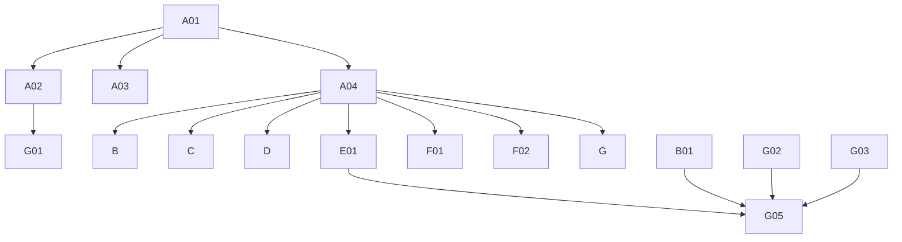

# Phase 4: Migration Plan & Stories — Claims

> **Domain:** `claims` · **Target DGS:** `ClaimService` → separate `claims` subgraph (repo `spark-claims`)
> **Pipeline Version:** 2.0 · **Generated:** 2026-06-27
> **Depends on:** [02-resolver-analysis.md](./02-resolver-analysis.md), [03-schema.graphql](./03-schema.graphql), [03-schema-analysis.md](./03-schema-analysis.md), [05-attribute-inventory.md](./05-attribute-inventory.md)
> **Index:** [04-stories-index.yaml](./04-stories-index.yaml)

Each story is self-contained. Full pseudo-logic in [02-resolver-analysis.md](./02-resolver-analysis.md).
**ACL is context-only** — no ACL work in any story. **Claims is its own subgraph** (Product/search/etc. are
cross-subgraph).

## 1. Phases Overview
| Phase | Name | Stories |
|---|---|---|
| A | Foundation & Schema | A01–A04 |
| B | Core Reads | B01–B05 |
| C | Search & Listing | C01–C02 |
| D | Mutations (simple) | D01–D05 |
| E | Complex (proxy-ACL multi-step write) | E01 |
| F | Federation Contributions (BLOCKED-BY product) | F01–F02 |
| G | Field Resolvers & Tests | G01–G05 |

## 2. Dependency Graph


---

## 3. Stories

### Phase A — Foundation & Schema

### SPARK-CLM-A01 · Schema skeleton + DateTime scalar
```yaml
{id: SPARK-CLM-A01, operation: "-", type: schema, category: CAT-1, phase: A, complexity: Low, depends_on: [], ext_services: [], files: [spark-claims/.../schema/claims.graphqls, spark-claims/.../config/ScalarConfig.kt], blocked_by: none}
```
**Current Behaviour:** green-field; schema translated from `code/schemas/SPARK_Claims.txt`.
**Target:** federation v2.3 header, `scalar DateTime → Instant`, empty `extend type Query`/`Mutation`.
**Acceptance:** 1. `./gradlew generateJava` passes. 2. `DateTime` round-trips. **Tests:** ☐ compiles ☐ scalar serde.

### SPARK-CLM-A02 · Owned types + inputs
```yaml
{id: SPARK-CLM-A02, operation: "-", type: schema, category: CAT-1, phase: A, complexity: Medium, depends_on: [SPARK-CLM-A01], ext_services: [], files: [spark-claims/.../schema/claims.graphqls], blocked_by: none}
```
**Target:** `Claims` (**`@key(fields:"humanId")`** — SDL has no `id`), the 7 value types, the ~9 inputs,
`@shareable CodeDescription` — per [03-schema.graphql](./03-schema.graphql). **Note:** `workspaceContext`
is `[ID]` on create but `PartialWorkspaceAssociationsInput` on update (preserve). **Acceptance:** 1. all types+inputs present; `@key=humanId`; nullability matches SDL. 2. validates. **Tests:** ☐ validates ☐ entity stub.

### SPARK-CLM-A03 · External stubs (Product + platform + sibling DGS)
```yaml
{id: SPARK-CLM-A03, operation: "-", type: schema, category: CAT-1, phase: A, complexity: Low, depends_on: [SPARK-CLM-A01], ext_services: [], files: [spark-claims/.../schema/claims.graphqls], blocked_by: none}
```
**Target:** `@extends @external` stubs — `Product`, `WorkspaceV2`, `UserProfileAttributes`,
`UserGroup_Participants`, `AccessControl`, `ResourcePermissions`, `ProductComponentStatus`, `TeamPaged`,
`VMM_BusinessPartner`. (All cross-subgraph — claims is its own DGS.) **Acceptance:** 1. compiles; gateway composes. **Tests:** ☐ compiles ☐ stub resolves.

### SPARK-CLM-A04 · `ClaimService` Kotlin port
```yaml
{id: SPARK-CLM-A04, operation: "ClaimService", type: service, category: CAT-3, phase: A, complexity: Medium, depends_on: [SPARK-CLM-A01], ext_services: [], files: [spark-claims/.../service/ClaimService.kt, spark-claims/.../client/*Client.kt, spark-claims/.../model/*Dto.kt], blocked_by: none}
```
**Current Behaviour (Phase 2 §Service):** 13 REST methods on the claim base (2 unused: versions).
**Target:** Kotlin service; preserve create/update throw-on-error and the `bulkUpdateClaim` `status_code`
contract; **fix** `bulkUpdateClaim` to camelCase the response (source snake-cases it). **Acceptance:** 1. used methods present (POST, GET listing, GET /search, PUT /{humanId}, PUT /bulk-update, GET /communication-channels, GET/POST /export, GET /search/guest_facing_claim, PUT /{id}/lock|unlock, GET /claims-about). 2. bulk response camelCased. **Tests:** ☐ endpoint build ☐ bulk transform ☐ error contracts.

---

### Phase B — Core Reads

### SPARK-CLM-B01 · `getClaims(parentHumanId, claimHumanIds, partnerIds)`
```yaml
{id: SPARK-CLM-B01, operation: getClaims, type: query, category: CAT-2, phase: B, complexity: Low, depends_on: [SPARK-CLM-A02, SPARK-CLM-A04], ext_services: [], files: [spark-claims/.../dataFetcher/ClaimQueryDataFetcher.kt], blocked_by: none}
```
**Current Behaviour (Q1):** (own) `claim.getClaims.load({parentHumanId, claimHumanIds, partnerIds})` `GET {base}` (filtered) → camelCase. **No ACL token.** **Target:** `@DgsQuery → [Claims]`. **Acceptance:** 1. filters by the 3 args. **Tests:** ☐ happy ☐ empty ☐ integration.

### SPARK-CLM-B02 · `getClaimByIds(claimHumanIds)`
```yaml
{id: SPARK-CLM-B02, operation: getClaimByIds, type: query, category: CAT-2, phase: B, complexity: Low, depends_on: [SPARK-CLM-A02, SPARK-CLM-A04], ext_services: [], files: [spark-claims/.../dataFetcher/ClaimQueryDataFetcher.kt], blocked_by: none}
```
**Current Behaviour (Q2):** (ACL context) token → `GET {base}/search?claimIds={csv}`. **Target:** `@DgsQuery → [Claims]`. **Acceptance:** 1. returns claims for ids. **Tests:** ☐ happy ☐ empty.

### SPARK-CLM-B03 · `getCommunicationChannels` (cacheable)
```yaml
{id: SPARK-CLM-B03, operation: getCommunicationChannels, type: query, category: CAT-2, phase: B, complexity: Low, depends_on: [SPARK-CLM-A04], ext_services: [], files: [spark-claims/.../dataFetcher/ClaimQueryDataFetcher.kt], blocked_by: none}
```
**Current Behaviour (Q3):** (own) `GET {base}/communication-channels`. **Target:** `@DgsQuery` → `@Cacheable` → `[CommunicationChannel]`. **Acceptance:** 1. returns channels; cached. **Tests:** ☐ list ☐ cache hit.

### SPARK-CLM-B04 · `getAllClaimsAbout` (cacheable)
```yaml
{id: SPARK-CLM-B04, operation: getAllClaimsAbout, type: query, category: CAT-2, phase: B, complexity: Low, depends_on: [SPARK-CLM-A04], ext_services: [], files: [spark-claims/.../dataFetcher/ClaimQueryDataFetcher.kt], blocked_by: none}
```
**Current Behaviour (Q4):** (own) `GET {base}/claims-about`. **Target:** `@DgsQuery` → `@Cacheable` → `[CodeDescription]`. **Acceptance:** 1. returns list; cached. **Tests:** ☐ list ☐ cache hit.

### SPARK-CLM-B05 · `getClaimExports`
```yaml
{id: SPARK-CLM-B05, operation: getClaimExports, type: query, category: CAT-2, phase: B, complexity: Low, depends_on: [SPARK-CLM-A04], ext_services: [], files: [spark-claims/.../dataFetcher/ClaimQueryDataFetcher.kt], blocked_by: none}
```
**Current Behaviour (Q5):** (own) `GET {base}/export`. **Target:** `@DgsQuery → [ClaimExport]`. **Acceptance:** 1. returns export records. **Tests:** ☐ list.

---

### Phase C — Search & Listing

### SPARK-CLM-C01 · `searchGuestFacing(queryParam)`
```yaml
{id: SPARK-CLM-C01, operation: searchGuestFacing, type: query, category: CAT-2, phase: C, complexity: Medium, depends_on: [SPARK-CLM-A04], ext_services: [], files: [spark-claims/.../dataFetcher/ClaimQueryDataFetcher.kt], blocked_by: none}
```
**Current Behaviour (Q6):** (own) `GET {base}/search/guest_facing_claim?{qs(queryParam)}` → camelCase. **Target:** `@DgsQuery → [Guest_Facing]`. **Acceptance:** 1. query-string built from `queryParam`. **Tests:** ☐ search ☐ empty.

### SPARK-CLM-C02 · `getClaimsElastic(parentHumanId)`
```yaml
{id: SPARK-CLM-C02, operation: getClaimsElastic, type: query, category: CAT-2, phase: C, complexity: Medium, depends_on: [SPARK-CLM-A04], ext_services: [{key: search, severity: RED}], files: [spark-claims/.../dataFetcher/ClaimQueryDataFetcher.kt], blocked_by: none}
```
**Current Behaviour (Q7):** (🔴 search) `search.getClaimsElastic.load({ q:"parentId: {parentHumanId}" })`. **EXT:** 🔴 search. **Target:** `@DgsQuery → [Claims]` via the search subgraph/client. **Acceptance:** 1. `parentId:` elastic query built. **Tests:** ☐ query build ☐ parity.

---

### Phase D — Mutations (simple)

### SPARK-CLM-D01 · `createClaim`
```yaml
{id: SPARK-CLM-D01, operation: createClaim, type: mutation, category: CAT-2, phase: D, complexity: Medium, depends_on: [SPARK-CLM-A04], ext_services: [], files: [spark-claims/.../dataFetcher/ClaimMutationDataFetcher.kt], blocked_by: none}
```
**Current Behaviour (M1):** (own) `POST {base}` (snake_case). **If `validationErrors`/`message` → throw.** **Target:** `@DgsMutation → [Claims]`; port throw-on-error. **Acceptance:** 1. creates claim(s). 2. validation error → exception. **Tests:** ☐ create ☐ validation-error→throw.

### SPARK-CLM-D02 · `bulkUpdateClaim`
```yaml
{id: SPARK-CLM-D02, operation: bulkUpdateClaim, type: mutation, category: CAT-2, phase: D, complexity: Medium, depends_on: [SPARK-CLM-A04], ext_services: [], files: [spark-claims/.../dataFetcher/ClaimMutationDataFetcher.kt], blocked_by: none}
```
**Current Behaviour (M3):** (own) `PUT {base}/bulk-update`. **Error contract:** result is array → return; `status_code>400` → throw; else throw "unhandled". **Latent:** source snake-cases the response — **fix to camelCase**. **Target:** `@DgsMutation → [Claims]`. **Acceptance:** 1. array result returned (camelCase). 2. error status → exception. **Tests:** ☐ bulk ☐ error status ☐ camelCase.

### SPARK-CLM-D03 · `requestClaimExport`
```yaml
{id: SPARK-CLM-D03, operation: requestClaimExport, type: mutation, category: CAT-2, phase: D, complexity: Low, depends_on: [SPARK-CLM-A04], ext_services: [], files: [spark-claims/.../dataFetcher/ClaimMutationDataFetcher.kt], blocked_by: none}
```
**Current Behaviour (M4):** (own) `POST {base}/export` → `response.request_id`. **Target:** `@DgsMutation → String`. **Acceptance:** 1. returns the request id. **Tests:** ☐ request.

### SPARK-CLM-D04 · `lockClaim`
```yaml
{id: SPARK-CLM-D04, operation: lockClaim, type: mutation, category: CAT-2, phase: D, complexity: Low, depends_on: [SPARK-CLM-A04], ext_services: [], files: [spark-claims/.../dataFetcher/ClaimMutationDataFetcher.kt], blocked_by: none}
```
**Current Behaviour (M5):** (ACL context) token → `PUT {base}/{claimId}/lock`. **Target:** `@DgsMutation → Claims`. **Acceptance:** 1. locks the claim. **Tests:** ☐ lock.

### SPARK-CLM-D05 · `unlockClaim`
```yaml
{id: SPARK-CLM-D05, operation: unlockClaim, type: mutation, category: CAT-2, phase: D, complexity: Low, depends_on: [SPARK-CLM-A04], ext_services: [], files: [spark-claims/.../dataFetcher/ClaimMutationDataFetcher.kt], blocked_by: none}
```
**Current Behaviour (M6):** (ACL context) token → `PUT {base}/{claimId}/unlock`. **Target:** `@DgsMutation → Claims`. **Acceptance:** 1. unlocks the claim. **Tests:** ☐ unlock.

---

### Phase E — Complex Operations

### SPARK-CLM-E01 · `updateClaim` (proxy ACL + multi-step write)
```yaml
{id: SPARK-CLM-E01, operation: updateClaim, type: mutation, category: CAT-2, phase: E, complexity: High, depends_on: [SPARK-CLM-A04], ext_services: [{key: workspaceV2, severity: YELLOW}], files: [spark-claims/.../service/ClaimUpdateService.kt], blocked_by: none}
```
**As a** DGS engineer **I want** the multi-step claim update with a failure strategy **so that** workspace
and body changes stay consistent.
**Current Behaviour (M2):** 1) `getUserPermissionsJWTByProxy({id:humanId, proxyIds:[parentId],
basePermissions:true})` (proxy/external ACL path — context only); 2) if `workspaceContext.{add,remove}`
non-empty → `workspaceAssociationHelper(CLAIM, humanId, add, remove)`; 3) `PUT {base}/{humanId}`;
4) **throw on `validationErrors`/`message`**. No rollback.
**EXT:** 🟡 workspaceV2. **Target:** ordered steps + chosen failure strategy (**PO decision**). The proxy
ACL is **context-only** (note it; build nothing). **Acceptance:** 1. workspace assoc runs when present. 2. body update + throw-on-error. 3. partial-failure strategy. **Tests:** ☐ body-only ☐ +workspace ☐ validation-error→throw ☐ partial-failure ☐ parity.

---

### Phase F — Federation Contributions (BLOCKED-BY product)

### SPARK-CLM-F01 · `Product.claims` (federation contribution)
```yaml
{id: SPARK-CLM-F01, operation: "Product.claims", type: field-resolver, category: CAT-4, phase: F, complexity: Medium, depends_on: [SPARK-CLM-A04], ext_services: [], files: [spark-claims/.../schema, spark-claims/.../dataFetcher/ProductClaimsEntityFetcher.kt], blocked_by: product}
```
**Target:** `extend type Product @key(fields:"id") { claims(partnerIds:[String], includeClaims:Boolean): [Claims] }` with a `@DgsEntityFetcher`; the claims subgraph fills `Product.claims` over the gateway. **BLOCKED-BY:** the `Product` entity existing (plm-product Phase A). **Acceptance:** 1. `Product.claims` resolves via federation. 2. parity vs the current in-gateway resolver. **Tests:** ☐ field resolves ☐ parity.

### SPARK-CLM-F02 · `ResourcesCount.claims` (TechPack — claims side of SPARK-PROD-F05)
```yaml
{id: SPARK-CLM-F02, operation: "ResourcesCount.claims", type: field-resolver, category: CAT-4, phase: F, complexity: Low, depends_on: [SPARK-CLM-A04], ext_services: [], files: [spark-claims/.../schema, spark-claims/.../dataFetcher/ResourcesCountClaimsEntityFetcher.kt], blocked_by: product}
```
**Target:** `extend type ResourcesCount @key(fields:"productId partnerId") { claims: [ID] }` with a
`@DgsEntityFetcher`; fills the TechPack `claims` count. **BLOCKED-BY:** product TechPack facade
(`SPARK-PROD-E03`/`F05`). **Acceptance:** 1. field resolves on the federated `ResourcesCount`; parity vs facade. **Tests:** ☐ field resolves ☐ parity.

---

### Phase G — Field Resolvers & Tests

### SPARK-CLM-G01 · `access` + `currentUserPermissions` + `participantDetails`
```yaml
{id: SPARK-CLM-G01, operation: "Claims.access+perms+participants", type: field-resolver, category: CAT-2, phase: G, complexity: Medium, depends_on: [SPARK-CLM-A02, SPARK-CLM-A04], ext_services: [{key: userGroup, severity: BLUE}], files: [spark-claims/.../dataFetcher/ClaimAclFieldDataFetcher.kt], blocked_by: none}
```
**Current Behaviour:** `access` → `accessControl.getPermissions([humanId])[0]`; `currentUserPermissions`
→ `getUserAccessUnencoded(humanId)[0]`; `participantDetails` → `getUserGroup(humanId)`. (ACL context.) **Acceptance:** 1. each resolves; null-safe. **Tests:** ☐ access ☐ perms ☐ participants.

### SPARK-CLM-G02 · `createdBy` + `updatedBy` + `businessPartner` + `designPartner`
```yaml
{id: SPARK-CLM-G02, operation: "Claims.users+partners", type: field-resolver, category: CAT-2, phase: G, complexity: Medium, depends_on: [SPARK-CLM-A04], ext_services: [{key: userAttributes, severity: YELLOW}, {key: vmm, severity: BLUE}], files: [spark-claims/.../dataFetcher/ClaimPartnerFieldDataFetcher.kt], blocked_by: none}
```
**Current Behaviour:** users via 🟡 user-profile; `businessPartner` **3-way fallback** (`partnerId` ||
`{bpId:0,bpName:'Target'}` when no `dpPartnerId` || `dpPartnerId`); `designPartner` `dpPartnerId` or
`{bpId:null,bpName:null}`. **Target:** preserve every branch exactly. **Acceptance:** 1. all 3 BP branches correct (incl. `bpId:0` Target). 2. null id → null user. **Tests:** ☐ partnerId ☐ dp fallback ☐ Target(0) ☐ users.

### SPARK-CLM-G03 · `product` + `parentDetails` (otherClaimBps / systemTeams / droppedPartnerIds)
```yaml
{id: SPARK-CLM-G03, operation: "Claims.parent", type: field-resolver, category: CAT-2, phase: G, complexity: High, depends_on: [SPARK-CLM-A04], ext_services: [{key: product, severity: YELLOW}, {key: search, severity: RED}], files: [spark-claims/.../dataFetcher/ClaimParentFieldDataFetcher.kt], blocked_by: none}
```
**Current Behaviour:** `product` (🟡 product, only if `parentId` starts `'PID'`); `parentDetails` →
`product.getByID(parentId)` (the product feeds `ParentDetails`): `otherClaimBps` (🔴 search
`getClaimsElastic` → partner ids), `systemTeams` (🔴 search `searchTeams` from product BPs; empty→`{content:[]}`),
`droppedPartnerIds` (direct). **Target:** federated product reference + search. **Acceptance:** 1. `product` null when not `PID*`. 2. `otherClaimBps`/`systemTeams` elastic queries match source; empty-BP → `{content:[]}`. **Tests:** ☐ product branch ☐ otherClaimBps ☐ systemTeams ☐ empty BPs.

### SPARK-CLM-G04 · `workspaces` + `ClaimSubstantiate.substantiatedBy` + `ClaimDetails.claimName`
```yaml
{id: SPARK-CLM-G04, operation: "Claims.workspaces+misc", type: field-resolver, category: CAT-2, phase: G, complexity: Medium, depends_on: [SPARK-CLM-A04], ext_services: [{key: workspaceV2, severity: YELLOW}, {key: userAttributes, severity: YELLOW}], files: [spark-claims/.../dataFetcher/ClaimMiscFieldDataFetcher.kt], blocked_by: none}
```
**Current Behaviour:** `workspaces` (🟡 workspaceV2 by `workspaceContext`); `substantiatedBy`
(🟡 user-profile); `ClaimDetails.claimName` = `guestFacingClaim` (computed). **Acceptance:** 1. each resolves; `workspaces` null when empty. 2. `claimName` mirrors `guestFacingClaim`. **Tests:** ☐ workspaces ☐ substantiatedBy ☐ claimName.

### SPARK-CLM-G05 · Tests, parity harness
```yaml
{id: SPARK-CLM-G05, operation: "tests", type: tests, category: CAT-5, phase: G, complexity: Medium, depends_on: [SPARK-CLM-B01, SPARK-CLM-E01, SPARK-CLM-G02, SPARK-CLM-G03], files: [spark-claims/.../test/*.kt], blocked_by: none}
```
**Target:** ≥80% unit coverage; parity fixtures (incl. `updateClaim` proxy path, `bulkUpdateClaim`
camelCase fix, the `businessPartner` 3-way fallback, `parentDetails` elastic lookups); contract test
(schema diff intentional-only). **Acceptance:** 1. unit ≥80%. 2. parity green. 3. schema-diff intentional. **Tests:** ☐ parity ☐ contract.

---

## 4. Risk Register
| Risk | Likelihood | Impact | Mitigation | Owner |
|------|-----------|--------|------------|-------|
| `updateClaim` proxy-ACL multi-step partial failure (E01) | Medium | High | Saga / compensation — PO decision | Tech Lead + PO |
| `bulkUpdateClaim` snake-cased response (likely bug) (D02) | Medium | Medium | Fix to camelCase; parity test | Backend Eng |
| `businessPartner` 3-way fallback regressions (G02) | Low | Medium | Unit-test each branch incl. Target(0) | Backend Eng |
| `ParentDetails` elastic team/BP lookups (G03) | Low | Medium | Preserve empty handling; paginate | Backend Eng |
| Federation contributions wait on product (F01/F02) | Low | Low | Post-launch; not on critical path | Architect |

## 5. Summary
- **Stories:** 24 (A:4 · B:5 · C:2 · D:5 · E:1 · F:2 · G:5).
- **Critical path:** A01→A02/A04→E01→G02/G03→G05.
- **Highest risk:** `updateClaim` (E01); the `bulkUpdateClaim` transform bug (D02).
- **Separate subgraph:** claims contributes `Product.claims` + TechPack `ResourcesCount.claims` (Phase F).

---
**Phase Completed:** Phase 4 — Migration Stories · **Domain:** `claims` · **Outputs:** 04-stories.md, 04-stories-index.yaml, 04-po-summary.md.
