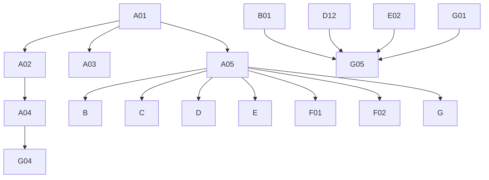

# Phase 4: Migration Plan & Stories — Discussion

> **Domain:** `discussion` · **Target DGS:** `DiscussionService` (+ V3) → separate `plm-discussion` subgraph
> **Pipeline Version:** 2.0 · **Generated:** 2026-06-27
> **Depends on:** [02-resolver-analysis.md](./02-resolver-analysis.md), [03-schema.graphql](./03-schema.graphql), [03-schema-analysis.md](./03-schema-analysis.md), [05-attribute-inventory.md](./05-attribute-inventory.md)
> **Index:** [04-stories-index.yaml](./04-stories-index.yaml)

Each story is self-contained. Full pseudo-logic in [02-resolver-analysis.md](./02-resolver-analysis.md).
**ACL is context-only.** `discussion` is its **own subgraph** (V2 + V3). `core*` mutations are paired with
their public twin per story.

## 1. Phases Overview
| Phase | Name | Stories |
|---|---|---|
| A | Foundation & Schema | A01–A05 |
| B | Core Reads | B01–B07 |
| C | Search & Listing | C01–C02 |
| D | Mutations (create/update/delete/reply/sample/flags/files) | D01–D13 |
| E | Participant management | E01–E02 |
| F | Federation & decisions | F01–F03 |
| G | Field Resolvers & Tests | G01–G05 |

## 2. Dependency Graph


---

## 3. Stories

### Phase A — Foundation & Schema

### SPARK-DISC-A01 · Schema skeleton + DateTime scalar
```yaml
{id: SPARK-DISC-A01, operation: "-", type: schema, category: CAT-1, phase: A, complexity: Low, depends_on: [], ext_services: [], files: [plm-discussion/.../schema/discussion.graphqls, plm-discussion/.../config/ScalarConfig.kt], blocked_by: none}
```
**Current Behaviour:** green-field; schema translated from `SPARK_Discussion.txt` + `SPARK_DiscussionV3.txt`.
**Target:** federation v2.3 header, `scalar DateTime → Instant`, `scalar JsonNode`, empty `extend type Query`/`Mutation`. **Acceptance:** 1. `generateJava` passes. **Tests:** ☐ compiles ☐ serde.

### SPARK-DISC-A02 · Owned types + inputs (V2+V3 surface)
```yaml
{id: SPARK-DISC-A02, operation: "-", type: schema, category: CAT-1, phase: A, complexity: High, depends_on: [SPARK-DISC-A01], ext_services: [], files: [plm-discussion/.../schema/discussion.graphqls], blocked_by: none}
```
**Target:** `Discussion` (`@key(fields:"discussionId")`) + ~18 value types + ~12 inputs per [03-schema.graphql](./03-schema.graphql); reconcile V2 + V3 type shapes. **Acceptance:** 1. all types/inputs present; nullability matches SDLs. 2. validates. **Tests:** ☐ validates ☐ entity stub.

### SPARK-DISC-A03 · External stubs (platform + other DGS + Resource members)
```yaml
{id: SPARK-DISC-A03, operation: "-", type: schema, category: CAT-1, phase: A, complexity: Medium, depends_on: [SPARK-DISC-A01], ext_services: [], files: [plm-discussion/.../schema/discussion.graphqls], blocked_by: none}
```
**Target:** `@extends @external` stubs for `Attachment`/`SearchAttachment`, `DiscussionElastic`,
`UserProfileAttributes`, `UserGroup_Participants`, `Tag`, `VMM_BusinessPartner`, and the `Resource` members
`Product`/`SampleV2`/`WorkspaceV2`. **Acceptance:** 1. compiles; gateway composes. **Tests:** ☐ compiles ☐ stub resolves.

### SPARK-DISC-A04 · `Resource` union `@DgsTypeResolver`
```yaml
{id: SPARK-DISC-A04, operation: "Resource", type: field-resolver, category: CAT-2, phase: A, complexity: Medium, depends_on: [SPARK-DISC-A02, SPARK-DISC-A03], ext_services: [], files: [plm-discussion/.../dataFetcher/ResourceTypeResolver.kt], blocked_by: none}
```
**Current Behaviour (`__resolveType`):** map the discussion's parent resource id prefix → `Product` | `SampleV2` | `WorkspaceV2`. **Target:** `@DgsTypeResolver(name="Resource")`. **Acceptance:** 1. each member maps by prefix; unknown → null. **Tests:** ☐ product ☐ sample ☐ workspace.

### SPARK-DISC-A05 · `DiscussionService` Kotlin port (v1/v2 + V3 consolidated)
```yaml
{id: SPARK-DISC-A05, operation: "DiscussionService", type: service, category: CAT-3, phase: A, complexity: High, depends_on: [SPARK-DISC-A01], ext_services: [], files: [plm-discussion/.../service/DiscussionService.kt, plm-discussion/.../client/*Client.kt], blocked_by: none}
```
**Current Behaviour (Phase 2 §Service):** `discussions/v1` (+ `discussion_message`, `/bulk`), `discussions/v2`
(`/discussion`), admin `/unsent`, + V3 service (~30 methods). **Target:** consolidated Kotlin service; map the `core*` system-context twins. **Acceptance:** 1. v1/v2/V3 endpoints present. 2. core twins distinguished. **Tests:** ☐ endpoint build ☐ core context.

---

### Phase B — Core Reads

### SPARK-DISC-B01 · `getDiscussionV2` (+ `coreGetDiscussionV2`)
```yaml
{id: SPARK-DISC-B01, operation: getDiscussionV2, type: query, category: CAT-2, phase: B, complexity: Low, depends_on: [SPARK-DISC-A02, SPARK-DISC-A05], ext_services: [], files: [plm-discussion/.../dataFetcher/DiscussionQueryDataFetcher.kt], blocked_by: none}
```
**Current Behaviour:** (own) `GET discussions/v2?ids={id}` → `FullDiscussion`; `core*` = system context. **Target:** `@DgsQuery → FullDiscussion` (two fields, shared impl). **Acceptance:** 1. returns discussion; core uses system context. **Tests:** ☐ happy ☐ core.

### SPARK-DISC-B02 · `getDiscussionByIdsV2`
```yaml
{id: SPARK-DISC-B02, operation: getDiscussionByIdsV2, type: query, category: CAT-2, phase: B, complexity: Low, depends_on: [SPARK-DISC-A05], ext_services: [], files: [plm-discussion/.../dataFetcher/DiscussionQueryDataFetcher.kt], blocked_by: none}
```
**Current Behaviour:** (own) `GET /v2?ids={csv}`. **Target:** `@DgsQuery → [FullDiscussion]`. **Acceptance:** 1. returns by ids. **Tests:** ☐ happy ☐ empty.

### SPARK-DISC-B03 · `getDiscussionsCount`
```yaml
{id: SPARK-DISC-B03, operation: getDiscussionsCount, type: query, category: CAT-2, phase: B, complexity: Low, depends_on: [SPARK-DISC-A05], ext_services: [], files: [plm-discussion/.../dataFetcher/DiscussionQueryDataFetcher.kt], blocked_by: none}
```
**Current Behaviour:** (own) count by `resourceId`/`resourceType` → `[ResourceCount]`. **Target:** `@DgsQuery`. **Acceptance:** 1. returns per-resource counts. **Tests:** ☐ counts.

### SPARK-DISC-B04 · `getDiscussionOnResource`
```yaml
{id: SPARK-DISC-B04, operation: getDiscussionOnResource, type: query, category: CAT-2, phase: B, complexity: Low, depends_on: [SPARK-DISC-A05], ext_services: [], files: [plm-discussion/.../dataFetcher/DiscussionQueryDataFetcher.kt], blocked_by: none}
```
**Current Behaviour:** (own) discussions for a resource. **Target:** `@DgsQuery → [Discussion]`. **Acceptance:** 1. returns discussions. **Tests:** ☐ happy.

### SPARK-DISC-B05 · `getDiscussionsByThread`
```yaml
{id: SPARK-DISC-B05, operation: getDiscussionsByThread, type: query, category: CAT-2, phase: B, complexity: Low, depends_on: [SPARK-DISC-A05], ext_services: [], files: [plm-discussion/.../dataFetcher/DiscussionQueryDataFetcher.kt], blocked_by: none}
```
**Current Behaviour:** (own) discussions in a thread. **Target:** `@DgsQuery → [Discussion]`. **Acceptance:** 1. returns thread discussions. **Tests:** ☐ happy.

### SPARK-DISC-B06 · `getUnsentDiscussions`
```yaml
{id: SPARK-DISC-B06, operation: getUnsentDiscussions, type: query, category: CAT-2, phase: B, complexity: Low, depends_on: [SPARK-DISC-A05], ext_services: [], files: [plm-discussion/.../dataFetcher/DiscussionQueryDataFetcher.kt], blocked_by: none}
```
**Current Behaviour:** (own) `GET /api/admin/unsent`. **Target:** `@DgsQuery → UnsentDiscussions`. **Acceptance:** 1. returns unsent. **Tests:** ☐ happy.

### SPARK-DISC-B07 · `getVersionedDiscussions` (+ threads)
```yaml
{id: SPARK-DISC-B07, operation: "getVersioned*", type: query, category: CAT-2, phase: B, complexity: Medium, depends_on: [SPARK-DISC-A05], ext_services: [], files: [plm-discussion/.../dataFetcher/DiscussionVersionDataFetcher.kt], blocked_by: none}
```
**Covers:** `getVersionedDiscussions(id)`, `getVersionedDiscussionThreads(id)` (V3). **Current Behaviour:** (own V3) version history. **Target:** `@DgsQuery`. **Acceptance:** 1. both return version history. **Tests:** ☐ discussions ☐ threads.

---

### Phase C — Search & Listing

### SPARK-DISC-C01 · `getDiscussionsV2` (elastic)
```yaml
{id: SPARK-DISC-C01, operation: getDiscussionsV2, type: query, category: CAT-2, phase: C, complexity: Medium, depends_on: [SPARK-DISC-A05], ext_services: [{key: search, severity: RED}], files: [plm-discussion/.../dataFetcher/DiscussionSearchDataFetcher.kt], blocked_by: none}
```
**Current Behaviour:** (🔴 search) elastic discussions by `resourceId`/`resourceType` (partner-filtered) → `DiscussionElastic`. **Target:** `@DgsQuery`. **Acceptance:** 1. elastic query + partner filter. **Tests:** ☐ query ☐ partner filter.

### SPARK-DISC-C02 · `getSampleDiscussion`
```yaml
{id: SPARK-DISC-C02, operation: getSampleDiscussion, type: query, category: CAT-2, phase: C, complexity: Medium, depends_on: [SPARK-DISC-A05], ext_services: [], files: [plm-discussion/.../dataFetcher/DiscussionSearchDataFetcher.kt], blocked_by: none}
```
**Current Behaviour:** (own) sample-scoped discussions. **Target:** `@DgsQuery → [Discussion]`. **Acceptance:** 1. returns sample discussions. **Tests:** ☐ happy.

---

### Phase D — Mutations

### SPARK-DISC-D01 · `addDiscussionV2`
```yaml
{id: SPARK-DISC-D01, operation: addDiscussionV2, type: mutation, category: CAT-2, phase: D, complexity: Medium, depends_on: [SPARK-DISC-A05], ext_services: [{key: attachment, severity: YELLOW}], files: [plm-discussion/.../dataFetcher/DiscussionMutationDataFetcher.kt], blocked_by: none}
```
**Current Behaviour:** (own) create + (🟡 attachment) bulk attachment input. **Target:** `@DgsMutation → Discussion`. **Acceptance:** 1. creates; attachments associated. **Tests:** ☐ create ☐ +attachments.

### SPARK-DISC-D02 · `addDiscussionReplyV2` + `updateDiscussionReplyV2`
```yaml
{id: SPARK-DISC-D02, operation: "reply*V2", type: mutation, category: CAT-2, phase: D, complexity: Medium, depends_on: [SPARK-DISC-A05], ext_services: [{key: attachment, severity: YELLOW}], files: [plm-discussion/.../dataFetcher/DiscussionMutationDataFetcher.kt], blocked_by: none}
```
**Current Behaviour:** add/update reply + (🟡 attachment) input (`isAttachmentsV3` flag). **Target:** `@DgsMutation → DiscussionReply`. **Acceptance:** 1. add + update reply; v3-attachment flag honored. **Tests:** ☐ add ☐ update ☐ attachments.

### SPARK-DISC-D03 · `updateDiscussionV2`
```yaml
{id: SPARK-DISC-D03, operation: updateDiscussionV2, type: mutation, category: CAT-2, phase: D, complexity: Low, depends_on: [SPARK-DISC-A05], ext_services: [], files: [plm-discussion/.../dataFetcher/DiscussionMutationDataFetcher.kt], blocked_by: none}
```
**Current Behaviour:** (own) `PUT` discussion body. **Target:** `@DgsMutation → Discussion`. **Acceptance:** 1. updates. **Tests:** ☐ update.

### SPARK-DISC-D04 · `deleteDiscussionV2`
```yaml
{id: SPARK-DISC-D04, operation: deleteDiscussionV2, type: mutation, category: CAT-2, phase: D, complexity: Low, depends_on: [SPARK-DISC-A05], ext_services: [], files: [plm-discussion/.../dataFetcher/DiscussionMutationDataFetcher.kt], blocked_by: none}
```
**Current Behaviour:** (own) delete by id → ID. **Target:** `@DgsMutation → ID`. **Acceptance:** 1. deletes. **Tests:** ☐ delete.

### SPARK-DISC-D05 · `deleteDiscussionReplyV2`
```yaml
{id: SPARK-DISC-D05, operation: deleteDiscussionReplyV2, type: mutation, category: CAT-2, phase: D, complexity: Low, depends_on: [SPARK-DISC-A05], ext_services: [], files: [plm-discussion/.../dataFetcher/DiscussionMutationDataFetcher.kt], blocked_by: none}
```
**Current Behaviour:** (own) delete reply → ID. **Target:** `@DgsMutation → ID`. **Acceptance:** 1. deletes reply. **Tests:** ☐ delete.

### SPARK-DISC-D06 · `deleteDiscussionPartnersV2`
```yaml
{id: SPARK-DISC-D06, operation: deleteDiscussionPartnersV2, type: mutation, category: CAT-2, phase: D, complexity: Low, depends_on: [SPARK-DISC-A05], ext_services: [], files: [plm-discussion/.../dataFetcher/DiscussionMutationDataFetcher.kt], blocked_by: none}
```
**Current Behaviour:** (own) delete partners from a discussion → ID. **Target:** `@DgsMutation → ID`. **Acceptance:** 1. removes partners. **Tests:** ☐ delete partners.

### SPARK-DISC-D07 · Sample discussions (V2/V3 + bulk)
```yaml
{id: SPARK-DISC-D07, operation: "sample-discussions", type: mutation, category: CAT-2, phase: D, complexity: Medium, depends_on: [SPARK-DISC-A05], ext_services: [], files: [plm-discussion/.../dataFetcher/DiscussionMutationDataFetcher.kt], blocked_by: none}
```
**Covers:** `addSampleDiscussionV2`, `addSampleDiscussionV3`, `bulkAddSampleDiscussions`. **Current Behaviour:** (own) sample-scoped create. **Target:** `@DgsMutation → SampleDiscussion`/`[…]`. **Acceptance:** 1. each creates sample discussion(s). **Tests:** ☐ v2 ☐ v3 ☐ bulk.

### SPARK-DISC-D08 · Flags (critical / editable / tag)
```yaml
{id: SPARK-DISC-D08, operation: "discussion-flags", type: mutation, category: CAT-2, phase: D, complexity: Low, depends_on: [SPARK-DISC-A05], ext_services: [{key: tag, severity: BLUE}], files: [plm-discussion/.../dataFetcher/DiscussionMutationDataFetcher.kt], blocked_by: none}
```
**Covers:** `updateAsCritical`, `updateDiscussionEditable`, `updateTagExisting` (share the `DiscussionAsCritical` input). **Target:** `@DgsMutation → DiscussionReply`. **Acceptance:** 1. each flag updates. **Tests:** ☐ critical ☐ editable ☐ tag.

### SPARK-DISC-D09 · `cloneFilesForBulkDiscussion`
```yaml
{id: SPARK-DISC-D09, operation: cloneFilesForBulkDiscussion, type: mutation, category: CAT-2, phase: D, complexity: Medium, depends_on: [SPARK-DISC-A05], ext_services: [{key: attachment, severity: YELLOW}], files: [plm-discussion/.../dataFetcher/DiscussionMutationDataFetcher.kt], blocked_by: none}
```
**Current Behaviour:** (ACL) token → `Promise.all(attachmentIds.map(id → (🟡 attachment) cloneAttachmentV3({cloneReferences}, id)))`. **Target:** structured-concurrency fan-out. **Acceptance:** 1. clones each id. **Tests:** ☐ clone.

### SPARK-DISC-D10 · `discussionReadByUsers`
```yaml
{id: SPARK-DISC-D10, operation: discussionReadByUsers, type: mutation, category: CAT-2, phase: D, complexity: Medium, depends_on: [SPARK-DISC-A05], ext_services: [], files: [plm-discussion/.../dataFetcher/DiscussionMutationDataFetcher.kt], blocked_by: none}
```
**Current Behaviour:** (own) mark read across `discussionIds`/`discussionThreadIds` for `readByUserList`. **Target:** `@DgsMutation → DiscussionReadByUsers`. **Acceptance:** 1. records read receipts. **Tests:** ☐ read receipts.

### SPARK-DISC-D11 · `addDiscussionV3` (+ `coreAddDiscussionV3`)
```yaml
{id: SPARK-DISC-D11, operation: "addDiscussionV3*", type: mutation, category: CAT-2, phase: D, complexity: Medium, depends_on: [SPARK-DISC-A05], ext_services: [{key: attachment, severity: YELLOW}], files: [plm-discussion/.../dataFetcher/DiscussionMutationDataFetcher.kt], blocked_by: none}
```
**Current Behaviour:** (own V3) create + attachments; `core*` = system context. **Target:** `@DgsMutation → Discussion` (two fields, shared impl). **Acceptance:** 1. creates; core uses system context. **Tests:** ☐ add ☐ core.

### SPARK-DISC-D12 · `addBulkDiscussionV3`
```yaml
{id: SPARK-DISC-D12, operation: addBulkDiscussionV3, type: mutation, category: CAT-2, phase: D, complexity: High, depends_on: [SPARK-DISC-A05], ext_services: [{key: attachment, severity: YELLOW}], files: [plm-discussion/.../service/DiscussionBulkService.kt], blocked_by: none}
```
**Current Behaviour:** (own V3) bulk create across resources + attachments → `BulkDiscussionOutputV3`.
**Note:** `coreAddBulkDiscussionV3` is **schema-drift** (no resolver — see F03). **Target:** `@DgsMutation`. **Acceptance:** 1. bulk creates. **Tests:** ☐ bulk ☐ parity.

### SPARK-DISC-D13 · `updateDiscussionV3` (+ `coreUpdateDiscussionV3`)
```yaml
{id: SPARK-DISC-D13, operation: "updateDiscussionV3*", type: mutation, category: CAT-2, phase: D, complexity: Medium, depends_on: [SPARK-DISC-A05], ext_services: [], files: [plm-discussion/.../dataFetcher/DiscussionMutationDataFetcher.kt], blocked_by: none}
```
**Current Behaviour:** (own V3) update; `core*` = system context. **Target:** `@DgsMutation → Discussion`. **Acceptance:** 1. updates; core context. **Tests:** ☐ update ☐ core.

---

### Phase E — Participant management

### SPARK-DISC-E01 · Participants V2 (`updateParticipantsV2` + `deleteParticipantV2`)
```yaml
{id: SPARK-DISC-E01, operation: "participants-v2", type: mutation, category: CAT-2, phase: E, complexity: Medium, depends_on: [SPARK-DISC-A05], ext_services: [{key: userGroup, severity: YELLOW}], files: [plm-discussion/.../service/DiscussionParticipantService.kt], blocked_by: none}
```
**Current Behaviour:** add participants (`AddParticipantInput`) / remove a participant (team/user/partner). **Target:** `@DgsMutation → Discussion`. **Acceptance:** 1. add + remove participants. **Tests:** ☐ add ☐ remove.

### SPARK-DISC-E02 · Participants V3 (`updateParticipantsV3` + `coreUpdate` + `coreDelete` + `deleteParticipantV3`)
```yaml
{id: SPARK-DISC-E02, operation: "participants-v3", type: mutation, category: CAT-2, phase: E, complexity: High, depends_on: [SPARK-DISC-A05], ext_services: [{key: userGroup, severity: YELLOW}], files: [plm-discussion/.../service/DiscussionParticipantService.kt], blocked_by: none}
```
**Current Behaviour:** richer participant model — `updateParticipantsV3` / `coreUpdateParticipantsV3`
(participants + relatedResources + resourceType), `coreDeleteParticipantsV3` (removedUser/team/partners/
designPartners), `deleteParticipantV3` (team/user/partner/designPartner). **Target:** `@DgsMutation → Discussion` (one service, four fields). **Acceptance:** 1. each path updates/removes the right participants. **Tests:** ☐ update ☐ coreUpdate ☐ coreDelete ☐ delete.

---

### Phase F — Federation & decisions

### SPARK-DISC-F01 · `Discussion` federated entity fetcher
```yaml
{id: SPARK-DISC-F01, operation: "Discussion.__entity", type: field-resolver, category: CAT-4, phase: F, complexity: Medium, depends_on: [SPARK-DISC-A05], ext_services: [], files: [plm-discussion/.../dataFetcher/DiscussionEntityFetcher.kt], blocked_by: none}
```
**Target:** `@DgsEntityFetcher(name="Discussion")` by `discussionId`; provides `discussionsCount`/`discussionsV2`
for product/workspace over the gateway. **Acceptance:** 1. entity resolves by key. 2. cross-subgraph smoke. **Tests:** ☐ entity ☐ smoke.

### SPARK-DISC-F02 · `ResourcesCount.discussions` (TechPack — SPARK-PROD-F02)
```yaml
{id: SPARK-DISC-F02, operation: "ResourcesCount.discussions", type: field-resolver, category: CAT-4, phase: F, complexity: Low, depends_on: [SPARK-DISC-A05], ext_services: [], files: [plm-discussion/.../dataFetcher/ResourcesCountDiscussionsEntityFetcher.kt], blocked_by: product}
```
**Target:** `extend type ResourcesCount @key(fields:"productId partnerId") { discussions: [ID] }` with a `@DgsEntityFetcher`; fills the TechPack `discussions` count (the discussion side of `SPARK-PROD-F02`). **BLOCKED-BY:** product TechPack facade. **Acceptance:** 1. field resolves; parity vs facade. **Tests:** ☐ field ☐ parity.

### SPARK-DISC-F03 · Deferred drift decision (drop/undrop + coreAddBulkDiscussionV3)
```yaml
{id: SPARK-DISC-F03, operation: "drift", type: schema, category: CAT-4, phase: F, complexity: Low, depends_on: [SPARK-DISC-A05], ext_services: [], files: [plm-discussion/.../schema/discussion.graphqls], blocked_by: none}
```
**Current Behaviour:** `dropPartnerFromDiscussionIds`/`unDropPartnerFromDiscussionIds` (no resolver — run inside `workspaceBusinessPartnerActionsV2`); `coreAddBulkDiscussionV3` (no resolver). **Target:** delete or keep `@deprecated`; coordinate drop/undrop ownership with workspace. **Acceptance:** 1. decision + traffic survey. **Tests:** ☐ schema diff intentional.

---

### Phase G — Field Resolvers & Tests

### SPARK-DISC-G01 · `Discussion` + `FullDiscussion` + `DiscussionContent` field resolvers
```yaml
{id: SPARK-DISC-G01, operation: "Discussion.*", type: field-resolver, category: CAT-2, phase: G, complexity: High, depends_on: [SPARK-DISC-A02, SPARK-DISC-A05], ext_services: [{key: userAttributes, severity: YELLOW}, {key: tag, severity: BLUE}], files: [plm-discussion/.../dataFetcher/DiscussionFieldDataFetcher.kt], blocked_by: none}
```
**Current Behaviour:** discussion/full/content bodies, `createdBy`/`updatedBy` (🟡 user), `tags` (🔵 tag),
`resource` (union), `replies`/`participants`/`attachments` links. **Acceptance:** 1. each field resolves. **Tests:** ☐ bodies ☐ users ☐ resource ☐ replies.

### SPARK-DISC-G02 · `DiscussionReply` + `NotificationStatus` field resolvers
```yaml
{id: SPARK-DISC-G02, operation: "DiscussionReply.*", type: field-resolver, category: CAT-2, phase: G, complexity: Medium, depends_on: [SPARK-DISC-A05], ext_services: [{key: attachment, severity: YELLOW}, {key: userAttributes, severity: YELLOW}], files: [plm-discussion/.../dataFetcher/DiscussionReplyFieldDataFetcher.kt], blocked_by: none}
```
**Current Behaviour:** reply body/author (🟡 user), `attachments` (🟡 attachment), `notificationStatus`. **Acceptance:** 1. each resolves. **Tests:** ☐ reply ☐ attachments ☐ notification.

### SPARK-DISC-G03 · Participants + Team + Participant sub-types
```yaml
{id: SPARK-DISC-G03, operation: "participants-subtypes", type: field-resolver, category: CAT-2, phase: G, complexity: Medium, depends_on: [SPARK-DISC-A05], ext_services: [{key: userAttributes, severity: YELLOW}, {key: vmm, severity: BLUE}], files: [plm-discussion/.../dataFetcher/DiscussionParticipantFieldDataFetcher.kt], blocked_by: none}
```
**Current Behaviour:** `Discussion_Participants.teams`/`users`; `Discussion_Team.businessPartner` (🔵 vmm);
`Discussion_Participant.userDetails` (🟡 user). **Acceptance:** 1. teams/users/bp resolve. **Tests:** ☐ teams ☐ users ☐ bp.

### SPARK-DISC-G04 · `Resource` union members + Versioned + `DiscussionReadByUsers`
```yaml
{id: SPARK-DISC-G04, operation: "resource+versioned", type: field-resolver, category: CAT-2, phase: G, complexity: Medium, depends_on: [SPARK-DISC-A04, SPARK-DISC-A05], ext_services: [{key: userAttributes, severity: YELLOW}], files: [plm-discussion/.../dataFetcher/DiscussionMiscFieldDataFetcher.kt], blocked_by: none}
```
**Current Behaviour:** `Resource` union resolution (via A04); `VersionedDiscussion`/`Thread.updatedBy` (🟡 user)/`updatedAt` (parse); `DiscussionReadByUsers.discussions`/`discussionThreads` (computed). **Acceptance:** 1. each resolves. **Tests:** ☐ resource ☐ versioned ☐ readBy.

### SPARK-DISC-G05 · Tests, parity harness
```yaml
{id: SPARK-DISC-G05, operation: "tests", type: tests, category: CAT-5, phase: G, complexity: High, depends_on: [SPARK-DISC-B01, SPARK-DISC-D12, SPARK-DISC-E02, SPARK-DISC-G01], files: [plm-discussion/.../test/*.kt], blocked_by: none}
```
**Target:** ≥80% unit coverage; parity harness (incl. V2/V3 + core twins, participants, bulk, the `Resource`
union, read receipts); contract test (schema diff intentional-only). **Acceptance:** 1. unit ≥80%. 2. parity green. 3. schema-diff intentional. **Tests:** ☐ parity ☐ contract.

---

## 4. Risk Register
| Risk | Likelihood | Impact | Mitigation | Owner |
|------|-----------|--------|------------|-------|
| Three API versions (v1/v2/V3) + `core*` twins | Medium | High | Consolidate in the service port; pair twins | Tech Lead |
| Participant-management correctness (E01/E02) | Medium | Medium | Per-op parity (users/teams/partners/design-partners) | Backend Eng |
| `Resource` union correctness (A04) | Medium | Medium | `@DgsTypeResolver` + per-member tests | Backend Eng |
| Schema-drift drop/undrop owned by workspace (F03) | Medium | Low | Coordinate ownership with workspace | Architect |
| Attachment coupling on write | Low | Medium | Attachment client / entity refs | Architect |

## 5. Summary
- **Stories:** 37 (A:5 · B:7 · C:2 · D:13 · E:2 · F:3 · G:5) covering 11 queries + 26 mutations (+3 drift).
- **Critical path:** A01→A02/A05→A04→G01→G05; E02 + D12 for the heavy writes.
- **Highest cost:** v1/v2/V3 consolidation + participant management + the field-resolver surface (+ `Resource` union).
- **Separate subgraph:** discussion provides `discussionsCount`/`discussionsV2` + the TechPack `discussions` count.

---
**Phase Completed:** Phase 4 — Migration Stories · **Domain:** `discussion` · **Outputs:** 04-stories.md, 04-stories-index.yaml, 04-po-summary.md.
