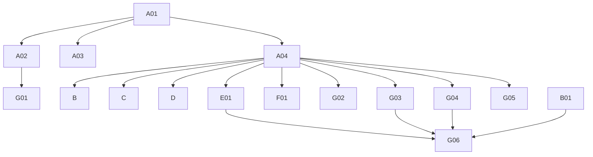

# Phase 4: Migration Plan & Stories — Packaging

> **Domain:** `packaging` · **Target DGS:** `PackagingService` → `plm-product`
> **Pipeline Version:** 2.0 · **Generated:** 2026-06-27
> **Depends on:** [02-resolver-analysis.md](./02-resolver-analysis.md), [03-schema.graphql](./03-schema.graphql), [03-schema-analysis.md](./03-schema-analysis.md), [05-attribute-inventory.md](./05-attribute-inventory.md)
> **Index:** [04-stories-index.yaml](./04-stories-index.yaml)

Each story is self-contained. Full pseudo-logic in [02-resolver-analysis.md](./02-resolver-analysis.md).
**ACL is context-only** — no ACL work in any story. Base path `packaging/v1`.

## 1. Phases Overview
| Phase | Name | Stories |
|---|---|---|
| A | Foundation & Schema | A01–A04 |
| B | Core Reads | B01–B06 |
| C | Search & Listing | C01 |
| D | Mutations (simple) | D01–D09 |
| E | Complex (multi-step write) | E01 |
| F | Federation (internal) | F01 |
| G | Field Resolvers & Tests | G01–G06 |

## 2. Dependency Graph


---

## 3. Stories

### Phase A — Foundation & Schema

### SPARK-PKG-A01 · Schema skeleton + DateTime scalar
```yaml
{id: SPARK-PKG-A01, operation: "-", type: schema, category: CAT-1, phase: A, complexity: Low, depends_on: [], ext_services: [], files: [plm-product/.../schema/packaging.graphqls, plm-product/.../config/ScalarConfig.kt], blocked_by: none}
```
**Current Behaviour:** green-field; schema translated from `code/schemas/SPARK_Packaging.txt`.
**Target:** federation v2.3 header, `scalar DateTime → Instant`, empty `extend type Query`/`Mutation`.
**Acceptance:** 1. `./gradlew generateJava` passes. 2. `DateTime` round-trips. **Tests:** ☐ compiles ☐ scalar serde.

### SPARK-PKG-A02 · Owned types + inputs (~24 types, ~20 inputs)
```yaml
{id: SPARK-PKG-A02, operation: "-", type: schema, category: CAT-1, phase: A, complexity: Medium, depends_on: [SPARK-PKG-A01], ext_services: [], files: [plm-product/.../schema/packaging.graphqls], blocked_by: none}
```
**Target:** `Packaging` (`@key(fields:"humanId")`), `Dieline` (`@key(fields:"humanId")`), the ~20 value
types and ~20 inputs — per [03-schema.graphql](./03-schema.graphql). Carry `@deprecated` directives
(`retailPrice`, `creativePath`, `resourceType`, `fileDeliveryEmail`, `Dieline.attachments`). **Acceptance:** 1. all types+inputs present; entities keyed on `humanId`; nullability matches SDL. 2. validates. **Tests:** ☐ validates ☐ entity stubs.

### SPARK-PKG-A03 · External stubs (platform + sibling DGS)
```yaml
{id: SPARK-PKG-A03, operation: "-", type: schema, category: CAT-1, phase: A, complexity: Low, depends_on: [SPARK-PKG-A01], ext_services: [], files: [plm-product/.../schema/packaging.graphqls], blocked_by: none}
```
**Target:** stubs `Attachment`, `SearchAttachment`, `WorkspaceV2`, `UserProfileAttributes`,
`UserGroup_Participants`, `AccessControl`, `VMM_BusinessPartner` + internal placeholders `Product`,
`ProductComponentStatus`, `SpgFileLibrary`. **Acceptance:** 1. compiles; gateway composes. **Tests:** ☐ compiles ☐ stub resolves.

### SPARK-PKG-A04 · `PackagingService` Kotlin port (packaging/v1)
```yaml
{id: SPARK-PKG-A04, operation: "PackagingService", type: service, category: CAT-3, phase: A, complexity: Medium, depends_on: [SPARK-PKG-A01], ext_services: [], files: [plm-product/.../service/PackagingService.kt, plm-product/.../client/*Client.kt, plm-product/.../model/*Dto.kt], blocked_by: none}
```
**Current Behaviour (Phase 2 §Service):** ~16 REST methods on `packaging/v1` (+ dielines + export).
**Target:** Kotlin service; preserve create/bulk throw-on-error and the `{content}` status wrap; snake/camel
at the Feign boundary. **Acceptance:** 1. methods present (POST, PUT, /dielines/{id}/evaluate, bulk add/update, GET listings, GET /{id}, /export, /{id}/lock|unlock, /component_status_update, /{id}/workspace_associations). 2. add throws on validation error. **Tests:** ☐ endpoint build ☐ create error ☐ status wrap.

---

### Phase B — Core Reads

### SPARK-PKG-B01 · `getPackagings(...)`
```yaml
{id: SPARK-PKG-B01, operation: getPackagings, type: query, category: CAT-2, phase: B, complexity: Low, depends_on: [SPARK-PKG-A02, SPARK-PKG-A04], ext_services: [], files: [plm-product/.../dataFetcher/PackagingQueryDataFetcher.kt], blocked_by: none}
```
**Current Behaviour (Q1):** (own) `getPackagings().load({page,size,packagingIds,parentIds,workspaceIds,partnerIds,statusIds})` → paged. **Target:** `@DgsQuery → PackagingPaged`. **Acceptance:** 1. all 7 filter args forwarded; defaults page=0/size=10000. **Tests:** ☐ filters ☐ paging ☐ integration.

### SPARK-PKG-B02 · `getPackagingById(packagingId)`
```yaml
{id: SPARK-PKG-B02, operation: getPackagingById, type: query, category: CAT-2, phase: B, complexity: Low, depends_on: [SPARK-PKG-A02, SPARK-PKG-A04], ext_services: [], files: [plm-product/.../dataFetcher/PackagingQueryDataFetcher.kt], blocked_by: none}
```
**Current Behaviour (Q2):** (ACL context) token → (own) `getPackagingById.load(packagingId)`. **Target:** `@DgsQuery → Packaging`. **Acceptance:** 1. returns packaging; miss→null. **Tests:** ☐ happy ☐ miss.

### SPARK-PKG-B03 · `getDielines(...)`
```yaml
{id: SPARK-PKG-B03, operation: getDielines, type: query, category: CAT-2, phase: B, complexity: Low, depends_on: [SPARK-PKG-A02, SPARK-PKG-A04], ext_services: [], files: [plm-product/.../dataFetcher/PackagingQueryDataFetcher.kt], blocked_by: none}
```
**Current Behaviour (Q3):** (own) `getDielines.load({...})` → `.dielines`. **Target:** `@DgsQuery → [Dieline]`. **Acceptance:** 1. filters forwarded; returns the `dielines` array. **Tests:** ☐ filters ☐ integration.

### SPARK-PKG-B04 · `getPackagingFieldValuesByType(type, ids)`
```yaml
{id: SPARK-PKG-B04, operation: getPackagingFieldValuesByType, type: query, category: CAT-2, phase: B, complexity: Low, depends_on: [SPARK-PKG-A04], ext_services: [], files: [plm-product/.../dataFetcher/PackagingQueryDataFetcher.kt], blocked_by: none}
```
**Current Behaviour (Q4):** (own) `getPackagingFieldValuesByType(type, ids)`. **Target:** `@DgsQuery → [PackagingFieldValues]`. **Acceptance:** 1. by type (+optional ids). **Tests:** ☐ by type.

### SPARK-PKG-B05 · `getDielineEvaluationStatuses` (cacheable)
```yaml
{id: SPARK-PKG-B05, operation: getDielineEvaluationStatuses, type: query, category: CAT-2, phase: B, complexity: Low, depends_on: [SPARK-PKG-A04], ext_services: [], files: [plm-product/.../dataFetcher/PackagingQueryDataFetcher.kt], blocked_by: none}
```
**Current Behaviour (Q5):** (own) `getDielineEvaluationStatuses()`. **Target:** `@DgsQuery` → `@Cacheable` → `[CodeDescription]`. **Acceptance:** 1. returns statuses; cached. **Tests:** ☐ list ☐ cache hit.

### SPARK-PKG-B06 · `getCountries(codes)` (cacheable)
```yaml
{id: SPARK-PKG-B06, operation: getCountries, type: query, category: CAT-2, phase: B, complexity: Low, depends_on: [SPARK-PKG-A04], ext_services: [], files: [plm-product/.../dataFetcher/PackagingQueryDataFetcher.kt], blocked_by: none}
```
**Current Behaviour (Q6):** (own) `getCountries(codes)`. **Target:** `@DgsQuery` → `@Cacheable` → `[Countries]`. **Acceptance:** 1. returns countries (optionally filtered by codes). **Tests:** ☐ all ☐ filtered.

---

### Phase C — Search & Listing

### SPARK-PKG-C01 · `getPackagingElastic(parentHumanId)`
```yaml
{id: SPARK-PKG-C01, operation: getPackagingElastic, type: query, category: CAT-2, phase: C, complexity: Medium, depends_on: [SPARK-PKG-A04], ext_services: [{key: search, severity: RED}], files: [plm-product/.../dataFetcher/PackagingQueryDataFetcher.kt], blocked_by: none}
```
**Current Behaviour (Q7):** (🔴 search) `search.getPackagingElastic.load({ q:"parentId: {parentHumanId}" })` → `.content`. **EXT:** 🔴 search. **Target:** `@DgsQuery → [Packaging]`. **Acceptance:** 1. `parentId:` elastic query built; returns content. **Tests:** ☐ query build ☐ parity.

---

### Phase D — Mutations (simple)

### SPARK-PKG-D01 · `addPackaging`
```yaml
{id: SPARK-PKG-D01, operation: addPackaging, type: mutation, category: CAT-2, phase: D, complexity: Medium, depends_on: [SPARK-PKG-A04], ext_services: [], files: [plm-product/.../dataFetcher/PackagingMutationDataFetcher.kt], blocked_by: none}
```
**Current Behaviour (M1):** (own) `POST packaging/v1`. **Throw on `validationErrors`/`message`.** **Target:** `@DgsMutation → Packaging`; port throw-on-error. **Acceptance:** 1. creates. 2. validation error → exception. **Tests:** ☐ create ☐ validation-error→throw.

### SPARK-PKG-D02 · `evaluateDieline`
```yaml
{id: SPARK-PKG-D02, operation: evaluateDieline, type: mutation, category: CAT-2, phase: D, complexity: Low, depends_on: [SPARK-PKG-A04], ext_services: [], files: [plm-product/.../dataFetcher/PackagingMutationDataFetcher.kt], blocked_by: none}
```
**Current Behaviour (M3):** (own) `PUT packaging/v1/dielines/{dielineId}/evaluate`. **Target:** `@DgsMutation → Dieline`. **Acceptance:** 1. evaluates the dieline. **Tests:** ☐ evaluate.

### SPARK-PKG-D03 · `bulkAddPackagings`
```yaml
{id: SPARK-PKG-D03, operation: bulkAddPackagings, type: mutation, category: CAT-2, phase: D, complexity: Medium, depends_on: [SPARK-PKG-A04], ext_services: [], files: [plm-product/.../dataFetcher/PackagingMutationDataFetcher.kt], blocked_by: none}
```
**Current Behaviour (M4):** (own) `bulkAddPackagings`. **Throw on `validationErrors`/`message`.** **Target:** `@DgsMutation → PackagingBulk`. **Acceptance:** 1. bulk creates. 2. error → throw. **Tests:** ☐ bulk ☐ error.

### SPARK-PKG-D04 · `bulkUpdatePackagings`
```yaml
{id: SPARK-PKG-D04, operation: bulkUpdatePackagings, type: mutation, category: CAT-2, phase: D, complexity: Medium, depends_on: [SPARK-PKG-A04], ext_services: [], files: [plm-product/.../dataFetcher/PackagingMutationDataFetcher.kt], blocked_by: none}
```
**Current Behaviour (M5):** token for `packaging[].humanId` → (own) `bulkUpdatePackagings`. **Throw on error.** **Target:** `@DgsMutation → PackagingBulk`. **Acceptance:** 1. bulk updates. 2. error → throw. **Tests:** ☐ bulk ☐ error.

### SPARK-PKG-D05 · `exportPackaging`
```yaml
{id: SPARK-PKG-D05, operation: exportPackaging, type: mutation, category: CAT-2, phase: D, complexity: Low, depends_on: [SPARK-PKG-A04], ext_services: [], files: [plm-product/.../dataFetcher/PackagingMutationDataFetcher.kt], blocked_by: none}
```
**Current Behaviour (M6):** token → (own) `requestPackagingExport({workspace_id, workspace_description, product_ids})` → request id. **Target:** `@DgsMutation → String`. **Acceptance:** 1. returns the export request id. **Tests:** ☐ request.

### SPARK-PKG-D06 · `lockPackaging`
```yaml
{id: SPARK-PKG-D06, operation: lockPackaging, type: mutation, category: CAT-2, phase: D, complexity: Low, depends_on: [SPARK-PKG-A04], ext_services: [], files: [plm-product/.../dataFetcher/PackagingMutationDataFetcher.kt], blocked_by: none}
```
**Current Behaviour (M7):** token → `PUT packaging/v1/{id}/lock`. **Target:** `@DgsMutation → Packaging`. **Acceptance:** 1. locks. **Tests:** ☐ lock.

### SPARK-PKG-D07 · `unlockPackaging`
```yaml
{id: SPARK-PKG-D07, operation: unlockPackaging, type: mutation, category: CAT-2, phase: D, complexity: Low, depends_on: [SPARK-PKG-A04], ext_services: [], files: [plm-product/.../dataFetcher/PackagingMutationDataFetcher.kt], blocked_by: none}
```
**Current Behaviour (M8):** token → `PUT packaging/v1/{id}/unlock`. **Target:** `@DgsMutation → Packaging`. **Acceptance:** 1. unlocks. **Tests:** ☐ unlock.

### SPARK-PKG-D08 · `cloneFilesForDielines`
```yaml
{id: SPARK-PKG-D08, operation: cloneFilesForDielines, type: mutation, category: CAT-2, phase: D, complexity: Medium, depends_on: [SPARK-PKG-A04], ext_services: [{key: attachment, severity: RED}], files: [plm-product/.../dataFetcher/PackagingMutationDataFetcher.kt], blocked_by: none}
```
**Current Behaviour (M9):** token → `Promise.all(attachmentIds.map(id => (🔴 attachment) cloneAttachmentV3({cloneReferences}, id)))`, flatten. **EXT:** 🔴 attachment. **Target:** structured-concurrency fan-out. **Acceptance:** 1. clones each id with the shared `cloneReferences`. **Tests:** ☐ clone ☐ parity.

### SPARK-PKG-D09 · `updatePackagingComponentStatus`
```yaml
{id: SPARK-PKG-D09, operation: updatePackagingComponentStatus, type: mutation, category: CAT-2, phase: D, complexity: Low, depends_on: [SPARK-PKG-A04], ext_services: [], files: [plm-product/.../dataFetcher/PackagingMutationDataFetcher.kt], blocked_by: none}
```
**Current Behaviour (M10):** (own) `updatePackagingComponentStatus({productId, ids, status})`. **No JWT — confirm backend-enforced.** **Target:** `@DgsMutation → PackagingPagedForStatus`. **Acceptance:** 1. updates statuses. 2. no-token behaviour documented. **Tests:** ☐ update.

---

### Phase E — Complex Operations

### SPARK-PKG-E01 · `updatePackaging` (multi-step write)
```yaml
{id: SPARK-PKG-E01, operation: updatePackaging, type: mutation, category: CAT-2, phase: E, complexity: High, depends_on: [SPARK-PKG-A04], ext_services: [{key: attachment, severity: RED}, {key: relationship, severity: YELLOW}], files: [plm-product/.../service/PackagingUpdateService.kt], blocked_by: none}
```
**As a** DGS engineer **I want** the multi-step packaging update with a failure strategy **so that** body and
attachment add/remove changes stay consistent.
**Current Behaviour (M2):** 1) token; set `humanId=packagingId`; `PUT packaging/v1` (body); 2) if
`attachmentsToRemove` → (🔴 attachment) `archiveAttachmentBulkV2` + (🟡 relationship) `removeRelationship`;
3) if `attachmentsToAdd` → (🟡 relationship) `addBulkRelationShip` (**reject on status≥400**) then
(🔴 attachment) `bulkUpdateAttributes`; 4) **throw on `validationErrors`/`message`**. No rollback.
**EXT:** 🔴 attachment · 🟡 relationship. **Target:** ordered steps + chosen failure strategy
(**PO decision**); **align** the add/remove error handling (the remove branch currently swallows errors).
**Acceptance:** 1. all branches in order. 2. add rejects on status≥400; remove error handling decided. 3. partial-failure strategy. **Tests:** ☐ body-only ☐ remove ☐ add ☐ status≥400 ☐ partial-failure ☐ parity.

---

### Phase F — Federation (internal)

### SPARK-PKG-F01 · Product packaging links (internal, same subgraph)
```yaml
{id: SPARK-PKG-F01, operation: "Product.packaging", type: field-resolver, category: CAT-2, phase: F, complexity: Low, depends_on: [SPARK-PKG-A04], ext_services: [], files: [plm-product/.../dataFetcher/ProductPackagingFieldDataFetcher.kt], blocked_by: none}
```
**Current Behaviour:** Product references packaging (e.g. `components(...packaging)`, packaging attributes)
from the co-located packaging service. **Target:** **internal** `@DgsData` calling `PackagingService`
in-process (not gateway federation; depends only on the `Product`/`Component` types existing). **Acceptance:** 1. resolves in-process; no gateway hop. **Tests:** ☐ resolves ☐ parity.

---

### Phase G — Field Resolvers & Tests

### SPARK-PKG-G01 · `access` + `businessPartner` + `participantDetails`
```yaml
{id: SPARK-PKG-G01, operation: "Packaging.access+bp+participants", type: field-resolver, category: CAT-2, phase: G, complexity: Medium, depends_on: [SPARK-PKG-A02, SPARK-PKG-A04], ext_services: [{key: vmm, severity: BLUE}, {key: userGroup, severity: BLUE}], files: [plm-product/.../dataFetcher/PackagingAclFieldDataFetcher.kt], blocked_by: none}
```
**Current Behaviour:** `access` → `accessControl.getPermissions([humanId])[0]` (context); `businessPartner`
→ (🔵 vmm) `loadBpsWithType([businessPartner])[0]`; `participantDetails` → `getUserGroup(humanId||id)`. **Acceptance:** 1. each resolves; null-safe. **Tests:** ☐ access ☐ bp ☐ participants.

### SPARK-PKG-G02 · `createdBy` + `updatedBy` + `dielineEvaluators`
```yaml
{id: SPARK-PKG-G02, operation: "Packaging.users", type: field-resolver, category: CAT-2, phase: G, complexity: Low, depends_on: [SPARK-PKG-A04], ext_services: [{key: userAttributes, severity: YELLOW}], files: [plm-product/.../dataFetcher/PackagingUserFieldDataFetcher.kt], blocked_by: none}
```
**Current Behaviour:** `createdBy`/`updatedBy` (🟡 user-profile `getUser`); `dielineEvaluators` → map
`userAttributes.getUserByID`, default `[]`. **Acceptance:** 1. each resolves; null id → null. **Tests:** ☐ users ☐ evaluators.

### SPARK-PKG-G03 · `product` + `workspaces` + `attachments`
```yaml
{id: SPARK-PKG-G03, operation: "Packaging.product+workspaces+attachments", type: field-resolver, category: CAT-2, phase: G, complexity: Medium, depends_on: [SPARK-PKG-A04], ext_services: [{key: search, severity: RED}], files: [plm-product/.../dataFetcher/PackagingRefFieldDataFetcher.kt], blocked_by: none}
```
**Current Behaviour:** `product` (internal, only if `parentId` starts `'PID'`); `workspaces`
→ (🔴 search) `getWorkspacesPagedV3({q:"id:(...)"})`.content; `attachments`
→ (🔴 search) `searchAttachmentsByRelatedResource(humanId)`. **Acceptance:** 1. `product` null when not `PID*`. 2. workspaces/attachments via elastic. **Tests:** ☐ product branch ☐ workspaces ☐ attachments.

### SPARK-PKG-G04 · `suggestedRetailPriceByDPCI` + `waveDescription` + `retailPrice`
```yaml
{id: SPARK-PKG-G04, operation: "Packaging.pricing+wave", type: field-resolver, category: CAT-2, phase: G, complexity: High, depends_on: [SPARK-PKG-A04], ext_services: [{key: tag, severity: YELLOW}, {key: apex, severity: BLUE}], files: [plm-product/.../service/PackagingPricingService.kt], blocked_by: none}
```
**Current Behaviour:** `suggestedRetailPriceByDPCI` — gated on `requiresSuggestedRetailPrice` + a BP id:
collect printer ids from `packagingElements` → (own) `getDielines(printerIds)` → unique dpcis →
(🔵 apex/pricing) `getRetailPriceByDpci({dpcis, bpId, productId})`; else `[]`. `waveDescription`
→ (🟡 tag) `getTag(wave).name` if `wave`, else `waveDescription`. `retailPrice` → `0` (deprecated). **Target:** port the pricing chain; cache/batch dielines. **Acceptance:** 1. price chain matches source; gate honored. 2. wave tag fallback. 3. `retailPrice`→0. **Tests:** ☐ price chain ☐ gate ☐ wave ☐ retailPrice.

### SPARK-PKG-G05 · `Dieline` + `PrinterDieline` + `PackagingElement` field resolvers
```yaml
{id: SPARK-PKG-G05, operation: "Dieline+PrinterDieline+PackagingElement", type: field-resolver, category: CAT-2, phase: G, complexity: Medium, depends_on: [SPARK-PKG-A04], ext_services: [{key: attachment, severity: RED}, {key: search, severity: RED}, {key: userAttributes, severity: YELLOW}], files: [plm-product/.../dataFetcher/DielineFieldDataFetcher.kt], blocked_by: none}
```
**Current Behaviour:** `Dieline.evaluatedBy` (🟡 user-profile), `Dieline.attachments` (🔴 search),
`Dieline.attachment` (🔴 attachment `getAttachmentsV3([attachmentId])[0]`); `PrinterDieline.dielines`
(own `getDielines({printerIds, statusIds})`); `PackagingElement.packagingLibrary` (internal fileLibrary). **Acceptance:** 1. each field resolves to the right source. **Tests:** ☐ dieline fields ☐ printer dielines ☐ packagingLibrary.

### SPARK-PKG-G06 · Tests, parity harness
```yaml
{id: SPARK-PKG-G06, operation: "tests", type: tests, category: CAT-5, phase: G, complexity: Medium, depends_on: [SPARK-PKG-B01, SPARK-PKG-E01, SPARK-PKG-G03, SPARK-PKG-G04], files: [plm-product/.../test/*.kt], blocked_by: none}
```
**Target:** ≥80% unit coverage; parity fixtures (incl. the multi-step `updatePackaging`, the pricing chain,
attachment-by-search fields, create/bulk error contracts); contract test (schema diff intentional-only,
incl. `@deprecated`). **Acceptance:** 1. unit ≥80%. 2. parity green. 3. schema-diff intentional. **Tests:** ☐ parity ☐ contract.

---

## 4. Risk Register
| Risk | Likelihood | Impact | Mitigation | Owner |
|------|-----------|--------|------------|-------|
| `updatePackaging` multi-step partial failure (E01) | Medium | High | Saga / compensation; align add/remove error handling | Tech Lead + PO |
| `suggestedRetailPriceByDPCI` multi-hop pricing (G04) | Medium | Medium | Cache/batch; honor the `requiresSuggestedRetailPrice` gate | Backend Eng |
| `updatePackagingComponentStatus` no auth token (D09) | Low | Medium | Confirm backend-enforced | PO |
| Attachment-by-search field perf (G03/G05) | Low | Medium | Shared helper; batch | Backend Eng |
| Claims pass-through on `PackagingInput` | Low | Low | Confirm ownership (packaging vs claims) | Architect |

## 5. Summary
- **Stories:** 28 (A:4 · B:6 · C:1 · D:9 · E:1 · F:1 · G:6).
- **Critical path:** A01→A02/A04→E01→G04→G06.
- **Highest risk:** `updatePackaging` (E01); `suggestedRetailPriceByDPCI` (G04).
- **Co-located:** packaging is in the `plm-product` monorepo; Product packaging links resolve internally.

---
**Phase Completed:** Phase 4 — Migration Stories · **Domain:** `packaging` · **Outputs:** 04-stories.md, 04-stories-index.yaml, 04-po-summary.md.
