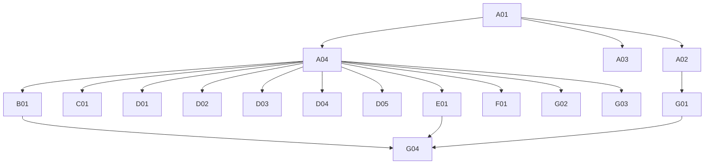

# Phase 4: Migration Plan & Stories — ProductDetails

> **Domain:** `productDetails` · **Target DGS:** `ProductDetailsService` → `plm-product`
> **Pipeline Version:** 2.0 · **Generated:** 2026-06-27
> **Depends on:** [02-resolver-analysis.md](./02-resolver-analysis.md), [03-schema.graphql](./03-schema.graphql), [03-schema-analysis.md](./03-schema-analysis.md), [05-attribute-inventory.md](./05-attribute-inventory.md)
> **Index:** [04-stories-index.yaml](./04-stories-index.yaml)

Each story is self-contained (Current Behaviour → Target → Files → Acceptance → Tests). Full pseudo-logic
in [02-resolver-analysis.md](./02-resolver-analysis.md). **ACL is context-only** — no ACL work in any story.
Backend path is `construction/v1`.

## 1. Phases Overview
| Phase | Name | Stories |
|---|---|---|
| A | Foundation & Schema | A01–A04 |
| B | Core Reads | B01 |
| C | Search & Listing | C01 |
| D | Mutations (simple) | D01–D05 |
| E | Complex (multi-step write) | E01 |
| F | Federation (internal) | F01 |
| G | Field Resolvers & Tests | G01–G04 |

## 2. Dependency Graph


---

## 3. Stories

### Phase A — Foundation & Schema

### SPARK-PDTL-A01 · Schema skeleton + DateTime scalar
```yaml
{id: SPARK-PDTL-A01, operation: "-", type: schema, category: CAT-1, phase: A, complexity: Low, depends_on: [], ext_services: [], files: [plm-product/.../schema/productdetails.graphqls, plm-product/.../config/ScalarConfig.kt], blocked_by: none}
```
**Current Behaviour:** green-field; schema translated from `code/schemas/SPARK_ProductDetail.txt`.
**Target:** federation v2.3 header, `scalar DateTime → Instant`, empty `extend type Query`/`Mutation`.
**Files:** `schema/productdetails.graphqls`, `config/ScalarConfig.kt`. **Deps:** none.
**Acceptance:** 1. `./gradlew generateJava` passes. 2. `DateTime` round-trips. **Tests:** ☐ compiles ☐ scalar serde.

### SPARK-PDTL-A02 · Owned types + inputs
```yaml
{id: SPARK-PDTL-A02, operation: "-", type: schema, category: CAT-1, phase: A, complexity: Medium, depends_on: [SPARK-PDTL-A01], ext_services: [], files: [plm-product/.../schema/productdetails.graphqls], blocked_by: none}
```
**Target:** `ProductDetails` (`@key(fields:"id")`), `ProductDetailsItem`, `ProductDetailsCategoryWithSection`,
`ProductDetailsPaged`, the 8 inputs, `@shareable CodeDescription` — per [03-schema.graphql](./03-schema.graphql).
**Note:** `workspaceContext` is `[String]` on create but `PartialWorkspaceAssociationsInput` on update (preserve).
**Deps:** A01. **Acceptance:** 1. all types+inputs present; nullability matches SDL. 2. schema validates. **Tests:** ☐ validates ☐ entity stub.

### SPARK-PDTL-A03 · External stubs (platform + sibling DGS)
```yaml
{id: SPARK-PDTL-A03, operation: "-", type: schema, category: CAT-1, phase: A, complexity: Low, depends_on: [SPARK-PDTL-A01], ext_services: [], files: [plm-product/.../schema/productdetails.graphqls], blocked_by: none}
```
**Target:** stubs `Attachment`, `WorkspaceV2`, `UserProfileAttributes`, `UserGroup_Participants`,
`AccessControl`, `ResourcePermissions`, `VMM_BusinessPartner` + internal placeholders `Product`,
`ProductComponentStatus`, `VersionableId`. **Deps:** A01. **Acceptance:** 1. compiles; gateway composes. **Tests:** ☐ compiles ☐ stub resolves.

### SPARK-PDTL-A04 · `ProductDetailsService` Kotlin port (construction/v1)
```yaml
{id: SPARK-PDTL-A04, operation: "ProductDetailsService", type: service, category: CAT-3, phase: A, complexity: Medium, depends_on: [SPARK-PDTL-A01], ext_services: [], files: [plm-product/.../service/ProductDetailsService.kt, plm-product/.../client/*Client.kt, plm-product/.../model/*Dto.kt], blocked_by: none}
```
**Current Behaviour (Phase 2 §Service):** 9 REST methods on `construction/v1` (2 unused: versions).
**Target:** Kotlin service; snake/camel at the Feign boundary; preserve the create error-contract
(throw on `validationErrors`/`message`) and the `{content}` wrap on component-status.
**Deps:** A01. **Acceptance:** 1. used methods present (GET ?ids, POST, PUT /{id}, /manage-permissions, /{id}/{lock|unlock}, /component_status_update, /{id}/workspace_associations). 2. create throws on validation error. **Tests:** ☐ endpoint build ☐ create error ☐ status wrap.

---

### Phase B — Core Reads

### SPARK-PDTL-B01 · `getProductDetailsById(ids)`
```yaml
{id: SPARK-PDTL-B01, operation: getProductDetailsById, type: query, category: CAT-2, phase: B, complexity: Low, depends_on: [SPARK-PDTL-A02, SPARK-PDTL-A04], ext_services: [], files: [plm-product/.../dataFetcher/ProductDetailsQueryDataFetcher.kt], blocked_by: none}
```
**Current Behaviour (Q1):** (ACL context) token for `ids` → `GET construction/v1?ids={csv}` → camelCase list.
**Target:** `@DgsQuery getProductDetailsById(ids): [ProductDetails]`. **Acceptance:** 1. returns list for ids; empty → []. **Tests:** ☐ happy ☐ empty ☐ integration.

---

### Phase C — Search & Listing

### SPARK-PDTL-C01 · `getProductDetailsElastic(resourceId)`
```yaml
{id: SPARK-PDTL-C01, operation: getProductDetailsElastic, type: query, category: CAT-2, phase: C, complexity: Medium, depends_on: [SPARK-PDTL-A04], ext_services: [{key: search, severity: RED}], files: [plm-product/.../dataFetcher/ProductDetailsQueryDataFetcher.kt], blocked_by: none}
```
**Current Behaviour (Q2):** (🔴 search) `search.getProductDetailsElastic.load({ q:"parentId: {resourceId}" })` → paged.
**EXT:** 🔴 search. **Target:** `@DgsQuery → ProductDetailsPaged`. **Note:** the source resolver reads a `types` arg not in the SDL — drop (or add to schema) per [03-analysis §2](./03-schema-analysis.md).
**Acceptance:** 1. `parentId:` elastic query built. 2. paged shape returned. **Tests:** ☐ query build ☐ parity.

---

### Phase D — Mutations (simple)

### SPARK-PDTL-D01 · `createProductDetailsSet`
```yaml
{id: SPARK-PDTL-D01, operation: createProductDetailsSet, type: mutation, category: CAT-2, phase: D, complexity: Medium, depends_on: [SPARK-PDTL-A04], ext_services: [], files: [plm-product/.../dataFetcher/ProductDetailsMutationDataFetcher.kt], blocked_by: none}
```
**Current Behaviour (M1):** (ACL context) token for literal capability → `POST construction/v1` (snake_case). **If response has `validationErrors` or `message` → throw.** **Target:** `@DgsMutation`; port the throw-on-error contract. **Acceptance:** 1. creates set. 2. validation error → exception (not a partial object). **Tests:** ☐ create ☐ validation-error→throw.

### SPARK-PDTL-D02 · `updateProductDetailAccess`
```yaml
{id: SPARK-PDTL-D02, operation: updateProductDetailAccess, type: mutation, category: CAT-2, phase: D, complexity: Low, depends_on: [SPARK-PDTL-A04], ext_services: [], files: [plm-product/.../dataFetcher/ProductDetailsMutationDataFetcher.kt], blocked_by: none}
```
**Current Behaviour (M2):** map `managePermissionsRequest[].resourceId` → token → `PUT construction/v1/manage-permissions` (`primeKey=humanId`). **Target:** `@DgsMutation → [ProductDetails]`. **Acceptance:** 1. updates partner access for each resource. **Tests:** ☐ update ☐ integration.

### SPARK-PDTL-D03 · `productDetailLockUnlock`
```yaml
{id: SPARK-PDTL-D03, operation: productDetailLockUnlock, type: mutation, category: CAT-2, phase: D, complexity: Low, depends_on: [SPARK-PDTL-A04], ext_services: [], files: [plm-product/.../dataFetcher/ProductDetailsMutationDataFetcher.kt], blocked_by: none}
```
**Current Behaviour (M3):** token for `[constructionSetId]` → `PUT construction/v1/{id}/{lock|unlock}`. **Target:** `@DgsMutation`. **Acceptance:** 1. `isLock=true`→lock path, false→unlock path. **Tests:** ☐ lock ☐ unlock.

### SPARK-PDTL-D04 · `cloneFilesForProductDetails`
```yaml
{id: SPARK-PDTL-D04, operation: cloneFilesForProductDetails, type: mutation, category: CAT-2, phase: D, complexity: Medium, depends_on: [SPARK-PDTL-A04], ext_services: [{key: attachment, severity: RED}], files: [plm-product/.../dataFetcher/ProductDetailsMutationDataFetcher.kt], blocked_by: none}
```
**Current Behaviour (M5):** token → `Promise.all(attachmentIds.map((id,i) => (🔴 attachment) cloneAttachmentV3({cloneReferences:[cloneReference[i]]}, id)))`, stamp `parentResource=id`, flatten. No rollback. **EXT:** 🔴 attachment. **Target:** structured-concurrency fan-out via `AttachmentClient`. **Acceptance:** 1. clones each id with its paired cloneReference. 2. `parentResource` stamped. **Tests:** ☐ clone ☐ pairing ☐ parity.

### SPARK-PDTL-D05 · `updateProductDetailComponentStatus`
```yaml
{id: SPARK-PDTL-D05, operation: updateProductDetailComponentStatus, type: mutation, category: CAT-2, phase: D, complexity: Low, depends_on: [SPARK-PDTL-A04], ext_services: [], files: [plm-product/.../dataFetcher/ProductDetailsMutationDataFetcher.kt], blocked_by: none}
```
**Current Behaviour (M6):** `PUT construction/v1/component_status_update`; wraps result as `{content}`. **No JWT — confirm backend-enforced.** **Target:** `@DgsMutation → ProductDetailsPaged`. **Acceptance:** 1. updates statuses; result wrapped as `{content}`. 2. no-token behaviour documented. **Tests:** ☐ update ☐ wrap.

---

### Phase E — Complex Operations

### SPARK-PDTL-E01 · `updateProductDetailsSet` (multi-step write)
```yaml
{id: SPARK-PDTL-E01, operation: updateProductDetailsSet, type: mutation, category: CAT-2, phase: E, complexity: High, depends_on: [SPARK-PDTL-A04], ext_services: [{key: attachment, severity: RED}, {key: workspaceV2, severity: YELLOW}], files: [plm-product/.../service/ProductDetailsUpdateService.kt], blocked_by: none}
```
**As a** DGS engineer **I want** the multi-step product-details update with a failure strategy **so that**
workspace, attachment, and body changes stay consistent.
**Current Behaviour (M4):** 1) if `workspaceContext.{add,remove}Workspaces` non-empty →
`workspaceAssociationHelper(PRODUCT_DETAIL, id, add, remove)` (throws on error); 2) null `workspaceContext`;
3) if `deleteAttachmentIds` → (🔴 attachment) `archiveAttachmentBulkV3` (separate ACL token);
4) `PUT construction/v1/{id}`. **No rollback across steps.**
**EXT:** 🔴 attachment · 🟡 workspaceV2. **Target:** ordered steps with a chosen failure strategy
(**PO decision** saga / compensation log / best-effort). **Acceptance:** 1. all 4 steps in order. 2. partial-failure strategy implemented. 3. workspace assoc throws propagate. **Tests:** ☐ full path ☐ workspace-only ☐ attachment-archive ☐ partial-failure ☐ parity.

---

### Phase F — Federation (internal)

### SPARK-PDTL-F01 · `Product.productDetails` (internal, same subgraph)
```yaml
{id: SPARK-PDTL-F01, operation: "Product.productDetails", type: field-resolver, category: CAT-2, phase: F, complexity: Low, depends_on: [SPARK-PDTL-A04], ext_services: [], files: [plm-product/.../dataFetcher/ProductProductDetailsFieldDataFetcher.kt], blocked_by: none}
```
**Current Behaviour:** Product exposes `productDetails` resolved from the co-located ProductDetails service. **Target:** **internal** `@DgsData` on `Product` calling `ProductDetailsService` in-process (not gateway federation; depends only on the `Product` type existing). **Acceptance:** 1. `Product.productDetails` resolves in-process; no gateway hop. **Tests:** ☐ resolves ☐ parity.

---

### Phase G — Field Resolvers & Tests

### SPARK-PDTL-G01 · `access` + `currentUserPermissions` + `participantDetails`
```yaml
{id: SPARK-PDTL-G01, operation: "ProductDetails.access+perms+participants", type: field-resolver, category: CAT-2, phase: G, complexity: Medium, depends_on: [SPARK-PDTL-A02, SPARK-PDTL-A04], ext_services: [{key: userGroup, severity: BLUE}], files: [plm-product/.../dataFetcher/ProductDetailsAclFieldDataFetcher.kt], blocked_by: none}
```
**Current Behaviour:** `access` → `accessControl.getPermissions([humanId||id])[0]`; `currentUserPermissions`
→ `getUserAccessUnencoded(humanId||id)[0]`; `participantDetails` → `getUserGroup(humanId)`. (ACL context.) **Target:** thin `@DgsData`; ACL is context-only. **Acceptance:** 1. each field resolves; null-safe on empty. **Tests:** ☐ access ☐ perms ☐ participants.

### SPARK-PDTL-G02 · `product` + `createdBy` + `updatedBy` + `businessPartners` + `workspaces`
```yaml
{id: SPARK-PDTL-G02, operation: "ProductDetails.refs", type: field-resolver, category: CAT-2, phase: G, complexity: Medium, depends_on: [SPARK-PDTL-A04], ext_services: [{key: userAttributes, severity: YELLOW}, {key: workspaceV2, severity: YELLOW}, {key: vmm, severity: BLUE}], files: [plm-product/.../dataFetcher/ProductDetailsRefFieldDataFetcher.kt], blocked_by: none}
```
**Current Behaviour:** `product` (internal, only if `parentId` starts `'PID'`), `createdBy`/`updatedBy`
(🟡 user-profile), `businessPartners` (🔵 vmm `loadBpsWithType`), `workspaces` (🟡 workspaceV2 by ids). **Target:** internal + federated references. **Acceptance:** 1. each resolves; `product` null when `parentId` not `PID*`. 2. null id → null user. **Tests:** ☐ product branch ☐ users ☐ partners ☐ workspaces.

### SPARK-PDTL-G03 · `attachment` + item `attachment`/`constructionSetAttachments` + category `subCategories`
```yaml
{id: SPARK-PDTL-G03, operation: "ProductDetails.attachments+subCategories", type: field-resolver, category: CAT-2, phase: G, complexity: Medium, depends_on: [SPARK-PDTL-A04], ext_services: [{key: search, severity: RED}], files: [plm-product/.../dataFetcher/ProductDetailsAttachmentFieldDataFetcher.kt], blocked_by: none}
```
**Current Behaviour:** `ProductDetails.attachment` → (🔴 search) `searchAttachments([humanId||id])`, find
`relatedResources.length<=2`; `ProductDetailsItem.attachment` → `searchAttachments([templateId])[0]||{}`;
`constructionSetAttachments` → `searchAttachments([id]).content||[]`; `CategoryWithSection.subCategories`
→ (internal `specificationsTemplate`) `getProductDetailsCategorySection()` find by `code`. **Target:** shared search helper + internal master-data call. **Acceptance:** 1. each field resolves to the right source. 2. `attachment` length-≤2 filter preserved. **Tests:** ☐ set attachment ☐ item attachments ☐ subCategories.

### SPARK-PDTL-G04 · Tests, parity harness
```yaml
{id: SPARK-PDTL-G04, operation: "tests", type: tests, category: CAT-5, phase: G, complexity: Medium, depends_on: [SPARK-PDTL-B01, SPARK-PDTL-E01, SPARK-PDTL-G01], files: [plm-product/.../test/*.kt], blocked_by: none}
```
**Target:** ≥80% unit coverage; parity fixtures (incl. the multi-step `updateProductDetailsSet`, the
create error-contract, attachment-by-search fields); contract test (schema diff intentional-only). **Acceptance:** 1. unit ≥80%. 2. parity fixtures green. 3. schema-diff intentional-only. **Tests:** ☐ parity ☐ contract.

---

## 4. Risk Register
| Risk | Likelihood | Impact | Mitigation | Owner |
|------|-----------|--------|------------|-------|
| `updateProductDetailsSet` multi-step partial failure (E01) | Medium | High | Saga / compensation — PO decision | Tech Lead + PO |
| `updateProductDetailComponentStatus` no auth token (D05) | Low | Medium | Confirm backend-enforced | PO |
| Attachment-by-search field perf (G03) | Low | Medium | Shared helper; batch | Backend Eng |
| `getProductDetailsElastic.types` schema drift (C01) | Low | Low | Drop or add to schema | Backend Eng |

## 5. Summary
- **Stories:** 17 (A:4 · B:1 · C:1 · D:5 · E:1 · F:1 · G:4).
- **Critical path:** A01→A02/A04→E01→G01→G04.
- **Highest risk:** `updateProductDetailsSet` (E01).
- **Co-located:** productDetails is in the `plm-product` monorepo; `Product.productDetails` resolves internally.

---
**Phase Completed:** Phase 4 — Migration Stories · **Domain:** `productDetails` · **Outputs:** 04-stories.md, 04-stories-index.yaml, 04-po-summary.md.
