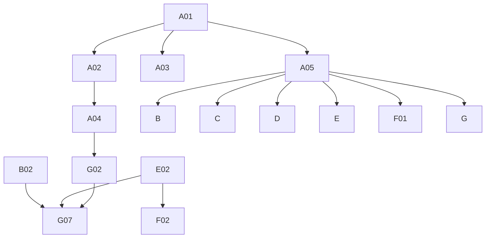

# Phase 4: Migration Plan & Stories — Sample

> **Domain:** `sample` · **Target DGS:** `SampleServiceV2` → separate `plm-sample` subgraph
> **Pipeline Version:** 2.0 · **Generated:** 2026-06-27
> **Depends on:** [02-resolver-analysis.md](./02-resolver-analysis.md), [03-schema.graphql](./03-schema.graphql), [03-schema-analysis.md](./03-schema-analysis.md), [05-attribute-inventory.md](./05-attribute-inventory.md)
> **Index:** [04-stories-index.yaml](./04-stories-index.yaml)

Each story is self-contained. Full pseudo-logic in [02-resolver-analysis.md](./02-resolver-analysis.md).
**ACL is context-only.** `sample` is its **own subgraph** (Product/workspace/measurement/search are
cross-subgraph). Base `samples/v2`.

## 1. Phases Overview
| Phase | Name | Stories |
|---|---|---|
| A | Foundation & Schema | A01–A05 |
| B | Core Reads | B01–B08 |
| C | RFID Reads | C01–C02 |
| D | Mutations (simple) | D01–D07 |
| E | Complex (evaluation writes) | E01–E02 |
| F | Federation & decisions | F01–F02 |
| G | Field Resolvers & Tests | G01–G07 |

## 2. Dependency Graph


---

## 3. Stories

### Phase A — Foundation & Schema

### SPARK-SMPL-A01 · Schema skeleton + DateTime scalar
```yaml
{id: SPARK-SMPL-A01, operation: "-", type: schema, category: CAT-1, phase: A, complexity: Low, depends_on: [], ext_services: [], files: [plm-sample/.../schema/sample.graphqls, plm-sample/.../config/ScalarConfig.kt], blocked_by: none}
```
**Current Behaviour:** green-field; schema translated from `code/schemas/SPARK_SampleV2.txt`.
**Target:** federation v2.3 header, `scalar DateTime → Instant`, empty `extend type Query`/`Mutation`. **Acceptance:** 1. `generateJava` passes. 2. scalar round-trips. **Tests:** ☐ compiles ☐ serde.

### SPARK-SMPL-A02 · Owned types + inputs (wide `SampleV2` surface)
```yaml
{id: SPARK-SMPL-A02, operation: "-", type: schema, category: CAT-1, phase: A, complexity: High, depends_on: [SPARK-SMPL-A01], ext_services: [], files: [plm-sample/.../schema/sample.graphqls], blocked_by: none}
```
**Target:** `SampleV2` (`@key(fields:"id")`) + ~24 value types + ~10 inputs per [03-schema.graphql](./03-schema.graphql); `@shareable` on `CodeDescription`/`SampleCodeDescriptionV2`/`Participants`. Expand the remaining SDL value types. **Acceptance:** 1. all types/inputs present; nullability matches SDL. 2. validates. **Tests:** ☐ validates ☐ entity stub.

### SPARK-SMPL-A03 · External stubs (platform + other DGS)
```yaml
{id: SPARK-SMPL-A03, operation: "-", type: schema, category: CAT-1, phase: A, complexity: Medium, depends_on: [SPARK-SMPL-A01], ext_services: [], files: [plm-sample/.../schema/sample.graphqls], blocked_by: none}
```
**Target:** `@extends @external` stubs for `Product`, `WorkspaceV2`, `SampleMeasurementSet`, `Attachment`,
`Trim`, `ColorArchroma`, `Color`, `Artwork`, `FabricSpecCombo`, `FabricSpecification`, `Material`, `Role`,
`UserProfileAttributes`, `Spark_AsapEvaluation`, `VMM_*`, `IG_Department`, `Tag`. **Acceptance:** 1. compiles; gateway composes. **Tests:** ☐ compiles ☐ stub resolves.

### SPARK-SMPL-A04 · `SampleAsset` union `@DgsTypeResolver`
```yaml
{id: SPARK-SMPL-A04, operation: "SampleAsset", type: field-resolver, category: CAT-2, phase: A, complexity: Medium, depends_on: [SPARK-SMPL-A02, SPARK-SMPL-A03], ext_services: [], files: [plm-sample/.../dataFetcher/SampleAssetTypeResolver.kt], blocked_by: none}
```
**Current Behaviour (`__resolveType`):** `isColorId(humanId)` → `Color`; Artworks-prefix → `Artwork`; else null. **Target:** `@DgsTypeResolver(name="SampleAsset")` mirroring the prefix logic. **Acceptance:** 1. Color/Artwork map correctly; unknown → null. **Tests:** ☐ color ☐ artwork ☐ unknown.

### SPARK-SMPL-A05 · `SampleServiceV2` Kotlin port (samples/v2)
```yaml
{id: SPARK-SMPL-A05, operation: "SampleServiceV2", type: service, category: CAT-3, phase: A, complexity: High, depends_on: [SPARK-SMPL-A01], ext_services: [], files: [plm-sample/.../service/SampleService.kt, plm-sample/.../client/*Client.kt, plm-sample/.../model/*Dto.kt], blocked_by: none}
```
**Current Behaviour (Phase 2 §Service):** ~30 REST methods on `samples/v2` (+ export). **Target:** Kotlin
service; preserve the `systemGenerated`/`systemUser` branch and batched by-ids. **Acceptance:** 1. methods present (by-id/byPost, rounds, master-data, create/update/round/workspace-assoc, drop/undrop service-level, exports, rfid, color samples). **Tests:** ☐ endpoint build ☐ batch ☐ master-data.

---

### Phase B — Core Reads

### SPARK-SMPL-B01 · `getSampleById(id)`
```yaml
{id: SPARK-SMPL-B01, operation: getSampleById, type: query, category: CAT-2, phase: B, complexity: Low, depends_on: [SPARK-SMPL-A02, SPARK-SMPL-A05], ext_services: [], files: [plm-sample/.../dataFetcher/SampleQueryDataFetcher.kt], blocked_by: none}
```
**Current Behaviour:** (own) `getSampleById.load(id)`. **Target:** `@DgsQuery → SampleV2`. **Acceptance:** 1. returns sample; miss→null. **Tests:** ☐ happy ☐ miss.

### SPARK-SMPL-B02 · `getSamplesByIdsV2(ids)` (batched)
```yaml
{id: SPARK-SMPL-B02, operation: getSamplesByIdsV2, type: query, category: CAT-2, phase: B, complexity: Medium, depends_on: [SPARK-SMPL-A05], ext_services: [{key: recentlyViewed, severity: BLUE}], files: [plm-sample/.../dataFetcher/SampleQueryDataFetcher.kt], blocked_by: none}
```
**Current Behaviour (Q2):** `batchParallelOperation(chunk)` → (ACL) token per batch → (own) `getSamplesByIdsV2ByPost`. **Side-effect:** exactly-one → (🔵 recentlyViewed) `addRecentlyViewed`. **Target:** `@DgsQuery → [SampleV2]`; chunked. **Acceptance:** 1. batched by chunk size. 2. single → recentlyViewed. **Tests:** ☐ batch ☐ recentlyViewed ☐ parity.

### SPARK-SMPL-B03 · `getSamplesByParentId(humanId)`
```yaml
{id: SPARK-SMPL-B03, operation: getSamplesByParentId, type: query, category: CAT-2, phase: B, complexity: Medium, depends_on: [SPARK-SMPL-A05], ext_services: [{key: relationship, severity: YELLOW}], files: [plm-sample/.../dataFetcher/SampleQueryDataFetcher.kt], blocked_by: none}
```
**Current Behaviour (Q3):** (🟡 relationship) `getByID({id, type:'sample', maxDepth:0})` → ids → (ACL) token → (own) `getSamplesByIdsV2`; empty → []. **Target:** `@DgsQuery → [SampleV2]`. **Acceptance:** 1. relationship→ids→samples chain. **Tests:** ☐ chain ☐ empty.

### SPARK-SMPL-B04 · `getColorSamplesByParentId(id)`
```yaml
{id: SPARK-SMPL-B04, operation: getColorSamplesByParentId, type: query, category: CAT-2, phase: B, complexity: Low, depends_on: [SPARK-SMPL-A05], ext_services: [], files: [plm-sample/.../dataFetcher/SampleQueryDataFetcher.kt], blocked_by: none}
```
**Current Behaviour:** (own) `getColorSamplesByParentId.load(id)`. **Target:** `@DgsQuery → [SampleV2]`. **Acceptance:** 1. returns color samples. **Tests:** ☐ happy.

### SPARK-SMPL-B05 · `getSampleRounds(humanId)`
```yaml
{id: SPARK-SMPL-B05, operation: getSampleRounds, type: query, category: CAT-2, phase: B, complexity: Low, depends_on: [SPARK-SMPL-A05], ext_services: [], files: [plm-sample/.../dataFetcher/SampleQueryDataFetcher.kt], blocked_by: none}
```
**Current Behaviour:** (ACL) token → (own) `getSampleRounds`. **Target:** `@DgsQuery → [SampleV2]`. **Acceptance:** 1. returns rounds. **Tests:** ☐ happy.

### SPARK-SMPL-B06 · `getSampleExports`
```yaml
{id: SPARK-SMPL-B06, operation: getSampleExports, type: query, category: CAT-2, phase: B, complexity: Low, depends_on: [SPARK-SMPL-A05], ext_services: [], files: [plm-sample/.../dataFetcher/SampleQueryDataFetcher.kt], blocked_by: none}
```
**Current Behaviour:** (own) `getSampleExports`. **Target:** `@DgsQuery → [SampleExport]`. **Acceptance:** 1. returns exports. **Tests:** ☐ list.

### SPARK-SMPL-B07 · `getSampleNotificationErrors`
```yaml
{id: SPARK-SMPL-B07, operation: getSampleNotificationErrors, type: query, category: CAT-2, phase: B, complexity: Low, depends_on: [SPARK-SMPL-A05], ext_services: [{key: notification, severity: YELLOW}], files: [plm-sample/.../dataFetcher/SampleQueryDataFetcher.kt], blocked_by: none}
```
**Current Behaviour:** (🟡 notification) `getSampleNotificationErrors`. **Target:** `@DgsQuery → [SampleNotificationError]`. **Acceptance:** 1. returns errors. **Tests:** ☐ list.

### SPARK-SMPL-B08 · Master-data type/format/purpose queries (cacheable bundle)
```yaml
{id: SPARK-SMPL-B08, operation: "sample-master-data", type: query, category: CAT-2, phase: B, complexity: Low, depends_on: [SPARK-SMPL-A05], ext_services: [], files: [plm-sample/.../dataFetcher/SampleMasterDataFetcher.kt], blocked_by: none}
```
**Covers (~13):** `getSampleMaterialTypesV2`, `getSampleTypesV2(resourceTypes)`, `getFabricSampleTypesV2`,
`getSampleProductTypesV2`, `getSampleTrackingTypesV2`, `getSampleLateReasonTypesV2`, `getColorSamplePurposesV2`,
`getMaterialSampleEvaluationTypesV2`, `getProductSampleEvaluationTypesV2`, `getWashSampleTypesV2`,
`getSampleFormats(type)`, `getMaterialSampleFormats(type)`, `getSampleEvaluationPurposes`,
`getSampleTypeFormatMappings`. **Current Behaviour:** thin (own) master-data loads. **Target:** `@DgsQuery` each → `@Cacheable`. **Acceptance:** 1. each returns its list; cached. **Tests:** ☐ each query ☐ cache hit.

---

### Phase C — RFID Reads

### SPARK-SMPL-C01 · `getSampleLocationByIds(ids)`
```yaml
{id: SPARK-SMPL-C01, operation: getSampleLocationByIds, type: query, category: CAT-2, phase: C, complexity: High, depends_on: [SPARK-SMPL-A05], ext_services: [{key: search, severity: RED}], files: [plm-sample/.../dataFetcher/SampleRfidDataFetcher.kt], blocked_by: none}
```
**Current Behaviour (Q6):** batched samples → for each with `rfidTagIds` → (🔴 search) `searchLatestRfidLocations({q: tagIds OR-joined})` → reduce to latest `lastSeen` → `{id, locationDescription, lastSeen}`; flatten. **Target:** `@DgsQuery → [RfidSampleLocation]`; batch tag queries. **Acceptance:** 1. latest-location reduce correct. 2. no tags → []. **Tests:** ☐ latest reduce ☐ no-tags ☐ parity.

### SPARK-SMPL-C02 · `getSamplesByRfidTagIds(ids)`
```yaml
{id: SPARK-SMPL-C02, operation: getSamplesByRfidTagIds, type: query, category: CAT-2, phase: C, complexity: Medium, depends_on: [SPARK-SMPL-A05], ext_services: [], files: [plm-sample/.../dataFetcher/SampleRfidDataFetcher.kt], blocked_by: none}
```
**Current Behaviour:** (ACL) token → (own) `getSamplesByRfidTagIds`. **Target:** `@DgsQuery → [SampleRfidTagPair]`. **Acceptance:** 1. returns tag→sample pairs. **Tests:** ☐ happy.

---

### Phase D — Mutations (simple)

### SPARK-SMPL-D01 · `createSamplesV2`
```yaml
{id: SPARK-SMPL-D01, operation: createSamplesV2, type: mutation, category: CAT-2, phase: D, complexity: Medium, depends_on: [SPARK-SMPL-A05], ext_services: [{key: relationship, severity: YELLOW}, {key: attachment, severity: YELLOW}], files: [plm-sample/.../dataFetcher/SampleMutationDataFetcher.kt], blocked_by: none}
```
**Current Behaviour (M1):** (own) `createSamplesV2`; **if first new sample has files** → (🟡 relationship) `createSampleAttachmentRelationship` + (ACL) token + (🟡 attachment) `bulkUpdateAttributes` (stamp resource/related). No rollback. **Target:** `@DgsMutation → [SampleV2]`. **Acceptance:** 1. creates. 2. file-relationship + attribute side-effects when files present. **Tests:** ☐ create ☐ create+files ☐ parity.

### SPARK-SMPL-D02 · `createSampleRoundV2`
```yaml
{id: SPARK-SMPL-D02, operation: createSampleRoundV2, type: mutation, category: CAT-2, phase: D, complexity: Low, depends_on: [SPARK-SMPL-A05], ext_services: [], files: [plm-sample/.../dataFetcher/SampleMutationDataFetcher.kt], blocked_by: none}
```
**Current Behaviour (M4):** (ACL) token `[sampleId, SAMPLE_EVALUTION]` → (own) `createSampleRoundV2`. **Target:** `@DgsMutation → SampleV2`. **Acceptance:** 1. creates a round. **Tests:** ☐ create round.

### SPARK-SMPL-D03 · `updateSampleWorkspaceAssociation`
```yaml
{id: SPARK-SMPL-D03, operation: updateSampleWorkspaceAssociation, type: mutation, category: CAT-2, phase: D, complexity: Low, depends_on: [SPARK-SMPL-A05], ext_services: [], files: [plm-sample/.../dataFetcher/SampleMutationDataFetcher.kt], blocked_by: none}
```
**Current Behaviour (M3):** (ACL) token `[sampleId, workspaceId]` → (own) `updateSampleWorkspaceAssociation`. **Target:** `@DgsMutation → SampleV2`. **Acceptance:** 1. associates sample to workspace. **Tests:** ☐ assoc.

### SPARK-SMPL-D04 · `requestSampleExport`
```yaml
{id: SPARK-SMPL-D04, operation: requestSampleExport, type: mutation, category: CAT-2, phase: D, complexity: Low, depends_on: [SPARK-SMPL-A05], ext_services: [], files: [plm-sample/.../dataFetcher/SampleMutationDataFetcher.kt], blocked_by: none}
```
**Current Behaviour (M6):** (own) `requestSampleExport`. **Target:** `@DgsMutation → String`. **Acceptance:** 1. returns request id. **Tests:** ☐ request.

### SPARK-SMPL-D05 · `retrySampleNotificationError`
```yaml
{id: SPARK-SMPL-D05, operation: retrySampleNotificationError, type: mutation, category: CAT-2, phase: D, complexity: Low, depends_on: [SPARK-SMPL-A05], ext_services: [{key: notification, severity: YELLOW}], files: [plm-sample/.../dataFetcher/SampleMutationDataFetcher.kt], blocked_by: none}
```
**Current Behaviour (M7):** (🟡 notification) `retrySampleNotificationError(failedMessageId)`. **Target:** `@DgsMutation`. **Acceptance:** 1. retries one. **Tests:** ☐ retry.

### SPARK-SMPL-D06 · `retryAllSampleNotificationErrors`
```yaml
{id: SPARK-SMPL-D06, operation: retryAllSampleNotificationErrors, type: mutation, category: CAT-2, phase: D, complexity: Low, depends_on: [SPARK-SMPL-A05], ext_services: [{key: notification, severity: YELLOW}], files: [plm-sample/.../dataFetcher/SampleMutationDataFetcher.kt], blocked_by: none}
```
**Current Behaviour (M8):** (🟡 notification) `retryAllSampleNotificationErrors`. **Target:** `@DgsMutation → [...]`. **Acceptance:** 1. retries all. **Tests:** ☐ retry all.

### SPARK-SMPL-D07 · `bulkCloneFilesForEvaluate`
```yaml
{id: SPARK-SMPL-D07, operation: bulkCloneFilesForEvaluate, type: mutation, category: CAT-2, phase: D, complexity: Medium, depends_on: [SPARK-SMPL-A05], ext_services: [{key: attachment, severity: YELLOW}], files: [plm-sample/.../dataFetcher/SampleMutationDataFetcher.kt], blocked_by: none}
```
**Current Behaviour (M9):** (ACL) token → `Promise.all(attachmentIds.map(id => (🟡 attachment) cloneAttachmentV3({cloneReferences}, id)))`, flatten. **Target:** structured-concurrency fan-out. **Acceptance:** 1. clones each id. **Tests:** ☐ clone ☐ parity.

---

### Phase E — Complex Operations

### SPARK-SMPL-E01 · `updateSamplesV2`
```yaml
{id: SPARK-SMPL-E01, operation: updateSamplesV2, type: mutation, category: CAT-2, phase: E, complexity: High, depends_on: [SPARK-SMPL-A05], ext_services: [], files: [plm-sample/.../service/SampleUpdateService.kt], blocked_by: none}
```
**Current Behaviour (M2):** (ACL) token for all `updateSamples[].id` + `SAMPLE_EVALUTION` → (own) `updateSamplesV2`. **Target:** `@DgsMutation → [SampleV2]`. **Acceptance:** 1. bulk-updates samples (eval-scoped token). **Tests:** ☐ update ☐ parity.

### SPARK-SMPL-E02 · `bulkEvaluateSamples`
```yaml
{id: SPARK-SMPL-E02, operation: bulkEvaluateSamples, type: mutation, category: CAT-2, phase: E, complexity: High, depends_on: [SPARK-SMPL-A05], ext_services: [{key: attachment, severity: YELLOW}], files: [plm-sample/.../service/SampleBulkEvaluateService.kt], blocked_by: none}
```
**As a** DGS engineer **I want** the bulk-evaluate orchestration **so that** evaluations + new rounds apply
consistently.
**Current Behaviour (M5):** delegates to `bulkEvaluateSampleUtil(ctx, updateSamples, newSampleRounds)` —
applies evaluations and creates new sample rounds. **Target:** port the util as a service; choose a
failure strategy if partial. **Acceptance:** 1. evaluations + new rounds applied. 2. partial-failure handling decided. **Tests:** ☐ evaluate ☐ new rounds ☐ partial ☐ parity.

---

### Phase F — Federation & decisions

### SPARK-SMPL-F01 · `SampleV2` federated entity fetcher
```yaml
{id: SPARK-SMPL-F01, operation: "SampleV2.__entity", type: field-resolver, category: CAT-4, phase: F, complexity: Medium, depends_on: [SPARK-SMPL-A05], ext_services: [], files: [plm-sample/.../dataFetcher/SampleEntityFetcher.kt], blocked_by: none}
```
**Target:** `@DgsEntityFetcher(name="SampleV2")` resolving by `id`, so product (`Product.samples`/`sampleIds`),
measurement (`SampleV2.sampleMeasurement` — `SPARK-MEAS-F02`), and workspace resolve sample over the gateway. **Acceptance:** 1. entity resolves by key. 2. `Product { samples { id } }` cross-subgraph smoke test. **Tests:** ☐ entity fetch ☐ smoke.

### SPARK-SMPL-F02 · Deferred drift mutation decision
```yaml
{id: SPARK-SMPL-F02, operation: "drift-mutations", type: schema, category: CAT-4, phase: F, complexity: Low, depends_on: [SPARK-SMPL-E02], ext_services: [], files: [plm-sample/.../schema/sample.graphqls], blocked_by: none}
```
**Current Behaviour:** `updateSampleEvaluations` (no resolver — superseded by `bulkEvaluateSamples`),
`dropSamples`/`undropSamples` (no resolver — run inside `workspaceBusinessPartnerActionsV2`). **Target:** PO/Architect decide delete vs keep `@deprecated`; coordinate drop/undrop ownership with workspace. **Acceptance:** 1. decision + traffic survey. **Tests:** ☐ schema diff intentional.

---

### Phase G — Field Resolvers & Tests

### SPARK-SMPL-G01 · Users (created/updated/evaluated + evaluators + primary roles)
```yaml
{id: SPARK-SMPL-G01, operation: "SampleV2.users", type: field-resolver, category: CAT-2, phase: G, complexity: Medium, depends_on: [SPARK-SMPL-A05], ext_services: [{key: userAttributes, severity: YELLOW}, {key: role, severity: BLUE}], files: [plm-sample/.../dataFetcher/SampleUserFieldDataFetcher.kt], blocked_by: none}
```
**Current Behaviour:** `createdBy`/`updatedBy`/`evaluatedBy` (🟡 user; `systemGenerated` → `systemUser`),
`designEvaluators`/`technicalEvaluators` (🟡 user map), `createdByInternalPrimaryRole`/`evaluatedByInternalPrimaryRole` (🔵 role). **Acceptance:** 1. each resolves; system-user branch preserved. **Tests:** ☐ users ☐ system-user ☐ roles.

### SPARK-SMPL-G02 · Prefix-gated parents + `SampleAsset` union
```yaml
{id: SPARK-SMPL-G02, operation: "SampleV2.parents", type: field-resolver, category: CAT-2, phase: G, complexity: High, depends_on: [SPARK-SMPL-A04, SPARK-SMPL-A05], ext_services: [{key: product, severity: YELLOW}, {key: trim, severity: YELLOW}, {key: colorArchroma, severity: YELLOW}, {key: combination, severity: YELLOW}, {key: fabric, severity: YELLOW}, {key: artwork, severity: YELLOW}, {key: material, severity: YELLOW}], files: [plm-sample/.../service/SampleParentHydrationService.kt], blocked_by: none}
```
**Current Behaviour:** prefix-gated hydration — `product` (PID, 🟡 product), `colorArchroma` (ARCCLR/TARARCCLR/REFARCCLR, 🟡 colorArchroma), `fabricSpecCombo` (FSC, 🟡 combination), `fabricSpec` (FAS, 🟡 fabric), `artwork` (ART, 🟡 artwork), `trim` (🟡 trim), `asset` (union via 🟡 material). **Target:** central prefix→loader table; `asset` resolves via the `SampleAsset` `@DgsTypeResolver` (A04). **Acceptance:** 1. each prefix routes to the right loader. 2. `asset` union resolves. 3. non-matching → null. **Tests:** ☐ each prefix ☐ union ☐ null.

### SPARK-SMPL-G03 · Partners (`businessPartner`/`fabricSupplier`/`merchandiseVendors`/`brand`/`designPartnerId`)
```yaml
{id: SPARK-SMPL-G03, operation: "SampleV2.partners", type: field-resolver, category: CAT-2, phase: G, complexity: Medium, depends_on: [SPARK-SMPL-A05], ext_services: [{key: vmm, severity: BLUE}, {key: brand, severity: BLUE}], files: [plm-sample/.../dataFetcher/SamplePartnerFieldDataFetcher.kt], blocked_by: none}
```
**Current Behaviour:** `businessPartner`/`fabricSupplier`/`merchandiseVendors` (🔵 vmm), `brand` (🔵 brand), `designPartnerId` (computed from `dpPartnerId`). **Acceptance:** 1. each resolves; empty → []. **Tests:** ☐ partners ☐ brand ☐ dp.

### SPARK-SMPL-G04 · `workspace` + `sampleMeasurementSet` + `designCycle` + `clmPackage`
```yaml
{id: SPARK-SMPL-G04, operation: "SampleV2.assoc", type: field-resolver, category: CAT-2, phase: G, complexity: Medium, depends_on: [SPARK-SMPL-A05], ext_services: [{key: workspaceV2, severity: YELLOW}, {key: measurement, severity: YELLOW}, {key: tag, severity: BLUE}, {key: tgtColorEvaluator, severity: BLUE}], files: [plm-sample/.../dataFetcher/SampleAssocFieldDataFetcher.kt], blocked_by: none}
```
**Current Behaviour:** `workspace` (🟡 workspace `getWorkspaceV2`), `sampleMeasurementSet` (🟡 measurement `getSampleMeasurement` — F02; gated on `sampleMeasurementSetId`), `sampleMeasurementSetAssociation` (computed), `designCycle` (🔵 tag), `clmPackage` (🔵 tgtColorEvaluator). **Acceptance:** 1. each resolves; gates preserved. **Tests:** ☐ workspace ☐ measurementSet ☐ designCycle ☐ clm.

### SPARK-SMPL-G05 · `attachments` + `rfidLocationInfo` + `currentLocations`
```yaml
{id: SPARK-SMPL-G05, operation: "SampleV2.attachments+rfid", type: field-resolver, category: CAT-2, phase: G, complexity: Medium, depends_on: [SPARK-SMPL-A05], ext_services: [{key: search, severity: RED}], files: [plm-sample/.../dataFetcher/SampleAttachmentFieldDataFetcher.kt], blocked_by: none}
```
**Current Behaviour:** `attachments` (🔴 search `searchAttachmentsByRelatedResource`); `rfidLocationInfo`/`currentLocations` (🔴 search `searchLatestRfidLocations` + latest reduce). **Acceptance:** 1. attachments via elastic. 2. rfid latest-location preserved. **Tests:** ☐ attachments ☐ rfid latest ☐ no-tags.

### SPARK-SMPL-G06 · participants + sub-types (+ library color + department)
```yaml
{id: SPARK-SMPL-G06, operation: "SampleV2.participants+subtypes", type: field-resolver, category: CAT-2, phase: G, complexity: Medium, depends_on: [SPARK-SMPL-A05], ext_services: [{key: userGroup, severity: BLUE}, {key: vmm, severity: BLUE}, {key: color, severity: YELLOW}, {key: ig, severity: BLUE}], files: [plm-sample/.../dataFetcher/SampleParticipantFieldDataFetcher.kt], blocked_by: none}
```
**Current Behaviour:** `discussionParticipants` (computed default), `participants` (🔵 userGroup, `isParticipantsFromUserGroup` branch); `SampleDiscussionParticipantTeamInfoV2.businessPartner` (🔵 vmm, Target-0); `SampleDiscussionParticipantUserInfoV2.userDetails` (🟡 user/systemUser); `SampleDiscussionsParticipantsV2.teams`/`users` (computed); `SampleLibraryColorsV2.color` (🟡 color); `SampleDepartment.department` (🔵 ig). **Acceptance:** 1. each resolves; Target-0 + system-user preserved. **Tests:** ☐ participants ☐ team bp ☐ user details ☐ library color ☐ department.

### SPARK-SMPL-G07 · Tests, parity harness, load test
```yaml
{id: SPARK-SMPL-G07, operation: "tests", type: tests, category: CAT-5, phase: G, complexity: High, depends_on: [SPARK-SMPL-B02, SPARK-SMPL-E02, SPARK-SMPL-G02], files: [plm-sample/.../test/*.kt], blocked_by: none}
```
**Target:** ≥80% unit coverage; parity harness (incl. batched by-ids, bulkEvaluate, prefix-gated parents +
the `SampleAsset` union, rfid latest-location); load test p95 for `getSamplesByIdsV2`/parents; contract test
(schema diff intentional-only). **Acceptance:** 1. unit ≥80%. 2. parity green. 3. load p95 parity. 4. schema-diff intentional. **Tests:** ☐ parity ☐ load ☐ contract.

---

## 4. Risk Register
| Risk | Likelihood | Impact | Mitigation | Owner |
|------|-----------|--------|------------|-------|
| Wide entity + prefix-gated parent hydration (G02) | Medium | High | DataLoader batch; central prefix→loader table | Backend Eng |
| `bulkEvaluateSamples` / `updateSamplesV2` orchestration (E01/E02) | Medium | High | Port the util carefully; failure strategy | Tech Lead |
| `SampleAsset` union correctness (A04) | Medium | Medium | `@DgsTypeResolver` + per-member tests | Backend Eng |
| `createSamplesV2` file-relationship side-effect (D01) | Low | Medium | Compensation/best-effort decision | Tech Lead |
| Schema-drift drop/undrop owned by workspace (F02) | Medium | Low | Coordinate ownership with workspace | Architect |
| RFID `searchLatestRfidLocations` perf (C01/G05) | Low | Medium | Batch tag queries; cache latest reduce | Backend Eng |

## 5. Summary
- **Stories:** 33 (A:5 · B:8 · C:2 · D:7 · E:2 · F:2 · G:7).
- **Critical path:** A01→A02/A05→A04→G02→G07; E02 for evaluation.
- **Highest cost:** the wide `SampleV2` type + prefix-gated polymorphic parents; the evaluation writes.
- **Separate subgraph:** `SampleV2` is the entity product/measurement/workspace reference.

---
**Phase Completed:** Phase 4 — Migration Stories · **Domain:** `sample` · **Outputs:** 04-stories.md, 04-stories-index.yaml, 04-po-summary.md.
