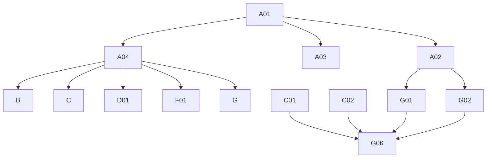

# Phase 4: Migration Plan & Stories — Search

> **Domain:** `search` · **Target DGS:** `SearchService` → separate `plm-elastic-search` subgraph
> **Pipeline Version:** 2.0 · **Generated:** 2026-06-27
> **Depends on:** [02-resolver-analysis.md](./02-resolver-analysis.md), [03-schema.graphql](./03-schema.graphql), [03-schema-analysis.md](./03-schema-analysis.md), [05-attribute-inventory.md](./05-attribute-inventory.md)
> **Index:** [04-stories-index.yaml](./04-stories-index.yaml)

Search has ~48 thin elastic-wrapper queries; per the bundling rule, the **Phase-C stories group queries by
search family** (each lists its operations). ACL is context-only. `search` is the read hub (its own subgraph).

## 1. Phases Overview
| Phase | Name | Stories |
|---|---|---|
| A | Foundation & Schema | A01–A04 |
| B | Core Reads (by-id / counts) | B01–B03 |
| C | Search & Listing (by family) | C01–C10 |
| D | Mutations | D01 |
| F | Federation & ownership | F01 |
| G | Result-type Field Resolvers & Tests | G01–G06 |

## 2. Dependency Graph


---

## 3. Stories

### Phase A — Foundation & Schema

### SPARK-SRCH-A01 · Schema skeleton + DateTime/JSON scalars
```yaml
{id: SPARK-SRCH-A01, operation: "-", type: schema, category: CAT-1, phase: A, complexity: Low, depends_on: [], ext_services: [], files: [plm-elastic-search/.../schema/search.graphqls, plm-elastic-search/.../config/ScalarConfig.kt], blocked_by: none}
```
**Current Behaviour:** green-field; schema translated from `code/schemas/SPARK_Search.txt`.
**Target:** federation v2.3 header, `scalar DateTime → Instant`, `scalar JSON`, empty `extend type Query`/`Mutation`. **Acceptance:** 1. `generateJava` passes. 2. scalars round-trip. **Tests:** ☐ compiles ☐ serde.

### SPARK-SRCH-A02 · Owned result types + inputs (the big surface)
```yaml
{id: SPARK-SRCH-A02, operation: "-", type: schema, category: CAT-1, phase: A, complexity: High, depends_on: [SPARK-SRCH-A01], ext_services: [], files: [plm-elastic-search/.../schema/search.graphqls], blocked_by: none}
```
**Target:** all ~50 owned result/value types (`SearchAttachment`, `Material`, `SearchCombination`,
`SearchPalette`, `SearchWatchlist`, `SearchComponent`, paged wrappers, report/group-by/suggestion shapes) +
~10 inputs per [03-schema.graphql](./03-schema.graphql). **Expand the `JSON` placeholders** to the concrete
SDL types. `@key` on the enriched result entities; `@shareable` on `Paging`/`CodeDescription`/etc. **This is
the single biggest task in the domain.** **Acceptance:** 1. every SDL type present; no stray `JSON` where the SDL has a concrete type. 2. validates. **Tests:** ☐ validates ☐ entity stubs.

### SPARK-SRCH-A03 · External stubs (platform + other DGS)
```yaml
{id: SPARK-SRCH-A03, operation: "-", type: schema, category: CAT-1, phase: A, complexity: Medium, depends_on: [SPARK-SRCH-A01], ext_services: [], files: [plm-elastic-search/.../schema/search.graphqls], blocked_by: none}
```
**Target:** `@extends @external` stubs for `Product(sPaged)`, `WorkspaceV2`, `Bom`, `SampleV2`, `Attachment`,
`UserProfileAttributes`, `UserGroup_Participants`, `Tag`, `TeamPaged`, template paged wrappers, `VMM_*`, `IG_*`. **Acceptance:** 1. compiles; gateway composes. **Tests:** ☐ compiles ☐ stub resolves.

### SPARK-SRCH-A04 · `SearchService` Kotlin port (plm-elastic-search)
```yaml
{id: SPARK-SRCH-A04, operation: "SearchService", type: service, category: CAT-3, phase: A, complexity: High, depends_on: [SPARK-SRCH-A01], ext_services: [], files: [plm-elastic-search/.../service/*SearchService.kt, plm-elastic-search/.../client/ElasticClient.kt], blocked_by: none}
```
**Current Behaviour (Phase 2 §Service):** ~80 elastic query-builder methods on the `plm-elastic-search` base.
**Target:** split into grouped services (`AttachmentSearch`, `MaterialSearch`, `SampleSearch`, `TeamSearch`,
`TemplateSearch`, `ProductSearch`, `SuggestionSearch`, `ReportSearch`); preserve each query-string/body shape
and `deepToCamelCase`. **Acceptance:** 1. each family's elastic query shape preserved. 2. proxy reads accept a token. **Tests:** ☐ query build per family ☐ camelCase.

---

### Phase B — Core Reads (by-id / counts)

### SPARK-SRCH-B01 · `searchMaterialsById(id)`
```yaml
{id: SPARK-SRCH-B01, operation: searchMaterialsById, type: query, category: CAT-2, phase: B, complexity: Low, depends_on: [SPARK-SRCH-A02, SPARK-SRCH-A04], ext_services: [], files: [plm-elastic-search/.../dataFetcher/MaterialSearchDataFetcher.kt], blocked_by: none}
```
**Current Behaviour:** (own) `getMaterialByIds.load(id)`. **Target:** `@DgsQuery → Material`. **Acceptance:** 1. returns material; miss→null. **Tests:** ☐ happy ☐ miss.

### SPARK-SRCH-B02 · `getElasticSamplesByIds(ids)`
```yaml
{id: SPARK-SRCH-B02, operation: getElasticSamplesByIds, type: query, category: CAT-2, phase: B, complexity: Low, depends_on: [SPARK-SRCH-A04], ext_services: [], files: [plm-elastic-search/.../dataFetcher/SampleSearchDataFetcher.kt], blocked_by: none}
```
**Current Behaviour:** (own) `getElasticSamplesByIds.load({ids})`. **Target:** `@DgsQuery → [SampleV2]`. **Acceptance:** 1. returns samples for ids. **Tests:** ☐ happy ☐ empty.

### SPARK-SRCH-B03 · `getAttachmentsCounts` + `getSampleCount`
```yaml
{id: SPARK-SRCH-B03, operation: "counts", type: query, category: CAT-2, phase: B, complexity: Low, depends_on: [SPARK-SRCH-A04], ext_services: [], files: [plm-elastic-search/.../dataFetcher/CountsDataFetcher.kt], blocked_by: none}
```
**Current Behaviour:** `getAttachmentsCounts(resourceIds)`; `getSampleCount(resourceId)` → `[ResourceCount]`. **Target:** `@DgsQuery`. **Acceptance:** 1. both return counts. **Tests:** ☐ attachment counts ☐ sample counts.

---

### Phase C — Search & Listing (grouped by family)

### SPARK-SRCH-C01 · `searchAttachments`
```yaml
{id: SPARK-SRCH-C01, operation: searchAttachments, type: query, category: CAT-2, phase: C, complexity: Medium, depends_on: [SPARK-SRCH-A04], ext_services: [], files: [plm-elastic-search/.../dataFetcher/AttachmentSearchDataFetcher.kt], blocked_by: none}
```
**Current Behaviour:** (own elastic) `searchAttachments({q,parentIds,relatedIds,partnerId,asset3D,proxyIds,page,size,sort})`. **Target:** `@DgsQuery → SearchAttachmentsPaged`. **Acceptance:** 1. all params forwarded; `sort=field,dir`. **Tests:** ☐ params ☐ paging ☐ parity.

### SPARK-SRCH-C02 · Material search family
```yaml
{id: SPARK-SRCH-C02, operation: "material-search", type: query, category: CAT-2, phase: C, complexity: High, depends_on: [SPARK-SRCH-A04], ext_services: [], files: [plm-elastic-search/.../dataFetcher/MaterialSearchDataFetcher.kt], blocked_by: none}
```
**Covers:** `searchMaterials`, `searchMaterialsV2`, `searchMaterialsNested`, `searchMaterialsByProxyIds` (ACL),
`multiRequestMaterialSearch`. **Current Behaviour:** build elastic bodies (V2 = query+sort+options+`searchArguments`
incl. RGB color criteria + nested filters) → post → `MaterialsPaged`. **Target:** one data fetcher per query over `MaterialSearch`. **Acceptance:** 1. each variant's body shape preserved (RGB/nested). 2. proxy variant tokens. **Tests:** ☐ V2 body ☐ nested ☐ proxy ☐ multiRequest.

### SPARK-SRCH-C03 · Sample search family
```yaml
{id: SPARK-SRCH-C03, operation: "sample-search", type: query, category: CAT-2, phase: C, complexity: High, depends_on: [SPARK-SRCH-A04], ext_services: [], files: [plm-elastic-search/.../dataFetcher/SampleSearchDataFetcher.kt], blocked_by: none}
```
**Covers:** `searchSamples`, `searchSamplesByParentId`, `getSamplesCountGroupBy` (→ `.samplesCount`),
`getMaterialSamplesGroupBy`, `getRequestedSamplesByUser`. **Target:** elastic sample queries + group-by aggregates. **Acceptance:** 1. each query/agg shape preserved. **Tests:** ☐ by-parent ☐ group-by ☐ requested-by-user.

### SPARK-SRCH-C04 · Team search family
```yaml
{id: SPARK-SRCH-C04, operation: "team-search", type: query, category: CAT-2, phase: C, complexity: Medium, depends_on: [SPARK-SRCH-A04], ext_services: [], files: [plm-elastic-search/.../dataFetcher/TeamSearchDataFetcher.kt], blocked_by: none}
```
**Covers:** `searchTeamsElastic`, `searchTeamsElasticResourceType`, `searchTeamsByProxyIds` (ACL),
`searchTeamsWithTypeCheck` (mvs/dps). **Acceptance:** 1. each query shape preserved. **Tests:** ☐ elastic ☐ type-check ☐ proxy.

### SPARK-SRCH-C05 · Template search family
```yaml
{id: SPARK-SRCH-C05, operation: "template-search", type: query, category: CAT-2, phase: C, complexity: Medium, depends_on: [SPARK-SRCH-A04], ext_services: [], files: [plm-elastic-search/.../dataFetcher/TemplateSearchDataFetcher.kt], blocked_by: none}
```
**Covers:** `searchMeasurementTemplates`, `searchSizeTemplates`, `searchProductDetailsTemplates`. **Acceptance:** 1. each returns its paged shape. **Tests:** ☐ each template.

### SPARK-SRCH-C06 · Product search family
```yaml
{id: SPARK-SRCH-C06, operation: "product-search", type: query, category: CAT-2, phase: C, complexity: Medium, depends_on: [SPARK-SRCH-A04], ext_services: [], files: [plm-elastic-search/.../dataFetcher/ProductSearchDataFetcher.kt], blocked_by: none}
```
**Covers:** `searchProductByField` (field-weight body), `getProductSuggestions` (SMP-prefix → sample-suggestion
branch), `getProductSuggestionsV1`, `getTemplateSuggestions`. **Note:** `searchProducts` is **schema-drift** (no
resolver — see F01). **Acceptance:** 1. field-weight body preserved. 2. SMP-prefix branch. **Tests:** ☐ by-field ☐ SMP branch.

### SPARK-SRCH-C07 · `searchCombinations` + `searchPalettes`
```yaml
{id: SPARK-SRCH-C07, operation: "combination-palette-search", type: query, category: CAT-2, phase: C, complexity: Low, depends_on: [SPARK-SRCH-A04], ext_services: [], files: [plm-elastic-search/.../dataFetcher/CombinationSearchDataFetcher.kt], blocked_by: none}
```
**Covers:** `searchCombinations`, `searchPalettes`. **Acceptance:** 1. paged results. **Tests:** ☐ combinations ☐ palettes.

### SPARK-SRCH-C08 · `searchWatchlist` + `searchClaimsByProxyIds` + `searchRfidLocations`
```yaml
{id: SPARK-SRCH-C08, operation: "misc-search", type: query, category: CAT-2, phase: C, complexity: Low, depends_on: [SPARK-SRCH-A04], ext_services: [], files: [plm-elastic-search/.../dataFetcher/MiscSearchDataFetcher.kt], blocked_by: none}
```
**Covers:** `searchWatchlist`, `searchClaimsByProxyIds` (ACL), `searchRfidLocations`. **Acceptance:** 1. each paged result; proxy token on claims. **Tests:** ☐ watchlist ☐ claims-proxy ☐ rfid.

### SPARK-SRCH-C09 · Suggestions family
```yaml
{id: SPARK-SRCH-C09, operation: "suggestions", type: query, category: CAT-2, phase: C, complexity: Medium, depends_on: [SPARK-SRCH-A04], ext_services: [], files: [plm-elastic-search/.../dataFetcher/SuggestionDataFetcher.kt], blocked_by: none}
```
**Covers:** `searchSuggestions(type)`, `searchRfidSuggestions`, `searchPointOfMeasureSuggestions`,
`searchCombinationSuggestions`, `searchPaletteSuggestions`, `searchMeasurementTemplatesSuggestions`,
`searchSizeTemplatesSuggestions`, `getProductDetailsTemplateSuggestions`. **Ownership to confirm (F01):**
`searchSPGSuggestions`/`searchUsersSuggestions`/`searchTeamsSuggestions` (no resolver in snapshot);
`searchWorkspaceSuggestions`/`searchWorkspaceProductsSuggestions` (resolved in workspace). **Current Behaviour:** thin elastic suggestion wrappers → `[Suggestion]`. **Acceptance:** 1. each wrapper returns suggestions; `searchSuggestions` honors `type`. **Tests:** ☐ generic+type ☐ each specific ☐ ownership confirmed.

### SPARK-SRCH-C10 · Reports
```yaml
{id: SPARK-SRCH-C10, operation: "reports", type: query, category: CAT-2, phase: C, complexity: Medium, depends_on: [SPARK-SRCH-A04], ext_services: [], files: [plm-elastic-search/.../dataFetcher/ReportSearchDataFetcher.kt], blocked_by: none}
```
**Covers:** `getConnectedBOMs` (query via `getQueryForConnectedBOMSearch(filter)`), `getProductReport`,
`getProductWorkspaceMetricsReportCount`. **Acceptance:** 1. each report aggregate preserved. **Tests:** ☐ connected-boms ☐ product-report.

---

### Phase D — Mutations

### SPARK-SRCH-D01 · `sendBulkCombinationUpdates`
```yaml
{id: SPARK-SRCH-D01, operation: sendBulkCombinationUpdates, type: mutation, category: CAT-2, phase: D, complexity: Low, depends_on: [SPARK-SRCH-A04], ext_services: [], files: [plm-elastic-search/.../dataFetcher/SearchMutationDataFetcher.kt], blocked_by: none}
```
**Current Behaviour:** (own) `sendBulkCombinationUpdates(combinationUpdates)` → `{requestId}`. **Target:** `@DgsMutation → BulkCombination`. **Acceptance:** 1. returns request id. **Tests:** ☐ bulk update.

---

### Phase F — Federation & ownership

### SPARK-SRCH-F01 · Gateway composition + ownership reconciliation
```yaml
{id: SPARK-SRCH-F01, operation: "gateway-compose+ownership", type: schema, category: CAT-4, phase: F, complexity: Medium, depends_on: [SPARK-SRCH-A04], ext_services: [], files: [gateway/supergraph-config, plm-elastic-search/.../schema/search.graphqls], blocked_by: none}
```
**Target:** add `plm-elastic-search` to the supergraph; **reconcile drift/ownership**: `searchProducts`
(no resolver — delete or implement) vs `searchProductsES` (add to SDL or drop); decide owner for
`searchSPGSuggestions`/`searchUsersSuggestions`/`searchTeamsSuggestions` (no resolver) and
`searchWorkspaceSuggestions`/`searchWorkspaceProductsSuggestions` (resolved in workspace). Sequence the
read-hub cutover so dependents' `search` calls resolve. **Acceptance:** 1. supergraph composes. 2. each drift/cross-file op has an owner + decision. **Tests:** ☐ compose ☐ ownership matrix.

---

### Phase G — Result-type Field Resolvers & Tests

### SPARK-SRCH-G01 · `SearchAttachment` enrichment
```yaml
{id: SPARK-SRCH-G01, operation: "SearchAttachment.*", type: field-resolver, category: CAT-2, phase: G, complexity: High, depends_on: [SPARK-SRCH-A02, SPARK-SRCH-A04], ext_services: [{key: product, severity: YELLOW}, {key: workspaceV2, severity: YELLOW}, {key: attachment, severity: YELLOW}, {key: userAttributes, severity: YELLOW}], files: [plm-elastic-search/.../dataFetcher/SearchAttachmentFieldDataFetcher.kt], blocked_by: none}
```
**Current Behaviour (~13 fields):** `createdBy`/`updatedBy` (🟡 user), `tags` (delegates Attachment),
`relatedProduct` (🟡 product, PID-prefix), `relatedWorkspace` (🟡 workspace, WRK-prefix),
`currentUserFileAccess` (accessControl), `renders`/`gallery`/`modelFile` (🟡 attachment, gated),
`productPacketProps`/`canOpenInShowDog`/`finalVirtualFile` (snake/camel coalesce). **Acceptance:** 1. each field resolves; prefix gates + coalesces preserved. **Tests:** ☐ relatedProduct/Workspace ☐ renders gate ☐ coalesce.

### SPARK-SRCH-G02 · `Material` enrichment (incl. `colorLinks`)
```yaml
{id: SPARK-SRCH-G02, operation: "Material.*", type: field-resolver, category: CAT-2, phase: G, complexity: High, depends_on: [SPARK-SRCH-A02, SPARK-SRCH-A04], ext_services: [{key: vmm, severity: BLUE}, {key: fabric, severity: BLUE}, {key: color, severity: BLUE}, {key: tag, severity: BLUE}], files: [plm-elastic-search/.../dataFetcher/MaterialFieldDataFetcher.kt], blocked_by: none}
```
**Current Behaviour (~18 fields):** `supplierName`/`businessPartners`/`droppedPartnerIds`/`teams` (🔵 vmm),
`permissions` (accessControl), `claims` (🔵 fabric), `tags` (🔵 tag), `attachments` (own elastic),
`createdBy` (🟡 user), `baseMaterial`/`referenceId`/`impressionIntent`/`is3D`/`trimSuppliers` (computed),
`colorLinks` (🔵 color, **12-prefix gate**). **Acceptance:** 1. each field resolves; colorLinks prefix table exact. **Tests:** ☐ supplier ☐ claims ☐ colorLinks gate ☐ computed.

### SPARK-SRCH-G03 · `SearchCombination` + `SearchPalette` field resolvers
```yaml
{id: SPARK-SRCH-G03, operation: "Combination+Palette.*", type: field-resolver, category: CAT-2, phase: G, complexity: Medium, depends_on: [SPARK-SRCH-A04], ext_services: [{key: brand, severity: BLUE}, {key: ig, severity: BLUE}, {key: tag, severity: BLUE}, {key: vmm, severity: BLUE}], files: [plm-elastic-search/.../dataFetcher/CombinationFieldDataFetcher.kt], blocked_by: none}
```
**Current Behaviour:** brands (🔵 brand), business/dropped partners (🔵 vmm), department/division (🔵 ig),
designCycles/materialCategory/tags (🔵 tag), `fabricSpec` (🔵 fabric); palette: brands/tags/designCycles/departments/partners. **Acceptance:** 1. each resolves; empty → []. **Tests:** ☐ combination ☐ palette.

### SPARK-SRCH-G04 · `SearchWatchlist` + `SearchComponent` field resolvers
```yaml
{id: SPARK-SRCH-G04, operation: "Watchlist+Component.*", type: field-resolver, category: CAT-2, phase: G, complexity: Medium, depends_on: [SPARK-SRCH-A04], ext_services: [{key: product, severity: YELLOW}, {key: workspaceV2, severity: YELLOW}, {key: bom, severity: YELLOW}, {key: userGroup, severity: BLUE}], files: [plm-elastic-search/.../dataFetcher/WatchlistComponentFieldDataFetcher.kt], blocked_by: none}
```
**Current Behaviour:** Watchlist: businessPartners (🔵 vmm), created/updatedBy (🟡 user), attachments (own),
workspaces (🟡 workspace), participantDetails (🔵 userGroup), product (🟡 product, PID); Component:
created/updatedBy (🟡 user), workspaces (🟡 workspace), materials (🟡 bom, BOM/PKGBOM/PRDBOM prefix). **Acceptance:** 1. each resolves; prefix gates preserved. **Tests:** ☐ watchlist ☐ component materials.

### SPARK-SRCH-G05 · Access + report-group + paging field resolvers
```yaml
{id: SPARK-SRCH-G05, operation: "access+report+paging", type: field-resolver, category: CAT-2, phase: G, complexity: Medium, depends_on: [SPARK-SRCH-A04], ext_services: [{key: vmm, severity: BLUE}, {key: ig, severity: BLUE}, {key: userAttributes, severity: YELLOW}], files: [plm-elastic-search/.../dataFetcher/SearchMiscFieldDataFetcher.kt], blocked_by: none}
```
**Current Behaviour:** `SearchAttachmentAccess.bps` (union)/`partnerNamesMap` (🔵 vmm);
`ConnectedBOMGroup.groupBy` (🔵 ig division name)/`…GroupResult.designCycle` (🔵 tag);
`Requested_Evaluated_Samples_By_User.user` (🟡 user); `SearchProductDivision/DepartmentCount` (🔵 ig);
paged-type `paging`/`counts` (computed; `MaterialsPaged.counts` → `getCounts`). **Acceptance:** 1. each resolves. **Tests:** ☐ access ☐ report groups ☐ paging.

### SPARK-SRCH-G06 · Tests, parity harness, schema-conformance CI
```yaml
{id: SPARK-SRCH-G06, operation: "tests", type: tests, category: CAT-5, phase: G, complexity: High, depends_on: [SPARK-SRCH-C01, SPARK-SRCH-C02, SPARK-SRCH-G01, SPARK-SRCH-G02], files: [plm-elastic-search/.../test/*.kt], blocked_by: none}
```
**Target:** ≥80% unit coverage; parity harness across the search families + enriched result types; **schema-
conformance CI** (every SDL type present, no stray placeholders); load test p95 for `searchAttachments`/
material/sample search. **Acceptance:** 1. unit ≥80%. 2. parity green. 3. schema-conformance passes. 4. load p95 parity. **Tests:** ☐ parity ☐ conformance ☐ load.

---

## 4. Risk Register
| Risk | Likelihood | Impact | Mitigation | Owner |
|------|-----------|--------|------------|-------|
| Type-surface breadth under-scoped (A02) | High | Medium | Expand all SDL types; conformance CI (G06) | Architect |
| Enrichment field resolvers fan-out (G01/G02) | Medium | Medium | DataLoader batching; cache platform lookups | Backend Eng |
| Ownership drift (searchProducts/ES, *Suggestions) (F01) | Medium | Medium | Reconcile before exposing | Architect |
| Read-hub cutover coordination | High | High | Migrate early or dual-run; sequence dependents | Tech Lead + Platform |

## 5. Summary
- **Stories:** 25 (A:4 · B:3 · C:10 · D:1 · F:1 · G:6) covering ~48 queries + 1 mutation (Phase-C grouped by family).
- **Critical path:** A01→A02/A04→C01/C02→G01/G02→G06.
- **Highest cost:** the type surface (A02) + enrichment field resolvers (G01/G02); not orchestration.
- **Read hub:** every product-family domain's `search` calls resolve against this subgraph — sequence the cutover.

---
**Phase Completed:** Phase 4 — Migration Stories · **Domain:** `search` · **Outputs:** 04-stories.md, 04-stories-index.yaml, 04-po-summary.md.
