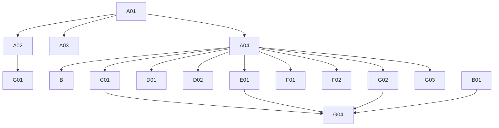

# Phase 4: Migration Plan & Stories — Watchlist

> **Domain:** `watchlist` · **Target DGS:** `WatchlistService` → `plm-product`
> **Pipeline Version:** 2.0 · **Generated:** 2026-06-27
> **Depends on:** [02-resolver-analysis.md](./02-resolver-analysis.md), [03-schema.graphql](./03-schema.graphql), [03-schema-analysis.md](./03-schema-analysis.md), [05-attribute-inventory.md](./05-attribute-inventory.md)
> **Index:** [04-stories-index.yaml](./04-stories-index.yaml)

Each story is self-contained. Full pseudo-logic in [02-resolver-analysis.md](./02-resolver-analysis.md).
**ACL is context-only** — no ACL work in any story. Base path `watchlist/v1`. **Co-located in plm-product.**

## 1. Phases Overview
| Phase | Name | Stories |
|---|---|---|
| A | Foundation & Schema | A01–A04 |
| B | Core Reads | B01–B03 |
| C | Search & Listing | C01 |
| D | Mutations (simple) | D01–D02 |
| E | Complex (multi-step write) | E01 |
| F | Federation (internal) | F01–F02 |
| G | Field Resolvers & Tests | G01–G04 |

## 2. Dependency Graph


---

## 3. Stories

### Phase A — Foundation & Schema

### SPARK-WL-A01 · Schema skeleton + DateTime scalar
```yaml
{id: SPARK-WL-A01, operation: "-", type: schema, category: CAT-1, phase: A, complexity: Low, depends_on: [], ext_services: [], files: [plm-product/.../schema/watchlist.graphqls, plm-product/.../config/ScalarConfig.kt], blocked_by: none}
```
**Current Behaviour:** green-field; schema translated from `code/schemas/SPARK_Watchlist.txt`.
**Target:** federation v2.3 header, `scalar DateTime → Instant`, empty `extend type Query`/`Mutation`.
**Acceptance:** 1. `./gradlew generateJava` passes. 2. `DateTime` round-trips. **Tests:** ☐ compiles ☐ scalar serde.

### SPARK-WL-A02 · Owned types + inputs
```yaml
{id: SPARK-WL-A02, operation: "-", type: schema, category: CAT-1, phase: A, complexity: Medium, depends_on: [SPARK-WL-A01], ext_services: [], files: [plm-product/.../schema/watchlist.graphqls], blocked_by: none}
```
**Target:** `Watchlist` (`@key(fields:"humanId")`), `WatchlistInspection`, `WatchlistInspectionAction`,
`WatchlistPartner`, the 4 inputs, `@shareable CodeDescription` — per [03-schema.graphql](./03-schema.graphql).
**Acceptance:** 1. all types+inputs present; `@key=humanId`; nullability matches SDL. 2. validates. **Tests:** ☐ validates ☐ entity stub.

### SPARK-WL-A03 · External stubs (platform + sibling DGS)
```yaml
{id: SPARK-WL-A03, operation: "-", type: schema, category: CAT-1, phase: A, complexity: Low, depends_on: [SPARK-WL-A01], ext_services: [], files: [plm-product/.../schema/watchlist.graphqls], blocked_by: none}
```
**Target:** stubs `Attachment`, `SearchAttachment`, `WorkspaceV2`, `UserProfileAttributes`,
`UserGroup_Participants`, `VMM_BusinessPartner` + internal placeholder `Product`. **Acceptance:** 1. compiles; gateway composes. **Tests:** ☐ compiles ☐ stub resolves.

### SPARK-WL-A04 · `WatchlistService` Kotlin port (watchlist/v1)
```yaml
{id: SPARK-WL-A04, operation: "WatchlistService", type: service, category: CAT-3, phase: A, complexity: Medium, depends_on: [SPARK-WL-A01], ext_services: [], files: [plm-product/.../service/WatchlistService.kt, plm-product/.../client/*Client.kt, plm-product/.../model/*Dto.kt], blocked_by: none}
```
**Current Behaviour (Phase 2 §Service):** 7 REST methods on `watchlist/v1` (2 unused: versions).
**Target:** Kotlin service; preserve create/update throw-on-error; snake/camel at the Feign boundary. **Acceptance:** 1. used methods present (GET `?watchlistIds=`, `/watchlist_reasons`, `/watchlist_inspection_action_types`, POST, PUT). 2. create/update throw on validation error. **Tests:** ☐ endpoint build ☐ error contracts.

---

### Phase B — Core Reads

### SPARK-WL-B01 · `getWatchlistByIds(ids)`
```yaml
{id: SPARK-WL-B01, operation: getWatchlistByIds, type: query, category: CAT-2, phase: B, complexity: Low, depends_on: [SPARK-WL-A02, SPARK-WL-A04], ext_services: [], files: [plm-product/.../dataFetcher/WatchlistQueryDataFetcher.kt], blocked_by: none}
```
**Current Behaviour (Q1):** (ACL context) token → `GET watchlist/v1?watchlistIds={csv}` → camelCase. **Target:** `@DgsQuery → [Watchlist]`. **Acceptance:** 1. returns entries for ids; empty → []. **Tests:** ☐ happy ☐ empty.

### SPARK-WL-B02 · `getWatchlistReasons` (cacheable)
```yaml
{id: SPARK-WL-B02, operation: getWatchlistReasons, type: query, category: CAT-2, phase: B, complexity: Low, depends_on: [SPARK-WL-A04], ext_services: [], files: [plm-product/.../dataFetcher/WatchlistQueryDataFetcher.kt], blocked_by: none}
```
**Current Behaviour (Q2):** (own) `GET watchlist/v1/watchlist_reasons`. **Target:** `@DgsQuery` → `@Cacheable` → `[CodeDescription]`. **Acceptance:** 1. returns reasons; cached. **Tests:** ☐ list ☐ cache hit.

### SPARK-WL-B03 · `getWatchlistInspectionActions` (cacheable)
```yaml
{id: SPARK-WL-B03, operation: getWatchlistInspectionActions, type: query, category: CAT-2, phase: B, complexity: Low, depends_on: [SPARK-WL-A04], ext_services: [], files: [plm-product/.../dataFetcher/WatchlistQueryDataFetcher.kt], blocked_by: none}
```
**Current Behaviour (Q3):** (own) `GET watchlist/v1/watchlist_inspection_action_types`. **Target:** `@DgsQuery` → `@Cacheable` → `[WatchlistInspectionAction]`. **Acceptance:** 1. returns actions; cached. **Tests:** ☐ list ☐ cache hit.

---

### Phase C — Search & Listing

### SPARK-WL-C01 · `getWatchlistByFilter(...)` (4-step read)
```yaml
{id: SPARK-WL-C01, operation: getWatchlistByFilter, type: query, category: CAT-2, phase: C, complexity: Medium, depends_on: [SPARK-WL-A04], ext_services: [{key: search, severity: RED}, {key: product, severity: YELLOW}], files: [plm-product/.../dataFetcher/WatchlistQueryDataFetcher.kt], blocked_by: none}
```
**Current Behaviour (Q4):** (internal) `product.getWorkspaceProducts({q,filter,workspaceId,page,size})` →
product `humanId`s → (🔴 search) `searchWatchlist({ q:"parentId:(... OR ...) AND workspaceContext: {workspaceId} AND statusId: 501", page, size })` → watchlist ids → (ACL) token → (own) `getWatchlistByIds`.
**EXT:** 🔴 search · product internal. **Target:** `@DgsQuery → [Watchlist]`; chain the 4 calls.
**Acceptance:** 1. product→search→watchlist chain preserved. 2. elastic query string exact (incl. `statusId: 501`). **Tests:** ☐ chain ☐ query build ☐ parity.

---

### Phase D — Mutations (simple)

### SPARK-WL-D01 · `createWatchlistEntries`
```yaml
{id: SPARK-WL-D01, operation: createWatchlistEntries, type: mutation, category: CAT-2, phase: D, complexity: Medium, depends_on: [SPARK-WL-A04], ext_services: [{key: userGroup, severity: BLUE}], files: [plm-product/.../dataFetcher/WatchlistMutationDataFetcher.kt], blocked_by: none}
```
**Current Behaviour (M1):** `Promise.all(entries.map(w => { (own) createWatchlistEntries([w]); **throw on validationErrors/message**; then (🔵 user-group) addUserGroup({resourceId:humanId, participantDetails, relatedResources}); **throw on error** }))`, flatten. **EXT:** 🔵 user-group. **Target:** per-entry create + user-group; port both throw contracts. **Acceptance:** 1. creates each entry + its user group. 2. either failure → exception. **Tests:** ☐ create ☐ user-group ☐ validation-error→throw.

### SPARK-WL-D02 · `cloneFilesForWatchlist`
```yaml
{id: SPARK-WL-D02, operation: cloneFilesForWatchlist, type: mutation, category: CAT-2, phase: D, complexity: Medium, depends_on: [SPARK-WL-A04], ext_services: [{key: attachment, severity: RED}], files: [plm-product/.../dataFetcher/WatchlistMutationDataFetcher.kt], blocked_by: none}
```
**Current Behaviour (M3):** (ACL) token → `Promise.all(attachmentIds.map((id,i) => (🔴 attachment) cloneAttachmentV3({cloneReferences:[cloneReference[i]]}, id)))`, stamp `parentResource=id`, flatten. **EXT:** 🔴 attachment. **Target:** structured-concurrency fan-out. **Acceptance:** 1. clones each id with its paired cloneReference; `parentResource` stamped. **Tests:** ☐ clone ☐ pairing ☐ parity.

---

### Phase E — Complex Operations

### SPARK-WL-E01 · `updateWatchlistEntries` (multi-step write)
```yaml
{id: SPARK-WL-E01, operation: updateWatchlistEntries, type: mutation, category: CAT-2, phase: E, complexity: High, depends_on: [SPARK-WL-A04], ext_services: [{key: attachment, severity: RED}, {key: userGroup, severity: BLUE}], files: [plm-product/.../service/WatchlistUpdateService.kt], blocked_by: none}
```
**As a** DGS engineer **I want** the multi-step watchlist update with correct ordering + a failure strategy
**so that** user-group, body, and attachment changes stay consistent.
**Current Behaviour (M2):** 1) **per-entry (currently NOT awaited — bug):** `getUserGroups([humanId])`; if
existing participants → `updateUserGroup`, else (🔵 user-group) `addUserGroup` (throw on error);
2) (own) `updateWatchlistEntries(entries)` (throw on error); 3) collect `removedAttachmentIds` → (ACL)
token → (🔴 attachment) `archiveAttachmentBulkV3`. **No rollback.**
**EXT:** 🔴 attachment · 🔵 user-group. **Target:** **await** the per-entry user-group upserts (fix the race)
before/with the body update; chosen failure strategy (**PO decision**). **Acceptance:** 1. user-group upserts complete before the watchlist update (race fixed). 2. removed attachments archived. 3. partial-failure strategy. **Tests:** ☐ existing-participants path ☐ new-participants path ☐ attachment archive ☐ ordering/await ☐ partial-failure ☐ parity.

---

### Phase F — Federation (internal, same subgraph)

### SPARK-WL-F01 · `Product.watchlists` (internal)
```yaml
{id: SPARK-WL-F01, operation: "Product.watchlists", type: field-resolver, category: CAT-2, phase: F, complexity: Low, depends_on: [SPARK-WL-A04], ext_services: [], files: [plm-product/.../dataFetcher/ProductWatchlistsFieldDataFetcher.kt], blocked_by: none}
```
**Current Behaviour:** Product exposes `watchlists` resolved from the co-located watchlist service. **Target:** **internal** `@DgsData` on `Product` calling `WatchlistService` in-process (not gateway federation). **Acceptance:** 1. resolves in-process; no gateway hop. **Tests:** ☐ resolves ☐ parity.

### SPARK-WL-F02 · `ResourcesCount.watchlists` (internal — TechPack)
```yaml
{id: SPARK-WL-F02, operation: "ResourcesCount.watchlists", type: field-resolver, category: CAT-2, phase: F, complexity: Low, depends_on: [SPARK-WL-A04], ext_services: [], files: [plm-product/.../dataFetcher/ResourcesCountWatchlistsFieldDataFetcher.kt], blocked_by: none}
```
**Target:** fill the TechPack `ResourcesCount.watchlists` count **internally** (same subgraph) — the
watchlist side of product's `SPARK-PROD-F08`. **This is CAT-2 internal, not gateway federation** (watchlist
is co-located; analogous to `SPARK-BOM-F06` / `SPARK-MEAS-F04`). **Acceptance:** 1. count resolves in-process; parity vs the TechPack facade. **Tests:** ☐ count ☐ parity.

---

### Phase G — Field Resolvers & Tests

### SPARK-WL-G01 · Computed flatteners (status/reasons/inspection action)
```yaml
{id: SPARK-WL-G01, operation: "Watchlist.computed", type: field-resolver, category: CAT-2, phase: G, complexity: Low, depends_on: [SPARK-WL-A02], ext_services: [], files: [plm-product/.../dataFetcher/WatchlistComputedFieldDataFetcher.kt], blocked_by: none}
```
**Current Behaviour:** `statusId`=`status.code`, `statusName`=`status.description`, `reasonIds`=`reasons[].code`,
`reasons`=`reasons[].description`; `WatchlistInspection.actionId`=`action.code`, `action`=`action.description`. **Target:** computed `@DgsData` (no I/O). **Acceptance:** 1. each flattener maps correctly. **Tests:** ☐ status ☐ reasons ☐ inspection action.

### SPARK-WL-G02 · `createdBy` + `updatedBy` + `workspaces` + `participantDetails` + `partnerName`
```yaml
{id: SPARK-WL-G02, operation: "Watchlist.refs", type: field-resolver, category: CAT-2, phase: G, complexity: Medium, depends_on: [SPARK-WL-A04], ext_services: [{key: userAttributes, severity: YELLOW}, {key: workspaceV2, severity: YELLOW}, {key: userGroup, severity: BLUE}, {key: vmm, severity: BLUE}], files: [plm-product/.../dataFetcher/WatchlistRefFieldDataFetcher.kt], blocked_by: none}
```
**Current Behaviour:** `createdBy`/`updatedBy` (🟡 user-profile); `workspaces` (🟡 workspaceV2 by
`workspaceContext`); `participantDetails` (🔵 user-group `getUserGroups([humanId])[0].participantDetails`);
`WatchlistPartner.partnerName` (🔵 vmm `getByID(partnerId).bpName`, null-safe). **Acceptance:** 1. each resolves; null-safe. **Tests:** ☐ users ☐ workspaces ☐ participants ☐ partnerName.

### SPARK-WL-G03 · `attachments` + `product`
```yaml
{id: SPARK-WL-G03, operation: "Watchlist.attachments+product", type: field-resolver, category: CAT-2, phase: G, complexity: Medium, depends_on: [SPARK-WL-A04], ext_services: [{key: search, severity: RED}], files: [plm-product/.../dataFetcher/WatchlistAttachmentFieldDataFetcher.kt], blocked_by: none}
```
**Current Behaviour:** `attachments` → (🔴 search) `searchAttachmentsByRelatedResource(humanId)`; `product`
(internal, only if `parentId` starts `'PID'`). **Acceptance:** 1. attachments via elastic. 2. `product` null when not `PID*`. **Tests:** ☐ attachments ☐ product branch.

### SPARK-WL-G04 · Tests, parity harness
```yaml
{id: SPARK-WL-G04, operation: "tests", type: tests, category: CAT-5, phase: G, complexity: Medium, depends_on: [SPARK-WL-B01, SPARK-WL-C01, SPARK-WL-E01, SPARK-WL-G02], files: [plm-product/.../test/*.kt], blocked_by: none}
```
**Target:** ≥80% unit coverage; parity fixtures (incl. `getWatchlistByFilter` chain, the multi-step
`updateWatchlistEntries` with the await fix, create+user-group, computed flatteners); contract test (schema
diff intentional-only). **Acceptance:** 1. unit ≥80%. 2. parity green. 3. schema-diff intentional. **Tests:** ☐ parity ☐ contract.

---

## 4. Risk Register
| Risk | Likelihood | Impact | Mitigation | Owner |
|------|-----------|--------|------------|-------|
| `updateWatchlistEntries` un-awaited user-group map (race) (E01) | Medium | Medium-High | Await/`Promise.all`; failure strategy | Backend Eng + Tech Lead |
| `updateWatchlistEntries` multi-step partial failure (E01) | Medium | Medium | Saga / compensation — PO decision | Tech Lead + PO |
| `getWatchlistByFilter` 4-step chain perf (C01) | Low | Medium | Cache product lookup; paginate | Backend Eng |
| Product `SPARK-PROD-F08` mislabel (corrected to internal) | — | Low | F08 reclassified CAT-2 internal | Architect |

## 5. Summary
- **Stories:** 17 (A:4 · B:3 · C:1 · D:2 · E:1 · F:2 · G:4).
- **Critical path:** A01→A02/A04→C01→E01→G02→G04.
- **Highest risk:** `updateWatchlistEntries` (E01) — multi-step + un-awaited user-group map.
- **Co-located:** watchlist is in the `plm-product` monorepo; `Product.watchlists` + TechPack count resolve internally.

---
**Phase Completed:** Phase 4 — Migration Stories · **Domain:** `watchlist` · **Outputs:** 04-stories.md, 04-stories-index.yaml, 04-po-summary.md.
