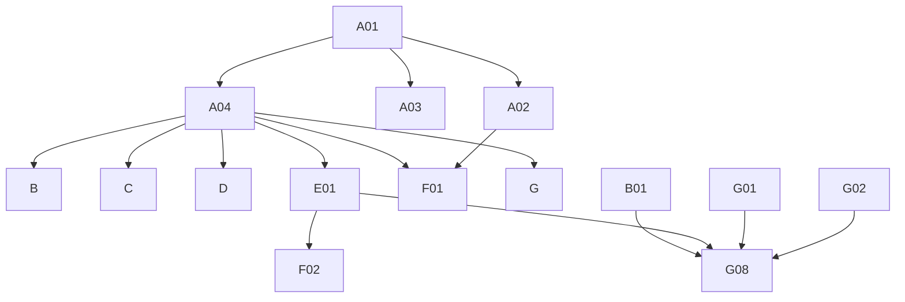

# Phase 4: Migration Plan & Stories — Workspace

> **Domain:** `workspace` · **Target DGS:** `WorkspaceServiceV2` → separate `plm-workspace` subgraph
> **Pipeline Version:** 2.0 · **Generated:** 2026-06-27
> **Depends on:** [02-resolver-analysis.md](./02-resolver-analysis.md), [03-schema.graphql](./03-schema.graphql), [03-schema-analysis.md](./03-schema-analysis.md), [05-attribute-inventory.md](./05-attribute-inventory.md)
> **Index:** [04-stories-index.yaml](./04-stories-index.yaml)

Each story is self-contained. Full pseudo-logic in [02-resolver-analysis.md](./02-resolver-analysis.md).
**ACL is context-only**, but the drop/undrop **resource bookkeeping** in E01 IS build work. `workspace` is
its **own subgraph** (Product/search/etc. are cross-subgraph).

## 1. Phases Overview
| Phase | Name | Stories |
|---|---|---|
| A | Foundation & Schema | A01–A04 |
| B | Core Reads | B01–B06 |
| C | Search & Listing | C01–C02 |
| D | Mutations (simple) | D01–D09 |
| E | Complex (partner-action dispatcher) | E01 |
| F | Federation & decisions | F01–F02 |
| G | Field Resolvers & Tests | G01–G08 |

## 2. Dependency Graph


---

## 3. Stories

### Phase A — Foundation & Schema

### SPARK-WS-A01 · Schema skeleton + DateTime/JsonNode scalars
```yaml
{id: SPARK-WS-A01, operation: "-", type: schema, category: CAT-1, phase: A, complexity: Low, depends_on: [], ext_services: [], files: [plm-workspace/.../schema/workspace.graphqls, plm-workspace/.../config/ScalarConfig.kt], blocked_by: none}
```
**Current Behaviour:** green-field; schema translated from `code/schemas/SPARK_WorkspaceV2.txt`.
**Target:** federation v2.3 header, `scalar DateTime → Instant`, `scalar JsonNode`, empty `extend type Query`/`Mutation`. **Acceptance:** 1. `generateJava` passes. 2. scalars round-trip. **Tests:** ☐ compiles ☐ serde.

### SPARK-WS-A02 · Owned types + inputs
```yaml
{id: SPARK-WS-A02, operation: "-", type: schema, category: CAT-1, phase: A, complexity: Medium, depends_on: [SPARK-WS-A01], ext_services: [], files: [plm-workspace/.../schema/workspace.graphqls], blocked_by: none}
```
**Target:** `WorkspaceV2` (`@key(fields:"id")`) + ~13 value types + ~10 inputs per [03-schema.graphql](./03-schema.graphql); `@shareable` on `CodeDescription`/`Paging`/`Pageable`/`ResourceCount`; carry `@deprecated`. **Acceptance:** 1. all types/inputs present; nullability matches SDL. 2. validates. **Tests:** ☐ validates ☐ entity stub.

### SPARK-WS-A03 · External stubs (platform + other DGS)
```yaml
{id: SPARK-WS-A03, operation: "-", type: schema, category: CAT-1, phase: A, complexity: Low, depends_on: [SPARK-WS-A01], ext_services: [], files: [plm-workspace/.../schema/workspace.graphqls], blocked_by: none}
```
**Target:** `@extends @external` stubs for `Product`/`ProductsPaged`, `Claims`, `CombinationSourcePaged`,
`Attachment`/`SearchAttachment(sPaged)`, `DiscussionPaged`/`DiscussionElastic`, `TeamPaged`,
`UserProfileAttributes`, `ResourcePermissions`, `ResourceMapping`, `Tag`, `Status`, `VMM_*`, `IG_*`. **Acceptance:** 1. compiles; gateway composes. **Tests:** ☐ compiles ☐ stub resolves.

### SPARK-WS-A04 · `WorkspaceServiceV2` Kotlin port (plm-workspace)
```yaml
{id: SPARK-WS-A04, operation: "WorkspaceServiceV2", type: service, category: CAT-3, phase: A, complexity: Medium, depends_on: [SPARK-WS-A01], ext_services: [], files: [plm-workspace/.../service/WorkspaceService.kt, plm-workspace/.../client/*Client.kt, plm-workspace/.../model/*Dto.kt], blocked_by: none}
```
**Current Behaviour (Phase 2 §Service):** 13 REST methods on the `plm-workspace` base.
**Target:** Kotlin service; preserve the create/update **dup-check** throw and `changeWorkspace` throw-on-error; default `workspaceType=103`. **Acceptance:** 1. methods present (CRUD, resources/teams bulk, change_resource, drop/undrop). 2. dup-check throws. **Tests:** ☐ endpoint build ☐ dup-check ☐ change throw.

---

### Phase B — Core Reads

### SPARK-WS-B01 · `getWorkspaceV2(id, metric)`
```yaml
{id: SPARK-WS-B01, operation: getWorkspaceV2, type: query, category: CAT-2, phase: B, complexity: Low, depends_on: [SPARK-WS-A02, SPARK-WS-A04], ext_services: [], files: [plm-workspace/.../dataFetcher/WorkspaceQueryDataFetcher.kt], blocked_by: none}
```
**Current Behaviour (Q1):** (own) `getWorkspaceByIdV2.load(id)` `GET {base}?ids={id}`. **Target:** `@DgsQuery → WorkspaceV2`. **Acceptance:** 1. returns workspace; miss→null. **Tests:** ☐ happy ☐ miss.

### SPARK-WS-B02 · `getWorkspacesByIdsV2(ids)`
```yaml
{id: SPARK-WS-B02, operation: getWorkspacesByIdsV2, type: query, category: CAT-2, phase: B, complexity: Low, depends_on: [SPARK-WS-A02, SPARK-WS-A04], ext_services: [], files: [plm-workspace/.../dataFetcher/WorkspaceQueryDataFetcher.kt], blocked_by: none}
```
**Current Behaviour (Q2):** (ACL) token → (own) `getWorkspacesByIdsV2(jwt).load({ids})`. **Target:** `@DgsQuery → [WorkspaceV2]`. **Acceptance:** 1. returns list for ids. **Tests:** ☐ happy ☐ empty.

### SPARK-WS-B03 · `getWorkspaceTypeCount`
```yaml
{id: SPARK-WS-B03, operation: getWorkspaceTypeCount, type: query, category: CAT-2, phase: B, complexity: Low, depends_on: [SPARK-WS-A04], ext_services: [{key: search, severity: RED}], files: [plm-workspace/.../dataFetcher/WorkspaceQueryDataFetcher.kt], blocked_by: none}
```
**Current Behaviour (Q7):** (🔴 search) `getWorkspaceTypeCount({})`. **Target:** `@DgsQuery → WorkspaceTypeCount`. **Acceptance:** 1. returns products/combinations/research counts. **Tests:** ☐ counts.

### SPARK-WS-B04 · `findWorkspaceProductAndSampleIds(workspaceId, q, filter)`
```yaml
{id: SPARK-WS-B04, operation: findWorkspaceProductAndSampleIds, type: query, category: CAT-2, phase: B, complexity: Medium, depends_on: [SPARK-WS-A04], ext_services: [{key: product, severity: RED}], files: [plm-workspace/.../dataFetcher/WorkspaceQueryDataFetcher.kt], blocked_by: none}
```
**Current Behaviour (Q5):** (🔴 product) `getWorkspaceProducts({workspaceId, filter, q, page:0, size:10000})` → map `{id:humanId, sampleIds:[sample.humanId]}`. **Target:** `@DgsQuery → WorkspaceContentResult`. **Acceptance:** 1. maps products + their sample human ids. **Tests:** ☐ map ☐ parity.

### SPARK-WS-B05 · `findWorkspaceClaims(workspaceId, q, filter)`
```yaml
{id: SPARK-WS-B05, operation: findWorkspaceClaims, type: query, category: CAT-2, phase: B, complexity: Low, depends_on: [SPARK-WS-A04], ext_services: [{key: search, severity: RED}], files: [plm-workspace/.../dataFetcher/WorkspaceQueryDataFetcher.kt], blocked_by: none}
```
**Current Behaviour (Q6):** (🔴 search) `getClaimsElastic({ q:"workspaceContext:{workspaceId}", page:0, size:10000 })` → `.content`. **Target:** `@DgsQuery → [Claims]` (federated). **Acceptance:** 1. elastic query exact. **Tests:** ☐ query ☐ parity.

### SPARK-WS-B06 · `getWorkspacePackagingAttachments(workspaceId, bpId)`
```yaml
{id: SPARK-WS-B06, operation: getWorkspacePackagingAttachments, type: query, category: CAT-2, phase: B, complexity: Medium, depends_on: [SPARK-WS-A04], ext_services: [{key: search, severity: RED}], files: [plm-workspace/.../dataFetcher/WorkspaceQueryDataFetcher.kt], blocked_by: none}
```
**Current Behaviour (Q8):** env `WORKSPACE_PACKAGING_TAG_ID` (**throws if unset**) → (🔴 search) `searchAttachments({ q:"tags:{tag}[ AND security.bps:{bpId}]", relatedIds:[workspaceId], size:500, sort:"createdAt,desc" })` → `.content`. **Target:** `@DgsQuery`; tag id from config. **Acceptance:** 1. throws if tag config missing. 2. bp filter appended when present. **Tests:** ☐ config-missing ☐ with/without bp.

---

### Phase C — Search & Listing

### SPARK-WS-C01 · `getWorkspacesPagedV2(...)`
```yaml
{id: SPARK-WS-C01, operation: getWorkspacesPagedV2, type: query, category: CAT-2, phase: C, complexity: Medium, depends_on: [SPARK-WS-A04], ext_services: [{key: search, severity: RED}], files: [plm-workspace/.../dataFetcher/WorkspaceSearchDataFetcher.kt], blocked_by: none}
```
**Current Behaviour (Q3):** (🔴 search) `getWorkspacesPagedV2` — array params CSV-joined (except page/size); `omitBy` drops empties. **Target:** `@DgsQuery → WorkspacesPagedV2`. **Acceptance:** 1. array→CSV; empties omitted. **Tests:** ☐ params ☐ paging ☐ parity.

### SPARK-WS-C02 · `getWorkspacesPagedV3(...)`
```yaml
{id: SPARK-WS-C02, operation: getWorkspacesPagedV3, type: query, category: CAT-2, phase: C, complexity: Medium, depends_on: [SPARK-WS-A04], ext_services: [{key: search, severity: RED}], files: [plm-workspace/.../dataFetcher/WorkspaceSearchDataFetcher.kt], blocked_by: none}
```
**Current Behaviour (Q4):** (🔴 search) `getWorkspacesPagedV3` — CSV-join except `q`/`designPartnerIds`; `omitBy`. **Target:** `@DgsQuery → WorkspacesPagedV3`. **Acceptance:** 1. CSV-join rules preserved (q/designPartnerIds passthrough). **Tests:** ☐ params ☐ parity.

---

### Phase D — Mutations (simple)

### SPARK-WS-D01 · `createWorkspaceV2`
```yaml
{id: SPARK-WS-D01, operation: createWorkspaceV2, type: mutation, category: CAT-2, phase: D, complexity: Medium, depends_on: [SPARK-WS-A04], ext_services: [], files: [plm-workspace/.../dataFetcher/WorkspaceMutationDataFetcher.kt], blocked_by: none}
```
**Current Behaviour (M1):** default `workspaceType=103`; (own) `POST {base}` (`validateUnique`). **Throw `GraphQLError('Workspace already exists')`** if the response message starts with the dup text. **Target:** `@DgsMutation → WorkspaceV2`. **Acceptance:** 1. creates; default type 103. 2. dup → GraphQLError. **Tests:** ☐ create ☐ dup→throw.

### SPARK-WS-D02 · `updateWorkspaceV2`
```yaml
{id: SPARK-WS-D02, operation: updateWorkspaceV2, type: mutation, category: CAT-2, phase: D, complexity: Medium, depends_on: [SPARK-WS-A04], ext_services: [], files: [plm-workspace/.../dataFetcher/WorkspaceMutationDataFetcher.kt], blocked_by: none}
```
**Current Behaviour (M2):** (ACL) token for `workspace.id`; default type 103; (own) `PUT {base}/{id}?validateUnique=` → same dup-check throw. **Target:** `@DgsMutation`. **Acceptance:** 1. updates; dup→throw. **Tests:** ☐ update ☐ dup→throw.

### SPARK-WS-D03 · `changeWorkspace`
```yaml
{id: SPARK-WS-D03, operation: changeWorkspace, type: mutation, category: CAT-2, phase: D, complexity: Medium, depends_on: [SPARK-WS-A04], ext_services: [], files: [plm-workspace/.../dataFetcher/WorkspaceMutationDataFetcher.kt], blocked_by: none}
```
**Current Behaviour (M3):** (ACL) token for `Attr-{newWs}-resources` → (own) `PUT {base}/{newWs}/change_resource` with `{newWorkspaceId, oldWorkspaceId, productHumanId, teams, removeWorkspaceOnly}`. **Throw on validationErrors/message.** **Target:** `@DgsMutation`. **Acceptance:** 1. moves product between workspaces. 2. error→throw. **Tests:** ☐ change ☐ error.

### SPARK-WS-D04 · `addResourcesToWorkspaceV2`
```yaml
{id: SPARK-WS-D04, operation: addResourcesToWorkspaceV2, type: mutation, category: CAT-2, phase: D, complexity: Medium, depends_on: [SPARK-WS-A04], ext_services: [{key: product, severity: RED}], files: [plm-workspace/.../dataFetcher/WorkspaceMutationDataFetcher.kt], blocked_by: none}
```
**Current Behaviour (M4):** (ACL) token; **if single product** → (🔴 product) read `Product.workspaces` + `updateViewToggle` (init workspace attrs; `firstWorkspace` adds designCycle/setDates); (own) `POST {base}/{workspaceId}/resources/bulk`. **Target:** `@DgsMutation`; the product side-effect via a product client/entity. **Acceptance:** 1. adds resources. 2. single-product init side-effect preserved. **Tests:** ☐ add ☐ single-product init ☐ parity.

### SPARK-WS-D05 · `removeWorkspaceResourcesV2`
```yaml
{id: SPARK-WS-D05, operation: removeWorkspaceResourcesV2, type: mutation, category: CAT-2, phase: D, complexity: Medium, depends_on: [SPARK-WS-A04], ext_services: [{key: product, severity: RED}], files: [plm-workspace/.../dataFetcher/WorkspaceMutationDataFetcher.kt], blocked_by: none}
```
**Current Behaviour (M5):** (ACL) token; **if single product** → (🔴 product) `deletePartnerWorkspaceStatuses` cleanup; (own) `DELETE {base}/{workspaceId}/resources/delete/bulk?resourceType=&resourceIds=`. **Target:** `@DgsMutation`. **Acceptance:** 1. removes resources. 2. single-product status cleanup. **Tests:** ☐ remove ☐ cleanup.

### SPARK-WS-D06 · `addTeamsToWorkspaceV3`
```yaml
{id: SPARK-WS-D06, operation: addTeamsToWorkspaceV3, type: mutation, category: CAT-2, phase: D, complexity: Low, depends_on: [SPARK-WS-A04], ext_services: [], files: [plm-workspace/.../dataFetcher/WorkspaceMutationDataFetcher.kt], blocked_by: none}
```
**Current Behaviour (M6):** (ACL) token → (own) `POST {base}/{workspaceId}/teams/bulk`. **Target:** `@DgsMutation`. **Acceptance:** 1. adds teams. **Tests:** ☐ add.

### SPARK-WS-D07 · `exportWorkspace`
```yaml
{id: SPARK-WS-D07, operation: exportWorkspace, type: mutation, category: CAT-2, phase: D, complexity: Low, depends_on: [SPARK-WS-A04], ext_services: [{key: search, severity: RED}], files: [plm-workspace/.../dataFetcher/WorkspaceMutationDataFetcher.kt], blocked_by: none}
```
**Current Behaviour (M8):** (🔴 search) `requestBulkAttachmentExport({parentResourceId, exportType, includedAttachmentIds, includeOnlyPrimaryThumbnails}, {q, filter})`. **Target:** `@DgsMutation → WorkspaceExportReceipt`. **Acceptance:** 1. returns receipt. **Tests:** ☐ export.

### SPARK-WS-D08 · `exportWorkspaceExcel`
```yaml
{id: SPARK-WS-D08, operation: exportWorkspaceExcel, type: mutation, category: CAT-2, phase: D, complexity: Low, depends_on: [SPARK-WS-A04], ext_services: [{key: exportHub, severity: BLUE}], files: [plm-workspace/.../dataFetcher/WorkspaceMutationDataFetcher.kt], blocked_by: none}
```
**Current Behaviour (M9):** (🔵 exportHub) `exportWorkspaceExcel(workspaceExportOptions)`. **Target:** `@DgsMutation`. **Acceptance:** 1. returns receipt. **Tests:** ☐ export.

### SPARK-WS-D09 · `exportPackagingFiles`
```yaml
{id: SPARK-WS-D09, operation: exportPackagingFiles, type: mutation, category: CAT-2, phase: D, complexity: Low, depends_on: [SPARK-WS-A04], ext_services: [{key: search, severity: RED}], files: [plm-workspace/.../dataFetcher/WorkspaceMutationDataFetcher.kt], blocked_by: none}
```
**Current Behaviour (M10):** (🔴 search) `requestPackagingExport({workspaceId, workspaceDescription, exportContext, exportType}, {q, filter})`. **Target:** `@DgsMutation`. **Acceptance:** 1. returns receipt. **Tests:** ☐ export.

---

### Phase E — Complex Operations

### SPARK-WS-E01 · `workspaceBusinessPartnerActionsV2` (5-case drop/undrop dispatcher)
```yaml
{id: SPARK-WS-E01, operation: workspaceBusinessPartnerActionsV2, type: mutation, category: CAT-2, phase: E, complexity: Very High, depends_on: [SPARK-WS-A04], ext_services: [{key: relationship, severity: YELLOW}, {key: discussion, severity: YELLOW}, {key: sampleV2, severity: YELLOW}, {key: favorite, severity: BLUE}], files: [plm-workspace/.../service/WorkspacePartnerActionService.kt], blocked_by: none}
```
**As a** DGS engineer **I want** the partner-action dispatcher with a failure strategy **so that** drop/undrop
stays consistent across workspace/discussion/sample/claim + ACL + user-profile.
**Current Behaviour (M7 / helper):** ~310-line switch — `REMOVE_TEAM`, `REMOVE_PARTNER`, `DROP_PARTNER`,
`UNDO_DROP_PARTNER`, `DROP_UNDROP_PARTNER`. Builds a relationship tree (🟡 relationship), ACL-filters
resources, drops/undrops workspace + (🟡 discussion) + (🟡 sampleV2, skipped for DESIGN_PARTNER) in parallel,
then (accessControl) `dropPartnerFromResources`/`unDropPartnerFromResources` + user-profile cleanup, with
**manual compensation** on ACL failure. **⚠ the DROP/UNDO_DROP `Promise.all().then()` chains are not awaited.**
**Target:** `WorkspacePartnerActionService` with 5 strategy methods; **PO decision** saga/compensation; **fix
the un-awaited chains**; preserve the design-partner sample-skip. **Acceptance:** 1. all 5 paths reach REST
parity (recorded fixtures). 2. chains awaited; compensation on ACL failure. 3. design-partner skips samples. **Tests:** ☐ REMOVE_TEAM ☐ REMOVE_PARTNER ☐ DROP ☐ UNDO_DROP ☐ DROP_UNDROP ☐ partial-failure ☐ parity.

---

### Phase F — Federation & decisions

### SPARK-WS-F01 · `WorkspaceV2` federated entity fetcher
```yaml
{id: SPARK-WS-F01, operation: "WorkspaceV2.__entity", type: field-resolver, category: CAT-4, phase: F, complexity: Medium, depends_on: [SPARK-WS-A02, SPARK-WS-A04], ext_services: [], files: [plm-workspace/.../dataFetcher/WorkspaceEntityFetcher.kt], blocked_by: none}
```
**Target:** `@DgsEntityFetcher(name="WorkspaceV2")` resolving by `id`, so the product-family subgraphs
(product/bom/measurement/impression/productDetails/packaging/claims/watchlist) resolve their `workspaces`
fields over the gateway. **Acceptance:** 1. entity resolves by key from `_entities`. 2. a cross-subgraph `Product { workspaces { id description } }` smoke test passes. **Tests:** ☐ entity fetch ☐ cross-subgraph smoke.

### SPARK-WS-F02 · Deferred drop/undrop wrapper decision (drift mutations)
```yaml
{id: SPARK-WS-F02, operation: "drift-wrappers", type: schema, category: CAT-4, phase: F, complexity: Low, depends_on: [SPARK-WS-E01], ext_services: [], files: [plm-workspace/.../schema/workspace.graphqls], blocked_by: none}
```
**Current Behaviour:** `dropWorkspaceBusinessPartnerV2`/`unDropWorkspaceBusinessPartnerV2` are schema-drift wrappers; traffic routes through `workspaceBusinessPartnerActionsV2`. **Target:** PO decides delete vs keep `@deprecated`. **Acceptance:** 1. traffic survey complete. 2. decision implemented. **Tests:** ☐ schema diff intentional.

---

### Phase G — Field Resolvers & Tests

### SPARK-WS-G01 · `WorkspaceV2.attachmentsWithMetaData`
```yaml
{id: SPARK-WS-G01, operation: "WorkspaceV2.attachmentsWithMetaData", type: field-resolver, category: CAT-2, phase: G, complexity: Very High, depends_on: [SPARK-WS-A02, SPARK-WS-A04], ext_services: [{key: relationship, severity: YELLOW}, {key: attachment, severity: RED}, {key: discussion, severity: YELLOW}], files: [plm-workspace/.../service/WorkspaceAttachmentEnrichmentService.kt], blocked_by: none}
```
**Current Behaviour (~75 ln):** (🟡 relationship) tree (attachments_v3/discussions/discussionThreads) →
(🔴 attachment) `getAttachmentsV3` (ACL) → (🟡 discussion) batch discussions/threads → merge → order by
`resource.type,created_at desc` → **draft filter** (discussion attachments w/o link or draft removed). **Target:** Kotlin enrichment service; keep the "ACL should do draft filter" TODO. **Acceptance:** 1. parity for mixed attachment/discussion/thread. 2. ordering + draft filter preserved. **Tests:** ☐ merge ☐ ordering ☐ draft filter ☐ parity.

### SPARK-WS-G02 · `WorkspaceV2.counts` (product dashboard rollup)
```yaml
{id: SPARK-WS-G02, operation: "WorkspaceV2.counts", type: field-resolver, category: CAT-2, phase: G, complexity: Very High, depends_on: [SPARK-WS-A04], ext_services: [{key: search, severity: RED}, {key: product, severity: RED}, {key: discussion, severity: YELLOW}], files: [plm-workspace/.../service/WorkspaceCountsService.kt], blocked_by: none}
```
**Current Behaviour (~85 ln):** (🔴 search) `getFilteredProductsWithSummary` → (🔴 product) `getPage` →
(🟡 discussion) product discussion counts + (🔴 search) sample counts + sample-discussion roll-up into product
discussion counts → assemble `WorkspaceCountsV2` (+ dashboard, nonEvaluated count). Empty product set → zeros. **Target:** Kotlin counts service; batch. **Acceptance:** 1. parity for the full rollup incl. sample-discussion increment. 2. empty → zeros. **Tests:** ☐ rollup ☐ sample-discussion ☐ empty ☐ parity.

### SPARK-WS-G03 · `WorkspaceV2.attachmentsV3`
```yaml
{id: SPARK-WS-G03, operation: "WorkspaceV2.attachmentsV3", type: field-resolver, category: CAT-2, phase: G, complexity: High, depends_on: [SPARK-WS-A04], ext_services: [{key: relationship, severity: YELLOW}, {key: attachment, severity: RED}], files: [plm-workspace/.../dataFetcher/WorkspaceAttachmentFieldDataFetcher.kt], blocked_by: none}
```
**Current Behaviour:** with args → `getProductOrWorkSpaceAttachments` (per-BP counts via `initialCountsByBp`);
without args → relationship tree → `resolveRelationIds` → filter. **Target:** shared attachment helper. **Acceptance:** 1. both arg/no-arg paths. 2. per-BP counts. **Tests:** ☐ with args ☐ no args ☐ counts.

### SPARK-WS-G04 · `products` + `productsCount` + `combinations` + `sampleReport` (cross-subgraph)
```yaml
{id: SPARK-WS-G04, operation: "WorkspaceV2.products+combinations+sampleReport", type: field-resolver, category: CAT-2, phase: G, complexity: High, depends_on: [SPARK-WS-A04], ext_services: [{key: product, severity: RED}, {key: search, severity: RED}, {key: combination, severity: YELLOW}, {key: sampleV2, severity: YELLOW}], files: [plm-workspace/.../dataFetcher/WorkspaceContentFieldDataFetcher.kt], blocked_by: none}
```
**Current Behaviour:** `products` → (🔴 product) `getProducts(resourceType:'workspaces', resourceId, include*: true)`; `productsCount` → (🔴 product) `getPage` totalElements; `combinations` → (🔴 search) `searchCombinations` → (🟡 combination) `getByIds`; `sampleReport` → (🔴 search) samples-by-parent + (🟡 sampleV2) `getSamplesByIdsV2` + round filtering. **Target:** product/combination/sample clients (replace direct resolver calls). **Acceptance:** 1. each resolves; include flags forwarded. 2. sampleReport round counts correct. **Tests:** ☐ products ☐ count ☐ combinations ☐ sampleReport.

### SPARK-WS-G05 · partners (`businessPartners`/`droppedPartners`/`notRemovablePartnerIds`/`unDroppablePartners`)
```yaml
{id: SPARK-WS-G05, operation: "WorkspaceV2.partners", type: field-resolver, category: CAT-2, phase: G, complexity: Medium, depends_on: [SPARK-WS-A04], ext_services: [{key: vmm, severity: BLUE}], files: [plm-workspace/.../dataFetcher/WorkspacePartnerFieldDataFetcher.kt], blocked_by: none}
```
**Current Behaviour:** `businessPartners`/`droppedPartners` → (🔵 vmm) `loadBpsWithType`; `notRemovablePartnerIds` → `getWorkspacePartnersNotRemovable`; `unDroppablePartners` (isDesignPartner) → `getUnDroppablePartners` else `[]`. **Acceptance:** 1. each resolves; unDroppable gated on `isDesignPartner`. **Tests:** ☐ partners ☐ notRemovable ☐ unDroppable.

### SPARK-WS-G06 · hierarchy/tags (`divisions`/`brands`/`clazzes`/`designCycles`/`tags` + `WorkspaceDepartmentV2`)
```yaml
{id: SPARK-WS-G06, operation: "WorkspaceV2.hierarchy", type: field-resolver, category: CAT-2, phase: G, complexity: Medium, depends_on: [SPARK-WS-A04], ext_services: [{key: ig, severity: BLUE}, {key: brand, severity: BLUE}, {key: tag, severity: YELLOW}], files: [plm-workspace/.../dataFetcher/WorkspaceHierarchyFieldDataFetcher.kt], blocked_by: none}
```
**Current Behaviour:** `divisions` (🔵 ig), `brands` (🔵 brand), `clazzes` (🔵 ig by dept+class), `designCycles`/`tags` (🟡 tag); `WorkspaceDepartmentV2.node`/`clazzes` (🔵 ig). **Acceptance:** 1. each resolves; empty → []. **Tests:** ☐ divisions ☐ brands ☐ clazzes ☐ tags.

### SPARK-WS-G07 · users/computed (`createdBy`/`updatedBy`/`status`/`id` + `discussionsV2`/`teams` + paged)
```yaml
{id: SPARK-WS-G07, operation: "WorkspaceV2.users+computed", type: field-resolver, category: CAT-2, phase: G, complexity: Medium, depends_on: [SPARK-WS-A04], ext_services: [{key: userAttributes, severity: YELLOW}, {key: search, severity: RED}], files: [plm-workspace/.../dataFetcher/WorkspaceMiscFieldDataFetcher.kt], blocked_by: none}
```
**Current Behaviour:** `id` (workspaceHumanId||humanId), `status` ({id:status, name:statusName}), `workspaceTypeElastic`, `createdAt`/`updatedAt` (from ts) — computed; `createdBy`/`updatedBy` (🟡 user-profile); `discussionsV2`/`teams` (🔴 search elastic); `WorkspacesPagedV2/V3` paging/content/pageable (computed). **Acceptance:** 1. computed mappings correct. 2. users/discussions/teams resolve. **Tests:** ☐ computed ☐ users ☐ discussions ☐ teams.

### SPARK-WS-G08 · Tests, parity harness, load test
```yaml
{id: SPARK-WS-G08, operation: "tests", type: tests, category: CAT-5, phase: G, complexity: High, depends_on: [SPARK-WS-B01, SPARK-WS-E01, SPARK-WS-G01, SPARK-WS-G02], files: [plm-workspace/.../test/*.kt], blocked_by: none}
```
**Target:** ≥80% unit coverage; parity harness (incl. all 5 partner-action cases, attachmentsWithMetaData, counts, paged search, dup-check); load test p95 for `getWorkspaceV2`/`counts`/`attachmentsWithMetaData`; contract test (schema diff intentional-only). **Acceptance:** 1. unit ≥80%. 2. parity green. 3. load p95 parity. 4. schema-diff intentional. **Tests:** ☐ parity ☐ load ☐ contract.

---

## 4. Risk Register
| Risk | Likelihood | Impact | Mitigation | Owner |
|------|-----------|--------|------------|-------|
| Partner-action dispatcher partial failure + un-awaited chains (E01) | High | High | Saga/compensation; await; parity per case | Tech Lead + PO |
| `attachmentsWithMetaData` / `counts` perf (G01/G02) | Medium | High | Parallel + cached relationship/ACL; batch | Backend Eng |
| Cross-subgraph coupling to product (G04/D04) | Medium | Medium | Entity refs / product client | Architect |
| Schema-drift drop/undrop wrappers may have live consumers (F02) | Medium | Medium | Traffic survey before delete | PO |
| `WORKSPACE_PACKAGING_TAG_ID` env dependency (B06) | Low | Medium | Move to config; fail-fast | Platform |

## 5. Summary
- **Stories:** 32 (A:4 · B:6 · C:2 · D:9 · E:1 · F:2 · G:8).
- **Critical path:** A01→A02/A04→E01→G01/G02→G08.
- **Highest risk:** `workspaceBusinessPartnerActionsV2` (E01), `attachmentsWithMetaData`/`counts` (G01/G02).
- **Separate subgraph:** `WorkspaceV2` is the entity every product-family subgraph references for `workspaces`.

---
**Phase Completed:** Phase 4 — Migration Stories · **Domain:** `workspace` · **Outputs:** 04-stories.md, 04-stories-index.yaml, 04-po-summary.md.
