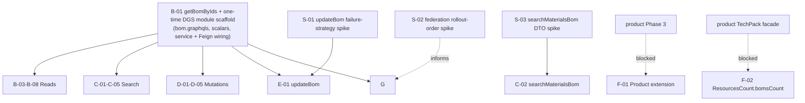

# Phase 4: Migration Plan & Stories — BOM

> **Domain:** `bom` · **Target DGS:** `BomService` → `plm-product` · **Generated:** 2026-06-26
> **Depends on:** [be-02-resolver-analysis.md](./be-02-resolver-analysis.md), [be-03-schema.graphql](./be-03-schema.graphql), [be-03-schema-analysis.md](./be-03-schema-analysis.md), [be-05-attribute-inventory.md](./be-05-attribute-inventory.md)
> **Machine-readable index:** `be-04-stories-index.yaml`

- **How to use this file (Engineers):** find your story ID, read *Current Behaviour* → *Target DGS
Implementation* → *Files* → *Acceptance Criteria* → *Test Cases*. You should not need to open the `.js`
resolver. **ACL note:** where a story says the current code obtains a capability token via ACL, that is
**context only** — ACL is ignored in the DGS implementation (no ACL work in any story).

---

## 1. Phases Overview

| Phase | Name | Stories | Notes |
|-------|------|---------|-------|
| 0 | Spikes | S-01–S-03 | time-boxed research; must conclude before the stories they block start |
| B | Core Reads | B-01, B-03–B-08 | one query per story; 4 are cacheable master data. **`B-02` removed** — see Bom_Unified deprecation below |
| C | Search & Listing | C-01–C-05 | elastic + supplier lookups |
| D | Mutations (simple) | D-01–D-05 | add / workspaces / lock / unlock / component-status |
| E | Complex Operations | E-01 | `updateBom` 3-step non-atomic write — blocked by `S-01` |
| F | Federation Contributions | F-01–F-02 | internal, same `plm-product` subgraph as product — ships on green, no gateway block |
| G | Field Resolvers & Tests | G-01, G-03–G-17 | one story per type block + parity harness. **`G-02` removed**, `G-10` repurposed — see Bom_Unified deprecation below. `G-17` (supplier entity ref) added by the federation review — recommended/PO-gated |

> **`Bom_Unified` deprecated.** The reviewer decision (formerly Decision #3) was: drop `Bom_Unified` as a
> parallel type and use field selection on `Bom` instead. That removes `getBomDataV2` (`B-02`) and
> `BomMaterial_Unified` (`G-02`) entirely. `G-10` (`BomImpressionDetails_Unified`) is **not** deleted, though —
> its internal/external branch-resolution logic and `MaterialDataLoader` are the shared implementation that
> `G-11`/`G-12`/`G-13` depend on for the *real* (non-Unified) `BomImpressionDetailsInterface` types. `G-10` is
> repurposed to own just that shared logic; see its story body below.

Effort/day-ranges are intentionally **not** in stories (complexity tier only). See
[be-04-po-summary.md](./be-04-po-summary.md) for AI-estimated ranges and sprint sequencing.

> **Self-contained story model.** The Netflix-DGS-on-REST framework already exists, so **every operation story below is end-to-end in a single PR**: it adds the schema (query/mutation + the GraphQL type definitions it returns), the DGS data fetcher, the Kotlin REST service method (read or write) that calls the backend, and pushes the schema change to the **Hive** registry. There is **no separate service-layer story** — the former `*Service` Kotlin-port story has been dissolved into the operation stories. The BOM material `@DgsTypeResolver` (A-04) remains a dedicated story.

> **These are thin DGS wrappers — and why `B-01` is *not* in the Depends On column.** The domain **model**, the
> **REST controller (GET/POST/PUT)**, and the Kotlin **service** already exist; each story only adds the
> Netflix-DGS layer so the federated graph can stitch this subgraph. The **one-time DGS module scaffold** `B-01`
> lands (`bom.graphqls`, scalar registration, service + Feign wiring) is a prerequisite for **every** operation
> story, so it is **assumed once (shown in the graph below) and not repeated in each row's `Depends On`**. Rows
> list only **genuine story-to-story dependencies**. After `B-01`, phases B/C/D/G run **fully in parallel**.

> **Reading the graph:** an arrow from `B-01` means *"needs the DGS module scaffold"* — shown **once here**, not
> duplicated in each story's `Depends On`.

## 2. Dependency Graph



---

## 3. Stories

### Phase 0 — Spikes

> A spike is time-boxed research, not shipped code. It ends in a recorded decision that
> gets written back into the story it blocks — it does not ship a feature itself. These three replace what
> used to be a flat "Decisions Required" table; each is now a real, estimable story.

---

### BOM-BE-S-01 · `updateBom` failure-strategy spike
- **Type:** Spike · **Phase:** S · **Complexity:** Medium · **Category:** CAT-1 · **Depends on:** — · **Blocks:** E-01
- **Status:** ⬜ Not Started

> **Superseded by ADR-013 (ratification pending).** All three "What's unknown" questions below are answered
> by the program-level decision: Option B, one shared `WriteSaga` module (built in `PRODUCT-BE-E-00`), BOM
> shares it rather than solving standalone, failure is synchronous/visible via `PARTIAL_FAILURE` with
> per-step detail. `BOM-BE-E-01` already implements the concrete choice. This spike is kept as the historical
> record of the question; closing/removing spike stories is a separate housekeeping decision, not made here.

- **Layman summary:** `updateBom` today does three separate write calls in a row — save the workspace links,
- save the bom body, save the permissions — and if the 2nd or 3rd call fails, the 1st one is already committed and nothing undoes it.
- The spike's job is to pick **one, specific** way to handle that failure for BOM (not invent a new pattern — one already exists, see below).

- **What's unknown:**
1. Which of the three general strategies fits BOM's risk/complexity tradeoff (a full rollback saga is more
   work to build than a "log it and let someone reconcile" approach — is that extra work worth it here?).
2. Whether a partial failure should be visible to the caller synchronously (the mutation returns an error) or
   asynchronously (the mutation "succeeds" but a compensation job runs after).
3. Whether BOM should share infrastructure with the eight *other* domains that have the same non-atomic-write
   shape (see Candidate pattern C below) or solve it standalone.

- **Candidate patterns:**
| Option | What it means in practice | Tradeoff |
|---|---|---|
| (a) Saga w/ compensation | Each step records its own "undo" action; on failure, undo already-committed steps in reverse order | Strongest consistency guarantee; more code, more test surface |
| (b) Compensation log + reconcile | On failure, write a log entry describing what's now inconsistent; a separate job/alert reconciles it later | Less code; consistency is "eventually", not "immediately" |
| (c) Documented best-effort | Do nothing extra — keep today's behaviour, but document it so support/on-call knows what a partial failure looks like | Cheapest; punts the actual risk |

> **Prior art, don't start from zero:** [`../../complexStories/non-atomic-write-saga/00-overview.md`](../../complexStories/non-atomic-write-saga/00-overview.md)
> already designs a shared `WriteSaga` + `WriteRegistry` for exactly this shape of problem across 9 mutations
> in 8 domains (BOM's `updateBom` is its worked example). This spike's real job is: **(1)** confirm BOM should
> plug into that shared saga rather than solve it alone, and **(2)** pick the per-step compensation for BOM's
> 3 steps specifically (what does "undo the workspace association" actually call?).

- **Example:** caller sends `updateBom(humanId: "B123", body: {...}, workspaceContext: {add:["W9"]}, businessPartners: [...])`.
- Step 1 (workspace-add) succeeds.
- Step 2 (body PUT) fails with a 500.
- Today: `W9` stays associated, body is unchanged, caller gets an error, no one is told about the dangling workspace link.
- Under pattern (a): the orchestrator calls the workspace-dissociate endpoint for `W9` before returning the error.
- Under (b): the orchestrator writes `{bomId: "B123", failedStep: "body", committedSteps: ["workspace"], action: "dissociate W9"}` to a compensation log/topic and returns the error; a reconcile job (or a human) actions it later.

#### Acceptance Criteria

1. One of (a)/(b)/(c) is chosen and recorded here, with the reasoning.
2. If (a) or (b), the per-step compensation (specifically: how to undo the workspace-assoc step) is written
   down concretely enough for `E-01` to implement without re-deriving it.
3. `E-01`'s "Chosen failure strategy" line is updated from "PO decision E-01" to the concrete choice.
4. If a shared `WriteSaga` (prior art above) is adopted, note that `E-01` becomes the first *production* wiring
   of that shared component (`non-atomic-write-saga` is the design; `E-01` is an implementation of it).

---

### BOM-BE-S-02 · Federation rollout-order spike (material sibling DGS)
- **Type:** Spike · **Phase:** S · **Complexity:** Low · **Category:** CAT-1 · **Depends on:** — · **Blocks:** B-01, G
- **Status:** ⬜ Not Started

- **Layman summary:** BOM's material field resolvers (trim, wash, fabric, fabric-spec, combination, and the
- material hub) each call out to a *different sibling team's* GraphQL service to enrich a material row (e.g.
- "what does trim size code 4 actually mean").
- Those sibling services aren't all being migrated to the new federated setup at the same time.
- Until a sibling ships its federated stub, BOM's field resolver for that material type can only return `{id}` — the enrichment is missing.
- The spike decides **which order** the 5 siblings should ship in, so BOM's rollout (and the demo/UAT plan) isn't blocked on all 5 landing at once.

- **What's unknown:**
1. Which sibling teams (hub / trim / wash / fabric / combination) are actually closest to shipping their own
   federated subgraph — this is a cross-team scheduling question, not a BOM-internal one.
2. Whether BOM should ship reads/writes for **all** material types on day 1 with partial enrichment (some
   materials show `{id}` only), or gate the whole domain launch on at least N of 5 siblings being ready.
3. Whether trim (`G-08`, the largest field-resolver story) and its sibling should be prioritized first since
   it is also the highest-complexity story, or whether an easier sibling (e.g. wash) should go first to prove
   the federation stub pattern cheaply.

- **Candidate patterns:**
| Option | What it means | Tradeoff |
|---|---|---|
| Ship in complexity order (wash → fabric → combination → trim → hub) | Prove the stub pattern on easy cases first | Trim (highest-value, highest-risk) enrichment lands last |
| Ship in caller-priority order (whatever the PO says users hit most) | Optimizes perceived quality fastest | Needs usage data BOM doesn't currently have |
| Ship all 5 in parallel, BOM ships with partial `{id}`-only enrichment meanwhile | No cross-team blocking at all | UAT sees incomplete data until all 5 land — may look like a bug if not called out |

- **Example:** if `wash` ships its federated subgraph first and `trim` hasn't yet, a `BomTrimMaterial.libraryResource`
query returns `{id: "T4521"}` with no `name`/`colors`/`sizes` — same shape as today's "not yet federated"
placeholder documented in each `G0x` story's Target section.

#### Acceptance Criteria

1. A rollout order for hub/trim/wash/fabric/combination is agreed with Platform + each sibling team and
   recorded here.
2. The order is reflected in the sprint sequencing table in `be-04-po-summary.md`.
3. `B-01`'s DGS-module-init checklist and each affected `G0x` story note which siblings are expected to be
   `{id}`-only at BOM's launch date.

---

### BOM-BE-S-03 · `searchMaterialsBom` request-shape spike
- **Type:** Spike · **Phase:** S · **Complexity:** Low · **Category:** CAT-1 · **Depends on:** — · **Blocks:** C-02
- **Status:** ⬜ Not Started

- **Layman summary:** today, when a caller sends `nestedSearchFilters` to `searchMaterialsBom`, the gateway
- flattens each filter into 5 separate query-string keys (`nestedSearchFilters[0].type`, `nestedSearchFilters[0].fieldPath`, …) before calling the search backend — an artifact of how the old Node gateway built URLs.
- The spike decides whether the new Kotlin service should keep faithfully reproducing that flattened wire format, or send the backend a proper structured request body instead.

- **What's unknown:**
1. Does the `search` backend actually require the flattened `nestedSearchFilters[i].*` query-string shape, or
   does it also accept (or prefer) a structured JSON body — this needs a conversation with the Search team,
   not a guess.
2. If a structured DTO is possible, is there any other caller today relying on the flattened wire format
   directly (e.g. a saved query, a client-side cache key) that would break if the shape changed.

- **Candidate patterns:**
| Option | What it means | Tradeoff |
|---|---|---|
| Keep the flatten (byte-for-byte parity) | Zero backend risk, zero behavior change | Carries forward an awkward format nobody would design today |
| Move to a structured DTO | Cleaner Kotlin code, easier to test | Requires the Search backend to accept it, and a parity check that the *results* are identical even though the *request* shape changed |

- **Example:** input `nestedSearchFilters: [{type: "trim", fieldPath: "size", operator: "eq", values: ["4"]}]`.
- Flattened (today): `?nestedSearchFilters[0].type=trim&nestedSearchFilters[0].fieldPath=size&nestedSearchFilters[0].operator=eq&nestedSearchFilters[0].values=4`.
- Structured (candidate): `{"nestedSearchFilters": [{"type": "trim", "fieldPath": "size", "operator": "eq", "values": ["4"]}]}` sent as a JSON body.

#### Acceptance Criteria

1. Search backend team confirms whether a structured body is accepted.
2. Decision (flatten vs. structured) recorded here and copied into `C-02`'s Target DGS Implementation text.
3. If moving to structured, `C-02`'s acceptance criteria #2 (today: "same `nestedSearchFilters[i].*` keys as
   today") is updated to describe the agreed structured shape instead.

---

### Phase A — Foundation & Schema

---

### BOM-BE-A-04 · `@DgsTypeResolver` for the 2 BOM interfaces
- **Type:** Field Resolver · **Phase:** A · **Complexity:** Medium · **Category:** CAT-2 · **Depends on:** —

- **In plain terms:** Route each material/impression row to the right concrete type by its category code.

- **As a** DGS migration engineer **I want** type resolvers for `BomMaterialInterface` (7 impls) and
`BomImpressionDetailsInterface` (5 impls) **so that** polymorphic material/impression lists resolve to the
correct concrete type.

- **Current Behaviour (from Phase 2 — C3 / C-11):**
- Material: switch on `material.materialCategory.code` → 4→Trim, 6→Wash, 2→Fabric, 15→Combination,
  16→FabricSpec, {10,11,12,13,14,17–24}→Packaging, **default (1,5,9)→BomMaterial**.
- Impression: switch on `impression.type` → 603→Trim, 605→TrimZipper, 604→Wash, 602→Fabric, **default 601→Base**.

- **Target DGS Implementation:** Two `@DgsTypeResolver(name=...)` functions mirroring the switches. Keep the
default branches exactly (HUB code 9 must fall through to `BomMaterial`). Source the category codes from a
`BomConstants.kt` enum (replaces the resolver's `MATERIAL_CATEGORY_ID` — fixes the circular import).

- **Files to Create / Modify:** `dataFetcher/BomTypeResolvers.kt`; `model/BomConstants.kt`.

#### Acceptance Criteria

1. Each `materialCategory.code` maps to the type in the table above; unknown codes → `BomMaterial`.
2. Each impression `type` maps correctly; unknown → `BomBaseImpressionDetails`.
3. `BomConstants` holds all 21 category codes + 5 impression codes (verify values against backend, ADR-017 pin-down 1).

---

### BOM-BE-A-05 · Shared CI conformance gate + `code → type` registry (`SPIKE-05`)
- **Type:** Service · **Phase:** A · **Complexity:** Medium · **Category:** CAT-1 · **Depends on:** A-04 · **Blocks:** every future PR touching a polymorphic dispatch site (this domain and, later phase, sample/search)

- **In plain terms:** Build the one shared test library that fails a PR when a schema type, a dispatch enum, and a golden fixture disagree — so the next added material/impression variant can't silently drift the way today's five hand-maintained switch tables can.

- **As a** DGS migration engineer **I want** a shared conformance-check library and a human-readable
`code → type` registry **so that** every polymorphic dispatch site (bom now; sample and search in later
phases) inherits one drift guard instead of each domain reinventing review-only vigilance.

- **Current Behaviour, in plain terms:** today there are five hand-maintained dispatch tables across three
domains (`BomMaterialInterface`, `BomImpressionDetailsInterface`, `SampleAsset`, `SampleV2.parent*` prefix
gates, materials-search `type`-string dispatch) with **no guard** — an added interface impl with no
matching dispatch row, or a dispatch row targeting a type that no longer exists, fails silently at runtime
(the wrong fragment renders, nothing throws). See
[ADR-017 §1](../../complexStories/polymorphic-type-resolution/01-adr-polymorphic-type-resolution.md) for
the full table-by-table inventory.
- **Pattern (draft ADR-017 Option B, pending ratification):** `BOM-BE-A-04` already does the per-site
port (constants enum + dumb-lookup `@DgsTypeResolver`) for bom's two dispatch sites — this story builds the
**shared** pieces that sit alongside every per-site port: (1) a CI conformance-check test library, versioned
with the schema-registry tooling and pinned by each affected subgraph's own build (ADR-017 pin-down 7); (2)
the `SPIKE-05` `code → type` registry — one human-readable master table seeded from ADR-017 §1, including
ADR-014's `type 2 → packagingBom` row (cross-reference to the components-and-counts-rollups case).

- **The conformance gate's three checks (ADR-017 §3-B):**
```
1. Parse the subgraph SDL: every member of every interface/union must have ≥1 enum row targeting it,
   and every enum row's target must exist in the SDL — catches both "add a type, forget the row" and
   "add a row, forget the type."
2. The default branch must be declared EXPLICITLY in the enum — no implicit fall-through allowed
   (closes ADR-017 pin-down 2: HUB code 9 / COMPONENT 1 / OTHER 5 must be a named DEFAULT row, not an
   accidental "else" branch that could later be cased away and silently break hub-material rendering).
3. A golden-table fixture per dispatch site (code/prefix → type snapshot) diffed on every build; a
   mapping change requires a fixture change in the same PR — mapping changes become reviewable events,
   not silent diffs.
```

- **Files to Create:** shared library — `conformance-gate/DispatchConformanceCheck.kt` (the three checks
above, generic over any SDL + enum pair); `conformance-gate/CodeToTypeRegistry.md` (the human-readable
`SPIKE-05` registry, seeded from ADR-017 §1 + ADR-014 pin-down 6); per-subgraph wiring —
`bom/build.gradle.kts` pins the shared library into bom's CI build against `BomConstants.kt` +
`bom.graphqls`.

#### Acceptance Criteria

1. The conformance library's three checks (SDL↔enum, explicit-default, golden-fixture-diff) run against
   `BomConstants.kt` + `bom.graphqls` in bom's CI build and pass on the current (correct) mapping.
2. Demonstrably fails on each drift direction, proven by a negative test per direction: an SDL member with
   no enum row; an enum row with no SDL type; an undeclared/implicit default; a mapping change with no
   fixture change in the same commit.
3. Golden-table fixtures exist for both of bom's dispatch sites (`BomMaterialInterface`,
   `BomImpressionDetailsInterface`), seeded from ADR-017 §1 and backend-verified per `A-04` AC-3 — including
   a HUB (code 9) material row and an unknown/missing category-code row (ADR-017 §5 fixture list).
4. The `code → type` registry (`CodeToTypeRegistry.md`) is a standalone, human-readable page covering all
   five dispatch sites named in ADR-017 §1 (the three not yet built — `SampleAsset`, `SampleV2.parent*`,
   materials search — are recorded as later-phase rows so `SAMPLE-BE-A-04`/`SAMPLE-BE-G-02` and
   `SEARCH-BE-B-01`/`SEARCH-BE-C-02` inherit the table rather than re-deriving it), and includes ADR-014's
   `type 2 → packagingBom` row.
5. The library is versioned with the schema-registry tooling and documented as a single shared artifact —
   no domain forks its own copy (ADR-017 pin-down 7).
6. This story does not touch any per-variant field resolver or dispatch table itself — those are `A-04`'s
   and each per-variant `G-0x` story's own scope; this story only builds and wires the shared gate + registry.

#### Test Cases

- [ ] Unit: SDL member with no enum row → conformance check fails the build
- [ ] Unit: enum row with no matching SDL type → conformance check fails the build
- [ ] Unit: an implicit/undeclared default branch → conformance check fails the build
- [ ] Unit: a mapping row changed with no corresponding fixture change in the same diff → conformance check fails the build
- [ ] Integration: bom's actual `BomConstants.kt` + `bom.graphqls` pass all three checks today
- [ ] Golden fixture: HUB (code 9) material, unknown/missing category code, both impression defaults

---

### Phase B — Core Reads (one query per story)

---

### BOM-BE-B-01 · `getBomByIds` data fetcher
- **Type:** Query · **Phase:** B · **Complexity:** Low · **Category:** CAT-2 · **Depends on:** —

- **In plain terms:** Looks up full BOM records for a set of BOM ids (the core 'give me these BOMs' read).

> **Note — DGS Module Init (this PR only):** Creates `bom.graphqls` (federation v2.3 header, scalars, owned types with `@key`, external stubs), registers scalars in `ScalarConfig.kt`, and wires the service and Feign client. Full type list: [be-03-schema.graphql](./be-03-schema.graphql). **This scaffold is a prerequisite for every B/C/D/G story** — they need the module + schema file to compile their DGS wrapper — so it is assumed globally (shown once in the dependency graph) and **not repeated** in each story's `Depends On`. After it lands, the wrappers parallelize.
- **As a** DGS migration engineer **I want** the `getBomByIds` query **so that** clients can fetch boms by id list.

- **Current Behaviour (Q1):** if `ids` empty → `[]`; else `GET {base}/…/bom/v1?ids={ids}` → `deepToCamelCase`.
- **ACL note (context):** current impl gets a capability token for `ids` because boms are resource-scoped; ACL ignored in DGS.

- **Target DGS Implementation:** `@DgsQuery fun getBomByIds(ids): List<Bom>` → `bomService.getByIds(ids)`.
Add a request-scoped `BomDataLoader` keyed on id (the source isn't batched — improve here). Empty list → `[]`.
- **Files to Create / Modify:** `dataFetcher/BomQueryDataFetcher.kt` (+ `dataloader/BomDataLoader.kt`).

#### Acceptance Criteria

1. `getBomByIds(["B1","B2"])` returns mapped `Bom` objects from the REST list endpoint.
2. Empty `ids` → returns `[]` with **no** REST call.
3. Response snake_case → camelCase per schema.

---

> **`BOM-BE-B-02` (`getBomDataV2`) — removed.** It only ever existed to serve the `Bom_Unified` projection.
> Per the reviewer decision (§Phase 0 note above), `Bom_Unified` is deprecated in favor of field selection on
> `Bom` — callers who want a smaller projection now just ask `getBomByIds` for fewer fields, which is what
> GraphQL field selection is for. No replacement query is needed.

---

### BOM-BE-B-03 · `getBomStatus` (cacheable master data)
- **Type:** Query · **Phase:** B · **Complexity:** Low · **Category:** CAT-2 · **Depends on:** —

- **In plain terms:** Returns the list of possible BOM statuses — the options you'd see in a status dropdown.

- **Current Behaviour (Q3):** `GET {base}/masterData?name=BomStatus`; transform `{key:value}` map → `[{code,description}]`. No ACL.
- **Target DGS Implementation:** `@DgsQuery getBomStatus(): List<CodeDescription>` → `@Cacheable("bomMasterData", key="'status'")` service method that maps the map to the list.
- **Files / Dependencies:** `BomQueryDataFetcher.kt`.

#### Acceptance Criteria

1. Returns `[{code,description}]` from the status map.
2. Second call served from cache (no REST).
3. Map key→`code`, value→`description`.

---

### BOM-BE-B-04 · `getBomByParentId` data fetcher
- **Type:** Query · **Phase:** B · **Complexity:** Low · **Category:** CAT-2 · **Depends on:** —

- **In plain terms:** Lists all the BOMs that belong to one product, newest first.

- **Current Behaviour (Q4):** today, the gateway fetches boms for a product and sorts them by `createdAt` DESC
itself, in application code — the backend returns them unsorted. **ACL note (context):** capability token for
`parentId`; ignored in DGS.
- **Decision (resolved — was Decision #6):** push the sort to the backend. The Kotlin service **no longer**
replicates `sortedByDescending { it.createdAt }` client-side — the REST call now asks the backend to sort.
- **Target DGS Implementation:** `@DgsQuery getBomByParentId(parentId): BomPaged` → `GET …/bom/v1/byProductId/{parentId}?sort=createdAt,desc`
(backend-sorted); return `BomPaged{content}` as-is, no in-memory re-sort.
- **Files / Dependencies:** `BomQueryDataFetcher.kt`.

- **Example (before → after):**
```
// before (B-04 as originally written)
val boms = restClient.getByProductId(parentId)                 // unsorted
return boms.sortedByDescending { it.createdAt }                 // client-side sort

// after (this story)
val boms = restClient.getByProductId(parentId, sort = "createdAt,desc")  // backend-sorted
return boms                                                      // no client-side re-sort
```

#### Acceptance Criteria

1. Returns boms for `parentId` sorted `createdAt` DESC, sorted by the **backend**, not client code.
2. Empty → `{content: []}`.
3. No `sortedByDescending` (or equivalent) remains in the Kotlin data fetcher — sorting happens once, server-side.

---

### BOM-BE-B-05 · `getBomMaterialTypes` (merge with Material Hub)
- **Type:** Query · **Phase:** B · **Complexity:** Medium · **Category:** CAT-2 · **Depends on:** — · **EXT:** 🟡 `materialHub`

- **In plain terms:** Returns the catalog of material types, combined with the shared material-hub types.

- **Current Behaviour (Q5):** load bom material types (`GET …/master_data/bom_material_types[?ids]`) **and**
`materialHub.getHubMaterialTypes` (today sequential), concat; map each hub type →
`{code:9, description:type, bomType:{code:1,description:'Product'}, libraryLink:true, freeText:true}`.
- **EXT Service Calls:** **EXT** → key: `materialHub` · severity: 🟡 — hub material type list to merge into bom types.
- **Target DGS Implementation:** `@DgsQuery getBomMaterialTypes(ids): List<BomMaterialType>`. Fetch both
sources **in parallel** (`coroutineScope`), concat, synthesize hub rows as above. Hub fetch via federated
`materialHub` reference or a `MaterialHubClient`.
- **Files / Dependencies:** `BomQueryDataFetcher.kt`.

#### Acceptance Criteria

1. Returns bom types + synthesized hub types.
2. Hub rows carry `code=9, libraryLink=true, freeText=true, bomType={1,'Product'}`.
3. The two fetches run concurrently.
4. EXT hub failure → return bom types only (partial), logged.

---

### BOM-BE-B-06 · `getBomPackagingMaterialTypes` (cacheable)
- **Type:** Query · **Phase:** B · **Complexity:** Low · **Category:** CAT-2 · **Depends on:** —

- **In plain terms:** Returns the packaging material-type lookup list (cached, rarely changes).

- **Current Behaviour (Q6):** `GET …/master_data/packaging_bom_material_types` → camelCase. No ACL.
- **Target DGS Implementation:** `@DgsQuery` → `@Cacheable` service method.
- **Files / Dependencies:** `BomQueryDataFetcher.kt`.

#### Acceptance Criteria

1. Returns packaging material types.
2. Cached on second call.

---

### BOM-BE-B-07 · `getBomPackagingSubstrates` (cacheable)
- **Type:** Query · **Phase:** B · **Complexity:** Low · **Category:** CAT-2 · **Depends on:** —

- **In plain terms:** Returns the packaging substrate lookup list (cached).

- **Current Behaviour (Q7):** `GET …/master_data/packaging_bom_substrate_types` → camelCase.
- **Target DGS Implementation:** `@DgsQuery` → `@Cacheable` service method returning `[BomPackagingSubstrate]`.

#### Acceptance Criteria

1. Returns substrate list.
2. Cached.

---

### BOM-BE-B-08 · `getBomPackagingUnitOfMeasure` (cacheable)
- **Type:** Query · **Phase:** B · **Complexity:** Low · **Category:** CAT-2 · **Depends on:** —

- **In plain terms:** Returns the packaging unit-of-measure lookup list (cached).

- **Current Behaviour (Q8):** `GET …/master_data/packaging_unit_of_measure` → camelCase (`units_of_measure`).
- **Target DGS Implementation:** `@DgsQuery` → `@Cacheable` returning `[UnitsOfMeasure]`.

#### Acceptance Criteria

1. Returns UoM list.
2. Cached.

---

### Phase C — Search & Listing

---

### BOM-BE-C-01 · `getBomElastic` data fetcher
- **Type:** Query · **Phase:** C · **Complexity:** Low · **Category:** CAT-2 · **Depends on:** — · **EXT:** 🔴 `search`

- **In plain terms:** Runs a BOM search and returns the BOMs that match.

- **Current Behaviour (Q9):** `{content} = search.getBomElastic.load(query)`; return `content`. The **entire
`query` object** is passed to elastic — document the exact field set.
- **EXT Service Calls:** **EXT** → key: `search` · severity: 🔴 — elastic bom search index.
- **Target DGS Implementation:** `@DgsQuery getBomElastic(q): List<Bom>` → `searchClient.bomElastic(query)`; return `content`. Define the query DTO from the fields the backend expects (verify).
- **Files / Dependencies:** `BomSearchDataFetcher.kt`.

#### Acceptance Criteria

1. Returns `content` boms for a query.
2. Query DTO field set documented + matches backend.
3. Empty → `[]`.

---

### BOM-BE-C-02 · `searchMaterialsBom` data fetcher
- **Type:** Query · **Phase:** C · **Complexity:** Medium · **Category:** CAT-2 · **Depends on:** S-03 · **EXT:** 🔴 `search` · 🔵 `vmm`

- **In plain terms:** Searches for materials inside BOMs, with filters and paging.

- **Current Behaviour (Q10):** in plain terms — before hitting the search backend, this resolver (1) looks up
fabric suppliers by calling straight into another domain's resolver code (not a clean service call), and
(2) if the caller passed `nestedSearchFilters`, flattens each filter object into 5 separate query-string keys
(`nestedSearchFilters[i].type`, `...fieldPath`, `...nestedFieldPath`, `...operator`, `...values`) because
that's the shape the old gateway happened to build.
1. `fabricSuppliers = VMM_BusinessPartner.getRelatedFabricSuppliersByMerchVendors({merchVendorIds: partnerIds})` (cross-resolver import — replace with a service/federation call).
2. Build `queryPayload` from args.
3. If `nestedSearchFilters` present: flatten each `[i]` into 5 keys `nestedSearchFilters[i].{type|fieldPath|nestedFieldPath|operator|values}`, then delete the array key.
4. `search.searchMaterialsBom.load(queryPayload)`.
- **EXT Service Calls:** **EXT** → key: `search` · 🔴; **EXT** → key: `vmm` · 🔵 (fabric-supplier lookup).
- **Target DGS Implementation:** `@DgsQuery searchMaterialsBom(...): BomMaterialSearch`. Fetch fabric suppliers
- via a `VmmClient`/federation (not a resolver import).
- **Request shape is per `BOM-BE-S-03`'s outcome** — until that spike concludes, implement the flatten (below) so this story isn't blocked on the spike's timeline; swap to the structured DTO only if S-03 lands during this story's PR.

- **Example (today's flatten, to preserve until S-03 says otherwise):**
```
input:  nestedSearchFilters: [{type: "trim", fieldPath: "size", operator: "eq", values: ["4"]}]
output query string:
  nestedSearchFilters[0].type=trim
  nestedSearchFilters[0].fieldPath=size
  nestedSearchFilters[0].operator=eq
  nestedSearchFilters[0].values=4
```
- **Files / Dependencies:** `BomSearchDataFetcher.kt`.

#### Acceptance Criteria

1. Returns `BomMaterialSearch{content,paging}`.
2. With `nestedSearchFilters`, the request serializes to the same `nestedSearchFilters[i].*` keys as today
   (or the agreed structured DTO, once the search-request-shape decision has landed).
3. `size` defaults to 20.
4. Fabric-supplier prefetch via service/federation, not a resolver import.

---

### BOM-BE-C-03 · `getComboSupplierForBom` data fetcher
- **Type:** Query · **Phase:** C · **Complexity:** Medium · **Category:** CAT-2 · **Depends on:** — · **EXT:** 🟡 `combination` · 🔵 `vmm`

- **In plain terms:** Finds which suppliers are available for a BOM's combination materials.

- **Current Behaviour (Q13):**
1. `fabricSpecCombos = SPARK_Combination.searchFabricSpecCombos({q:`parentComboId:${comboId}`, page:0, size:100})` (cross-resolver import).
2. Filter combos: keep where `fsId` set AND ((`partnerIds` non-empty & `mvIds.length===1` & `partnerIds.includes(mvIds[0])`) OR `partnerIds` empty).
3. For each (parallel): `fs = vmm.getByID.load(fsId)`; if `fs.bpName`, push `{fabricSupplier:{id:fsId,name:fs.bpName}, fabricSpecCombo}`.
- **EXT Service Calls:** **EXT** → key: `combination` · 🟡; **EXT** → key: `vmm` · 🔵.
- **Target DGS Implementation:** `@DgsQuery getComboSupplierForBom(comboId, partnerIds): List<BomComboSupplier>`.
Call combination via `CombinationClient`/federation. VMM lookups in parallel (`coroutineScope`/`async`).
- **PO decision:** the `mvIds.length===1` filter silently drops multi-MV combos — confirm intended.
- **Files / Dependencies:** `BomSearchDataFetcher.kt`.

#### Acceptance Criteria

1. Returns suppliers only for combos with a resolvable `fsId` and `bpName`.
2. Filter logic matches the rule above (document the `mvIds.length===1` behaviour).
3. VMM lookups run concurrently.

---

### BOM-BE-C-04 · `getValidTrimSuppliersForBom` data fetcher
- **Type:** Query · **Phase:** C · **Complexity:** Low · **Category:** CAT-2 · **Depends on:** — · **EXT:** 🔵 `vmm`

- **In plain terms:** Lists the valid trim suppliers for a BOM.

- **Current Behaviour (Q11):** `getRelatedSuppliersForMVs(ctx, merchVendorIds, [TRIM_SUPPLIER.code])` → `[Int]` partner ids.
- **EXT Service Calls:** **EXT** → key: `vmm` · 🔵.
- **Target DGS Implementation:** `@DgsQuery` delegating to a `VmmSupplierService.relatedSuppliers(merchVendorIds, roles=[TRIM_SUPPLIER])`. Source the role code from `BomConstants` (confirm code value).

#### Acceptance Criteria

1. Returns related trim-supplier partner ids.
2. Role filter = TRIM_SUPPLIER only.
3. Empty input → `[]`.

---

### BOM-BE-C-05 · `getValidRawMaterialSuppliersForBom` data fetcher
- **Type:** Query · **Phase:** C · **Complexity:** Low · **Category:** CAT-2 · **Depends on:** — · **EXT:** 🔵 `vmm`

- **In plain terms:** Lists the valid raw-material suppliers for a BOM.

- **Current Behaviour (Q12):** same as C-04 with roles `[RAW_MATERIAL_SUPPLIER, FABRIC_SUPPLIER, TRIM_SUPPLIER]`.
- **Target DGS Implementation:** `@DgsQuery` delegating with the three roles.

#### Acceptance Criteria

1. Returns ids matching the 3 roles.
2. Empty input → `[]`.

---

### Phase D — Mutations (simple)

---

### BOM-BE-D-01 · `addBom` mutation
- **Type:** Mutation · **Phase:** D · **Complexity:** Medium · **Category:** CAT-2 · **Depends on:** —

- **In plain terms:** Creates a new BOM.

- **Current Behaviour (M1):** `bom = bomService.addBom(sparkBom)` → `POST {base}/…/bom/v1`
(`transformRequest: deepToSnakeCase`, `primeKey: humanId`); if `bom.validationErrors || bom.message` →
throw. No ACL (new resource).
- **Input validation:** `name` and `parentId` required (schema `String!`).
- **Target DGS Implementation:** `@DgsMutation addBom(sparkBom: BomInput): Bom` → `bomService.add(...)`. Map
camelCase→snake_case. On `validationErrors`/`message` in the response → throw typed `BomValidationException`.
After success, `bomDataLoader.prime(humanId, bom)`.
- **Files / Dependencies:** `BomMutationDataFetcher.kt`.

#### Acceptance Criteria

1. POST creates a bom and returns it mapped to `Bom`.
2. Backend `validationErrors`/`message` → `BomValidationException` (not a silent return).
3. Request body is snake_case.
4. Read cache primed with `humanId`.

---

### BOM-BE-D-02 · `manageBomWorkspaces` mutation
- **Type:** Mutation · **Phase:** D · **Complexity:** Low · **Category:** CAT-2 · **Depends on:** — · **EXT:** 🟡 `workspaceV2`

- **In plain terms:** Adds or removes which workspaces a BOM belongs to.

- **Current Behaviour (M3):** if `toAdd`/`toRemove` non-empty → `workspaceAssociationHelper(BOM, bomId, toAdd, toRemove)` → PUT `…/{bomId}/{associate|dissociate}_workspace`; else returns `undefined`.
- **EXT Service Calls:** **EXT** → key: `workspaceV2` · 🟡 (association). **ACL note (context):** capability token for `bomId`; ignored in DGS.
- **Target DGS Implementation:** `@DgsMutation manageBomWorkspaces(bomId, workspacesToAdd, workspacesToRemove): Bom`
→ `bomService.manageWorkspaceAssociations(...)`. Both empty → return `null` (document for clients).

#### Acceptance Criteria

1. Adds/removes workspace associations via the correct endpoint.
2. Both lists empty → `null`, no REST call.
3. Returns the updated bom.

---

### BOM-BE-D-03 · `lockBom` mutation
- **Type:** Mutation · **Phase:** D · **Complexity:** Low · **Category:** CAT-2 · **Depends on:** —

- **In plain terms:** Locks a BOM so others can't edit it.

- **Current Behaviour (M4):** `PUT …/{bomId}/lock`. **ACL note (context):** capability token for `bomId`; ignored in DGS.
- **Target DGS Implementation:** `@DgsMutation lockBom(bomId): Bom` → `bomService.lock(bomId)`.

#### Acceptance Criteria

1. PUT to `/lock` returns the locked bom.
2. 404 → null.

---

### BOM-BE-D-04 · `unlockBom` mutation
- **Type:** Mutation · **Phase:** D · **Complexity:** Low · **Category:** CAT-2 · **Depends on:** —

- **In plain terms:** Unlocks a BOM so it can be edited again.

- **Current Behaviour (M5):** `PUT …/{bomId}/unlock`. ACL note as D-03.
- **Target DGS Implementation:** `@DgsMutation unlockBom(bomId): Bom` → `bomService.unlock(bomId)`.

#### Acceptance Criteria

1. PUT to `/unlock` returns the unlocked bom.
2. 404 → null.

---

### BOM-BE-D-05 · `updateBomComponentStatus` mutation
- **Type:** Mutation · **Phase:** D · **Complexity:** Low · **Category:** CAT-2 · **Depends on:** —

- **In plain terms:** Updates the status of one or more components on a BOM.

- **Current Behaviour (M6):** `PUT …/bom/v1/component_status_update` body `{productId, ids, status}`. **No ACL token** — the only write without one (every other BOM write obtains one).
- **Target DGS Implementation:** `@DgsMutation updateBomComponentStatus(productId, ids, status): BomPaged` → `bomService.updateComponentStatus({...})`; wrap result as `{content}`.

#### Acceptance Criteria

1. PUT sends `{productId, ids, status}` (snake_case).
2. Returns `BomPaged{content}`.

---

### Phase E — Complex Operations

---

### BOM-BE-E-01 · `updateBom` — 3-step orchestrated write
- **Type:** Mutation · **Phase:** E · **Complexity:** Very High · **Category:** CAT-2 · **Depends on:** D-02, S-01 · **EXT:** 🟡 `workspaceV2` · **Blocked by:** product (`PRODUCT-BE-E-00`, the shared `WriteSaga` module)

- **In plain terms:** Edit a BOM — a 3-step write (workspace + body + permissions) that has no rollback today.

- **As a** DGS migration engineer **I want** `updateBom` implemented as an explicit 3-step orchestration with a
chosen failure strategy **so that** body, workspace, and permission updates stay consistent.

- **Current Behaviour, in plain terms:** editing a bom today is really three separate backend calls made one
- after another, with no undo button: (1) if the caller changed which workspaces the bom belongs to, save that first; (2) save the actual bom fields; (3) if the caller changed business-partner permissions, save that last.
- If call 2 or 3 fails, call 1 has already gone through — there's no way today to detect or undo that.
1. (ACL note — context) capability token obtained for `humanId` because the update is resource-scoped; ignored in DGS.
2. **If** `workspaceContext` has add/remove → `workspaceAssociationHelper(BOM, humanId, add, remove)` (**commits first**) → PUT `…/{bomId}/{associate|dissociate}_workspace`.
3. `bomService.updateBom(sparkBom)` → `PUT {base}/…/bom/v1/{humanId}` (`omitParamsInBody: true`).
4. If `validationErrors || message` → throw.
5. **If** `businessPartners` present → `bomService.updatePermissions().load(sparkBom)` → PUT `…/{humanId}/permission`.
6. Return the updated bom.
- **Risk 🔴:** three sequential writes, **no rollback** today. Step-2 workspace change persists even if step 3 fails; step-5 permission update can leave ACL stale.
- **EXT Service Calls:** **EXT** → key: `workspaceV2` · 🟡 (association step).
- **Target DGS Implementation:** `BomUpdateOrchestrator` running steps in order: workspace assoc → body PUT
- (`omitParamsInBody`) → optional permissions PUT.
- **Failure strategy (draft ADR-013, pending ratification):** against the shared `WriteSaga` module built in
`PRODUCT-BE-E-00` — workspace assoc `COMPENSATE` → body PUT = point of no return → permissions `RETRY` then
`PARTIAL_FAILURE`; the never-checked `updatePermissions` response becomes checked by construction (ADR-013
pin-down 5). `BOM-BE-S-01`'s three open questions (§"What's unknown") are all answered by ADR-013's decision —
see that story's note.
- Replace the `validationErrors||message` shape-sniff with a typed `BomValidationException`.
- Prime the read cache on success.
- **Files / Dependencies:** `service/BomUpdateOrchestrator.kt`, `BomMutationDataFetcher.kt`; D-02 (shares the workspace step); consumes the shared `WriteSaga` module from `PRODUCT-BE-E-00`.

- **Pseudocode (steps + policy per ADR-013 §4-B):**
```kotlin
class BomUpdateOrchestrator(private val saga: WriteSaga) {

  fun updateBom(humanId: String, body: BomInput, workspaceCtx: WorkspaceContext?, partners: List<BusinessPartner>?): Bom {
    saga.step("workspace-assoc",
      // do:
      { workspaceCtx?.let { manageBomWorkspaces(humanId, it.toAdd, it.toRemove) } },
      // compensate (undo) — COMPENSATE policy per ADR-013 §4-B:
      { workspaceCtx?.let { manageBomWorkspaces(humanId, toAdd = it.toRemove, toRemove = it.toAdd) } }
    )

    saga.step("body-put",
      { restClient.putBom(humanId, body.omit("humanId")) },  // throws BomValidationException on validationErrors/message
      { /* point of no return — no compensation, per ADR-013 §4-B */ }
    )

    saga.step("permissions-put",
      { partners?.let { restClient.putPermissions(humanId, it) } },
      { /* RETRY then PARTIAL_FAILURE — no compensation, stale ACL surfaced per ADR-013 §4-B */ }
    )

    val result = saga.finish()          // COMMITTED | COMPENSATED | PARTIAL_FAILURE
    bomCache.prime(humanId, result.bom) // only on COMMITTED
    return result.bom
  }
}
```

#### Acceptance Criteria

1. Parity for 5 fixtures: body-only; body+workspace-add; body+workspace-remove; body+partners; body+workspace+partners.
2. Workspace step runs **before** the body PUT; permissions step only when `businessPartners` present.
3. Body PUT omits `humanId` from the body.
4. Failure strategy per ADR-013 §4-B implemented: a workspace-step failure after the body PUT compensates
   (dissociate/re-associate); a permissions-step failure retries then surfaces `PARTIAL_FAILURE` with
   per-step detail (stale ACL made visible, not silently swallowed).
5. Backend `validationErrors`/`message` → `BomValidationException`.
6. Read cache updated with the returned bom.

#### Test Cases

- [ ] Unit: order workspace→body→perms
- [ ] Unit: no-workspace skip
- [ ] Unit: no-partners skip
- [ ] Unit: step-3 (permissions) failure path yields `PARTIAL_FAILURE` with per-step detail
- [ ] Parity: 5 fixtures

---

### Phase F — Internal Contributions to Product / ResourcesCount (same subgraph)

> **Monorepo:** `product` and `bom` are the **same `plm-product` subgraph**, so these are **internal field
> resolvers** (CAT-2), not cross-subgraph federation. They depend on the `Product`/`ResourcesCount` types
> existing in the merged schema but are **not** gateway-federated and **not** blocked by a separate
> deployment. See [federation-patterns-condensed.md §0](../../../fedMigrationScripts/reference/federation-patterns-condensed.md).

---

### BOM-BE-F-01 · Implement `Product.productBoms` / `boms` / `packagingBoms` (internal)
- **Type:** Field Resolver · **Phase:** F · **Complexity:** Medium · **Category:** CAT-2 · **Depends on:** —

- **In plain terms:** Serve a product's BOM lists from BOM's own service instead of product reaching across.

- **As a** DGS migration engineer **I want** the bom-list fields on `Product` served by the BOM code **so that**
product → bom navigation lives with the BOM service inside `plm-product`.

- **Current Behaviour, in plain terms:** when a client asks a `Product` for its boms today, that resolver lives
- in *product's* code and reaches across to BOM's data loader.
- After migration, product and bom live in the same service (`plm-product`), so there's no reason for that indirection — BOM's own code should just answer the field directly.
- `ctx.loaders.bom.getActiveBomsByProductId(...)` / `...AndBomType(...)`.
- **Target DGS Implementation:** plain `@DgsData` field resolvers on the `Product` type (same subgraph) →
`bomService.getActiveBomsByProductId` (and `...AndBomType` for `boms(types)`). **No** `@DgsEntityFetcher` /
`@extends @external` — `Product` is an internal type, so this is a normal in-process method call, not a
federation hop.

- **Example (Kotlin, same-subgraph field resolver — no federation annotations needed):**
```kotlin
@DgsComponent
class ProductBomFieldResolver(private val bomService: BomService) {

  @DgsData(parentType = "Product", field = "productBoms")
  fun productBoms(dfe: DgsDataFetchingEnvironment): List<Bom> {
    val product = dfe.getSource<Product>()
    return bomService.getActiveBomsByProductId(product.id)
  }

  @DgsData(parentType = "Product", field = "boms")
  fun boms(dfe: DgsDataFetchingEnvironment, @InputArgument types: List<Int>?): List<Bom> {
    val product = dfe.getSource<Product>()
    return bomService.getActiveBomsByProductIdAndBomType(product.id, types)
  }
}
```

#### Acceptance Criteria

1. `Product.productBoms/boms/packagingBoms` resolve via `bomService` internally.
2. the equivalent product-side resolvers are removed.
3. `boms(types)` filters by bom type.
4. no gateway hop.

---

### BOM-BE-F-02 · Fill `ResourcesCount.bomsCount` (internal)
- **Type:** Field Resolver · **Phase:** F · **Complexity:** Low · **Category:** CAT-2 · **Depends on:** — · **EXT:** 🔴 `search`

- **In plain terms:** Let BOM own the 'how many boms' count shown on the TechPack panel.

- **As a** DGS migration engineer **I want** `bomsCount` on `ResourcesCount` filled by the BOM code **so that**
the TechPack aggregate's bom count is owned by BOM.
- **Current Behaviour, in plain terms:** the TechPack summary panel shows "12 boms" for a product today by
having *product's* orchestration code run an elastic count query. Once BOM owns this field, BOM's own code
answers it directly — same count, just answered by the team that actually owns bom data.
- **Target DGS Implementation:** `@DgsData bomsCount` on the `ResourcesCount` type (owned by `product` in the
**same subgraph**) → internal bom elastic count. **No** entity fetcher / federation — only the *externally*
owned `ResourcesCount` fields (attachments/discussions/etc.) need real federation.
- **EXT:** 🔴 `search` (count query, the search DGS).

- **Example:**
```kotlin
@DgsData(parentType = "ResourcesCount", field = "bomsCount")
fun bomsCount(dfe: DgsDataFetchingEnvironment): Int {
  val productId = dfe.getSource<ResourcesCount>().productId
  return searchClient.countBomsByProductId(productId)   // same elastic query product used to run
}
```

#### Acceptance Criteria

1. `bomsCount` resolves internally on `ResourcesCount`.
2. count matches current elastic semantics.
3. no gateway hop for this field.

---

### Phase G — Field Resolvers & Tests (one story per type block)

> Each Phase-G story implements all field resolvers for one type. Titles name the type, not an "and" of
> operations. Trivial scalar pass-throughs are bundled in **G-14**. Every sibling-DGS field resolves as a
> federated reference; until that subgraph publishes its stub it returns `{id}`.

---

### BOM-BE-G-01 · `Bom` field resolvers (9 shared fields)
- **Type:** Field Resolver · **Phase:** G · **Complexity:** Medium · **Category:** CAT-2 · **Depends on:** — · **EXT:** 🟡 `workspaceV2` · 🔵 `tag`

- **In plain terms:** Resolve the 9 shared Bom fields (people, product, workspaces, partners, participants).

> **Scope note:** this story previously also backed `Bom_Unified` (a second, flatter type mirroring `Bom`).
> `Bom_Unified` is deprecated (§Phase 0 decision above) — callers who wanted a smaller projection now just
> select fewer fields on `Bom` itself. This story now backs **`Bom` only**.

- **Current Behaviour, in plain terms:** 9 fields — `humanId`, `access`, `currentUserPermissions`,
`businessPartners`, `createdBy`, `updatedBy`, `product`, `workspaces`, `participantDetails` — that all need a
little lookup logic rather than being plain pass-throughs (C1): `humanId` (`humanId ?? id`), `access` &
`currentUserPermissions` (accessControl — **ACL context only, ignore in impl**), `businessPartners`
(`loadBusinessPartners`), `createdBy`/`updatedBy` (`getUser`), `product` (if `parentId` starts `PID` →
`product.getByID`, else null), `workspaces` (`getWorkspacesByIdsV2`), `participantDetails` (`getUserGroup`).
- **EXT Service Calls:** 🟡 `workspaceV2`; 🔵 user-profile (`createdBy`/`updatedBy`/`participantDetails`); 🔵 teams (`businessPartners`). `product` is an internal same-DGS call.
- **Target DGS Implementation:** One `@DgsData` set on `Bom`. Sibling fields → federated references; `product` →
internal `productService.getById`. `access`/`currentUserPermissions` — omit ACL work; if surfaced, resolve via
the platform-provided permission context (no plumbing).
- **Confirmed (was Decision #8):** `parentId` only ever starts with `PID` — no longer an open question.
- **Files / Dependencies:** `BomEntityFieldDataFetcher.kt`.

- **Example:**
```
Bom{ parentId: "PID90210" }.product   → productService.getById("PID90210")   → Product{...}
Bom{ parentId: "SOMETHINGELSE" }.product → null   (never observed in practice per the confirmed decision,
                                                    but the code still guards on the PID prefix defensively)
```

#### Acceptance Criteria

1. All 9 fields resolve on `Bom` from one impl.
2. `product` null when `parentId` not `PID*` (defensive guard; in practice always `PID*`, per the confirmed decision).
3. Sibling fields emit correct `@key`s for federation.
4. No ACL plumbing introduced.

---

### BOM-BE-G-03 · `BomMaterial` field resolvers (8 fields)
- **Type:** Field Resolver · **Phase:** G · **Complexity:** Medium · **Category:** CAT-2 · **Depends on:** — · **EXT:** 🟡 `materialHub` · 🔵 `tag`

- **In plain terms:** Resolve the generic material row's fields (library lookup, origins, weight).

- **Current Behaviour, in plain terms:** `BomMaterial` is the generic ("hub") material row. Two of its fields —
- `libraryResource` and `genericMaterialType` — both need the same lookup from the Material Hub service, but today's code fetches the hub row twice (once per field) instead of once and reusing it.
- (C4): `libraryResource` (H5 hub), `genericMaterialType` (hub `baseMaterial.relatedMaterialType` precedence over local), `origins`/`certifications` (H3 coded-options filter+enrich), `weight` (H1), `sizeUnitOfMeasure` (H2), `countryOfOrigin` (tag), `parentLibraryResourceId`/`libraryResourceId` (Direct), `impressionDetails` (`material.impressions`).
- Hub resource loaded twice (libraryResource + genericMaterialType) — DataLoader-memoized; consolidate.
- **ACL context:** hub uses a capability token; ignore in impl.
- **EXT:** 🟡 materialHub; 🔵 tag.
- **Target DGS Implementation:** `BomMaterialFieldDataFetcher` with a single memoized hub fetch reused by
`libraryResource` + `genericMaterialType`. Coded-options cached per request (`@Cacheable`).

- **Example — consolidating the double-fetch:**
```kotlin
// one memoized fetch per material, reused by both fields in the same request
private val hubLoader = DataLoader<String, HubMaterial> { ids -> materialHubClient.batchGet(ids) }

fun libraryResource(material: BomMaterial) = hubLoader.load(material.libraryResourceId)
fun genericMaterialType(material: BomMaterial): String {
  val hub = hubLoader.load(material.libraryResourceId).join()   // same in-flight request as libraryResource
  return hub.baseMaterial?.relatedMaterialType ?: material.genericMaterialType
}
```

#### Acceptance Criteria

1. `genericMaterialType` returns hub value when `relatedMaterialType` differs from local, else local.
2. `origins`/`certifications` filtered to known codes and enriched to `{code,description}`.
3. `weight` uses UoM fallback code 23 (grams).
4. Hub fetched once per material.

---

### BOM-BE-G-04 · `BomPackagingMaterial` field resolvers (2 fields)
- **Type:** Field Resolver · **Phase:** G · **Complexity:** Low · **Category:** CAT-2 · **Depends on:** — · **EXT:** 🔵 `tag`

- **In plain terms:** Resolve a packaging material's impressions and country-of-origin.

- **Current Behaviour (C5):** `impressionDetails` (`material.impressions`), `countryOfOrigin` (tag).
- **Target DGS Implementation:** two `@DgsData` fields; `countryOfOrigin` via `tag` reference.

- **Example:** `BomPackagingMaterial{ countryOfOriginIds: ["US","CN"] }.countryOfOrigin` → `[Tag{code:"US",...}, Tag{code:"CN",...}]`; empty `countryOfOriginIds` → `[]`.

#### Acceptance Criteria

1. `impressionDetails` = parent impressions.
2. `countryOfOrigin` resolves from `countryOfOriginIds` (empty → `[]`).

---

### BOM-BE-G-05 · `BomFabricMaterial` field resolvers (4 fields)
- **Type:** Field Resolver · **Phase:** G · **Complexity:** Low · **Category:** CAT-2 · **Depends on:** — · **EXT:** 🔴 `search` · 🔵 `tag` · 🟡 `materialHub`

- **In plain terms:** Resolve a fabric material's spec/combo, weight and origin.

- **Current Behaviour (C6):** `libraryResource` = `search.searchFabricSpecCombos({q:`id:${fscId}`,page:0,size:1})` → `content[0] ?? {id:fscId}`; `weight` (H1), `countryOfOrigin`, `impressionDetails`, `libraryResourceId`.
- **EXT:** 🔴 search; 🟡 materialHub (weight); 🔵 tag.
- **Target DGS Implementation:** `libraryResource` via `searchClient.fabricSpecCombos(...)` with `{id}` fallback.

- **Example:** `libraryResourceId: "FSC-99"` → search returns a match → `libraryResource = FabricSpecCombo{id:"FSC-99", name:"Denim 12oz"}`; no match → `libraryResource = {id:"FSC-99"}` only (fallback shell, same convention as G-06/G-07/G-09).

#### Acceptance Criteria

1. Returns the matched fabricSpecCombo or `{id}`.
2. `weight`/`countryOfOrigin` as G-03.

---

### BOM-BE-G-06 · `BomFabricSpecMaterial` field resolvers (4 fields)
- **Type:** Field Resolver · **Phase:** G · **Complexity:** Low · **Category:** CAT-2 · **Depends on:** — · **EXT:** 🟡 `fabric` · 🔵 `tag` · 🟡 `materialHub`

- **In plain terms:** Resolve a fabric-spec material's fields.

- **Current Behaviour (C7):** `libraryResource` = `fabric.getSpecificationByID.load(id) ?? {id}`; `weight`, `countryOfOrigin`, `impressionDetails`.
- **EXT:** 🟡 fabric, materialHub; 🔵 tag.
- **Target DGS Implementation:** `libraryResource` via `FabricClient.getSpecificationById` with `{id}` fallback.

- **Example:** same fallback shape as G-05/G-07/G-09 — `libraryResource(id)` found → full object; not found → `{id}` only, never `null`.

#### Acceptance Criteria

1. Returns fabric spec or `{id}`.
2. weight/countryOfOrigin as G-03.

---

### BOM-BE-G-07 · `BomCombinationMaterial` field resolvers (4 fields)
- **Type:** Field Resolver · **Phase:** G · **Complexity:** Low · **Category:** CAT-2 · **Depends on:** — · **EXT:** 🟡 `combination` · 🔵 `tag` · 🟡 `materialHub`

- **In plain terms:** Resolve a combination material's fields.

- **Current Behaviour (C8):** `libraryResource` = `combination.getById.load(id) ?? {id}`; `weight`, `countryOfOrigin`.
- **Target DGS Implementation:** `libraryResource` via `CombinationClient.getById` with `{id}` fallback.

- **Example:** same fallback shape as G-05/G-06/G-09 — combination found → full object; not found → `{id}` only.

#### Acceptance Criteria

1. Returns combination or `{id}`.
2. weight/countryOfOrigin as G-03.

---

### BOM-BE-G-08 · `BomTrimMaterial` field resolvers (7 fields) — trim size dispatchers
- **Type:** Field Resolver · **Phase:** G · **Complexity:** High · **Category:** CAT-2 · **Depends on:** — · **EXT:** 🟡 `trim` · 🔵 `location` · 🔵 `tag`

- **In plain terms:** Resolve a trim material's fields, including the per-trim-type size dispatch.

- **As a** DGS migration engineer **I want** the trim material fields including the 15-case size/caption
dispatchers **so that** trim rows display the correct size value, caption, UoM and facility.

- **Current Behaviour (C9):**
- `libraryResource` = `trim.getTrimBatch.load(trimId)`.
- `materialLibraryUom` = trim UoMs, find by `materialLibraryUomId.toString()` (preserve int→string coercion).
- `sizeValue` = reload trim → match size by `librarySizeId` → `getTrimSizeValue(trimType, trimSubType, size)` — **15-case TRIM_TYPES** (`utils/bomUtils.js:57-114`).
- `sizeCaption` = reload trim → `getBomSizeCaption(trim, size)` — **15-case**, returns `{edit, view}` (`utils/bomUtils.js:116-187`).
- `facilityName` = if already set return it; else reload trim → find supplier by `supplierId` → facility by `facilityId` → `location.getLocationById(facilityId)` → `vmmFacility.name`.
- `weight`, `countryOfOrigin` as G-03. The trim is loaded 3× (memoized) — consolidate.
- **EXT:** 🟡 trim; 🔵 location (facility); 🔵 tag.
- **Target DGS Implementation:** `TrimEnrichmentService.enrich(material)` does **one** `getTrimBatch` and feeds
- `libraryResource`/`sizeValue`/`sizeCaption`/`materialLibraryUom`.
- Port the two 15-case dispatchers into a single Kotlin `TrimSizePresentation` table (`sizeValue` + `{edit,view}` caption per trim type/subtype).
- Preserve `materialLibraryUomId.toString()`.
- `facilityName` 2-level lookup via `LocationClient`.
- **Files / Dependencies:** `BomTrimMaterialFieldDataFetcher.kt`, `TrimSizePresentation.kt`, `TrimEnrichmentService.kt`.

- **Pseudocode — table-driven dispatch instead of a 15-branch if/else (this is the whole point of the port):**
```kotlin
data class TrimSizeRule(
  val sizeValue: (trim: Trim, size: TrimSize) -> String,
  val caption: (trim: Trim, size: TrimSize) -> BomSizeCaption   // {edit, view}
)

val TRIM_SIZE_TABLE: Map<Pair<TrimType, TrimSubType?>, TrimSizeRule> = mapOf(
  (BUTTON to null)          to TrimSizeRule({ _, s -> s.ligne.toString() }, { _, s -> BomSizeCaption("${s.ligne}L", "${s.ligne} ligne") }),
  (THREAD to WEIGHT)        to TrimSizeRule({ _, s -> s.weight },           { _, s -> BomSizeCaption(s.weight, "${s.weight} wt") }),
  (THREAD to LENGTH)        to TrimSizeRule({ _, s -> s.length },          { _, s -> BomSizeCaption(s.length, "${s.length} yds") }),
  (LABEL  to COMPATIBLE)    to TrimSizeRule({ t, s -> compatibleSize(t, s) }, { t, s -> compatibleCaption(t, s) }),
  // … remaining 11 (trimType, subType) entries, one row per case in the original 15-case switch
)

class TrimEnrichmentService(private val trimClient: TrimClient, private val locationClient: LocationClient) {
  fun enrich(material: BomTrimMaterial): EnrichedTrim {
    val trim = trimClient.getTrimBatch(material.libraryResourceId)   // ONE fetch, reused below (was 3x)
    val size = trim.sizes.find { it.id == material.librarySizeId }
    val rule = TRIM_SIZE_TABLE[trim.type to trim.subType] ?: TRIM_SIZE_TABLE[trim.type to null]!!
    return EnrichedTrim(
      libraryResource   = trim,
      sizeValue         = size?.let { rule.sizeValue(trim, it) },
      sizeCaption       = size?.let { rule.caption(trim, it) },
      materialLibraryUom = trim.uoms.find { it.code.toString() == material.materialLibraryUomId?.toString() },
      facilityName      = material.facilityName ?: locationClient.getFacilityName(trim.supplierId, trim.facilityId)
    )
  }
}
```

#### Acceptance Criteria

1. `sizeValue` matches `getTrimSizeValue` for all 15 trim types (parity table) incl. THREAD/LABEL subtype branches.
2. `sizeCaption` returns the correct `{edit,view}` per type incl. compatible-size and finished-size cases.
3. `materialLibraryUom` matches via string-coerced code.
4. `facilityName` returns the pre-set value if present, else the resolved VMM facility name.
5. Trim is fetched once per material (one REST call).

#### Test Cases

- [ ] Unit: 15 trim-type `sizeValue` cases
- [ ] Unit: caption edit/view per type
- [ ] Unit: UoM string coercion
- [ ] Unit: facilityName pre-set vs resolved
- [ ] Unit: single trim fetch
- [ ] Parity: recorded trim fixtures

---

### BOM-BE-G-09 · `BomWashMaterial` field resolvers (4 fields)
- **Type:** Field Resolver · **Phase:** G · **Complexity:** Low · **Category:** CAT-2 · **Depends on:** — · **EXT:** 🟡 `wash` · 🔵 `tag` · 🟡 `materialHub`

- **In plain terms:** Resolve a wash material's fields.

- **Current Behaviour (C-10):** `libraryResource` = `wash.getWash(jwt).load(washId) ?? {id}`; `weight`, `countryOfOrigin`, `impressionDetails`. **ACL context:** wash uses a capability token; ignore in impl.
- **Target DGS Implementation:** `libraryResource` via `WashClient.getWash(washId)` with `{id}` fallback.

- **Example:** same fallback shape as G-05/G-06/G-07 — wash found → full object; not found → `{id}` only.

#### Acceptance Criteria

1. Returns wash or `{id}`.
2. weight/countryOfOrigin as G-03.

---

### BOM-BE-G-10 · Impression library-resource resolution (shared internal/external branch + `MaterialDataLoader`)
- **Type:** Field Resolver · **Phase:** G · **Complexity:** High · **Category:** CAT-2 · **Depends on:** — · **EXT:** 🔴 `search`

- **In plain terms:** Resolve an impression's colour/library links, branching on internal vs external caller.

> **Rescoped.** This story previously implemented `BomImpressionDetails_Unified` — the flattened impression
> type that only existed to support `Bom_Unified` (`getBomDataV2`). Since `Bom_Unified` and its whole type
> family are deprecated (§Phase 0 decision above), that specific type is dropped. **But the internal/external
> branch logic and the `MaterialDataLoader` this story builds are still needed** — `G-11`/`G-12`/`G-13` (the real,
> non-Unified impression types `BomFabricLibraryImpressionDetails`/`BomTrimLibraryImpressionDetails`/
> `BomTrimZipperLibraryImpressionDetails`, which implement `BomImpressionDetailsInterface` on the main `Bom`
> path) rely on exactly this helper. So `G-10` is kept as its own story, rescoped to own **just** the shared
> resolution service + loader, not a schema type of its own.

- **Current Behaviour, in plain terms:** resolving "what material does this impression's color/library field
- point to" needs to behave differently depending on who's asking.
- An **internal** user gets the material looked up directly by id.
- An **external** (e.g. supplier-portal) user doesn't have direct access to that id space, so the lookup goes through a proxy-id search instead, scoped to the boms they're allowed to see.
- `libraryResource`: **internal** (`currentUser.internal`) → `searchMaterialById('libraryResource', detail)`;
  **external** → `bomIds = args.ids`; if no `libraryResource.id` → null; else `searchMaterialsByProxyIds.load({q:`id:(${id})`, proxyIds: bomIds, page:0, size:1})` → `content[0] ?? {id}`.
- `groundColor`/`textColor`/`sliderColor`/`tapeColor`/`teethColor` → `searchMaterialById(name, detail)` (5 loader calls).
- **Risk 🔴:** the external branch reads `args.ids` — only present when the parent query carried `ids`, a
fragile implicit contract. **ACL context:** external path obtains a capability token for `bomIds`; ignore in
impl, but keep `proxyIds`.
- **EXT:** 🔴 search.
- **Target DGS Implementation:** Pass `bomIds` via `DgsDataFetchingEnvironment` **local context** set by the
parent query — **do not** read `args.ids`. Branch on the user-internal flag from the request context. Color
fields via a `MaterialDataLoader` keyed on id.
- **Files / Dependencies:** `ImpressionLibraryResourceResolver.kt` (renamed from `BomImpressionDetailsFieldDataFetcher.kt`
to reflect that it's a shared service now, not a single type's field resolver), `MaterialDataLoader.kt`.

- **Pseudocode — the shared helper `G-11`/`G-12`/`G-13` call into:**
```kotlin
class ImpressionLibraryResourceResolver(private val searchClient: SearchClient, private val materialLoader: MaterialDataLoader) {

  // one branch, reused by every impression-detail type that has a libraryResource field
  fun resolveLibraryResource(detail: ImpressionDetail, dfe: DgsDataFetchingEnvironment): Material? {
    val isInternal = dfe.requestContext.currentUser.internal
    return if (isInternal) {
      searchClient.searchMaterialById("libraryResource", detail)
    } else {
      val bomIds = dfe.localContext<BomLocalContext>().bomIds   // NOT args.ids — the fixed contract
      val id = detail.libraryResource?.id ?: return null
      searchClient.searchMaterialsByProxyIds(q = "id:($id)", proxyIds = bomIds, page = 0, size = 1)
        .content.firstOrNull() ?: Material(id = id)
    }
  }

  fun resolveColor(name: String, detail: ImpressionDetail): Material? = materialLoader.load(detail.colorIdFor(name))
}
```

#### Acceptance Criteria

1. Internal path resolves `libraryResource` via material-by-id; external path via proxy-id search.
2. `bomIds` come from DGS local context, not field args (the fragile `args.ids` contract is removed).
3. Missing `libraryResource.id` → null.
4. 5 color fields resolve via batched material loader.
5. `G-11`/`G-12`/`G-13` call this shared service rather than re-implementing the branch.

#### Test Cases

- [ ] Unit: internal branch
- [ ] Unit: external branch (proxyIds)
- [ ] Unit: null id
- [ ] Unit: color batch
- [ ] Parity: internal vs external

---

### BOM-BE-G-11 · `BomFabricLibraryImpressionDetails.libraryResource`
- **Type:** Field Resolver · **Phase:** G · **Complexity:** Medium · **Category:** CAT-2 · **Depends on:** G-10 · **EXT:** 🔴 `search`

- **In plain terms:** Resolve this impression type's library link (shares G-10's branch).

- **Current Behaviour (C-13):** single `libraryResource` field with the same internal/external branch as G-10.
- **Target DGS Implementation:** thin `@DgsData` that calls `ImpressionLibraryResourceResolver.resolveLibraryResource(detail, dfe)` (the `G-10` shared service) — no branch logic duplicated here.

- **Example:**
```kotlin
@DgsData(parentType = "BomFabricLibraryImpressionDetails", field = "libraryResource")
fun libraryResource(dfe: DgsDataFetchingEnvironment) =
  impressionLibraryResourceResolver.resolveLibraryResource(dfe.getSource(), dfe)
```

#### Acceptance Criteria

1. Same behaviour as `G-10`'s `libraryResource` for this type.
2. Uses local-context `bomIds`.

---

### BOM-BE-G-12 · `BomTrimLibraryImpressionDetails` field resolvers (3 fields)
- **Type:** Field Resolver · **Phase:** G · **Complexity:** Medium · **Category:** CAT-2 · **Depends on:** G-10 · **EXT:** 🔴 `search`

- **In plain terms:** Resolve this trim-impression's library link and two colours.

- **Current Behaviour (C-14):** `libraryResource` (G-10 branch) + `groundColor`, `textColor` via `searchMaterialById`.
- **Target DGS Implementation:** reuse `G-10`'s `resolveLibraryResource` + 2 color fields via `resolveColor`.

- **Example:** `groundColor` → `impressionLibraryResourceResolver.resolveColor("groundColor", detail)`; same
pattern for `textColor`, each a batched lookup through the shared `MaterialDataLoader`, not a separate call.

#### Acceptance Criteria

1. `libraryResource` behaves as `G-10`.
2. `groundColor`/`textColor` resolve via material loader.

---

### BOM-BE-G-13 · `BomTrimZipperLibraryImpressionDetails` field resolvers (3 colors)
- **Type:** Field Resolver · **Phase:** G · **Complexity:** Low · **Category:** CAT-2 · **Depends on:** G-10 · **EXT:** 🔴 `search`

- **In plain terms:** Resolve a zipper impression's three colours.

- **Current Behaviour (C-15):** `sliderColor`, `tapeColor`, `teethColor` via `searchMaterialById`. Unlike `G-11`/`G-12`,
this type has no `libraryResource` field at all — just three colors — so it only needs `G-10`'s color loader,
not the internal/external branch.
- **Target DGS Implementation:** 3 `@DgsData` fields via `impressionLibraryResourceResolver.resolveColor(name, detail)`.

- **Example:** `sliderColor` → `resolveColor("sliderColor", detail)`; missing `sliderColorRowId` → `null`, no call made.

#### Acceptance Criteria

1. Three color fields resolve by id.
2. Missing id → null.

---

### BOM-BE-G-14 · Trivial pass-through fields (bundle)
- **Type:** Field Resolver · **Phase:** G · **Complexity:** Low · **Category:** CAT-2 · **Depends on:** —

- **In plain terms:** Resolve the trivial computed / pass-through fields (no service call).

- **Current Behaviour:** the only allowed bundle — fields that return a parent value with no service call:
`BomMaterialType.id` = `` `${code}_${description}` `` (computed); `BomMaterialSearch.paging` = whole-object
passthrough; every material type's `impressionDetails` = `parent.impressions` (rename); `*.libraryResourceId`
= `get(parent,'libraryResource.id')`; `*.parentLibraryResourceId`; and ~30 scalar pass-throughs per material
type covered by DTO mapping.
- **Target DGS Implementation:** Jackson DTO mapping for scalars; tiny `@DgsData` for the 3 computed/renamed fields.

- **Example:** `BomMaterialType{code: 4, description: "Zipper"}.id` → `"4_Zipper"` (no service call, pure string concat).

#### Acceptance Criteria

1. `BomMaterialType.id` = `code_description`.
2. `impressionDetails` maps from `impressions`.
3. `libraryResourceId` from nested id.
4. No EXT calls.

---

### BOM-BE-G-15 · `BomMaterialSearchResult` field resolvers (5 fields)
- **Type:** Field Resolver · **Phase:** G · **Complexity:** Medium · **Category:** CAT-2 · **Depends on:** C-02 · **EXT:** 🟡 `fabric` · 🔴 `search`

- **In plain terms:** Resolve the material-search-result fields (tolerant of both response shapes).

- **Current Behaviour (C-18):** `description` (`description ?? name`), `status` (`status?.description ?? status`),
- `fabricSpec` (if `type==='fabric_spec_combo'` & `fabricSpecId` → `fabric.getSpecificationByID`), `fabric` (if `type==='combination'` & `fabricRecordHumanId` → `fabric.getByID(jwt)`), `fabricId` (combination → `fabricRecordHumanId`), `relatedMaterials` (2-branch internal/external elastic by `relatedAssetIds` buckets).
- **Bug 🟡:** external branch does `proxyIds.push(detail.parentComboId)` — mutates the args array; defensive-copy.
- **ACL context:** `fabric.getByID` and external branch use a capability token; ignore in impl, keep `proxyIds`.
- **EXT:** 🟡 fabric; 🔴 search.
- **Target DGS Implementation:** field resolvers as above; `relatedMaterials` builds buckets from `intentLineIds`
(`split('.')[0]`, unique) and runs the internal (`getPage`) or external (`searchMaterialsByProxyIds`) query.
- **Defensive-copy** `proxyIds` before appending `parentComboId`.

- **Example (the mutation bug being fixed on port):**
```kotlin
// before (bug): mutates the caller's args list — a second field resolver reading the same args sees the mutated list
fun relatedMaterialsExternalBuggy(args: SearchArgs, detail: SearchResult) {
  args.proxyIds.add(detail.parentComboId)              // mutates args.proxyIds in place
  searchClient.searchMaterialsByProxyIds(args)
}

// after (fixed): copy first, mutate the copy
fun relatedMaterialsExternal(args: SearchArgs, detail: SearchResult) {
  val proxyIds = args.proxyIds.toMutableList().apply { add(detail.parentComboId) }  // defensive copy
  searchClient.searchMaterialsByProxyIds(args.copy(proxyIds = proxyIds))
}
```

#### Acceptance Criteria

1. `description`/`status` handle both shapes.
2. `fabricSpec`/`fabric`/`fabricId` gated by `type`.
3. `relatedMaterials` buckets `intentLineIds` correctly.
4. `proxyIds` not mutated (copy used).

---

### BOM-BE-G-17 · `supplier` entity references on material rows (recommended, PO-gated)
- **Type:** Field Resolver · **Phase:** G · **Complexity:** Medium · **Category:** CAT-2 · **Depends on:** G-01 · **EXT:** 🔵 `vmm`
- **Status:** Recommended (PO-gated — federation-review/03 §2 REC-1; answer OQ-3 snapshot-semantics first)

- **In plain terms:** Adds a `supplier { … }` object next to `supplierId`/`supplierName` on every material row,
so clients stop re-querying VMM for partner data they already have the id for.

- **Context:** `BomMaterialInterface.supplierId` + `supplierName` are the last partner references in the BOM
schema without an entity counterpart (18 client selections in
`src/libs/product-queries/src/queries/BomQueries.tsx`). Both existing fields stay — `supplierName` may be an
authoring-time snapshot (OQ-3), so the entity ref sits **beside** it, never replaces it.
- **Target DGS Implementation:** add `supplier: VMM_BusinessPartner` to `BomMaterialInterface` and all 7
implementations (each impl must add the field — no shared conformance check enforces the fan-out, verify
manually against the 7-impl list); resolver emits a `{id: supplierId}`
key stub — the gateway hydrates from VMM; null-safe when `supplierId` is empty. Facility/laundry refs are
deferred pending a `VMM_Location` stub decision (federation-review/03 §3).

#### Acceptance Criteria

1. PO approval recorded (OQ-5) and OQ-3 answered before implementation starts.
2. `supplier` present on the interface + all 7 impls.
3. `supplierId`/`supplierName` continue to return unchanged values (parity).
4. Stub emission only — no direct VMM calls from the BOM subgraph.

---

## 4. Risk Register

| Risk | Likelihood | Impact | Mitigation | Owner |
|------|-----------|--------|------------|-------|
| `updateBom` 3-step non-atomic write | Medium | High | `S-01` spike picks a failure strategy (saga/compensation/best-effort) before `E-01` starts | Tech Lead |
| Impression library-resource `args.ids` contract | Medium | Medium | `G-10` moves `bomIds` to DGS local context | Backend Eng |
| 7-variant polymorphism drift | Medium | Medium | Manual verify against the 7-impl list per change (no shared CI conformance check today) | Backend Eng |
| Sibling material subgraphs not federated yet | High | Medium | `S-02` spike sets the hub/trim/wash/fabric/combination rollout order | Platform |
| Trim 15-case dispatcher porting errors (G-08) | Medium | Medium | Parity table per trim type | Backend Eng |
| Latent bugs (`getHubMaterial` await; `getFabricMaterial` null; array mutation) | Medium | Low | Fix on port (G-03/G-05/G-15) + unit tests | Backend Eng |
| F-01/F-02 are internal (same subgraph) — depend on Product/ResourcesCount types existing | Low | Low | Sequence after product B-01; no gateway block | Tech Lead |

## 5. Summary
- **Stories:** 40 (S:3 · A:2 · B:7 · C:5 · D:5 · E:1 · F:2 · G:15). `A-05` (shared CI conformance gate +
  `code → type` registry, ADR-017) added — the shared drift guard `A-04` and every per-variant `G-0x` story
  build against. G-17 (recommended, PO-gated) added by the federation review. `G-15` (`BomMaterialSearchResult`
  field resolvers) is real field-resolver scope, not a bug-fix/test story — restored after being
  miscategorized and removed alongside `G-16`. Bug-fix/test-coverage stories (`G-16` only) tracked outside
  this Jira pipeline, created manually.
  > **Note — A:2** is `BOM-BE-A-04` (the TypeResolver story, one dedicated PR for `BomMaterialInterface` +
  > `BomImpressionDetailsInterface`) plus `BOM-BE-A-05` (the shared CI conformance gate + registry it and
  > every per-variant `G-0x` story depend on). All other former Phase A work is folded into B-01.
  > **B:7 / G:14** (down from 8/16): `B-02` (`getBomDataV2`) and `G-02` (`BomMaterial_Unified`) are removed — see
  > the `Bom_Unified` deprecation decision. `G-10` is kept but rescoped (still counts toward G:14).
- **Critical path:** S-01 → E-01.
- **Highest risk:** `updateBom` atomicity (`E-01`, pending `S-01`); impression `args.ids` contract (`G-10`).
- **Monorepo:** F-01/F-02 are **internal** field resolvers in the same `plm-product` subgraph (not gateway
  federation). Real cross-subgraph federation in BOM is only the **material DGS** references (hub/trim/wash/
  fabric/combination) + workspace/tag/user-profile/access-control.
