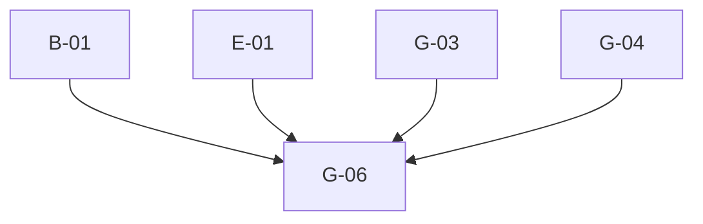

# Phase 4: Migration Plan & Stories — Packaging

> **Domain:** `packaging` · **Target DGS:** `PackagingService` → `plm-product`
> **Pipeline Version:** 2.0 · **Generated:** 2026-06-27
> **Depends on:** [be-02-resolver-analysis.md](./be-02-resolver-analysis.md), [be-03-schema.graphql](./be-03-schema.graphql), [be-03-schema-analysis.md](./be-03-schema-analysis.md), [be-05-attribute-inventory.md](./be-05-attribute-inventory.md)
> **Index:** `be-04-stories-index.yaml`

Each story is self-contained. Full pseudo-logic in [be-02-resolver-analysis.md](./be-02-resolver-analysis.md).
- **ACL is context-only** — no ACL work in any story. Base path `packaging/v1`.

## 1. Phases Overview
| Phase | Name | Stories |
|---|---|---|
| B | Core Reads | B-01–B-06 |
| C | Search & Listing | C-01 |
| D | Mutations (simple) | D-01–D-09 |
| E | Complex (multi-step write) | E-01 |
| F | Federation (internal) | F-01 |
| G | Field Resolvers & Tests | G-01–G-06 |

> **Self-contained story model.** The Netflix-DGS-on-REST framework already exists, so **every operation story below is end-to-end in a single PR**: it adds the schema (query/mutation + the GraphQL type definitions it returns), the DGS data fetcher, the Kotlin REST service method (read or write) that calls the backend, and pushes the schema change to the **Hive** registry. There is **no separate service-layer story** — the former `*Service` Kotlin-port story has been dissolved into the operation stories.

## 2. Dependency Graph

---

## 3. Stories

### Phase B — Core Reads

---

### PKG-BE-B-01 · `getPackagings(...)`
- **Type:** Query · **Phase:** B · **Complexity:** Low · **Category:** CAT-2 · **Depends on:** —

- **In plain terms:** List packagings with paging and filters.

> **Note — DGS Module Init (this PR only):** Creates `packaging.graphqls` (federation v2.3 header, scalars, owned types with `@key`, external stubs), registers scalars in `ScalarConfig.kt`, and wires the service and Feign client. Full type list: [be-03-schema.graphql](./be-03-schema.graphql).
- **Current Behaviour (Q1):** (own) `getPackagings().load({page,size,packagingIds,parentIds,workspaceIds,partnerIds,statusIds})` → paged. **Target:** `@DgsQuery → PackagingPaged`. 

#### Acceptance Criteria

1. all 7 filter args forwarded; defaults page=0/size=10000.

---

### PKG-BE-B-02 · `getPackagingById(packagingId)`
- **Type:** Query · **Phase:** B · **Complexity:** Low · **Category:** CAT-2 · **Depends on:** B-01

- **In plain terms:** Fetch one packaging by id.

- **Current Behaviour (Q2):** (ACL context) token → (own) `getPackagingById.load(packagingId)`. **Target:** `@DgsQuery → Packaging`. 

#### Acceptance Criteria

1. returns packaging; miss→null.

---

### PKG-BE-B-03 · `getDielines(...)`
- **Type:** Query · **Phase:** B · **Complexity:** Low · **Category:** CAT-2 · **Depends on:** B-01

- **In plain terms:** List dielines (print layouts) for a packaging.

- **Current Behaviour (Q3):** (own) `getDielines.load({...})` → `.dielines`. **Target:** `@DgsQuery → [Dieline]`. 

#### Acceptance Criteria

1. filters forwarded; returns the `dielines` array.

---

### PKG-BE-B-04 · `getPackagingFieldValuesByType(type, ids)`
- **Type:** Query · **Phase:** B · **Complexity:** Low · **Category:** CAT-2 · **Depends on:** B-01

- **In plain terms:** Return packaging field-value lookups by type.

- **Current Behaviour (Q4):** (own) `getPackagingFieldValuesByType(type, ids)`. **Target:** `@DgsQuery → [PackagingFieldValues]`. 

#### Acceptance Criteria

1. by type (+optional ids).

---

### PKG-BE-B-05 · `getDielineEvaluationStatuses` (cacheable)
- **Type:** Query · **Phase:** B · **Complexity:** Low · **Category:** CAT-2 · **Depends on:** B-01

- **In plain terms:** Return the dieline evaluation-status lookup (cached).

- **Current Behaviour (Q5):** (own) `getDielineEvaluationStatuses()`. **Target:** `@DgsQuery` → `@Cacheable` → `[CodeDescription]`. 

#### Acceptance Criteria

1. returns statuses; cached.

---

### PKG-BE-B-06 · `getCountries(codes)` (cacheable)
- **Type:** Query · **Phase:** B · **Complexity:** Low · **Category:** CAT-2 · **Depends on:** B-01

- **In plain terms:** Return the country lookup (cached).

- **Current Behaviour (Q6):** (own) `getCountries(codes)`. **Target:** `@DgsQuery` → `@Cacheable` → `[Countries]`. 

#### Acceptance Criteria

1. returns countries (optionally filtered by codes).

---

### Phase C — Search & Listing

---

### PKG-BE-C-01 · `getPackagingElastic(parentHumanId)`
- **Type:** Query · **Phase:** C · **Complexity:** Medium · **Category:** CAT-2 · **Depends on:** B-01 · **EXT:** 🔴 `search`

- **In plain terms:** Search a product's packagings via elastic.

- **Current Behaviour (Q7):** (🔴 search) `search.getPackagingElastic.load({ q:"parentId: {parentHumanId}" })` → `.content`. **EXT:** 🔴 search. **Target:** `@DgsQuery → [Packaging]`. 

#### Acceptance Criteria

1. `parentId:` elastic query built; returns content.

---

### Phase D — Mutations (simple)

---

### PKG-BE-D-01 · `addPackaging`
- **Type:** Mutation · **Phase:** D · **Complexity:** Medium · **Category:** CAT-2 · **Depends on:** B-01

- **In plain terms:** Create a packaging.

- **Current Behaviour (M1):** (own) `POST packaging/v1`. **Throw on `validationErrors`/`message`.** **Target:** `@DgsMutation → Packaging`; port throw-on-error. 

#### Acceptance Criteria

1. creates.
2. validation error → exception.

---

### PKG-BE-D-02 · `evaluateDieline`
- **Type:** Mutation · **Phase:** D · **Complexity:** Low · **Category:** CAT-2 · **Depends on:** B-01

- **In plain terms:** Trigger evaluation of a dieline.

- **Current Behaviour (M3):** (own) `PUT packaging/v1/dielines/{dielineId}/evaluate`. **Target:** `@DgsMutation → Dieline`. 

#### Acceptance Criteria

1. evaluates the dieline.

---

### PKG-BE-D-03 · `bulkAddPackagings`
- **Type:** Mutation · **Phase:** D · **Complexity:** Medium · **Category:** CAT-2 · **Depends on:** B-01

- **In plain terms:** Create many packagings at once.

- **Current Behaviour (M4):** (own) `bulkAddPackagings`. **Throw on `validationErrors`/`message`.** **Target:** `@DgsMutation → PackagingBulk`. 

#### Acceptance Criteria

1. bulk creates.
2. error → throw.

---

### PKG-BE-D-04 · `bulkUpdatePackagings`
- **Type:** Mutation · **Phase:** D · **Complexity:** Medium · **Category:** CAT-2 · **Depends on:** B-01

- **In plain terms:** Update many packagings at once.

- **Current Behaviour (M5):** token for `packaging[].humanId` → (own) `bulkUpdatePackagings`. **Throw on error.** **Target:** `@DgsMutation → PackagingBulk`. 

#### Acceptance Criteria

1. bulk updates.
2. error → throw.

---

### PKG-BE-D-05 · `exportPackaging`
- **Type:** Mutation · **Phase:** D · **Complexity:** Low · **Category:** CAT-2 · **Depends on:** B-01

- **In plain terms:** Kick off a packaging export.

- **Current Behaviour (M6):** token → (own) `requestPackagingExport({workspace_id, workspace_description, product_ids})` → request id. **Target:** `@DgsMutation → String`. 

#### Acceptance Criteria

1. returns the export request id.

---

### PKG-BE-D-06 · `lockPackaging`
- **Type:** Mutation · **Phase:** D · **Complexity:** Low · **Category:** CAT-2 · **Depends on:** B-01

- **In plain terms:** Lock a packaging from edits.

- **Current Behaviour (M7):** token → `PUT packaging/v1/{id}/lock`. **Target:** `@DgsMutation → Packaging`. 

#### Acceptance Criteria

1. locks.

---

### PKG-BE-D-07 · `unlockPackaging`
- **Type:** Mutation · **Phase:** D · **Complexity:** Low · **Category:** CAT-2 · **Depends on:** B-01

- **In plain terms:** Unlock a packaging.

- **Current Behaviour (M8):** token → `PUT packaging/v1/{id}/unlock`. **Target:** `@DgsMutation → Packaging`. 

#### Acceptance Criteria

1. unlocks.

---

### PKG-BE-D-08 · `cloneFilesForDielines`
- **Type:** Mutation · **Phase:** D · **Complexity:** Medium · **Category:** CAT-2 · **Depends on:** B-01 · **EXT:** 🔴 `attachment`

- **In plain terms:** Copy attachment files for dielines.

- **Current Behaviour (M9):** token → `Promise.all(attachmentIds.map(id => (🔴 attachment) cloneAttachmentV3({cloneReferences}, id)))`, flatten. **EXT:** 🔴 attachment. **Target:** structured-concurrency fan-out. 

#### Acceptance Criteria

1. clones each id with the shared `cloneReferences`.

---

### PKG-BE-D-09 · `updatePackagingComponentStatus`
- **Type:** Mutation · **Phase:** D · **Complexity:** Low · **Category:** CAT-2 · **Depends on:** B-01

- **In plain terms:** Update component status on packagings.

- **Current Behaviour (M10):** (own) `updatePackagingComponentStatus({productId, ids, status})`. **No JWT — confirm backend-enforced.** **Target:** `@DgsMutation → PackagingPagedForStatus`. 

#### Acceptance Criteria

1. updates statuses.
2. no-token behaviour documented.

---

### Phase E — Complex Operations

---

### PKG-BE-E-01 · `updatePackaging` (multi-step write)
- **Type:** Mutation · **Phase:** E · **Complexity:** 🔶 High · **Category:** CAT-2 · **Depends on:** B-01 · **EXT:** 🔴 `attachment` · 🟡 `relationship`

> **Spike-gated on `SPIKE-01` (Non-Atomic Write Saga) — draft ADR-013, ratification pending.** Saga steps: body PUT (validation checked **before** attachment side-effects — the late-check defect is fixed as an accepted deviation, ADR-013 pin-down 3) → attachment archive/attrs `RECORD`+reconcile → relationship add/remove `COMPENSATE`.

- **In plain terms:** Edit a packaging — a multi-step write (body + attachments + relationships) with no rollback today.

- **As a** DGS engineer **I want** the multi-step packaging update with a failure strategy **so that** body and
attachment add/remove changes stay consistent.
- **Current Behaviour (M2):** 1) token; set `humanId=packagingId`; `PUT packaging/v1` (body); 2) if
`attachmentsToRemove` → (🔴 attachment) `archiveAttachmentBulkV2` + (🟡 relationship) `removeRelationship`;
3) if `attachmentsToAdd` → (🟡 relationship) `addBulkRelationShip` (**reject on status≥400**) then
(🔴 attachment) `bulkUpdateAttributes`; 4) **throw on `validationErrors`/`message`**. No rollback.
- **EXT:** 🔴 attachment · 🟡 relationship. **Target:** ordered steps + chosen failure strategy

(**PO decision**); **align** the add/remove error handling (the remove branch currently swallows errors).

#### Acceptance Criteria

1. all branches in order.
2. add rejects on status≥400; remove error handling decided.
3. partial-failure strategy.

#### Test Cases

- [ ] body-only
- [ ] remove
- [ ] add
- [ ] status≥400
- [ ] partial-failure
- [ ] Parity: DGS response matches spark-internal-graphql baseline

---

### Phase F — Federation (internal)

---

### PKG-BE-F-01 · Product packaging links (internal, same subgraph)
- **Type:** Field Resolver · **Phase:** F · **Complexity:** Low · **Category:** CAT-2 · **Depends on:** B-01

- **In plain terms:** Expose a product's packagings on the Product type (same subgraph).

- **Current Behaviour:** Product references packaging (e.g. `components(...packaging)`, packaging attributes)
from the co-located packaging service. **Target:** **internal** `@DgsData` calling `PackagingService`
in-process (not gateway federation; depends only on the `Product`/`Component` types existing). 

#### Acceptance Criteria

1. resolves in-process; no gateway hop.

---

### Phase G — Field Resolvers & Tests

---

### PKG-BE-G-01 · `access` + `businessPartner` + `participantDetails`
- **Type:** Field Resolver · **Phase:** G · **Complexity:** Medium · **Category:** CAT-2 · **Depends on:** B-01 · **EXT:** 🔵 `vmm` · 🔵 `userGroup`

- **In plain terms:** Resolve a packaging's access / partner / participant fields.

- **Current Behaviour:** `access` → `accessControl.getPermissions([humanId])[0]` (context); `businessPartner`
→ (🔵 vmm) `loadBpsWithType([businessPartner])[0]`; `participantDetails` → `getUserGroup(humanId||id)`. 

#### Acceptance Criteria

1. each resolves; null-safe.

---

### PKG-BE-G-02 · `createdBy` + `updatedBy` + `dielineEvaluators`
- **Type:** Field Resolver · **Phase:** G · **Complexity:** Low · **Category:** CAT-2 · **Depends on:** B-01 · **EXT:** 🟡 `userAttributes`

- **In plain terms:** Resolve the people fields on a packaging.

- **Current Behaviour:** `createdBy`/`updatedBy` (🟡 user-profile `getUser`); `dielineEvaluators` → map
`userAttributes.getUserByID`, default `[]`. 

#### Acceptance Criteria

1. each resolves; null id → null.

---

### PKG-BE-G-03 · `product` + `workspaces` + `attachments`
- **Type:** Field Resolver · **Phase:** G · **Complexity:** Medium · **Category:** CAT-2 · **Depends on:** B-01 · **EXT:** 🔴 `search`

- **In plain terms:** Resolve a packaging's product, workspaces and attachments.

- **Current Behaviour:** `product` (internal, only if `parentId` starts `'PID'`); `workspaces`
→ (🔴 search) `getWorkspacesPagedV3({q:"id:(...)"})`.content; `attachments`
→ (🔴 search) `searchAttachmentsByRelatedResource(humanId)`. 

#### Acceptance Criteria

1. `product` null when not `PID*`.
2. workspaces/attachments via elastic.

---

### PKG-BE-G-04 · `suggestedRetailPriceByDPCI` + `waveDescription` + `retailPrice`
- **Type:** Field Resolver · **Phase:** G · **Complexity:** 🔶 High · **Category:** CAT-2 · **Depends on:** B-01 · **EXT:** 🟡 `tag` · 🔵 `apex`

- **In plain terms:** Resolve pricing fields (the dieline→DPCI→price chain).

- **Current Behaviour:** `suggestedRetailPriceByDPCI` — gated on `requiresSuggestedRetailPrice` + a BP id:
- collect printer ids from `packagingElements` → (own) `getDielines(printerIds)` → unique dpcis → (🔵 apex/pricing) `getRetailPriceByDpci({dpcis, bpId, productId})`; else `[]`.
- `waveDescription` → (🟡 tag) `getTag(wave).name` if `wave`, else `waveDescription`.
- `retailPrice` → `0` (deprecated).
- **Target:** port the pricing chain; cache/batch dielines.

#### Acceptance Criteria

1. price chain matches source; gate honored.
2. wave tag fallback.
3. `retailPrice`→0.

#### Test Cases

- [ ] price chain
- [ ] gate
- [ ] wave
- [ ] retailPrice

---

### PKG-BE-G-05 · `Dieline` + `PrinterDieline` + `PackagingElement` field resolvers
- **Type:** Field Resolver · **Phase:** G · **Complexity:** Medium · **Category:** CAT-2 · **Depends on:** B-01 · **EXT:** 🔴 `attachment` · 🔴 `search` · 🟡 `userAttributes`

- **In plain terms:** Resolve the dieline / printer-dieline / element sub-type fields.

- **Current Behaviour:** `Dieline.evaluatedBy` (🟡 user-profile), `Dieline.attachments` (🔴 search),
`Dieline.attachment` (🔴 attachment `getAttachmentsV3([attachmentId])[0]`); `PrinterDieline.dielines`
(own `getDielines({printerIds, statusIds})`); `PackagingElement.packagingLibrary` (internal fileLibrary). 

#### Acceptance Criteria

1. each field resolves to the right source.

---

### PKG-BE-G-06 · Tests, parity harness
- **Type:** Tests · **Phase:** G · **Complexity:** Medium · **Category:** CAT-5 · **Depends on:** B-01, E-01, G-03, G-04

- **In plain terms:** Prove the packaging subgraph matches the old gateway.

- **Target:** ≥80% unit coverage; parity fixtures (incl. the multi-step `updatePackaging`, the pricing chain,
attachment-by-search fields, create/bulk error contracts); contract test (schema diff intentional-only,
incl. `@deprecated`). 

#### Acceptance Criteria

1. unit ≥80%.
2. parity green.
3. schema-diff intentional.

---

## 4. Risk Register
| Risk | Likelihood | Impact | Mitigation | Owner |
|------|-----------|--------|------------|-------|
| `updatePackaging` multi-step partial failure (E-01) | Medium | High | Saga / compensation; align add/remove error handling | Tech Lead + PO |
| `suggestedRetailPriceByDPCI` multi-hop pricing (G-04) | Medium | Medium | Cache/batch; honor the `requiresSuggestedRetailPrice` gate | Backend Eng |
| `updatePackagingComponentStatus` no auth token (D-09) | Low | Medium | Confirm backend-enforced | PO |
| Attachment-by-search field perf (G-03/G-05) | Low | Medium | Shared helper; batch | Backend Eng |
| Claims pass-through on `PackagingInput` | Low | Low | Confirm ownership (packaging vs claims) | Product Owner |

## 5. Summary
- **Stories:** 24 (B:6 · C:1 · D:9 · E:1 · F:1 · G:6).
- **Critical path:** A-02/E-01→G-04→G-06.
- **Highest risk:** `updatePackaging` (E-01); `suggestedRetailPriceByDPCI` (G-04).
- **Co-located:** packaging is in the `plm-product` monorepo; Product packaging links resolve internally.

---
- **Phase Completed:** Phase 4 — Migration Stories · **Domain:** `packaging` · **Outputs:** be-04-stories.md, be-04-stories-index.yaml, be-04-po-summary.md.
