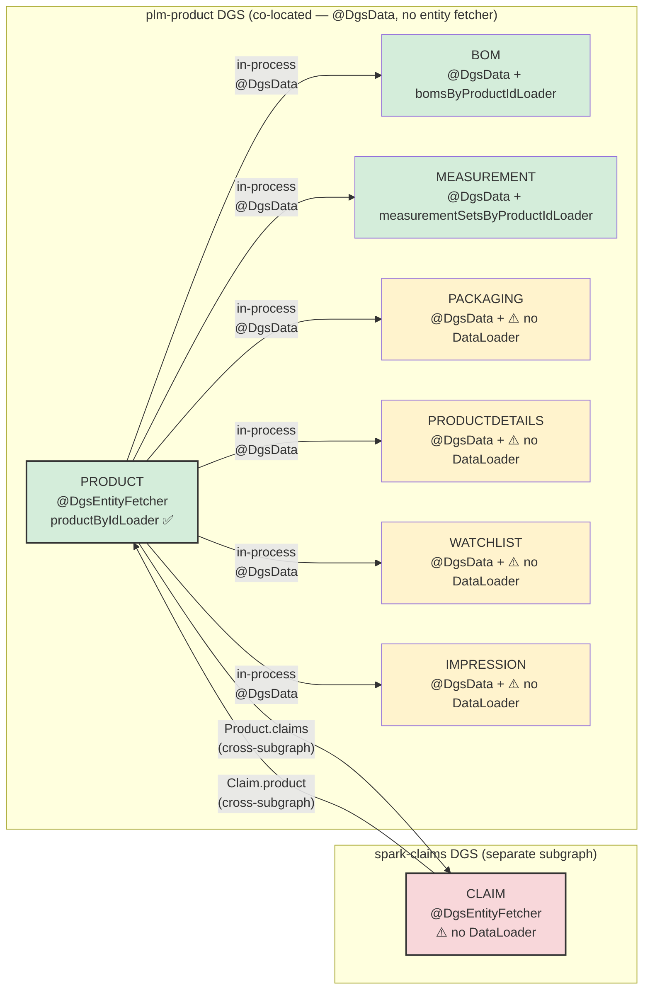

# Client Story Dependency — Cross-Domain Field Tracker

> **Purpose:** Track only fields and resolver paths that depend on another service or domain.
> This is for dependency tracking, not for listing every field.
> **Generated:** 2026-07-20 · **Sources:** `be-06-cross-domain-field-analysis.md` (all 8 domains), `ext-capability-stories.md`, `be-04-stories.md` (all 8 domains)

---

## How to Read This File

- **Field / Entity** — the GraphQL field or entity whose resolver crosses a domain boundary.
- **Story** — the existing story in the *owning* domain that implements this resolver.
- **External Dep** — the external service or domain the resolver calls.
- **Ext-Story** — the story in the *providing* domain that guarantees the endpoint/entity exists. `—` means the external service is a pre-existing REST API or gateway stub with no migration story.
- **New?** — `Yes` if a NEW story must be created; blank if covered.
- **Impacts** — which FE stories or downstream consumers are affected.
- **Notes** — classification or risk.

> **Excluded:** direct fields, simple calculated fields, pure pass-throughs, and co-located internal fields (e.g. measurement→product within plm-product).

---

## Entity Resolvers & DataLoaders — Per-Domain Inventory

### Cross-Subgraph Entity Fetchers (required — gateway resolves via `_entities` query)

Only domains on a **separate DGS subgraph** need `@DgsEntityFetcher`. The gateway calls the `_entities` query with `@key` representations to hydrate entities across subgraph boundaries.

| Domain | Entity | Fetcher Pattern | Story | DataLoader Key | Consumers (who calls it) | Notes |
|---|---|---|---|---|---|---|
| **product** | `Product` | `@DgsEntityFetcher(name = "Product")` | PRODUCT-BE-H-06 | `productByIdLoader.load(productId)` | spark-claims (H-01), all FE via gateway | ✅ Fully defined — DataLoader + EntityFetcher |
| **claims** | `SPARK_Claim` | `@DgsEntityFetcher(name = "SPARK_Claim")` | CLAIM-BE-H-01 | ⚠️ **NOT DEFINED** | product (ResourcesCount.claims) | ⚠️ GAP — Story defines entity fetcher but omits DataLoader/batch pattern |

### Co-Located Internal Field Resolvers (no entity fetcher needed — same plm-product DGS)

These 6 domains are **co-located in plm-product DGS**. Product resolves their fields via internal `@DgsData` method calls — no gateway hop, no `_entities` query, no `@DgsEntityFetcher` required.

| Domain | Entity | Resolution Pattern | Story | DataLoader? | Consumers (who calls it) | Notes |
|---|---|---|---|---|---|---|
| **bom** | `SPARK_Bom` | `@DgsData(parentType = "Product")` | BOM-BE-F-01 | ✅ `bomsByProductIdLoader` (AC #5 on F-01) | product (Product.productBoms/boms/packagingBoms) | In-process — ships on green |
| **measurement** | `SPARK_MeasurementSet` | `@DgsData(parentType = "Product")` | MST-BE-F-01 | ✅ `measurementSetsByProductIdLoader` (AC #4 on F-01) | product (Product.measurementSets) | In-process — ships on green |
| **packaging** | `SPARK_Packaging` | `@DgsData(parentType = "Product")` | PKG-BE-F-01 | ❌ **NONE DEFINED** | product (Product.packagingBoms) | ⚠️ GAP — N+1 risk for list fields |
| **productDetails** | `SPARK_ProductDetails` | `@DgsData(parentType = "Product")` | PDTL-BE-F-01 | ❌ **NONE DEFINED** | product (Product.productDetails) | ⚠️ GAP — N+1 risk for list fields |
| **watchlist** | `SPARK_Watchlist` | `@DgsData(parentType = "Product")` | WATCHLIST-BE-F-01 | ❌ **NONE DEFINED** | product (Product.watchlists) | ⚠️ GAP — N+1 risk for list fields |
| **impression** | `SPARK_Impression` | `@DgsData(parentType = "Product")` | IMPRESSION-BE-F-01 | ❌ **NONE DEFINED** | product (Product.impressions/impressionCounts) | ⚠️ GAP — N+1 risk for list fields |

### DataLoader Gap Summary

| Domain | Has DataLoader Story? | Risk | Status |
|---|---|---|---|
| product | ✅ PRODUCT-BE-C-01 (ProductDataLoader), H-06 (entity fetcher) | None | ✅ Covered |
| bom | ✅ AC added to BOM-BE-F-01 | **Medium** — co-located, list fields | ✅ AC added — `bomsByProductIdLoader` |
| measurement | ✅ AC added to MST-BE-F-01 | **Medium** — co-located, list field | ✅ AC added — `measurementSetsByProductIdLoader` |
| claims | ✅ AC added to CLAIM-BE-H-01 | **High** — entity fetcher without batch = N+1 at gateway | ✅ AC added — `claimByIdLoader` |
| packaging | ✅ AC added to PKG-BE-F-01 | **Medium** — co-located, but list fields hit REST N times | ✅ AC added — `packagingByProductIdLoader` |
| productDetails | ✅ AC added to PDTL-BE-F-01 | **Medium** — co-located, list fields | ✅ AC added — `productDetailsByProductIdLoader` |
| watchlist | ✅ AC added to WATCHLIST-BE-F-01 | **Medium** — co-located, list fields | ✅ AC added — `watchlistByProductIdLoader` |
| impression | ✅ AC added to IMPRESSION-BE-F-01 | **Low** — co-located, small cardinality | ✅ AC added — `impressionByProductIdLoader` |

### Canonical Kotlin Patterns

#### DataLoader (MappedBatchLoader — batches N IDs into 1 REST call)

```kotlin
@DgsDataLoader(name = "bomByIdLoader")
class BomByIdDataLoader(
    private val bomService: BomService
) : MappedBatchLoader<String, SPARK_Bom> {
    override fun load(keys: Set<String>): CompletionStage<Map<String, SPARK_Bom>> {
        return CompletableFuture.supplyAsync {
            bomService.getBomsByIds(keys.toList())
                .associateBy { it.id }
        }
    }
}
```

#### Entity Fetcher (cross-subgraph — only product & claims)

```kotlin
@DgsEntityFetcher(name = "Product")
fun product(values: Map<String, Any>, dfe: DgsDataFetchingEnvironment): CompletableFuture<Product?> {
    val id = values["id"] as String
    val loader = dfe.getDataLoader<String, Product>("productByIdLoader")
    return loader.load(id)
}
```

#### Internal Field Resolver (co-located — bom, measurement, packaging, etc.)

```kotlin
@DgsData(parentType = "Product", field = "productBoms")
fun productBoms(dfe: DgsDataFetchingEnvironment): CompletableFuture<List<SPARK_Bom>> {
    val product = dfe.getSource<Product>()
    val loader = dfe.getDataLoader<String, List<SPARK_Bom>>("bomsByProductIdLoader")
    return loader.load(product.id)
}
```

> **Key rules:**
> 1. Entity fetchers MUST use `MappedBatchLoader` (returns `null` for unknown IDs — never throws, per federation spec)
> 2. Co-located `@DgsData` resolvers SHOULD use DataLoaders to batch when the parent is a list (e.g. `getProducts` returning 50 products → 1 batched bom fetch, not 50)
> 3. Co-located domains do NOT need `@DgsEntityFetcher` — they are in-process within plm-product DGS

### Dependency Chain



---

## 1. PRODUCT Domain

### 1a. Cross-Subgraph Entity Resolution (Phase H — BLOCKED)

| Field / Entity | Story | External Dep | Ext-Story | New? | Impacts | Notes |
|---|---|---|---|---|---|---|
| `ResourcesCount.productAttachments` | PRODUCT-BE-H-01 | plm-attachment subgraph | EXT-ATTACHMENT-04 (no domain story) | | F-09 (facade retirement) | ⛔ BLOCKED — attachment domain not in migration |
| `ResourcesCount.discussions` | PRODUCT-BE-H-02 | plm-discussion subgraph | EXT-DISCUSSION-24 (no domain story) | | F-09 | ⛔ BLOCKED — discussion domain not in migration |
| `ResourcesCount.sample` | PRODUCT-BE-H-03 | plm-sample subgraph | EXT-SAMPLE-08 (no domain story) | | F-09 | ⛔ BLOCKED — sample domain not in migration |
| `ResourcesCount.claims` | PRODUCT-BE-H-04 | spark-claims subgraph | **CLAIM-BE-H-02** | | F-09 | ✅ Covered — only TechPack field with a real ext-story |
| `ResourcesCount.constructions` | PRODUCT-BE-H-05 | construction subgraph | (no domain story) | | F-09 | ⛔ BLOCKED — construction domain not in migration |
| `Product` entity fetcher | PRODUCT-BE-H-06 | — (enables refs TO Product) | — | | CLAIM-BE-H-01, CLAIM-FE-002 | Required for any cross-subgraph Product ref |

### 1b. Mutations Calling External Services

| Field / Entity | Story | External Dep | Ext-Story | New? | Impacts | Notes |
|---|---|---|---|---|---|---|
| `addProduct` → workspace assoc | PRODUCT-BE-D-01 | WorkspaceService (REST) | — | | PRODUCT-FE-007 | REST call; workspace not migrating |
| `addProduct` → attachment | PRODUCT-BE-D-02 | plm-attachment (REST) | — | | PRODUCT-FE-007 | REST call to existing API |
| `updateProduct` → attachment archive | PRODUCT-BE-D-04 | plm-attachment (REST) | — | | PRODUCT-FE-007 | REST call to existing API |
| `partnerActions` → sample cleanup | PRODUCT-BE-E-01 | SampleService (REST) | — | | PRODUCT-FE-008 | Fan-out; strategy per ADR-012 |
| `partnerActions` → favorite/recent/todo | PRODUCT-BE-E-01 | Dashboard services (REST) | — | | PRODUCT-FE-008 | Fan-out cleanup; best-effort |
| `updateComponentStatuses` → claim | PRODUCT-BE-E-02 | spark-claims (REST) | CLAIM-BE-D-05 | | PRODUCT-FE-008 | Only cross-DGS mutation call |

### 1c. Field Resolvers Calling External Services (Phase G — dependency-bearing only)

| Field / Entity | Story | External Dep | Ext-Story | New? | Impacts | Notes |
|---|---|---|---|---|---|---|
| `Product.attachmentsWithMetaData` | PRODUCT-BE-G-01 | plm-attachment, RelationshipService, SampleService | — | | PRODUCT-FE-001/002 | 🔴 Very High — ~200-line resolver, 3 ext calls |
| `Product.attachments` / `attachmentsV3` | PRODUCT-BE-G-03 | plm-attachment, RelationshipService | — | | PRODUCT-FE-001/002 | Shares G-01 service path |
| `Product.samples` / `sampleIds` | PRODUCT-BE-G-05 | RelationshipService, SearchService | — | | PRODUCT-FE-003 | |
| `Product.discussionsV2` / `discussionsCount` | PRODUCT-BE-G-06 | SearchService, plm-discussion | — | | PRODUCT-FE-004 | discussionsCount → separate DGS |
| `Product.teams` | PRODUCT-BE-G-06 | TeamService | — | | PRODUCT-FE-004 | |
| `Product.workspaces` | PRODUCT-BE-G-06 | SearchService | — | | PRODUCT-FE-004 | |
| `Product.productWorkspaceAttributes` | PRODUCT-BE-G-09 | SearchService, TagService | — | | PRODUCT-FE-005 | |
| `Product.components` | PRODUCT-BE-G-02 | ACL (batch), packaging/bom/measurement/productDetails (co-located) | — | | PRODUCT-FE-002 | 🔴 Very High — 50+ components, ACL batched |
| `ProductsCategories.categories` (12-case) | PRODUCT-BE-G-04 | VMM, IG, TagService, packaging | — | | PRODUCT-FE-003 | Polymorphic 12-case dispatch |
| `Product.rating` | PRODUCT-BE-G-10 | External Rating API | — | | PRODUCT-FE-006 | Secret from Vault |

### 1d. Gateway Platform Stubs (🔵 — verification only, no DGS build)

| Field / Entity | Story | External Dep | Ext-Story | New? | Impacts | Notes |
|---|---|---|---|---|---|---|
| `Product.brand` / `brands` / `clazz` / `department` / `division` | PRODUCT-BE-G-13 | VMM (brand), IG | — | | **8 FE stories** | ⚠️ FE chokepoint — prioritize early |
| `DopplerDepartment.*` (5 fields) | PRODUCT-BE-G-04 | IG, Doppler | — | | PRODUCT-FE-003 | Gateway stitch `@extends` |
| `Tcin.itemDetails` | PRODUCT-BE-G-13 | Corona (Items) | — | | PRODUCT-FE-006 | Gateway stitch |
| Platform stubs (VMM/IG/Doppler/CORONA/APEX) | PRODUCT-BE-F-11 | 5 platforms | — | | F-10 (composition) | Verify each stub resolves |

---

## 2. BOM Domain

### 2a. External Service Calls (Phase G)

| Field / Entity | Story | External Dep | Ext-Story | New? | Impacts | Notes |
|---|---|---|---|---|---|---|
| `BomCombinationMaterial.libraryResource` | BOM-BE-G-07 | CombinationService | — | | BOM-FE-002 | |
| `BomFabricMaterial.libraryResource` | BOM-BE-G-05 | SearchService (elastic) | — | | BOM-FE-002 | 🔴 |
| `BomFabricSpecMaterial.libraryResource` | BOM-BE-G-06 | FabricService | — | | BOM-FE-002 | |
| `BomTrimMaterial.libraryResource` / `sizeCaption` / `sizeValue` / `materialLibraryUom` / `facilityName` | BOM-BE-G-08 | TrimService, VMM Location | — | | BOM-FE-002 | 5 fields, 🟡 High — trim size dispatchers |
| `BomWashMaterial.libraryResource` | BOM-BE-G-09 | WashService | — | | BOM-FE-002 | |
| `BomImpressionDetails.libraryResource` (shared) | BOM-BE-G-10 | SearchService (elastic) | — | | BOM-FE-002 | Shared by G-11/G-12/G-13 |
| `BomMaterialSearchResult.fabric` / `fabricSpec` / `relatedMaterials` | BOM-BE-G-15 | FabricService, SearchService | — | | BOM-FE-003 | Depends on C-02 |

### 2b. Federation Contributions (Phase F — internal, same DGS)

| Field / Entity | Story | External Dep | Ext-Story | New? | Impacts | Notes |
|---|---|---|---|---|---|---|
| `Product.productBoms` / `boms` / `packagingBoms` | BOM-BE-F-01 | product (co-located) | — | | PRODUCT-FE-002 | Ships on green |
| `ResourcesCount.bomsCount` | BOM-BE-F-02 | product (co-located) | — | | E-03 TechPack | Ships on green |

---

## 3. CLAIMS Domain (separate `spark-claims` DGS)

### 3a. Cross-Subgraph Federation (Phase H — BLOCKED)

| Field / Entity | Story | External Dep | Ext-Story | New? | Impacts | Notes |
|---|---|---|---|---|---|---|
| `Product.claims` | CLAIM-BE-H-01 | plm-product (extending Product) | **PRODUCT-BE-F-14**, **PRODUCT-BE-H-06** | | CLAIM-FE-002 | ⛔ BLOCKED on contract alignment + entity fetcher |
| `ResourcesCount.claims` | CLAIM-BE-H-02 | plm-product (extending ResourcesCount) | **PRODUCT-BE-E-03** (facade), **PRODUCT-BE-F-14** | | TechPack | ⛔ BLOCKED |

### 3b. Field Resolvers Calling External Services (Phase G)

| Field / Entity | Story | External Dep | Ext-Story | New? | Impacts | Notes |
|---|---|---|---|---|---|---|
| `Claims.product` / `parentDetails` | CLAIM-BE-G-03 | plm-product (Product entity) | **PRODUCT-BE-H-06** | | CLAIM-FE-002 | Depends on G-06 (value-type alignment) |
| `ParentDetails.otherClaimBps` / `systemTeams` | CLAIM-BE-G-03 | SearchService (elastic) | — | | CLAIM-FE-002 | 🔴 |
| `Claims.businessPartner` / `designPartner` | CLAIM-BE-G-02 | VMM (gateway stitch) | — | | CLAIM-FE-002 | 🔵 Platform stub |
| `getClaimsElastic` | CLAIM-BE-C-02 | SearchService (elastic) | — | | CLAIM-FE-002 | 🔴 |

---

## 4. MEASUREMENT Domain

### 4a. Cross-Subgraph Federation (Phase H — BLOCKED)

| Field / Entity | Story | External Dep | Ext-Story | New? | Impacts | Notes |
|---|---|---|---|---|---|---|
| `SampleV2.sampleMeasurement` | MST-BE-H-01 | plm-sample (extending SampleV2) | — | | sample FE | ⛔ BLOCKED on sample subgraph deploy |
| `SampleMeasurementSet.sample` | MST-BE-H-02 | plm-sample (forward ref) | — | | sample FE | ⛔ BLOCKED; PO-gated |

### 4b. External Service Calls (Phase G)

| Field / Entity | Story | External Dep | Ext-Story | New? | Impacts | Notes |
|---|---|---|---|---|---|---|
| `getMeasurements` (id resolution) | MST-BE-C-01 | RelationshipService | — | | MST-FE-001 | 🔴 — core listing query |
| `getMeasurementsElastic` | MST-BE-C-02 | SearchService (elastic) | — | | MST-FE-001 | 🔴 |
| `MeasurementTemplate.brands` / `departments` / `divisions` | MST-BE-G-05 | VMM, IG (gateway stitch) | — | | MST-FE-003 | 🔵 Platform stubs |
| `TightFit.brands` / `departments` / `divisions` | MST-BE-G-07 | VMM, IG (gateway stitch) | — | | MST-FE-003 | 🔵 Platform stubs |

### 4c. Internal Federation (Phase F)

| Field / Entity | Story | External Dep | Ext-Story | New? | Impacts | Notes |
|---|---|---|---|---|---|---|
| `Product.measurementSets` | MST-BE-F-01 | RelationshipService, product (co-located) | — | | PRODUCT-FE-002 | Ships on green |

---

## 5. PACKAGING Domain

| Field / Entity | Story | External Dep | Ext-Story | New? | Impacts | Notes |
|---|---|---|---|---|---|---|
| `updatePackaging` → attachment add/remove | PKG-BE-E-01 | plm-attachment (REST) | — | | PKG-FE-004 | Multi-step write; E-00 gated |
| `cloneFilesForDielines` | PKG-BE-D-08 | plm-attachment (REST) | — | | PKG-FE-004 | |
| `Packaging.attachments` / `workspaces` | PKG-BE-G-03 | SearchService (elastic) | — | | PKG-FE-003 | 🔴 |
| `Dieline.attachment` / `attachments` | PKG-BE-G-05 | plm-attachment, SearchService | — | | PKG-FE-003 | 🔴 |
| `suggestedRetailPriceByDPCI` | PKG-BE-G-04 | TagService, APEX (pricing) | — | | PKG-FE-003 | 🟡 High — multi-hop pricing chain |
| `PackagingElement.packagingLibrary` | PKG-BE-G-05 | FileLibraryService | — | | PKG-FE-003 | 🔵 |
| `Product` packaging links (internal) | PKG-BE-F-01 | product (co-located) | — | | PRODUCT-FE-002 | Ships on green |

---

## 6. PRODUCT DETAILS Domain

| Field / Entity | Story | External Dep | Ext-Story | New? | Impacts | Notes |
|---|---|---|---|---|---|---|
| `updateProductDetailsSet` → attachment archive | PDTL-BE-E-01 | plm-attachment, WorkspaceService (REST) | — | | PDTL-FE-003 | Multi-step write; E-00 gated |
| `cloneFilesForProductDetails` | PDTL-BE-D-04 | plm-attachment (REST) | — | | PDTL-FE-003 | |
| `ProductDetails.attachment` / item `.attachment` / `.constructionSetAttachments` | PDTL-BE-G-03 | SearchService (elastic) | — | | PDTL-FE-002 | 🔴 — 3 fields, all elastic |
| `ProductDetailsCategoryWithSection.subCategories` | PDTL-BE-G-03 | SpecificationsTemplateService | — | | PDTL-FE-002 | 🟡 Co-located service |
| `Product.productDetails` (internal) | PDTL-BE-F-01 | product (co-located) | — | | PRODUCT-FE-002 | Ships on green |

---

## 7. WATCHLIST Domain

| Field / Entity | Story | External Dep | Ext-Story | New? | Impacts | Notes |
|---|---|---|---|---|---|---|
| `updateWatchlistEntries` → attachment + user-group | WATCHLIST-BE-E-01 | plm-attachment, UserGroupService (REST) | — | | WATCHLIST-FE-003 | Multi-step write; E-00 gated |
| `getWatchlistByFilter` | WATCHLIST-BE-C-01 | SearchService (elastic), product (co-located) | — | | WATCHLIST-FE-001 | 🔴 |
| `Watchlist.attachments` | WATCHLIST-BE-G-03 | SearchService (elastic) | — | | WATCHLIST-FE-001 | 🔴 |
| `WatchlistPartner.partnerName` | WATCHLIST-BE-G-02 | VMM (gateway stitch) | — | | WATCHLIST-FE-001 | 🔵 |
| `Product.watchlists` (internal) | WATCHLIST-BE-F-01 | product (co-located) | — | | PRODUCT-FE-002 | Ships on green |
| `ResourcesCount.watchlists` (internal) | WATCHLIST-BE-F-02 | product (co-located) | — | | E-03 TechPack | Ships on green |

---

## 8. IMPRESSION Domain

| Field / Entity | Story | External Dep | Ext-Story | New? | Impacts | Notes |
|---|---|---|---|---|---|---|
| `Impression.createdBy` / `updatedBy` | IMPRESSION-BE-G-01 | UserProfileService | — | | IMPRESSION-FE-002 | 🔵 |
| `Impression.businessPartners` / `owningBusinessPartner` | IMPRESSION-BE-G-01 | VMM (gateway stitch) | — | | IMPRESSION-FE-002 | 🔵 |
| `Product.impressions` / `impressionCounts` (internal) | IMPRESSION-BE-F-01 | product (co-located) | — | | PRODUCT-FE-002 | Ships on green |

---

## NEW Stories Required

### Tier 1 — Consuming-side gaps (stories that should exist but don't)

None found. All 8 domains' consuming-side resolvers are covered by existing `be-04-stories.md` entries.

### Tier 2 — Owning-side "build once" capabilities (cross-team coordination)

These are tracked in `program/ext-capability-stories.md` as `EXT-*` capabilities. They are NOT new stories in the 8 migrating domains — they are work items for the **owning teams** of each external service. The most impactful by confirmed client usage:

| EXT ID | Service | Consuming Resolvers | Confirmed Client Usage | Owner |
|---|---|---|---|---|
| EXT-SEARCH-01 | SearchService (elastic) | 28 across 7 domains | 4 | Search team |
| EXT-ATTACHMENT-04 | plm-attachment | 11 across 4 domains | 7 | Attachment team |
| EXT-WORKSPACE-23 | WorkspaceService | 3 in product | 2 | Workspace team |
| EXT-USERGROUP-21 | UserGroupService | 2 in watchlist | 2 | User-Group team |
| EXT-RULELIBRARY-17 | RuleLibraryService | 3 in product | 3 | Rules team |
| EXT-RELATIONSHIP-07 | RelationshipService | 6 across 2 domains | 2 | Relationship team |
| EXT-DASHBOARD-11 | Dashboard services | 3 in product | 3 | Dashboard team |

> **Key distinction:** These external services are called via **REST/Feign clients**, not federation entities.
> The consuming-side stories already build the Feign client and make the call. What's missing is a
> **guarantee** that the REST endpoint continues to exist and behave correctly once the gateway is retired.
> This is a program-level coordination item, not a per-domain story gap.

### Tier 3 — TechPack domains not in migration

| Product Story | Blocked On | Status | Action |
|---|---|---|---|
| PRODUCT-BE-H-01 | attachment domain | ⛔ Not in migration scope | Facade (E-03) covers until domain migrates |
| PRODUCT-BE-H-02 | discussion domain | ⛔ Not in migration scope | Facade covers |
| PRODUCT-BE-H-03 | sample domain | ⛔ Not in migration scope | Facade covers |
| PRODUCT-BE-H-05 | construction domain | ⛔ Not in migration scope | Facade covers |

> The **TechPack facade** (`PRODUCT-BE-E-03`) is the mitigation — it serves all 11 `ResourcesCount` fields
> from a temporary aggregation endpoint. H-01 through H-05 replace the facade one domain at a time.
> Until each domain migrates, the facade answers that domain's fields. `F-09` (retire facade) is the
> last story — it lands only when all 8 contributors are live.

---

## Cross-Domain Blocker Chain (critical path)

```mermaid
flowchart TD
    E00["PRODUCT-BE-E-00<br/>WriteSaga Shared Module"] --> BOM_E01 & CLAIM_E01 & MST_E01 & PKG_E01 & PDTL_E01 & WL_E01

    BOM_E01["BOM-BE-E-01<br/>updateBom"]
    CLAIM_E01["CLAIM-BE-E-01<br/>updateClaim"]
    MST_E01["MST-BE-E-01<br/>updateMeasurement"]
    PKG_E01["PKG-BE-E-01<br/>updatePackaging"]
    PDTL_E01["PDTL-BE-E-01<br/>updateProductDetailsSet"]
    WL_E01["WATCHLIST-BE-E-01<br/>updateWatchlistEntries"]

    F14["PRODUCT-BE-F-14<br/>Contract Alignment"] --> CLAIM_H01 & CLAIM_H02 & F10
    H06["PRODUCT-BE-H-06<br/>Product Entity Fetcher"] --> CLAIM_H01 & F10

    CLAIM_H01["CLAIM-BE-H-01<br/>Product.claims"]
    CLAIM_H02["CLAIM-BE-H-02<br/>ResourcesCount.claims"]
    F10["PRODUCT-BE-F-10<br/>Hive Composition"]

    E03["PRODUCT-BE-E-03<br/>TechPack Facade"] --> H01 & H02 & H03 & H04 & H05
    H01["PRODUCT-BE-H-01<br/>⛔ attachment"] 
    H02["PRODUCT-BE-H-02<br/>⛔ discussion"]
    H03["PRODUCT-BE-H-03<br/>⛔ sample"]
    H04["PRODUCT-BE-H-04<br/>✅ claims"] 
    H05["PRODUCT-BE-H-05<br/>⛔ construction"]
    H01 & H02 & H03 & H04 & H05 --> F09["PRODUCT-BE-F-09<br/>Retire Facade"]

    G13["PRODUCT-BE-G-13<br/>IG/tag/tcin/spg<br/>⚠️ 8 FE stories"] --> FE["8 FE stories<br/>(Wave 4)"]

    style E00 fill:#d4edda,stroke:#333,stroke-width:3px
    style F14 fill:#cce5ff,stroke:#333,stroke-width:2px
    style G13 fill:#fff3cd,stroke:#333,stroke-width:2px
    style H01 fill:#f8d7da
    style H02 fill:#f8d7da
    style H03 fill:#f8d7da
    style H05 fill:#f8d7da
    style H04 fill:#d4edda
```



---

## Verification Checklist

- [x] Every field in this table is dependency-bearing (crosses a domain boundary)
- [x] No direct fields, simple calculated fields, or pure pass-throughs included
- [x] Every consuming-side story exists in the domain's `be-04-stories.md`
- [x] External dependency stories referenced where they exist (CLAIM-BE-H-02, PRODUCT-BE-F-14, etc.)
- [x] No placeholder `??` IDs — all NEW stories would go to `ext-capability-stories.md` as EXT items
- [x] TechPack facade (E-03) correctly shown as mitigation for unresolved H-01/H-02/H-03/H-05
- [x] `PRODUCT-BE-G-13` flagged as FE chokepoint (8 stories blocked)

---

*Cross-references: `program/ext-capability-stories.md` (EXT-* capabilities), `program/ext-dependency-stories.md` (per-domain EXT details), `program/cross-domain-dependencies.md` (program-level blockers), `program/fe-09-story-dependency-matrix.md` (FE→BE blocking), `USAGE-GUIDE.md` (role navigation).*
