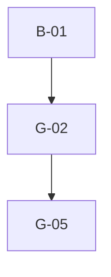

# Phase 4: Migration Plan & Stories — Watchlist

> **Domain:** `watchlist` · **Target DGS:** `WatchlistService` → `plm-product`
> **Pipeline Version:** 2.0 · **Generated:** 2026-06-27
> **Depends on:** [be-02-resolver-analysis.md](./be-02-resolver-analysis.md), [be-03-schema.graphql](./be-03-schema.graphql), [be-03-schema-analysis.md](./be-03-schema-analysis.md), [be-05-attribute-inventory.md](./be-05-attribute-inventory.md)
> **Index:** `be-04-stories-index.yaml`

Each story is self-contained. Full pseudo-logic in [be-02-resolver-analysis.md](./be-02-resolver-analysis.md).
- **ACL is context-only** — no ACL work in any story. Base path `watchlist/v1`. **Co-located in plm-product.**

## 1. Phases Overview
| Phase | Name | Stories |
|---|---|---|
| B | Core Reads | B-01–B-03 |
| C | Search & Listing | C-01 |
| D | Mutations (simple) | D-01–D-02 |
| E | Complex (multi-step write) | E-01 |
| F | Federation (internal) | F-01–F-02 |
| G | Field Resolvers | G-01–G-05 (G-05 recommended, PO-gated — federation review) |

> **Self-contained story model.** The Netflix-DGS-on-REST framework already exists, so **every operation story below is end-to-end in a single PR**: it adds the schema (query/mutation + the GraphQL type definitions it returns), the DGS data fetcher, the Kotlin REST service method (read or write) that calls the backend, and pushes the schema change to the **Hive** registry. There is **no separate service-layer story** — the former `*Service` Kotlin-port story has been dissolved into the operation stories.

## 2. Dependency Graph

---

## 3. Stories

### Phase B — Core Reads

---

### WATCHLIST-BE-B-01 · `getWatchlistByIds(ids)`
- **Type:** Query · **Phase:** B · **Complexity:** Low · **Category:** CAT-2 · **Depends on:** —

- **In plain terms:** Fetch watchlist entries by id.

> **Note — DGS Module Init (this PR only):** Creates `watchlist.graphqls` (federation v2.3 header, scalars, owned types with `@key`, external stubs), registers scalars in `ScalarConfig.kt`, and wires the service and Feign client. Full type list: [be-03-schema.graphql](./be-03-schema.graphql).
- **Current Behaviour (Q1):** (ACL context) token → `GET watchlist/v1?watchlistIds={csv}` → camelCase. **Target:** `@DgsQuery → [Watchlist]`. 

#### Acceptance Criteria

1. returns entries for ids; empty → [].

---

### WATCHLIST-BE-B-02 · `getWatchlistReasons` (cacheable)
- **Type:** Query · **Phase:** B · **Complexity:** Low · **Category:** CAT-2 · **Depends on:** B-01

- **In plain terms:** Return the watchlist-reason lookup (cached).

- **Current Behaviour (Q2):** (own) `GET watchlist/v1/watchlist_reasons`. **Target:** `@DgsQuery` → `@Cacheable` → `[CodeDescription]`. 

#### Acceptance Criteria

1. returns reasons; cached.

---

### WATCHLIST-BE-B-03 · `getWatchlistInspectionActions` (cacheable)
- **Type:** Query · **Phase:** B · **Complexity:** Low · **Category:** CAT-2 · **Depends on:** B-01

- **In plain terms:** Return the inspection-action lookup (cached).

- **Current Behaviour (Q3):** (own) `GET watchlist/v1/watchlist_inspection_action_types`. **Target:** `@DgsQuery` → `@Cacheable` → `[WatchlistInspectionAction]`. 

#### Acceptance Criteria

1. returns actions; cached.

---

### Phase C — Search & Listing

---

### WATCHLIST-BE-C-01 · `getWatchlistByFilter(...)` (4-step read)
- **Type:** Query · **Phase:** C · **Complexity:** Medium · **Category:** CAT-2 · **Depends on:** B-01 · **EXT:** 🔴 `search` · 🟡 `product`

- **In plain terms:** List watchlist entries for a workspace's products (a 4-step read).

- **Current Behaviour (Q4):** (internal) `product.getWorkspaceProducts({q,filter,workspaceId,page,size})` →
product `humanId`s → (🔴 search) `searchWatchlist({ q:"parentId:(... OR ...) AND workspaceContext: {workspaceId} AND statusId: 501", page, size })` → watchlist ids → (ACL) token → (own) `getWatchlistByIds`.
- **EXT:** 🔴 search · product internal. **Target:** `@DgsQuery → [Watchlist]`; chain the 4 calls.

#### Acceptance Criteria

1. product→search→watchlist chain preserved.
2. elastic query string exact (incl. `statusId: 501`).

---

### Phase D — Mutations (simple)

---

### WATCHLIST-BE-D-01 · `createWatchlistEntries`
- **Type:** Mutation · **Phase:** D · **Complexity:** Medium · **Category:** CAT-2 · **Depends on:** B-01 · **EXT:** 🔵 `userGroup`

- **In plain terms:** Create watchlist entries (and their user-groups).

- **Current Behaviour (M1):** `Promise.all(entries.map(w => { (own) createWatchlistEntries([w]); **throw on validationErrors/message**; then (🔵 user-group) addUserGroup({resourceId:humanId, participantDetails, relatedResources}); **throw on error** }))`, flatten. **EXT:** 🔵 user-group. **Target:** per-entry create + user-group; port both throw contracts. 

#### Acceptance Criteria

1. creates each entry + its user group.
2. either failure → exception.

---

### WATCHLIST-BE-D-02 · `cloneFilesForWatchlist`
- **Type:** Mutation · **Phase:** D · **Complexity:** Medium · **Category:** CAT-2 · **Depends on:** B-01 · **EXT:** 🔴 `attachment`

- **In plain terms:** Copy attachment files for watchlist entries.

- **Current Behaviour (M3):** (ACL) token → `Promise.all(attachmentIds.map((id,i) => (🔴 attachment) cloneAttachmentV3({cloneReferences:[cloneReference[i]]}, id)))`, stamp `parentResource=id`, flatten. **EXT:** 🔴 attachment. **Target:** structured-concurrency fan-out. 

#### Acceptance Criteria

1. clones each id with its paired cloneReference; `parentResource` stamped.

---

### Phase E — Complex Operations

---

### WATCHLIST-BE-E-01 · `updateWatchlistEntries` (multi-step write)
- **Type:** Mutation · **Phase:** E · **Complexity:** 🔶 High · **Category:** CAT-2 · **Depends on:** B-01 · **EXT:** 🔴 `attachment` · 🔵 `userGroup` · **Blocked by:** product (`PRODUCT-BE-E-00`, the shared `WriteSaga` module)

> **Draft ADR-013, ratification pending.** Against the shared `WriteSaga` module built in `PRODUCT-BE-E-00`:
> the unawaited per-entry user-group map is **awaited and ordered before the body** (accepted deviation,
> ADR-013 pin-down 2 — closes the race/unhandled-rejection defect); attachment archive is a `RECORD` step;
> JWT no longer fetched when the archive list is empty.

- **In plain terms:** Edit watchlist entries — a multi-step write (user-groups + body); today the group step isn't awaited (a bug).

- **As a** DGS engineer **I want** the multi-step watchlist update with correct ordering + a failure strategy
**so that** user-group, body, and attachment changes stay consistent.
- **Current Behaviour (M2):** 1) **per-entry (currently NOT awaited — bug):** `getUserGroups([humanId])`; if
existing participants → `updateUserGroup`, else (🔵 user-group) `addUserGroup` (throw on error);
2) (own) `updateWatchlistEntries(entries)` (throw on error); 3) collect `removedAttachmentIds` → (ACL)
token → (🔴 attachment) `archiveAttachmentBulkV3`. **No rollback.**
- **EXT:** 🔴 attachment · 🔵 user-group. **Target:** **await** the per-entry user-group upserts (fix the race)

before/with the body update; chosen failure strategy (**PO decision**). 

#### Acceptance Criteria

1. user-group upserts complete before the watchlist update (race fixed).
2. removed attachments archived.
3. partial-failure strategy.

#### Test Cases

- [ ] existing-participants path
- [ ] new-participants path
- [ ] attachment archive
- [ ] ordering/await
- [ ] partial-failure
- [ ] Parity: DGS response matches spark-internal-graphql baseline

---

### Phase F — Federation (internal, same subgraph)

---

### WATCHLIST-BE-F-01 · `Product.watchlists` (internal)
- **Type:** Field Resolver · **Phase:** F · **Complexity:** Low · **Category:** CAT-2 · **Depends on:** B-01

- **In plain terms:** Expose a product's watchlists on the Product type.

- **Current Behaviour:** Product exposes `watchlists` resolved from the co-located watchlist service. **Target:** **internal** `@DgsData` on `Product` calling `WatchlistService` in-process (not gateway federation). 

#### Acceptance Criteria

1. resolves in-process; no gateway hop.

---

### WATCHLIST-BE-F-02 · `ResourcesCount.watchlists` (internal — TechPack)
- **Type:** Field Resolver · **Phase:** F · **Complexity:** Low · **Category:** CAT-2 · **Depends on:** B-01

- **In plain terms:** Contribute the watchlists count to the TechPack rollup.

- **Target:** fill the TechPack `ResourcesCount.watchlists` count **internally** (same subgraph) — the
watchlist side of product's `PRODUCT-BE-F-08`. **This is CAT-2 internal, not gateway federation** (watchlist
is co-located; analogous to `BOM-BE-F-06` / `MST-BE-F-04`). 

#### Acceptance Criteria

1. count resolves in-process; parity vs the TechPack facade.

---

### Phase G — Field Resolvers & Tests

---

### WATCHLIST-BE-G-01 · Computed flatteners (status/reasons/inspection action)
- **Type:** Field Resolver · **Phase:** G · **Complexity:** Low · **Category:** CAT-2 · **Depends on:** B-01

- **In plain terms:** Flatten status / reason / inspection-action codes into readable fields.

- **Current Behaviour:** `statusId`=`status.code`, `statusName`=`status.description`, `reasonIds`=`reasons[].code`,
`reasons`=`reasons[].description`; `WatchlistInspection.actionId`=`action.code`, `action`=`action.description`. **Target:** computed `@DgsData` (no I/O). 

#### Acceptance Criteria

1. each flattener maps correctly.

---

### WATCHLIST-BE-G-02 · `createdBy` + `updatedBy` + `workspaces` + `participantDetails` + `partnerName`
- **Type:** Field Resolver · **Phase:** G · **Complexity:** Medium · **Category:** CAT-2 · **Depends on:** B-01 · **EXT:** 🟡 `userAttributes` · 🟡 `workspaceV2` · 🔵 `userGroup` · 🔵 `vmm`

- **In plain terms:** Resolve the people, workspace and partner fields.

- **Current Behaviour:** `createdBy`/`updatedBy` (🟡 user-profile); `workspaces` (🟡 workspaceV2 by
`workspaceContext`); `participantDetails` (🔵 user-group `getUserGroups([humanId])[0].participantDetails`);
`WatchlistPartner.partnerName` (🔵 vmm `getByID(partnerId).bpName`, null-safe). 

#### Acceptance Criteria

1. each resolves; null-safe.

---

### WATCHLIST-BE-G-03 · `attachments` + `product`
- **Type:** Field Resolver · **Phase:** G · **Complexity:** Medium · **Category:** CAT-2 · **Depends on:** B-01 · **EXT:** 🔴 `search`

- **In plain terms:** Resolve a watchlist entry's attachments and parent product.

- **Current Behaviour:** `attachments` → (🔴 search) `searchAttachmentsByRelatedResource(humanId)`; `product`
(internal, only if `parentId` starts `'PID'`). 

#### Acceptance Criteria

1. attachments via elastic.
2. `product` null when not `PID*`.

---

### WATCHLIST-BE-G-05 · `WatchlistPartner.partner` entity reference (recommended, PO-gated)
- **Type:** Field Resolver · **Phase:** G · **Complexity:** Low · **Category:** CAT-2 · **Depends on:** G-02 · **EXT:** 🔵 `vmm`
- **Status:** Recommended (PO-gated — federation-review/03 §2 REC-3)

- **In plain terms:** Adds `partner { … }` next to `partnerId`/`partnerName` on watchlist partner rows.

- **Context:** `WatchlistPartner.partnerName` is *already* a live VMM lookup (`getByID(partnerId).bpName`,
G-02) — the entity ref exposes the full partner from the same underlying call instead of one denormalized
field. `partnerId`/`partnerName` stay (client contract).
- **Target DGS Implementation:** schema adds `partner: VMM_BusinessPartner` on `WatchlistPartner`; resolver
emits `{id: partnerId}` — gateway hydrates from VMM; null-safe on missing `partnerId`.

#### Acceptance Criteria

1. PO approval recorded (OQ-5) before implementation starts.
2. `partner { id name }` resolves via the gateway; `partnerName` parity is preserved.
3. No additional VMM calls from the watchlist subgraph (stub emission only).

---

## 4. Risk Register
| Risk | Likelihood | Impact | Mitigation | Owner |
|------|-----------|--------|------------|-------|
| `updateWatchlistEntries` un-awaited user-group map (race) (E-01) | Medium | Medium-High | Await/`Promise.all`; failure strategy | Backend Eng + Tech Lead |
| `updateWatchlistEntries` multi-step partial failure (E-01) | Medium | Medium | Saga / compensation — PO decision | Tech Lead + PO |
| `getWatchlistByFilter` 4-step chain perf (C-01) | Low | Medium | Cache product lookup; paginate | Backend Eng |
| Product `PRODUCT-BE-F-08` mislabel (corrected to internal) | — | Low | F-08 reclassified CAT-2 internal | Product Owner |

## 5. Summary
- **Stories:** 13 (B:3 · C:1 · D:2 · E:1 · F:2 · G:4). G-05 (recommended, PO-gated) added by the federation review. Bug-fix/test-coverage stories (`G-04`) tracked outside this Jira pipeline, created manually.
- **Critical path:** A-02/C-01→E-01→G-02.
- **Highest risk:** `updateWatchlistEntries` (E-01) — multi-step + un-awaited user-group map.
- **Co-located:** watchlist is in the `plm-product` monorepo; `Product.watchlists` + TechPack count resolve internally.

---
- **Phase Completed:** Phase 4 — Migration Stories · **Domain:** `watchlist` · **Outputs:** be-04-stories.md, be-04-stories-index.yaml, be-04-po-summary.md.
