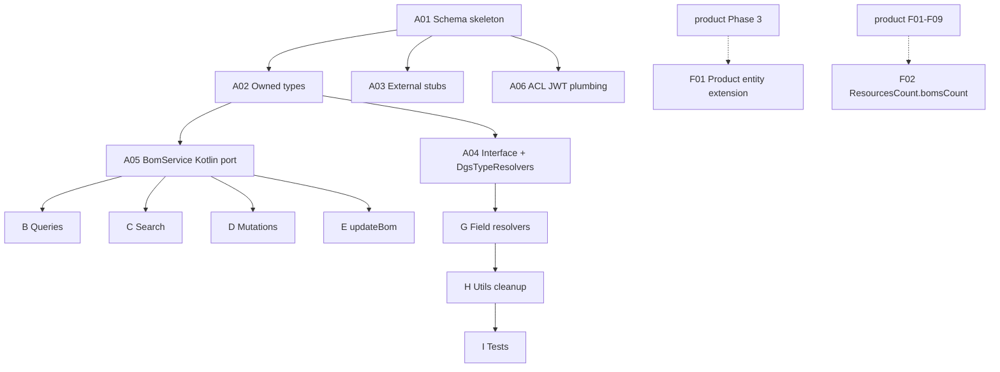

# Bom — Migration Plan & Stories

> **Domain:** `bom` · **Target DGS:** `plm-bom` (green-field, Kotlin / Netflix DGS)
> **Pipeline Version:** 1.1 · **Generated:** 2026-05-18
> **Depends on:** [02-resolver-analysis.md](output/bom/02-resolver-analysis.md), [02-resolver-analysis-mutations.md](output/bom/02-resolver-analysis-mutations.md), [02-resolver-analysis-fields.md](output/bom/02-resolver-analysis-fields.md), [02-resolver-analysis-services.md](output/bom/02-resolver-analysis-services.md), [03-schema.graphql](output/bom/03-schema.graphql), [03-schema-analysis.md](output/bom/03-schema-analysis.md)

---

## 1. Migration Phases Overview

| Phase | Name | Stories | Effort (raw d) | +20% buffer |
|---|---|---|---|---|
| A | Foundation & Schema | 6 | 11–18 | 13–22 |
| B | Core Queries (master data + simple lookups) | 5 | 5–10 | 6–12 |
| C | Search & Listing | 3 | 8–13 | 10–16 |
| D | Core Mutations | 5 | 6–12 | 7–14 |
| E | Complex Mutation (updateBom 3-step) | 1 | 5–8 | 6–10 |
| F | Federation contributions (Product extension + TechPack stub) | 2 | 4–7 | 5–9 |
| G | Field Resolvers (15 stories incl. trim X-Large) | 15 | 26–47 | 31–56 |
| H | Services + Utils + Cleanup | 4 | 11–17 | 13–20 |
| I | Test Coverage | 4 | 12–18 | 14–22 |
| **Total** | | **45** | **88–150** | **105–181** |

---

## 2. Dependency Graph

---

## 3. Stories

### Phase A — Foundation & Schema

**SPARK-BOM-A01 · CAT-1 · Small (1–2d)** — Schema skeleton + DGS project + DateTime scalar.

**SPARK-BOM-A02 · CAT-1 · Medium (3–5d)** — Owned types: `Bom`, `Bom_Unified`, 7 material implementations, 5 impression types, all value types (~32 types) per [03-schema.graphql §4](output/bom/03-schema.graphql). Apply `@key("id")` to `Bom` and `Bom_Unified`. `@shareable` on `CodeDescription`, `UnitsOfMeasure`, `Paging`, `ValueWithUnit`.

**SPARK-BOM-A03 · CAT-1 · Small (1–2d)** — External stubs: 1 platform (`VMM_BusinessPartner`) + 22 co-located (`Product`, `WorkspaceV2`, `Tag`, `UserProfileAttributes`, `HubMaterialInterface`, `Material`, `Trim`, `Wash`, `Fabric`, `FabricSpecCombo`, `FabricSpecification`, `Combination`, `BaseMaterial`, `MaterialsPaged`, `TrimColor/Finish/Size/Supplier`, `MaterialOrigin`, `UnitOfMeasure`, `UserGroup_Participants`, `ResourcePermissions`, `AccessControl`, `ProductComponentStatus`).

**SPARK-BOM-A04 · CAT-1 + CAT-2 · Small (1–2d)** — `BomMaterialInterface` + `BomImpressionDetailsInterface` `@DgsTypeResolver` per [03-schema-analysis.md §3](output/bom/03-schema-analysis.md). Preserve default branch (`BomMaterial` for HUB/COMPONENT/OTHER).

**SPARK-BOM-A05 · CAT-3 · Medium (3–5d)** — `BomService` Kotlin port (17 methods, [02-resolver-analysis-services.md §D1](output/bom/02-resolver-analysis-services.md)). Co-located methods become internal calls; only `addBom`/`updateBom` keep Feign to spark-product backend. Master-data methods get `@Cacheable`. Confirm fate of 3 unused methods.

**SPARK-BOM-A06 · CAT-3 · Small (1–2d)** — ACL JWT plumbing (capability-token header forwarding via `@DgsContext`). Required by 9 queries + 3 mutations + 5 field resolvers.

---

### Phase B — Core Queries (5 stories, all Small)

**SPARK-BOM-B01** — `getBomByIds` + `getBomDataV2` (single Kotlin handler, two `@DgsQuery`).
**SPARK-BOM-B02** — `getBomStatus` (cacheable master data).
**SPARK-BOM-B03** — `getBomByParentId` (server-side sort decision per Q4 finding).
**SPARK-BOM-B04** — `getBomMaterialTypes` (merge with materialHub, parallelize per Q5 finding).
**SPARK-BOM-B05** — `getBomPackagingMaterialTypes` + `getBomPackagingSubstrates` + `getBomPackagingUnitOfMeasure` (3 master-data queries, single PR).

---

### Phase C — Search & Listing (3 stories)

**SPARK-BOM-C01 · Small (1–2d)** — `getBomElastic` (elastic passthrough; confirm query-object shape).
**SPARK-BOM-C02 · Medium (3–5d)** — `searchMaterialsBom` with nested-filter flattening preserved (or replaced by structured DTO if backend supports).
**SPARK-BOM-C03 · Medium (3–5d)** — `getComboSupplierForBom` + `getValidTrimSuppliersForBom` + `getValidRawMaterialSuppliersForBom`. Includes cross-domain Combination call refactor (replace `SPARK_Combination.Query.searchFabricSpecCombos` import with federated entity call or service-method).

---

### Phase D — Core Mutations (5 stories)

**SPARK-BOM-D01 · Medium (3–5d)** — `addBom` with `primeKey` preservation + typed validation exception.
**SPARK-BOM-D02 · Small (1–2d)** — `manageBomWorkspaces`.
**SPARK-BOM-D03 · Small (<1d)** — `lockBom`.
**SPARK-BOM-D04 · Small (<1d)** — `unlockBom`.
**SPARK-BOM-D05 · Small (1–2d)** — `updateBomComponentStatus`. **Decision required** on JWT (M6 finding).

---

### Phase E — Complex Mutation

**SPARK-BOM-E01 · CAT-2 · Large (5–8d)** — `updateBom` (3-step non-atomic write per M2).

**Target:**
- `BomUpdateOrchestrator` Kotlin service
- Workspace association → body update → permission update sequence
- Apply chosen rollback strategy (saga / compensation log / best-effort)
- Typed `ValidationException` replaces shape-sniffing
- Preserve `omitParamsInBody: true` behavior at Feign serializer

**Acceptance:**
1. Parity for 5 fixture combinations (body only, body + workspace add, body + workspace remove, body + partners, body + workspace + partners)
2. Compensation log entry on partial failure
3. `primeKey` updates the read DataLoader cache after success

---

### Phase F — Federation Contributions

**SPARK-BOM-F01 · CAT-4 · Medium (3–5d) · BLOCKED-BY product domain Phase 3**

Contribute `productBoms(includeAttachments)`, `boms(types)`, `packagingBoms` fields to the `Product` entity per [03-schema-analysis.md §4.1](output/bom/03-schema-analysis.md). Replaces the equivalent field resolvers currently living in `plm-product`'s `SPARK_Product.js`.

**SPARK-BOM-F02 · CAT-4 · Small (1–2d) · BLOCKED-BY product domain F-phase TechPack stub**

Contribute `bomsCount` field on `ResourcesCount @key(fields: "productId partnerId")` composite-key entity per [03-schema-analysis.md §4.2](output/bom/03-schema-analysis.md). One `@DgsData` per bom-count source; preserve the existing elastic count semantics.

---

### Phase G — Field Resolvers (15 stories)

**SPARK-BOM-G01 · CAT-2 · Medium (3–5d)** — `Bom` + `Bom_Unified` 9 fields (single Kotlin impl backing both) per C1.

**SPARK-BOM-G02 · CAT-2 · Small (1–2d)** — `BomMaterial_Unified` 3 fields per C2 (includes `getBomMaterial` 4-case dispatcher).

**SPARK-BOM-G03 · CAT-2 · Medium (3–5d)** — `BomMaterial` 8 fields per C4. Includes `genericMaterialType` hub-precedence logic, `origins` + `certifications` coded-options enrichment, `getMaterialWeight`, `sizeUnitOfMeasure`.

**SPARK-BOM-G04 · CAT-2 · Small (<1d)** — `BomPackagingMaterial` 2 fields per C5.

**SPARK-BOM-G05 · CAT-2 · Small (1–2d)** — `BomFabricMaterial` 4 fields per C6.

**SPARK-BOM-G06 · CAT-2 · Small (1–2d)** — `BomFabricSpecMaterial` 4 fields per C7.

**SPARK-BOM-G07 · CAT-2 · Small (1–2d)** — `BomCombinationMaterial` 4 fields per C8.

**SPARK-BOM-G08 · CAT-2 · Large (5–8d)** — **`BomTrimMaterial` 7 fields per C9.** Consolidate three `getTrimBatch` calls into one `TrimEnrichmentService.enrich(material)`; port 15-case TRIM_TYPES dispatchers (`getTrimSizeValue`, `getBomSizeCaption`) into a single Kotlin trim-size table; preserve `materialLibraryUomId.toString()` coercion; verify facilityName 2-level supplier→facility lookup via VMM location loader.

**SPARK-BOM-G09 · CAT-2 · Small (1–2d)** — `BomWashMaterial` 4 fields per C10 (JWT-curried wash loader).

**SPARK-BOM-G10 · CAT-2 · Medium (3–5d)** — `BomImpressionDetails_Unified` 6 fields per C12. **Resolve `args.ids` fragility** — pass `bomIds` through `DgsDataFetchingEnvironment` context instead of inline arg read.

**SPARK-BOM-G11 · CAT-2 · Small (1–2d)** — `BomFabricLibraryImpressionDetails` (1 field, internal/external branch) per C13.

**SPARK-BOM-G12 · CAT-2 · Small (1–2d)** — `BomTrimLibraryImpressionDetails` (3 fields) per C14.

**SPARK-BOM-G13 · CAT-2 · Small (<1d)** — `BomTrimZipperLibraryImpressionDetails` (3 fields, `searchMaterialById` × 3) per C15.

**SPARK-BOM-G14 · CAT-2 · Trivial (<0.5d)** — `BomMaterialType.id` synthetic field + `BomMaterialSearch.paging` passthrough (single PR).

**SPARK-BOM-G15 · CAT-2 · Medium (3–5d)** — `BomMaterialSearchResult` 5 fields per C18. **Defensive-copy `proxyIds`** to fix the array mutation finding.

---

### Phase H — Services + Utils + Cleanup (4 stories)

**SPARK-BOM-H01 · CAT-3 · Medium (3–5d)** — Port `bomUtils.js` trim-presentation helpers (`getSizeOptions`, `getBomUomOptions`, `getSuppliers`, 15-case `getTrimSizeValue`, 15-case `getBomSizeCaption`, helper builders). Single Kotlin `TrimSizePresentation` object. Defensive-copy fix on `getSuppliers`.

**SPARK-BOM-H02 · CAT-3 · Medium (3–5d)** — Port `bomUtils.js` field-resolver helpers (`getBomAccess`, `getBusinessPartners`, `getCurrentUserPermissions`, `getCreatedBy`/`UpdatedBy`, `getProduct`, `getWorkspaces`, `getParticipantDetails`, `getBomMaterial` dispatcher, `getFabricMaterial`/`getTrimMaterial`/`getHubMaterial`/`getWashMaterial`, `getTrimSize`/`getSizeCaption`, `getMaterialLibraryUom`, `getCountryOfOrigin`). Fix latent bugs (D2.3 #2/#3/#4).

**SPARK-BOM-H03 · CAT-3 · Small (1–2d)** — Move `MATERIAL_CATEGORY_ID` and `IMPRESSION_TYPE` constants to `BomConstants.kt`; remove circular `bomUtils ↔ SPARK_Bom` import.

**SPARK-BOM-H04 · CAT-3 · Small (1–2d)** — Module-level helpers from `SPARK_Bom.js` (`getMaterialWeight`, `getValueWithMaterialHubUom`, `getCodedOptions`, `searchMaterialById`, `getMaterialHubResource`) → `BomMaterialHelpers.kt`.

---

### Phase I — Test Coverage (4 stories)

**SPARK-BOM-I01 · CAT-5 · Medium (3–5d)** — Unit + integration coverage for all data fetchers (≥ 80%).

**SPARK-BOM-I02 · CAT-5 · Medium (3–5d)** — Parity test harness: ≥ 30 query/mutation fixtures recorded from spark-internal-graphql; diff JSON against plm-bom. Material polymorphism well-represented (all 7 implementations).

**SPARK-BOM-I03 · CAT-5 · Medium (3–5d)** — Load test: 95th-percentile latency parity for `getBomByIds`, `getBomByParentId`, `searchMaterialsBom`, `Bom.materials` (heaviest field — full polymorphism + trim).

**SPARK-BOM-I04 · CAT-5 · Small (1–2d)** — Contract test + cut-over rehearsal (shadow traffic at gateway).

---

## 4. Risk Register

| # | Risk | Severity | Story |
|---|---|---|---|
| 1 | `updateBom` 3-step non-atomic write rollback strategy | 🔴 | E01 |
| 2 | `BomImpressionDetails_Unified.libraryResource` reads `args.ids` (fragile contract) | 🔴 | G10 |
| 3 | Trim enrichment X-Large (G08) — 15-case TRIM_TYPES × 2 dispatchers, 3-loader memoization, facility lookup | 🟡 | G08 |
| 4 | Cross-DGS sibling dependencies (material-hub, trim, wash, fabric, combination, VMM, tag) — stubs only until those domains federate | 🟡 | A03 |
| 5 | `getHubMaterial` missing `await` before promise-passing — latent bug | 🟡 | H02 |
| 6 | `updateBomComponentStatus` (M6) missing JWT vs all other writes | 🟡 | D05 |
| 7 | Q10 nested-filter flattening fragility | 🟡 | C02 |
| 8 | Circular import `bomUtils ↔ SPARK_Bom` | 🟢 | H03 |
| 9 | 3 unused service methods — confirm cross-domain callers before delete | 🟡 | A05 |
| 10 | `Bom` ↔ `Bom_Unified` duplication — refactor opportunity if PO approves | 🟢 | G01 |
| 11 | Polymorphic material type-resolver requires schema-check on every PR | 🟡 | I04 |
| 12 | F01/F02 federation contributions BLOCKED-BY product domain phase 3 completion | 🟡 | F01, F02 |

---

## 5. Summary

- **Total stories:** 45
- **Total effort:** 105–181 days (+20% buffer) ≈ **21–37 sprints** for one engineer
- **Critical path:** A → A05 → E01 → G08 → I03
- **Parallelism:** Phases B/C/D and most of G can run in parallel after A complete
- **Highest risk:** `updateBom` atomicity (E01) and `BomImpressionDetails_Unified.libraryResource` `args.ids` contract (G10)
- **Cross-domain blockers:** F01 (Product entity extension), F02 (TechPack `bomsCount`) — both BLOCKED-BY product domain

---

**Phase Completed:** Phase 4 — Migration Story Generation
**Outputs:** [04-stories.md](output/bom/04-stories.md), [04-po-summary.md](output/bom/04-po-summary.md)
