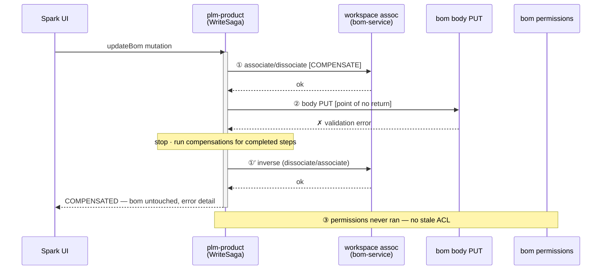

# ADR-013 (draft) — Non-Atomic Multi-Step Writes / WriteSaga (`SPIKE-01`)

> **Status:** 🔴 Proposed — draft for review
> **Spike:** `SPIKE-01` · **Home stubs:** `BOM-BE-E-01` · `MST-BE-E-01` · `PKG-BE-E-01` ·
> `PDTL-BE-E-01` · `WATCHLIST-BE-E-01` · `CLAIM-BE-E-01` · `PRODUCT-BE-E-02` · `SAMPLE-BE-E-01/E-02` (later phase)
> **Scope:** the **failure strategy** for every multi-step "save" — one shared mechanism instead of nine
> hand-rolled guesses. This spike *defines* the machinery; ADR-012 (partner drop/undrop) and ADR-011
> (association writes) *consume* it.
> **Evidence:** `resolvers/product/SPARK_Bom.js` · `SPARK_Measurement.js` · `SPARK_Packaging.js` ·
> `SPARK_ProductDetail.js` · `SPARK_Watchlist.js` · `SPARK_Claims.js` · `resolvers/SPARK_Product.js` ·
> `utils/workspaceAssociationHelper.js` at `https://github.com/XXX`.
> **Related:** ADR-019 (Mid-Request ACL Update) — the attachment-archive steps in `updatePackaging`
> (×2), `updateProductDetailsSet`, and `updateWatchlistEntries` are **downstream-token** call sites per
> ADR-019 §1 (target `attachment`); every other capability token below (workspace-association tokens,
> body-write tokens, `bom.updatePermissions`, the claim proxy JWT) is **own-domain-token** or
> **permission-check** and stays resolver-local, unchanged.
> *(`updateSamplesV2` / `bulkEvaluateSamples` are later-phase; steps below come from the earlier sample-domain
> analysis, not re-verified in this pass.)*

---

## 1. Today's behavior, write by write

Every mutation below is the same disease with different symptoms: **an early step commits, a later step
fails, the resource is left inconsistent, and nothing detects it.**

### `updateBom` (`BOM-BE-E-01`) — 3 writes, 3 services

1. Capability JWT for the bom (own-domain-token — gates this domain's own `workspaceAssociationHelper`/
   `bom` loader calls; resolver-local, unaffected by ADR-019).
2. **Workspace association commits first** — if `workspaceContext` has adds/removes:
   `workspaceAssociationHelper(BOM)` → bom-service associate/dissociate.
   ⚠ adds and removes are **two separate loads** — two commits, not one.
3. Body — `bom.updateBom` PUT; `validationErrors || message` → throw.
4. If `businessPartners`: `bom.updatePermissions(permissionJWT)` — **response never checked** for
   validation errors (own-domain-token — the bom service's own permissions write, not a cross-domain call).

- **Gap:** bom moved between workspaces but body unsaved (2✓ 3✗) · body saved but ACL stale (3✓ 4✗).

### `updateMeasurement` (`MST-BE-E-01`) — 2 writes

1. Capability JWT (own-domain-token; unaffected by ADR-019).
2. **Workspace association commits first** (checked — throws on `validationErrors`).
3. Body — `measurement.updateMeasurement` PUT (checked — throws).

- **Gap:** set moved but content unsaved (2✓ 3✗). The minimal reproducer of the whole problem.

### `updatePackaging` (`PKG-BE-E-01`) — body first, then attachments, error check LAST

1. Capability JWT (own-domain-token); body — `packaging.updatePackaging` PUT.
2. `attachmentsToRemove`? → mint a capability token, **Mid-Request ACL Update**
   (`SparkSecurityService.updateCurrentUserPermissions(capabilityToken)` — downstream-token site,
   `attachment` target, per ADR-019) before `attachment.archiveAttachmentBulkV2`, then `removeRelationship`
   (Relationship service).
3. `attachmentsToAdd`? → `addBulkRelationShip` (reject if status ≥ 400), capability token +
   **Mid-Request ACL Update** (downstream-token, `attachment` target), then
   `attachment.bulkUpdateAttributes`.
4. 🐞 **Only now** is step 1's response checked — `validationErrors || message` → throw.

- **Gap:** a body write that *already failed validation* still archives, unlinks, and relinks attachments
  before the error surfaces (1✗ then 2–3 run anyway).

### `updateProductDetailsSet` (`PDTL-BE-E-01`) — destructive step before the body

1. Capability JWT (own-domain-token); **workspace association commits first** (checked — throws;
   🐞 error text says *"measurement set"* — copy-paste).
2. `deleteAttachmentIds`? → mint a capability token, **Mid-Request ACL Update** (downstream-token,
   `attachment` target, per ADR-019) before `attachment.archiveAttachmentBulkV3` — **archives before the
   body write**.
3. Body — `ProductDetails.updateProductDetailsSet` PUT (returned unchecked to the caller).

- **Gap:** attachments archived, set moved — then the body fails: destructive steps already done (1–2✓ 3✗).

### `updateWatchlistEntries` (`WATCHLIST-BE-E-01`) — a race, then two writes

1. 🐞 `watchlistEntries.map(async …)` — per entry: read user-group, then update-or-add it —
   **the map is never awaited**. The user-group writes race step 2; a failure inside is an
   **unhandled rejection** (the thrown errors go nowhere).
2. Body — `watchlist.updateWatchlistEntries` (checked — throws).
3. Collect `removedAttachmentIds` → capability token (fetched even when the list is empty), **Mid-Request
   ACL Update** (downstream-token, `attachment` target, per ADR-019) →
   `attachment.archiveAttachmentBulkV3` (awaited).

- **Gap:** entries saved while user-groups silently failed, or vice versa — order not even deterministic.

### `updateClaim` (`CLAIM-BE-E-01`) — proxy ACL, unchecked association

1. **Proxy capability JWT** — `getUserPermissionsJWTByProxy({id, proxyIds: [parentId], basePermissions})` —
   permissions borrowed from the parent product (own-domain-token — gates this domain's own `claim`/
   `workspaceAssociationHelper` calls; resolver-local, unaffected by ADR-019).
2. Workspace association — `workspaceAssociationHelper(CLAIM)`; 🐞 **return value never checked**.
3. Body — `claim.updateClaim` PUT (checked — throws).

- **Gap:** claim moved (or the move silently failed — nobody looked) while the body diverges.

### `updateComponentStatuses` (`PRODUCT-BE-E-02`) — 5-domain parallel fan-out

1. Build one promise per id-type: `bom.updateBomComponentStatus` · `measurement.updateMeasurementComponentStatus` ·
   `ProductDetails.updateProductDetailComponentStatus` · `claim.bulkUpdateClaim` ·
   `packaging.updatePackagingComponentStatus`.
   🐞 the claim DTO embeds **all** `claimIds` in every claim's `statuses` (shadow/duplication bug).
2. `Promise.all(promises)` — **parallel**; first rejection wins, the rest keep running blind.
3. Returns nothing — the caller cannot tell what succeeded.

- **Gap:** status set on BOMs and measurements, missed on claims — invisible partial fan-out.

### `updateSamplesV2` / `bulkEvaluateSamples` (`SAMPLE-BE-E-01/E-02`, later phase)

- Sample body + evaluation write (E-01); bulk evaluation + open-new-review-rounds util (E-02).
- Same shape: two ordered writes, no rollback; adopt whatever this ADR decides when the sample domain migrates.

---

## 2. The write-operations grid

Order of the step in each row: `①②③…` = commit order · `∥` = parallel · `🔥` = fire-and-forget/unawaited ·
`✗?` = response not checked.

| Mutation | Workspace assoc | Body write | Permissions / ACL | Attachment | Relationship | UserGroup | 5-domain fan-out | Steps | Checked? |
|---|---|---|---|---|---|---|---|---|---|
| `updateBom` | ① (2 loads) | ② | ③ ✗? (own-domain-token) | — | — | — | — | 3–4 | partial |
| `updateMeasurement` | ① | ② | — | — | — | — | — | 2 | yes |
| `updatePackaging` | — | ① (checked **last** 🐞) | — | ② archive · ③ attrs (both **downstream-token → Mid-Request ACL Update**) | ② remove · ③ add | — | — | 4–5 | late |
| `updateProductDetailsSet` | ① | ③ ✗? | — | ② archive (before body!) (**downstream-token → Mid-Request ACL Update**) | — | — | — | 3 | partial |
| `updateWatchlistEntries` | — | ② | — | ③ archive (**downstream-token → Mid-Request ACL Update**) | — | ① 🔥 unawaited | — | 3 | race |
| `updateClaim` | ② ✗? | ③ | ① proxy JWT (own-domain-token) | — | — | — | — | 3 | partial |
| `updateComponentStatuses` | — | — | — | — | — | — | ∥ ×5 (void return) | 5∥ | no |
| `updateSamplesV2` *(later)* | — | ① | — | — | — | — | evaluation ② | 2 | — |
| `bulkEvaluateSamples` *(later)* | — | ① bulk eval | — | — | — | — | new-rounds ② | 2 | — |

Recurring shapes the grid exposes:

- **assoc → body (→ acl)** — bom, measurement, claim, productDetails: the *move* commits before the *save*.
- **body → attachments** — packaging, watchlist: link cleanup rides after (or during) the save.
- **parallel fan-out** — componentStatuses: no ordering at all.
- Cross-cutting defects: 4 unchecked responses · 1 unawaited write · 1 validation check after side-effects ·
  1 duplicated-ids DTO · 0 rollbacks anywhere.

---

## 3. Decision drivers

- Phase-1 goal is **behavioral parity** (recorded-fixture tests) — but *every* E-phase story's acceptance
  criteria demand a failure strategy, so pure lift-and-shift cannot pass its own gate.
- The steps span **different backends** (workspace/body on the product-family backend; attachment,
  relationship, ACL elsewhere) — a real DB transaction is impossible at the orchestration layer.
- These are interactive "save" clicks — the user waits; the response must say what happened.
  Async/event patterns are out of scope here (see ADR-011/012 for where they apply).
- Some steps have a **cheap, existing inverse** (associate ↔ dissociate, relationship add ↔ remove);
  others don't (a body PUT needs a prior-state snapshot; an archive may have no un-archive).
- ADR-012 already assumes a shared `WriteSaga` (its pin-down 3 declares per-step policy) — whatever is
  chosen here must serve that consumer too.
- The latent bugs (🐞 above) must be consciously fixed or consciously preserved — never accidentally either.

### Assumptions, constraints & success criteria

**Assumptions**
- The step sequences in §1 (from each domain's `be-02-resolver-analysis.md`) are the behavioral authority;
  sample-domain steps are unverified in this pass and are re-confirmed when that domain migrates.
- Existing inverse endpoints (associate↔dissociate, relationship add↔remove) behave as inverses; the
  compensation inventory (pin-down 1) verifies this before any policy relies on it.
- ADR-012 consumes this module unchanged — the saga API must satisfy its per-step policy needs.

**Constraints**
- No distributed transaction is available across the involved backends; atomicity can only be approximated.
- These are interactive "save" operations — the mutation response must describe the final state; async
  completion is out of scope here.
- Phase-1 parity: happy-path behavior (inputs, outputs, side-effects, step order) must match the legacy
  gateway exactly; only failure-path *visibility* may differ, per the agreed deviation list.

**Success criteria (measurable)**
- One shared `WriteSaga` module ships in Sprint 0 with the §4-B policy table; all nine E-phase stories
  implement against it with zero per-mutation failure-strategy decisions left open.
- Every write step's response is checked by construction; injected mid-sequence failures in tests yield
  `COMPENSATED` or `PARTIAL_FAILURE` with per-step detail — never silent inconsistency.
- Recorded-fixture parity green for each mutation's happy path; the deviation list (pin-downs 2–6) is
  PO-approved before parity testing starts.
- `updateMeasurement` pilot completes in one sprint; subsequent adoptions require no saga-API changes.

---

## 4. Options

| | Option | Failure handling | Cost | Verdict |
|---|---|---|---|---|
| A | Full compensating saga | every step has an undo; reverse-run on failure | high — inverses don't all exist | over-engineered |
| B | Shared `WriteSaga` — per-step declared policy | compensate where an inverse exists, else record + surface | medium, one shared module | **recommended** |
| C | Best-effort, documented ordering | keep sequences, log failures | near zero | fails the stories' own AC |
| D | Backend-composed atomic endpoints | push multi-step into one backend transaction | very high, per-backend work | only viable per-edge, later |

### A — Full compensating saga

- Every step registers an inverse; on failure, compensations run in reverse order; all-or-nothing illusion.
- ➕ closest to atomicity a REST fan-out can get.
- ➖ inverses **don't exist** for the hard steps: undoing a body PUT means snapshot-read before every write;
  un-archiving an attachment may have no endpoint; the compensation itself can fail (then what?) ·
  doubles the endpoint surface · weeks of per-domain work for a parity phase. Rejected as the default.

### B — Shared `WriteSaga` with per-step declared policy ⭐

- One module in `plm-product` (reused by every subgraph): ordered steps, each declaring
  `action` + `policy` — `COMPENSATE(inverse)` · `RETRY(n)` · `RECORD` (log + reconcile, never silent).
- Runs the steps, stops at first non-retryable failure, applies declared compensations for completed
  steps that have them, and returns `COMMITTED | COMPENSATED | PARTIAL_FAILURE` with per-step detail —
  exactly the story pseudocode shape in `PRODUCT-BE-E-01`.
- Default policy table (the "compensation-log + best-effort" middle option, made concrete):

| Step kind | Policy | Why |
|---|---|---|
| workspace associate / dissociate | `COMPENSATE` — inverse exists | move is cheaply reversible |
| relationship add / remove | `COMPENSATE` — inverse exists | link is cheaply reversible |
| body PUT (the primary write) | point of no return — fail = stop + compensate priors | snapshot-undo not worth it |
| ACL / permissions after body (own-domain-token, e.g. `bom.updatePermissions`) | `RETRY` then `PARTIAL_FAILURE` | stale ACL must be visible |
| attachment archive / attrs (downstream-token — carries **Mid-Request ACL Update** before the call, per ADR-019) | `RECORD` + reconcile | destructive, no reliable inverse; the ACL refresh itself is not a separate saga step — it rides inside the attachment-client call |
| parallel fan-out branches | isolate per branch, aggregate result | one failure must not hide the rest |

- ➕ one decision, nine reuses · failures visible with per-step detail (satisfies every E-story AC) ·
  compensation only where it's actually cheap · consistent with ADR-012's assumption.
- ➖ a new shared module to build first (Sprint 0, critical path) · parity tests must allow the new
  failure *visibility* (happy path unchanged).

### C — Pure best-effort (lift-and-shift + bug fixes)

- Keep every sequence as-is; fix only the outright bugs; log failures with a correlation id.
- ➕ maximum parity, minimum work.
- ➖ the inconsistency stays invisible to the caller — fails the stories' own acceptance criteria
  ("partial-failure strategy implemented") and re-decides nothing. Rejected.

### D — Backend-composed atomic endpoints

- Where **one backend owns all steps** (e.g. bom body + workspace assoc + permissions are all
  product-family), add a composite endpoint that is transactional server-side; the DGS makes one call.
- ➕ real atomicity for those edges — strictly better than any saga.
- ➖ backend-team work per endpoint · does nothing for cross-backend steps (attachment, relationship) ·
  not a decision the DGS layer can make alone.
- **Recorded as a per-edge refinement**: any edge that becomes single-backend-composable later simply
  replaces its saga steps with one call — the `WriteSaga` shape absorbs this without API change.

### The saga in one picture (`updateBom` under Option B, step-3 failure)

Today the same failure leaves the bom **moved but unsaved**, and the caller sees only a generic error.

---

## 5. Proposed decision (to ratify)

- **Option B** — one shared `WriteSaga`, per-step declared policy, default policy table as in §4-B.
- **Ordering:** keep each mutation's **legacy step order** in phase 1 (parity); reordering
  (e.g. body-before-assoc) is a per-story improvement *after* the saga makes failures visible.
- **Option D recorded as a per-edge refinement** — single-backend composites replace saga steps when the
  owning backend offers them.
- Build order: `WriteSaga` lands in Sprint 0 (critical path — blocks all `E`-phase writes),
  `updateMeasurement` is the pilot (smallest real case), then the rest adopt story-by-story.

### Pin-downs at ratification

| # | Item | Choice to make | Draft recommendation |
|---|---|---|---|
| 1 | Compensation inventory | verify each inverse actually exists (assoc↔dissoc, relationship add↔remove; un-archive?) | confirm per domain during Sprint 0; anything without an inverse is `RECORD`, never assumed |
| 2 | Watchlist unawaited map 🐞 | preserve race vs fix | **await it**, ordered before the body; accepted parity deviation |
| 3 | Packaging late validation check 🐞 | preserve vs fix | check the body response **before** attachment side-effects; accepted deviation |
| 4 | ComponentStatuses claim DTO 🐞 + void return | preserve vs fix | fix the duplicated `claimIds`; return an aggregated per-domain result; accepted deviation |
| 5 | Unchecked responses (bom perms, claim assoc, pdtl body) | preserve silence vs surface | every saga step's response is checked by construction — surface as step detail |
| 6 | Result surface | new `PARTIAL_FAILURE` detail vs legacy generic error | keep return types; carry per-step detail in the GraphQL error extensions; accepted deviation |
| 7 | Parallel fan-out (`updateComponentStatuses`) | serialize vs keep parallel | keep parallel; per-branch isolation + aggregated result (matches `E-01` AC-3 style) |
| 8 | Sample mutations (later phase) | — | adopt the same `WriteSaga` + policy table when the sample domain migrates; no new decision |

---

## 6. Consequences

- If accepted:
  - the nine E-phase stories implement against **one** module and **one** policy table — the
    "bespoke guess per mutation" problem ends by construction,
  - ADR-012's partner actions get their saga for free (same module),
  - every unchecked/raced/late-checked write becomes checked, ordered, and visible — the five 🐞s are
    closed with documented deviations,
  - `updateMeasurement` pilots the pattern in one sprint; each further adoption is mechanical.
- Risks:
  - the compensation inventory (pin-down 1) may find fewer inverses than assumed — policies degrade to
    `RECORD`, which is still strictly better than today's silence,
  - deviation list (pin-downs 2–6) must be agreed with the Product Owner **before** parity testing,
    or known-good fixes will read as regressions,
  - `WriteSaga` is Sprint-0 critical path — if it slips, every E-phase story slips with it; keep its
    scope to *ordered steps + policies + result*, nothing more.

---

## 7. On acceptance

Per `fedMigrationScripts/reference/SPIKE-ADR-LIFECYCLE.md`:

1. Copy this write-up to `adrs/`; add the `SPIKE-01` block to `adrs/adr-index.yaml`
   (`status: Accepted`, `chosen: "B — …"`, all options preserved).
2. Flip `00-overview.md` §2 to **Decided**; add `01-stories.md` + implementation notes
   (incl. the §4-B policy table as the per-step reference).
3. Replace the *"per `SPIKE-01`"* placeholders in each affected domain's
   `output/analysis/{domain}/be-04-stories.md` (bom, measurement, packaging, productDetails,
   watchlist, claims, product `E-02`).
4. Regenerate domain + global docs; push to Jira/Confluence.
