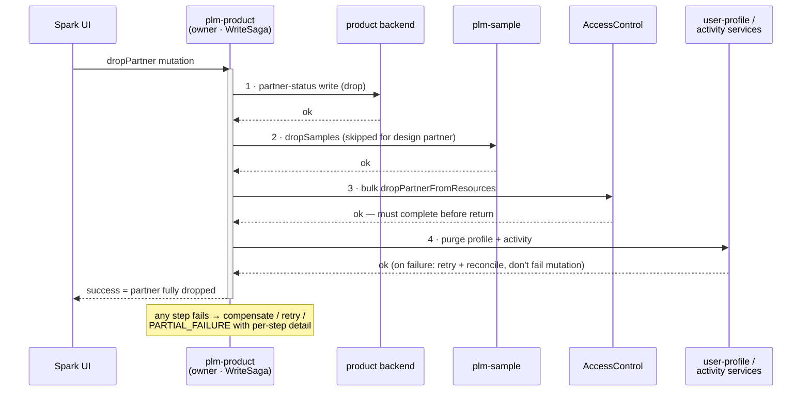
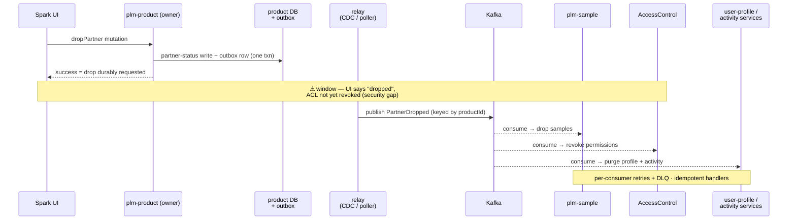

# ADR-012 (draft) — Partner Drop/Undrop + Ownership (`SPIKE-03`)

> **Status:** 🔴 Proposed — draft for review
> **Spike:** `SPIKE-03` · **Home stubs:** `PRODUCT-BE-E-01` · `WORKSPACE-BE-E-01` (later phase)
> **Scope:** who **owns** the partner drop/undrop/remove fan-out, and how it is **orchestrated** —
> the generic failure *machinery* (WriteSaga) is `SPIKE-01`'s decision, consumed here, not made here.
> **Related:** ADR-011 (cross-domain association writes) — same sync-orchestration stance ·
> `SPIKE-04` (not-removable/undroppable *reads*) is separate.
> **Evidence:** `resolvers/SPARK_Product.js` + `services/Product.js` + `utils/commonLoaders.js`
> at `https://github.com/XXX`.

---

## 1. Today's behavior — `productBusinessPartnerActions(actionType, values)`

- One mutation, a ~220-line **switch dispatcher**, three cases, **no rollback anywhere**.
- The workspace twin (`workspaceBusinessPartnerActionsV2`, `resolvers/SPARK_WorkspaceV2.js`, 5 cases)
  repeats the shape and must end up on the same pattern.

### Case `REMOVE_TEAM`

1. `product.removeProductResources` — `DELETE ${v1}/{productId}/resources/bulk?resourceList={teamIds}`.

- Single product-backend call. No fan-out; no pattern needed.

### Case `REMOVE_PARTNER` — 5 sequential side-effecting calls, 5 services

1. Remove the partner's teams — `product.removeProductResources` (same endpoint as above).
2. Clean recently-viewed — `recentlyViewed.deleteRecentlyViewedByPartner` (`resourceType: 'product'`).
3. Clean to-dos — `todo.deleteToDoByBusinessPartner`.
4. Clean favorites — `favorite.deleteFavoritesByBusinessPartner`.
5. ACL capability token for the product, then `product.removeProductBusinessPartner` —
   `DELETE ${v2}/{productId}/partners/bulk?partnerList={partnerId}`.

- **Failure:** strictly sequential, no compensation — a failure at step 3 leaves teams removed,
  recently-viewed wiped, and the partner still on the product.

### Case `DROP_UNDROP_PARTNER` — the hard one

1. **Enumerate everything the partner might touch** — `relationship.searchByIds(productId)` with
   branches `[product, sample, discussions, discussionThreads, claim]` and node types
   `[attachments, sample, discussions, discussionThreads, attachments_v3]`;
   group nodes by type → discussion / attachment / thread / sample / claim id lists.
   ← full Relationship-Service traversal, and that service is **being retired**.
2. **Filter to what the partner is actually on** — `filterResourcesByPartner` → batched
   `getAccessControlBatch` (chunks of 100) over all ids + `productId`; remove ids where the partner
   holds no permissions.
3. Build the ACL payload — `getPermissionMapForBulkACLCall` → per-resource dropped-permission map
   (`Bps`/`Dps`/`MerchVendor`/`FabricSupplier`/`Ids` groups; `Ids` keeps its grantee list).
4. Capability JWT for product + all surviving ids + `SAMPLE_EVALUTION`.
5. **Design-partner branch** — if `partnerType !== DESIGN_PARTNER` and samples exist:
   `sampleV2.dropSamples` / `unDropSamples` (by `dropped` flag).
6. `Promise.all([...])` — **in parallel**: product write
   `POST ${v2}/{productId}/drop-undrop-partner` + the sample call. **Then**, sequentially:
   - `accessControl.dropPartnerFromResources` / `unDropPartnerFromResources(toBePermissionsMap)`,
   - if dropping: `UserProfileAttributes.Mutation.deleteAllUserProfileDataForAPartner(...)` —
     **called by importing another domain's resolver directly** (same anti-pattern ADR-011 removes in D-02).

- **Failure:** parallel primary writes, then ordered ACL + profile cleanup; any mid-flight failure leaves
  the partner **half-dropped** (e.g. samples dropped but ACL still granting access) with no detection.

### Interaction matrix

Homes: product → `plm-product` · sample → `plm-sample` · ACL → AccessControlService ·
relationship → central service (**retiring**) · recentlyViewed / todo / favorite / userProfile →
user-activity services (🔵).

| Case | Product | Relationship | ACL | SampleV2 | RecentlyViewed | Todo | Favorite | UserProfile | Calls |
|---|---|---|---|---|---|---|---|---|---|
| `REMOVE_TEAM` | ✅ | — | — | — | — | — | — | — | 1 |
| `REMOVE_PARTNER` | ✅ ×2 | — | ✅ token | — | ✅ | ✅ | ✅ | — | 5–6 |
| `DROP_UNDROP_PARTNER` | ✅ | ✅ traversal | ✅ batch read + bulk drop/undrop + token | ✅ (non-design) | — | — | — | ✅ (drop only, cross-resolver) | 7–9 |

> **Key findings:**
> - `REMOVE_TEAM` needs no pattern — plain mutation.
> - Both real cases are **multi-service, non-atomic, no-rollback** — a mid-flight failure is invisible.
> - Drop/undrop is **security-relevant**: the UI (and the partner) assume access is revoked when the
>   mutation returns. That constrains async options far more than ADR-011's association writes.
> - Two structural dependencies must be replaced regardless of pattern: the Relationship-Service
>   traversal (retiring) and the `UserProfileAttributes` resolver import.

---

## 2. Decision drivers

- Phase-1 goal is **behavioral parity**, proven by recorded-fixture parity tests (`E-01` AC-1).
- **Access revocation is synchronous today** — drop must not return while ACL still grants access;
  eventual consistency here is a security gap, not just staleness.
- The Relationship-Service traversal is being retired — child enumeration needs a new source.
- `SPIKE-01` owns the failure *machinery* (shared `WriteSaga`: step / compensate / statuses
  `COMMITTED | COMPENSATED | PARTIAL_FAILURE`); this ADR only declares per-step policy.
- The workspace twin (`WORKSPACE-BE-E-01`) must reuse whatever is chosen — ownership must generalize.
- `E-01` AC-3: one cleanup failing must be **visible** and must not silently swallow the rest.
- Consistency with ADR-011: sync orchestration in the owning subgraph, service-to-service REST,
  never subgraph-to-subgraph GraphQL.

### Assumptions, constraints & success criteria

**Assumptions**
- `SPIKE-01`'s shared `WriteSaga` exists before `E-01` implementation starts (it is Sprint-0 critical
  path); this ADR declares per-step policy only.
- Each participant domain can expose (or already exposes) a drop/undrop/remove endpoint and can enumerate
  its own children for a product/workspace; gaps surface at contract-agreement time as backlog stories.
- The UI's contract is unchanged: mutation success means the action is fully effective.

**Constraints**
- **Security ordering:** on drop, ACL revocation must complete before the mutation returns success; on
  undrop, ACL restore precedes participant undrops. This is a testable invariant, not a convention.
- The Relationship-Service traversal may not be ported — child enumeration must come from participants.
- The workspace twin must reuse the participant contract without a second design round.

**Success criteria (measurable)**
- `E-01` recorded-fixture parity for all three action paths (REMOVE_TEAM, REMOVE_PARTNER,
  DROP_UNDROP_PARTNER), incl. the design-partner branch, with the partial-failure visibility deviation
  (pin-down 7) in the approved exception list.
- Injected failure at each saga step yields the declared policy outcome (compensate / retry-then-fail /
  retry-and-reconcile) with per-step detail; no silent partial state in any test.
- An automated test proves the drop ACL-ordering invariant (mutation cannot return success with ACL
  revocation incomplete).
- Zero remaining references to the Relationship-Service traversal and the `UserProfileAttributes`
  resolver import in the ported flow.

---

## 3. Options

| | Option | Ownership | Orchestration | Verdict |
|---|---|---|---|---|
| A | Lift-and-shift dispatcher | `plm-product` | inline sequential calls, as today | viable, keeps the invisible-failure problem |
| B | Owner-orchestrated saga + participant contract | resource owner (`plm-product` / `plm-workspace`) | `WriteSaga` steps over a per-domain drop/undrop contract | **recommended** |
| C | Central partner-lifecycle service | new shared service | it calls every domain | new single point of ownership nobody has |
| D | Event choreography (Kafka + outbox) | each domain reacts | `PartnerDropped` events | disqualified for drop — async access revocation |

### A — Lift-and-shift (dispatcher, formalized)

- Port the switch into a `plm-product` `@DgsMutation`; replace loaders with REST clients; keep ordering.
- ➕ exact parity · no new abstractions.
- ➖ mid-flight failure stays invisible (fails `E-01` AC-3) · the workspace twin re-implements the same
  fan-out · Relationship traversal + resolver import still need ad-hoc fixes.

### B — Owner-orchestrated saga + per-domain participant contract ⭐

- **Ownership:** the resource owner orchestrates — `plm-product` owns product partner actions,
  `plm-workspace` owns workspace ones. No new service.
- **Participant contract:** each affected domain exposes its own drop/undrop/remove step as a service
  endpoint — sample (`dropSamples`/`unDropSamples`, exists), ACL bulk drop/undrop (exists),
  user-profile purge (exists behind the resolver import — becomes a client call), activity cleanup
  (recentlyViewed/todo/favorite, exist). Each participant also **enumerates its own children** for a
  product/workspace — replacing the Relationship traversal with per-domain enumeration.
- **Orchestration:** the owner runs the steps through `SPIKE-01`'s `WriteSaga` — one step per
  participant, per-step policy declared (see pin-downs), result surfaces
  `COMMITTED | COMPENSATED | PARTIAL_FAILURE` with per-step detail.
- ➕ satisfies AC-3 (visible, isolated step failures) · workspace twin reuses the same participant
  contract · kills both structural dependencies by construction · consistent with ADR-011's stance.
- ➖ needs the participant endpoints agreed with each domain team · saga adds code the dispatcher
  didn't have · parity tests must tolerate the new failure *visibility* (same happy path).

### C — Central partner-lifecycle service

- One shared service owns "partner leaves/drops from X" for every resource type; subgraphs delegate to it.
- ➕ one place to reason about the fan-out.
- ➖ a new always-on service with no natural owner · inverts domain ownership (it must know every
  domain's cleanup) · overkill for two dispatchers. Rejected.

### D — Event choreography (Kafka + transactional outbox)

- Owner commits the partner-status write, outbox-publishes `PartnerDropped` / `PartnerUndropped` /
  `PartnerRemoved`; each domain consumes and cleans its own slice (outbox mechanics per ADR-011 §3-D).
- ➕ perfect domain ownership of cleanup · retries for free.
- ➖ **drop is access revocation** — returning before ACL is updated means the partner can still read
  data after the UI says they can't. Acceptable for activity cleanup (favorites, to-dos), not for ACL.
- **Verdict:** disqualified as the primary pattern; recorded as a later refinement for the
  non-security steps only (see pin-down 4).

### How the options actually differ (B vs C vs D)

**B vs C — both synchronous; the difference is where the orchestrator lives and who owns it.**

- B distributes orchestration to whoever owns the resource, and shares only a *contract*:
  - `plm-product` runs the fan-out for product actions, `plm-workspace` for workspace ones —
    two orchestrators, same participant contract + saga library, no shared runtime,
  - ownership is natural — the product team already owns "what happens to a product when a
    partner is dropped"; this makes it explicit.
- C centralizes orchestration into a **new service** that must know everyone's business:
  - one orchestrator at runtime — a single place to read, log, and reason about the fan-out,
  - but ownership inverts: the central service must know every domain's cleanup rules
    (design-partner sample exception, ACL group types, profile-purge conditions) — any domain's
    cleanup change becomes a *central-service* change,
  - and it is a new always-on deployment no existing team naturally owns — staffed, paged, and
    versioned for the sake of two dispatchers.
- Revisit C only if many more resource types ever need the same partner-lifecycle behavior;
  with exactly two fan-outs, a shared contract wins.

**B vs D — synchronous conductor vs asynchronous broadcast-and-react.**

Swimlanes for the **drop** flow:

*Option B — owner-orchestrated saga (everything inside the request):*

*Option D — event choreography (mutation returns first, cleanup follows):*

- Who drives:
  - B — the owner calls each participant's endpoint itself, in order, inside the mutation request,
  - D — the owner does only its own write + outbox row, returns, and calls nobody; participants
    subscribe to `PartnerDropped` and clean their own slice whenever they consume it.
- What the response means:
  - B — success means **the partner is fully dropped** (ACL revoked, samples dropped) — everything
    already happened,
  - D — success means only **the drop has been durably requested**; cleanup lands milliseconds or
    minutes later.
- Failure handling:
  - B — in-band: the saga sees a failed step while the request is open → compensate, retry, or
    return `PARTIAL_FAILURE` with per-step detail,
  - D — out-of-band: per-consumer retries + DLQ; the caller can never be told "the sample drop
    failed" — the mutation already returned.
- Coupling:
  - B — the owner holds a client for every participant,
  - D — the owner knows nothing about consumers; a new cleanup domain = a new subscriber, not a
    mutation change.
- Why D loses **here specifically**: drop is access revocation — under D there is a window where
  the UI says "dropped" but the ACL consumer hasn't processed the event, so the partner can still
  read samples and discussions. Security gap, not staleness.
- B and D are not mutually exclusive end-to-end: the recorded end-state is B as the skeleton, with
  D peeling off the non-security cleanup steps (activity, profile) once the outbox exists —
  exactly pin-down 4.

---

## 4. Proposed decision (to ratify)

- **Option B:**
  - ownership — the **resource owner orchestrates**: `plm-product` for product actions,
    `plm-workspace` for workspace actions; one shared participant contract between them,
  - orchestration — synchronous fan-out through `SPIKE-01`'s `WriteSaga`, one step per
    participant, per-step failure policy declared in a single table in the implementation notes,
  - `REMOVE_TEAM` is excluded — plain mutation, no saga.
- **Ordering constraint (security):** on **drop**, the ACL bulk-drop step must complete before the
  mutation returns success; on **undrop**, ACL restore runs before participant undrops become visible.
- **Option D recorded as a later refinement** for non-ACL cleanup steps only, with the transactional
  outbox as precondition (per ADR-011).

### Pin-downs at ratification

| # | Item | Choice to make | Draft recommendation |
|---|---|---|---|
| 1 | Relationship-Service traversal (retiring) | per-domain enumeration vs search-index query | each participant enumerates its own children behind its drop/undrop endpoint; no central traversal |
| 2 | `UserProfileAttributes` resolver import | — | replace with a user-profile service client call as a saga step (drop only) |
| 3 | Per-step failure policy | compensate vs retry+reconcile vs log, per step | partner-status write: compensate (inverse call) · ACL: retry then fail the mutation · activity/profile cleanup: retry + reconcile job, never fail the mutation |
| 4 | Async refinement scope | which steps may later move to events | recentlyViewed / todo / favorite / user-profile only; never ACL or partner status |
| 5 | Design-partner branch | keep vs generalize | keep as an orchestrator policy flag (`skipSamples = partnerType == DESIGN_PARTNER`), parity-tested |
| 6 | Mutation shape | keep `actionType` dispatcher vs split typed mutations | keep the dispatcher signature for phase-1 parity; splitting is a v2 API question |
| 7 | Error convention | dispatcher currently throws nothing on partial failure | surface `PARTIAL_FAILURE` per-step detail in the payload; listed as an accepted parity deviation |

---

## 5. Consequences

- If accepted:
  - `PRODUCT-BE-E-01` implements `ProductBusinessPartnerActionService` (3 strategy methods) over the
    shared `WriteSaga`, per the story's pseudocode shape,
  - `WORKSPACE-BE-E-01` (later phase) reuses the participant contract — no second design round,
  - the participant endpoints become explicit, versioned contracts with sample / ACL / user-activity
    domains — agree them early, they are the critical path,
  - Relationship-Service dependency for this flow is gone by construction.
- Risks:
  - participant enumeration ("list my children for product X") may not exist everywhere yet —
    each missing one is a story on the owning domain's backlog, discovered at contract-agreement time,
  - parity tests must pin the happy path exactly while allowing the new partial-failure visibility
    (pin-down 7) — put it in the exception list up front,
  - the drop ACL-ordering constraint (§4) must be a test, not a convention.

---

## 6. On acceptance

Per `fedMigrationScripts/reference/SPIKE-ADR-LIFECYCLE.md`:

1. Copy this write-up to `adrs/`; add the `SPIKE-03` block to `adrs/adr-index.yaml`
   (`status: Accepted`, `chosen: "B — …"`, all options preserved).
2. Flip `00-overview.md` §2 to **Decided**; add `01-stories.md` + implementation notes
   (incl. the per-step failure-policy table from pin-down 3).
3. Replace the *"per `SPIKE-03`"* placeholders in
   `output/analysis/product/be-04-stories.md` (`E-01`) — workspace's stories follow in its phase.
4. Regenerate domain + global docs; push to Jira/Confluence.
