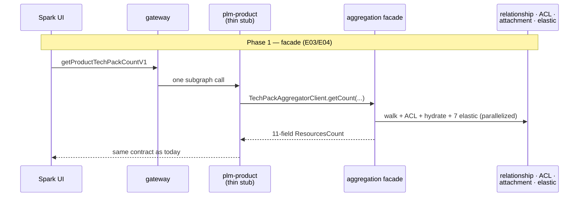
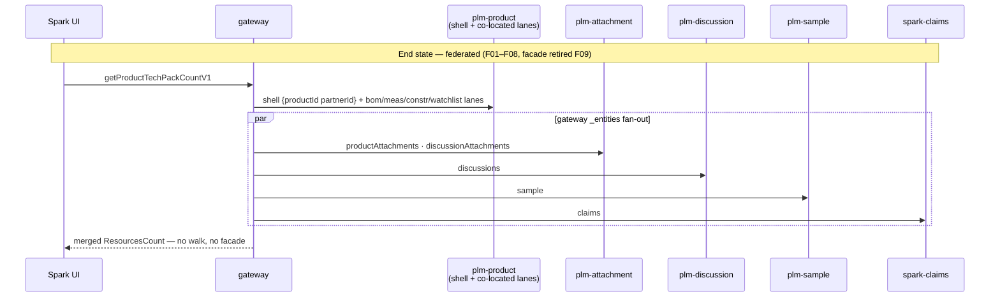

# ADR-015 (draft) — Product TechPack aggregate (`SPARK-SPIKE-02`)

> **Status:** 🔴 Proposed — draft for review
> **Spike:** `SPARK-SPIKE-02` · **Home stubs:** `SPARK-PROD-E03` (facade) · `SPARK-PROD-E04` (bulk) ·
> **Gates:** `F01–F08` (per-domain federation) · `F09` (retire facade)
> **Scope:** how the 11-field `ResourcesCount` badge aggregate is assembled under federation — one panel,
> ~8 domains' data, today one 200-line helper. Reads only; no writes in this case.
> **Related:** ADR-014 (components/counts rollups — same owner-computed-read stance) ·
> `SPARK-SPIKE-06a` (hydration) · the `TechPack/` spike clone validated the federated end-state E2E.
> **Evidence:** `resolvers/SPARK_Product.js` (Q8/Q9 + `getTechPackResourceCountMap`) +
> `utils/commonLoaders.js` + `utils/accessControlUtils.js` + `services/Search.js` / `Attachment.js` /
> `Relationship.js` / `AccessControl.js` at `https://github.com/XXX`.

---

## 1. Today's behavior — `getTechPackResourceCountMap(productId, partnerId, workspaceContext, parentProductId)`

### Q8 · `getProductTechPackCountV1` — the 15-step helper

1. **Relationship walk + ACL filter** — `getFilteredResourceAndLevelWiseChildrenBasedOnPartnerACLPermission`
   with `inputMap = {attachments: [0–3], attachments_v3: [0–3]}`:
   - `relationship.searchByIds` — `GET ${relationship}/{productId}?includeBranches=[9 types]&includeNodeTypes=[discussions, discussionThreads, attachments_v3]&includeMigratedV3Attachments=true`,
     **no `maxDepth`** → the entire subtree, grouped by depth,
   - collect every returned id → `filterResourcesByPartner` → `getAccessControlBatch(ids, 100)` —
     `POST ${acl}/permissions` per chunk, 🐞 **chunks run serially** (a `while` loop, one await per chunk),
   - drop ids where the partner holds no surviving permission.
2. `parentProductId`? → 🐞 **the whole of step 1 repeats** for the parent (second full walk + ACL pass).
3. **Merge attachment levels** — depth 0 (v2+v3 concat) → `productAttachments`; `discussionAttachments` =
   parent v3 depths 1–3 + own v3 depths 1–3.
   🐞 the merged v2+v3 values at depths 1–3 are computed, then **overwritten** — legacy `attachments` (v2)
   ids at depth ≥ 1 silently never count.
4. **Hydrate attachments** — capability token (`POST ${acl}/…/permissions/user/current`), then
   `attachment.getAttachmentsV3` — `GET ${attachment}/attachments/v3?humanIds={all ids}` — to read
   `product_packet_props` + `media_type` for the packet filter.
5. **Samples** — `search.getSamplesPage` — `GET ${search}/samples/v1?q=…` with
   `(parentId: {productId} OR parentId: {parentProductId}) AND partnerId AND evaluationStatus 101|102`;
   🐞 with no parent the query string carries a literal **`parentId: undefined`**.
   Post-filter: `workspaceContext` match **or** `sampleType.code` 200/135.
6. **Critical discussions** — `search.searchDiscussionsElastic` — `GET ${search}/discussion/v1/search/v2`
   (`relatedResources: product OR parent`, partner in `security.merchVendors|bps`, `critical:true`);
   same `undefined` interpolation.
7. **Measurement sets** — `GET ${search}/measurement/v1` (`parentId`, partner security, `statusId:200`).
8. **Claims** — `GET ${search}/claims/v1` (`statusId:501`).
9. **BOMs** — `GET ${search}/bom/v1` (`statusId:501`); later split `type 1` → `productBoms`,
   `type 2` → `packagingBoms` (the ADR-014 / `SPARK-SPIKE-05` tagging rule again).
10. **Constructions** — `GET ${search}/constructionset/v1`; 🐞 the `workspaceContext` clause is spliced
    **inside** the `parentId` parenthesis (`(parentId: X {ws} AND archived:false)`) — grouping differs from
    every sibling query; filter is `archived:false`, not a statusId.
11. **Watchlists** — `GET ${search}/watchlist/v1/search` (`statusId:501`).
    - 🐞 steps 5–11 are **seven sequential awaits** for seven independent queries — nothing orders them.
12. **Critical-id reduce** — from step 6: `criticalDiscussionIds` (dto critical) + `criticalThreadIds` /
    `parentDiscussionIds` (thread critical, deduped).
13. Critical ids exist? → `search.searchAttachmentsByParentResources` —
    `GET ${search}/attachments/v1?parentIds={ids}&size=10000` → non-3D attachment ids.
14. **Packet filter + assemble** — `isProductPacketAttachments` keeps hydrated attachments that are non-3D
    **and** carry `product_packet_props {partner_id, critical:true}` for this partner; output =
    `{productAttachments, discussionAttachments (∪ critical), discussions (∪ parent+critical),
    sample, measurementSets, claims, productBoms, packagingBoms, constructions, watchlists}` + echo keys.

- **Failure:** any one of the ~12 calls throwing fails the whole field; no per-slice degradation.

### Q9 · `getProductTechPackBulkCountV1(bulkTechPackCountResource[])`

- `Promise.all` over a map whose callbacks **push** each awaited result into a shared list.
- 🐞 **Result order = completion order, not input order** — the caller cannot match results to inputs
  (the known `E04` ordering bug; each entry does echo `productId`, so callers *can* re-key, but the list
  contract is broken).
- N inputs = N full runs of the 15 steps above, concurrently, each with its own graph walk.

### Interaction grid

Subgraph homes (per `fedMigrationScripts/reference/domain-service-catalog.md`): relationship → central
platform service (**retiring**) · ACL → AccessControlService · attachment → `plm-attachment` ·
search/elastic → `plm-elastic-search` · bom/measurement/construction/watchlist data → **co-located
`plm-product`** · sample data → `plm-sample` · discussions → `plm-discussion` · claims → spark-claims DGS.

| Step | Relationship | ACL | Attachment | Search (elastic) | Data owner | Order |
|---|---|---|---|---|---|---|
| 1–2 tree + partner filter | ✅ ×1–2 (full walk) | ✅ batch ×N/100, serial 🔥 | — | — | — (plumbing) | ① |
| 4 attachment hydration | — | ✅ token | ✅ | — | plm-attachment | ② |
| 5 samples | — | — | — | ✅ `samples/v1` | plm-sample | ③ |
| 6+13 critical discussions → attachments | — | — | — | ✅ ×2 | plm-discussion | ④…⑩ (serial 🔥) |
| 7 measurement | — | — | — | ✅ `measurement/v1` | plm-product (co-located) | ∥-able |
| 8 claims | — | — | — | ✅ `claims/v1` | spark-claims | ∥-able |
| 9 boms (product+packaging) | — | — | — | ✅ `bom/v1` | plm-product (co-located) | ∥-able |
| 10 constructions | — | — | — | ✅ `constructionset/v1` | plm-product (co-located) | ∥-able |
| 11 watchlists | — | — | — | ✅ `watchlist/v1/search` | plm-product (co-located) | ∥-able |

> **Key findings:**
> - The expensive part — full graph walk ×2 + chunked-serial ACL — exists **only to find attachment ids**
>   (and, via step 6, critical discussions). The other **8 of 11 fields are one direct elastic query each**,
>   already keyed by `productId + partnerId`.
> - 8 domains' *data*, but only **4 physical services** are ever called; every domain slice is an elastic
>   index. Re-homing a slice to its owning subgraph (`F01–F08`) changes *who runs the query*, not the query.
> - So the aggregate decomposes cleanly: each badge is independently computable by its owner; only the
>   attachment/discussion slices need the walk replaced by an owner-side query.

---

## 2. Decision drivers

- Phase-1 goal is **behavioral parity** (recorded fixtures) — including the packet-critical filter, the
  sample post-filter, per-index statusId quirks, and the parent double-walk semantics.
- The panel is a single screen paint — but only `plm-product` exists on day 1; **7 of 8 owning subgraphs
  aren't live**, so pure federation-native cannot ship first (`F01–F08` each block on a domain).
- The Relationship-Service walk is **retiring** — its replacement must not be rebuilt per domain later.
- The `TechPack/` spike clone already **validated the end-state mechanics** E2E: `ProductTechPack` shell
  `@key(productId partnerId)`, co-located lanes, `plm-attachment` / `plm-discussion` contributing fields
  (incl. `@requires` field-level dependency ordering in the gateway).
- `E04`'s bulk-ordering bug must be consciously fixed or preserved.
- Consistency: owner-computed reads (ADR-014), no cross-resolver imports, no `variableValues` coupling
  (none exist here — this helper is clean on both counts).

---

## 3. Options

| | Option | Who computes phase 1 | End-state | Parity | Verdict |
|---|---|---|---|---|---|
| A | Lift-and-shift aggregation in `plm-product` | one ported helper | same monolith | exact | viable, re-freezes the 8-domain coupling |
| B | Facade-then-federate | thin `@DgsQuery` → aggregation facade | per-domain federated fields, facade retired (`F09`) | exact | **recommended** (= the resolved "Option D Phase 1") |
| C | Federation-native day 1 | each domain contributes its slice | same | exact per slice | disqualified — 7 subgraphs not live |
| D | Search-DGS / materialized counts | elastic computes ready aggregates | indexer precomputes | risky | later refinement, never for ACL-dependent slices |

### A — Lift-and-shift into `plm-product`

- Port the 15 steps into one Kotlin service; loaders become REST/Feign clients; done.
- ➕ exact parity · single deliverable · no new seams.
- ➖ the 200-line 8-domain function survives as the permanent shape — no domain ever owns its badge ·
  `F01–F08` would then be a *rewrite*, not a re-homing · the retiring relationship walk gets a new lease.

### B — Facade-then-federate ⭐ (the already-resolved stance, formalized)

- **Phase 1 (`E03`/`E04`):** `@DgsQuery getProductTechPackCountV1(...)` is a thin stub over a
  `TechPackAggregatorClient` (Feign) → an aggregation facade extracted from `getTechPackResourceCountMap`,
  behavior-identical except the pinned fixes below. `@DgsEntityFetcher(name = "ResourcesCount")` rebuilds
  the entity for `_entities`.
- **Phase 2 (`F01–F08`):** each domain, as its subgraph goes live, contributes its fields to the shared
  entity — `extend type ResourcesCount @key(fields: "productId partnerId")` — attachment (`F01`),
  discussions (`F02`), samples (`F03`), claims (`F05`), and co-located bom/measurement/construction/
  watchlist lanes in-process; the facade stops serving that field.
- **Phase 3 (`F09`):** facade deleted; the query returns only the keyed shell; the gateway fans out.
- ➕ day-1 function with exact parity · every slice migrates independently, ship-on-green ·
  mechanics already proven in the `TechPack/` clone (shell + lanes + `@requires` ordering, 29 tests green) ·
  the relationship walk dies per-slice, replaced by each owner's own query (attachment already queries by
  `relatedResources` — no walk needed).
- ➖ the facade is **deliberate throwaway code** — must stay frozen (bug-fix only) or `F09` never lands ·
  two behaviors to keep in parity per slice during the F-phase overlap window.

### C — Federation-native on day 1

- Ship only the shell + per-domain contributed fields; no facade.
- ➕ no throwaway component.
- ➖ every badge blocks on its owning subgraph existing — the panel would ship with 3 of 11 fields.
  **Disqualified for phase 1**; it is simply B's end-state reached without an interim.

### D — Search-DGS aggregate / materialized counts

- The elastic DGS (or an indexer) exposes `productTechPack(productId, partnerId)` precomputed.
- ➕ one hop; kills the fan-out wholesale.
- ➖ the packet-critical filter needs attachment hydration + partner props (not in the index) · per-viewer
  ACL can't be precomputed · index staleness becomes visible badge-count drift · business rules land in the
  wrong owner (same rejection as ADR-014 §3-B/D). **Recorded as a later refinement** for viewer-independent
  counts only.

### The two shapes (B's interim vs end-state)

---

## 4. Proposed decision (to ratify)

- **Option B** — facade-then-federate, exactly as the `E03`/`E04` + `F01–F09` story chain already encodes:
  - `E03` ships the thin stub + facade (extracted, behavior-frozen, fixes below only),
  - each `F0x` re-homes one slice when its subgraph is live (ship-on-green, per-slice parity fixture),
  - `F09` retires the facade once all 8 report green.
- **Option D recorded as a later refinement** for viewer-independent counts; never the packet-filtered
  attachment fields.
- Bulk (`E04`) is a facade endpoint over the same core, **input-ordered**.

### Pin-downs at ratification

| # | Item | Choice to make | Draft recommendation |
|---|---|---|---|
| 1 | Bulk result ordering 🐞 | preserve completion-order vs fix | **fix — return in input order** (key by `productId`); accepted parity deviation (already `E04`'s AC) |
| 2 | 7 serial elastic queries 🐞 | keep serial vs parallelize | parallelize (one `Promise.all` equivalent); deviation noted — same stance as ADR-014 pin-down 7 |
| 3 | Serial ACL chunk loop 🐞 | keep vs parallelize chunks | parallelize chunk requests; deviation noted |
| 4 | `parentId: undefined` in query strings 🐞 | preserve literal vs omit clause | **preserve the exact query string** in the facade (parity — elastic treats it as a non-match today); each owner drops it at its `F0x` migration |
| 5 | v2 attachments at depth ≥ 1 discarded 🐞 | preserve vs "fix" the merge | **preserve** — treat as intentional post-v3-migration behavior; encode in the fixture notes |
| 6 | Constructions query paren splice 🐞 | preserve vs normalize | preserve the exact string phase 1; normalize at `F0x` with a fixture proving equivalence |
| 7 | Parent double-walk | keep vs single combined walk | keep in the facade (parity); dies naturally at federation (owners query `parentId IN (…)`) |
| 8 | Per-index statusId quirks (200/501/`archived:false`) | — | preserve verbatim; record in the per-slice parity fixtures so `F0x` owners inherit them consciously |
| 9 | Facade placement | module in `plm-product` vs separate deployable | Feign-fronted facade per `E03`'s shape, but **deploy inside `plm-product`** — no new always-on service for throwaway code |
| 10 | `discussionAttachments` critical-union semantics | — | preserve `∪(critical-discussion attachments, packet-critical)` exactly; it is the `F01`/`F02` contract boundary |

---

## 5. Consequences

- If accepted:
  - `E03` builds one frozen facade + thin stub; `E04` is a wrapper with the ordering fix,
  - `F01–F08` become mechanical re-homings against per-slice fixtures already recorded from the facade,
  - the Relationship-Service dependency is quarantined inside the facade and deleted with it (`F09`),
  - dashboard latency improves immediately (pin-downs 2–3) without changing any count.
- Risks:
  - the facade attracting feature work — freeze it by convention *and* by CODEOWNERS; anything new goes to
    the owning domain's `F0x` story,
  - the F-phase overlap window: a slice served by both facade and owner must agree — the per-slice fixture
    is the gate, run against **both** paths until `F09`,
  - fixture recording must include: a product **with a parent** (double-walk), > 100 walked ids (chunked
    ACL), a 3D attachment, and a critical thread whose parent discussion is outside the walk — or the edge
    behavior ships unverified.

---

## 6. On acceptance

Per `fedMigrationScripts/reference/SPIKE-ADR-LIFECYCLE.md`:

1. Copy this write-up to `adrs/`; add the `SPARK-SPIKE-02` block to `adrs/adr-index.yaml`
   (`status: Accepted`, `chosen: "B — …"`, all options preserved).
2. Flip `00-overview.md` §2 to **Decided**; add `01-stories.md` + implementation notes
   (incl. the pin-down table as the facade's deviation list).
3. Replace the techpack placeholders in `output/initial-analysis/product/04-stories.md`
   (`E03`, `E04`, `F01–F09`) with the concrete pattern above.
4. Regenerate domain + global docs; push to Jira/Confluence.
