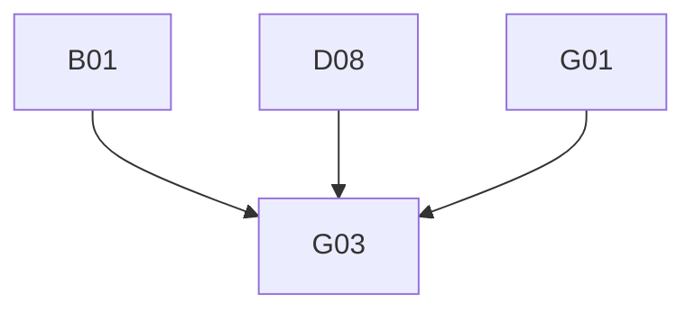

# Phase 4: Migration Plan & Stories — Attachment

> **Domain:** `attachment` · **Target DGS:** `AttachmentService` → separate `plm-attachment` subgraph
> **Pipeline Version:** 2.0 · **Generated:** 2026-06-27
> **Depends on:** [02-resolver-analysis.md](./02-resolver-analysis.md), [03-schema.graphql](./03-schema.graphql), [03-schema-analysis.md](./03-schema-analysis.md), [05-attribute-inventory.md](./05-attribute-inventory.md)
> **Index:** `04-stories-index.yaml`

Each story is self-contained. Full pseudo-logic in [02-resolver-analysis.md](./02-resolver-analysis.md).
- **ACL is context-only** (but ACL *writes* in D06/D08 are build work). `attachment` is its **own subgraph**.

## 1. Phases Overview
| Phase | Name | Stories |
|---|---|---|
| B | Core Reads | B01–B05 |
| D | Mutations | D01–D14 |
| F | Federation & decisions | F01–F02 |
| G | Field Resolvers & Tests | G01–G03 |

> **Self-contained story model.** The Netflix-DGS-on-REST framework already exists, so **every operation story below is end-to-end in a single PR**: it adds the schema (query/mutation + the GraphQL type definitions it returns), the DGS data fetcher, the Kotlin REST service method (read or write) that calls the backend, and pushes the schema change to the **Hive** registry. There is **no separate service-layer story** — the former `*Service` Kotlin-port story has been dissolved into the operation stories.

## 2. Dependency Graph

---

## 3. Stories

### Phase B — Core Reads

---

### SPARK-ATCH-B01 · `getAttachmentsV3(ids)`
- **Type:** Query · **Phase:** B · **Complexity:** Low · **Category:** CAT-2 · **Depends on:** —

- **In plain terms:** Fetch full attachment records for a set of ids.

> **Note — DGS Module Init (this PR only):** Creates `attachment.graphqls` (federation v2.3 header, scalars, owned types with `@key`, external stubs), registers scalars in `ScalarConfig.kt`, and wires the service and Feign client. Full type list: [03-schema.graphql](./03-schema.graphql).
- **Current Behaviour (Q1):** empty ids → []; (ACL) token → (own) `GET /attachments/v3?humanIds=`. **Target:** `@DgsQuery → [Attachment]`. 

#### Acceptance Criteria

1. returns attachments; empty ids → [].

---

### SPARK-ATCH-B02 · `getAttachmentsByResource(resourceId)`
- **Type:** Query · **Phase:** B · **Complexity:** Medium · **Category:** CAT-2 · **Depends on:** B01 · **EXT:** 🟡 `relationship`

- **In plain terms:** List the attachments hanging off a given resource (product, sample, etc.).

- **Current Behaviour (Q2):** (🟡 relationship) `searchByIds({id, includeNodeTypes:['attachments','attachments_v3'], maxDepth:0})` → ids → (accessControl) `getUserAccessByPost` → (own) `getAttachmentsByPostV3`. **Target:** `@DgsQuery → [Attachment]`. 

#### Acceptance Criteria

1. relationship→ids→attachments chain.

---

### SPARK-ATCH-B03 · `getAttachmentsByResourceAndOwner(resourceId)`
- **Type:** Query · **Phase:** B · **Complexity:** Medium · **Category:** CAT-2 · **Depends on:** B01 · **EXT:** 🟡 `relationship`

- **In plain terms:** List a resource's attachments, filtered to a specific owner/author.

- **Current Behaviour (Q3):** (🟡 relationship) ids → (own) `getAttachmentsByIdsAndAuthorByPostV3`. **Target:** `@DgsQuery → [Attachment]`. 

#### Acceptance Criteria

1. returns attachments incl. author.

---

### SPARK-ATCH-B04 · Renders queries (`getRendersForAttachmentIds`/`V3Ids`/`byPost`)
- **Type:** Query · **Phase:** B · **Complexity:** Medium · **Category:** CAT-2 · **Depends on:** B01

- **In plain terms:** Get the generated render/preview images for attachments.

- **Covers:** `getRendersForAttachmentIds` (@deprecated), `getRendersForAttachmentV3Ids`, `getRendersForAttachmentIdsByPost`. **Current Behaviour:** map each id → (own) renders loader (betaMode), compact; byPost uses an ACL token. **Target:** `@DgsQuery → [GalleryAttachment]`. 

#### Acceptance Criteria

1. each variant returns renders; betaMode honored.

---

### SPARK-ATCH-B05 · `getAttachmentsfromRelatedResource(s)`
- **Type:** Query · **Phase:** B · **Complexity:** Medium · **Category:** CAT-2 · **Depends on:** B01 · **EXT:** 🔴 `search`

- **In plain terms:** Find attachments reachable through a resource's related resources.

- **Covers:** `getAttachmentsfromRelatedResource` (parent+related or related-only), `getAttachmentsfromRelatedResources`. **Current Behaviour:** (🔴 search) `searchAttachmentsByParentAndRelatedResource` / `…ByRelatedResource(s)` → content or []. **Target:** `@DgsQuery → [SearchAttachment]`. 

#### Acceptance Criteria

1. parent+related vs related-only branches.

---

### Phase D — Mutations

---

### SPARK-ATCH-D01 · `archiveAttachmentV3`
- **Type:** Mutation · **Phase:** D · **Complexity:** Low · **Category:** CAT-2 · **Depends on:** B01

- **In plain terms:** Archive (soft-remove) an attachment.

- **Current Behaviour (M1):** (ACL) token → (own) `archiveAttachmentV3(id)`. **Target:** `@DgsMutation → Attachment`. 

#### Acceptance Criteria

1. archives.

---

### SPARK-ATCH-D02 · `deleteAttachmentV3`
- **Type:** Mutation · **Phase:** D · **Complexity:** Low · **Category:** CAT-2 · **Depends on:** B01

- **In plain terms:** Permanently delete an attachment.

- **Current Behaviour (M2):** (ACL) token → (own) `deleteAttachmentV3(humanId)` → String. **Target:** `@DgsMutation → String`. 

#### Acceptance Criteria

1. deletes; returns status.

---

### SPARK-ATCH-D03 · `copyAttachmentsV3`
- **Type:** Mutation · **Phase:** D · **Complexity:** Medium · **Category:** CAT-2 · **Depends on:** B01

- **In plain terms:** Copy attachments onto another resource.

- **Current Behaviour (M3):** (ACL) token for `humanIds` → (own) `copyAttachmentsV3`. **Target:** `@DgsMutation → CopyAttachment`. 

#### Acceptance Criteria

1. copies; returns thumbnail + copies.

---

### SPARK-ATCH-D04 · `associateResourcesV3`
- **Type:** Mutation · **Phase:** D · **Complexity:** Low · **Category:** CAT-2 · **Depends on:** B01

- **In plain terms:** Link an attachment to additional resources.

- **Current Behaviour (M4):** (ACL) token → (own) `associateResourcesV3`. **Target:** `@DgsMutation → [Attachment]`. 

#### Acceptance Criteria

1. associates resources.

---

### SPARK-ATCH-D05 · `removeResourcesV3`
- **Type:** Mutation · **Phase:** D · **Complexity:** Low · **Category:** CAT-2 · **Depends on:** B01

- **In plain terms:** Unlink an attachment from resources.

- **Current Behaviour (M5):** (ACL) token → (own) `removeResourcesV3`. **Target:** `@DgsMutation → [Attachment]`. 

#### Acceptance Criteria

1. removes resources.

---

### SPARK-ATCH-D06 · `updateAttachmentsACLPermissions`
- **Type:** Mutation · **Phase:** D · **Complexity:** Medium · **Category:** CAT-2 · **Depends on:** B01 · **EXT:** 🟡 `accessControl`

- **In plain terms:** Change who can view/administer an attachment (a permissions write).

- **Current Behaviour (M6):** build bulk `{resourceId, dps:[{permissionLevel:ADMIN/READ, grantees:[partnerId]}]}` for admin/read id lists → (accessControl) `updateAccessControl`. **Note:** this is an **ACL write** (grant data — build work). **Target:** `@DgsMutation → AccessControl`. 

#### Acceptance Criteria

1. ADMIN/READ DTOs built correctly per id list.

---

### SPARK-ATCH-D07 · `updateAttachmentTags` + `updateAttachmentTagsV3`
- **Type:** Mutation · **Phase:** D · **Complexity:** Low · **Category:** CAT-2 · **Depends on:** B01

- **In plain terms:** Update the tags on an attachment.

- **Current Behaviour (M7/M8):** **identical impl** — (ACL) token → (own) `updateTagsV3({attachmentId, tags})`. **Target:** `@DgsMutation` (one impl, two schema fields). 

#### Acceptance Criteria

1. updates tags; both fields delegate.

---

### SPARK-ATCH-D08 · `bulkUpdateAttachments`
- **Type:** Mutation · **Phase:** D · **Complexity:** Medium · **Category:** CAT-2 · **Depends on:** B01 · **EXT:** 🟡 `accessControl`

- **In plain terms:** Update many attachments at once (tags and/or permissions).

- **Current Behaviour (M9):** if tags → (own) `bulkUpdateTags`; if permissions → (accessControl) `bulkUpdateAttachmentPermissions`. **Latent:** fire-and-forget; **returns undefined** (confirm contract). **Target:** `@DgsMutation`; await + return updated. 

#### Acceptance Criteria

1. tags + permissions applied.
2. returns updated attachments (fix the undefined).

---

### SPARK-ATCH-D09 · `updateAttributes`
- **Type:** Mutation · **Phase:** D · **Complexity:** Low · **Category:** CAT-2 · **Depends on:** B01

- **In plain terms:** Update a single attachment's metadata attributes.

- **Current Behaviour (M10):** (ACL) token for `documentId` → (own) `updateAttributes`. **Target:** `@DgsMutation → Attachment`. 

#### Acceptance Criteria

1. updates attributes.

---

### SPARK-ATCH-D10 · `bulkUpdateAttributes`
- **Type:** Mutation · **Phase:** D · **Complexity:** Medium · **Category:** CAT-2 · **Depends on:** B01

- **In plain terms:** Update metadata attributes on many attachments at once.

- **Current Behaviour (M11):** (ACL) token for `documentId||humanId` → (own) `bulkUpdateAttributes`. **Target:** `@DgsMutation → [Attachment]`. 

#### Acceptance Criteria

1. bulk-updates attributes.

---

### SPARK-ATCH-D11 · `bulkUpdateAttachmentsV2`
- **Type:** Mutation · **Phase:** D · **Complexity:** Medium · **Category:** CAT-2 · **Depends on:** B01

- **In plain terms:** Bulk-update a batch of attachments.

- **Current Behaviour (M12):** (ACL) token for `documentId` → (own) `bulkUpdateAttachmentsV2({attachments})`. **Target:** `@DgsMutation → [Attachment]`. 

#### Acceptance Criteria

1. bulk-updates (tags/packet/perms/related).

---

### SPARK-ATCH-D12 · `publishAttachmentToGallery`
- **Type:** Mutation · **Phase:** D · **Complexity:** Medium · **Category:** CAT-2 · **Depends on:** B01

- **In plain terms:** Publish an attachment to the shared gallery.

- **Current Behaviour (M13):** **branch on `ATC-` prefix** → V3 (`publishAttachmentToGalleryV3`) or legacy (`publishAttachmentToGallery`); api returns void → return `true`. **Target:** `@DgsMutation → Boolean`. 

#### Acceptance Criteria

1. ATC- → V3, else legacy.
2. returns true on no-error.

---

### SPARK-ATCH-D13 · `unpublishAttachmentToGallery`
- **Type:** Mutation · **Phase:** D · **Complexity:** Medium · **Category:** CAT-2 · **Depends on:** B01

- **In plain terms:** Remove an attachment from the shared gallery.

- **Current Behaviour (M14):** as D12, unpublish (V3/legacy by `ATC-`). **Target:** `@DgsMutation → Boolean`. 

#### Acceptance Criteria

1. ATC- → V3, else legacy.

---

### SPARK-ATCH-D14 · `associateAttachmentTeams`
- **Type:** Mutation · **Phase:** D · **Complexity:** Medium · **Category:** CAT-2 · **Depends on:** B01

- **In plain terms:** Share attachments with teams (grant team access).

- **Current Behaviour (M15):** build `{teamsToUpdateDto, parentId, humanIds:files, relatedResourceIds}` → (ACL) token for `files` → (own) `associateAttachmentTeams`. **Target:** `@DgsMutation → [Attachment]`. 

#### Acceptance Criteria

1. associates teams to files.

---

### Phase F — Federation & decisions

---

### SPARK-ATCH-F01 · `Attachment` federated entity fetcher
- **Type:** Field Resolver · **Phase:** F · **Complexity:** Medium · **Category:** CAT-4 · **Depends on:** B01

- **In plain terms:** Let other subgraphs resolve an Attachment by its key (the federation entry point).

- **Target:** `@DgsEntityFetcher(name="Attachment")` resolving by `id`, so product (`attachments`,
`attachmentsWithMetaData`, copy flows), productDetails, packaging, workspace, sample, claims resolve
attachments over the gateway. Keep `Attachment` distinct from search's `SearchAttachment`. 

#### Acceptance Criteria

1. entity resolves by key.
2. `Product { attachments { id } }` smoke test.

---

### SPARK-ATCH-F02 · Deferred `getAttachments` drift query decision
- **Type:** Schema · **Phase:** F · **Complexity:** Low · **Category:** CAT-4 · **Depends on:** B01

- **In plain terms:** Decide whether to keep or drop the deprecated `getAttachments` query.

- **Current Behaviour:** `getAttachments(resourceId, resourceType)` is `@deprecated("Use v3")` with **no resolver**. **Target:** delete or keep `@deprecated`; survey consumers. 

#### Acceptance Criteria

1. decision + traffic survey.

---

### Phase G — Field Resolvers & Tests

---

### SPARK-ATCH-G01 · `Attachment` core field resolvers (snake/camel + access/users/businessPartnersFull)
- **Type:** Field Resolver · **Phase:** G · **Complexity:** 🔶 High · **Category:** CAT-2 · **Depends on:** B01 · **EXT:** 🟡 `accessControl` · 🔵 `vmm` · 🟡 `userAttributes`

- **In plain terms:** Resolve the everyday Attachment fields (names, dates, access, author, partners).

- **Current Behaviour:** ~18 coalescing fields (snake/camel) + Date parse + `id` derivation; `access`
(accessControl `getPermissionsForResource`), `businessPartnersFull` (🔵 vmm), `createdBy`/`updatedBy`
(🟡 user). **Target:** most coalescing handled by A02's canonical DTO; thin `@DgsData` for the EXT fields. 

#### Acceptance Criteria

1. coalescing correct (both shapes).
2. access/users/bps resolve.

#### Test Cases

- [ ] snake shape
- [ ] camel shape
- [ ] access
- [ ] users

---

### SPARK-ATCH-G02 · `tags` + `modelFile` + gallery sub-types
- **Type:** Field Resolver · **Phase:** G · **Complexity:** Medium · **Category:** CAT-2 · **Depends on:** B01 · **EXT:** 🟡 `tag` · 🔵 `gallery` · 🟡 `userAttributes`

- **In plain terms:** Resolve the tag, 3D-model-file and gallery sub-fields.

- **Current Behaviour:** `tags` (🟡 tag `getTags`), `modelFile` (`get3DmodelFile`); `GalleryDetails.publishedBy`
(🟡 user)/`fileTypes` (🔵 gallery `getAssetFiles`) + coalescing; `GalleryFile.canOpenInShowDog`, `ThreeDFile`,
`ProductPacketProps` (coalesce). 

#### Acceptance Criteria

1. each resolves; gallery fileTypes via asset id.

---

### SPARK-ATCH-G03 · Tests, parity harness
- **Type:** Tests · **Phase:** G · **Complexity:** 🔶 High · **Category:** CAT-5 · **Depends on:** B01, D08, G01

- **In plain terms:** Prove the new attachment subgraph matches the old gateway (tests + parity).

- **Target:** ≥80% unit coverage; parity harness (incl. **both record shapes**, the gallery V3/legacy branch,
ACL writes, bulk updates); contract test (schema diff intentional-only, incl. `@deprecated`). 

#### Acceptance Criteria

1. unit ≥80%.
2. parity green (both shapes).
3. schema-diff intentional.

#### Test Cases

- [ ] Parity: DGS response matches spark-internal-graphql baseline
- [ ] contract

---

## 4. Risk Register
| Risk | Likelihood | Impact | Mitigation | Owner |
|------|-----------|--------|------------|-------|
| Dual record shape leaks into schema (A02/G01) | Medium | Medium | Normalize at the DTO boundary; one mapping | Backend Eng |
| `bulkUpdateAttachments` fire-and-forget / undefined (D08) | Medium | Medium | Await + return updated; confirm contract | Backend Eng |
| ACL-permission writes treated as "ignored" (D06/D08) | Medium | Medium | They ARE build work (grant data) — port them | Tech Lead |
| Gallery publish/unpublish V3-vs-legacy branch (D12/D13) | Low | Low | Preserve the `ATC-` prefix branch | Backend Eng |
| `SearchAttachment` vs `Attachment` confusion in supergraph | Low | Medium | Keep the two types distinct | Product Owner |

## 5. Summary
- **Stories:** 24 (B:5 · D:14 · F:2 · G:3).
- **Critical path:** A02/G01→G03.
- **Highest cost:** the dual-shape normalization (A02) + core field resolvers (G01).
- **Separate subgraph:** `Attachment` is the entity product/productDetails/packaging/workspace/sample/claims reference.

---
- **Phase Completed:** Phase 4 — Migration Stories · **Domain:** `attachment` · **Outputs:** 04-stories.md, 04-stories-index.yaml, 04-po-summary.md.
