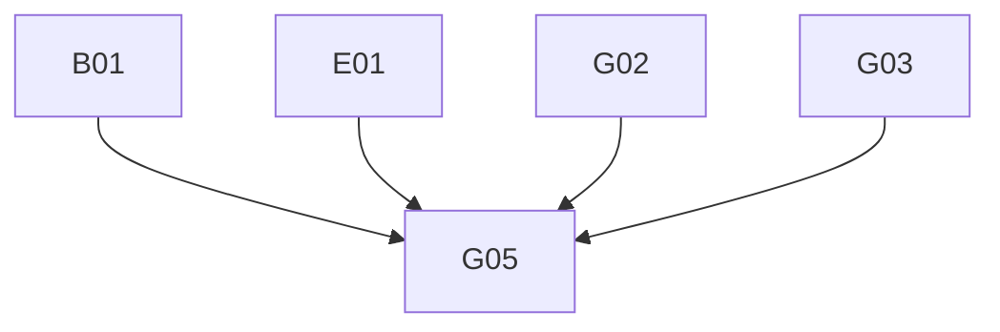

# Phase 4: Migration Plan & Stories — Claims

> **Domain:** `claims` · **Target DGS:** `ClaimService` → separate `claims` subgraph (repo `spark-claims`)
> **Pipeline Version:** 2.0 · **Generated:** 2026-06-27
> **Depends on:** [02-resolver-analysis.md](./02-resolver-analysis.md), [03-schema.graphql](./03-schema.graphql), [03-schema-analysis.md](./03-schema-analysis.md), [05-attribute-inventory.md](./05-attribute-inventory.md)
> **Index:** `04-stories-index.yaml`

Each story is self-contained. Full pseudo-logic in [02-resolver-analysis.md](./02-resolver-analysis.md).
- **ACL is context-only** — no ACL work in any story. **Claims is its own subgraph** (Product/search/etc. are
cross-subgraph).

## 1. Phases Overview
| Phase | Name | Stories |
|---|---|---|
| B | Core Reads | B01–B05 |
| C | Search & Listing | C01–C02 |
| D | Mutations (simple) | D01–D05 |
| E | Complex (proxy-ACL multi-step write) | E01 |
| F | Federation Contributions (BLOCKED-BY product) | F01–F02 |
| G | Field Resolvers & Tests | G01–G05 |

> **Self-contained story model.** The Netflix-DGS-on-REST framework already exists, so **every operation story below is end-to-end in a single PR**: it adds the schema (query/mutation + the GraphQL type definitions it returns), the DGS data fetcher, the Kotlin REST service method (read or write) that calls the backend, and pushes the schema change to the **Hive** registry. There is **no separate service-layer story** — the former `*Service` Kotlin-port story has been dissolved into the operation stories.

## 2. Dependency Graph

---

## 3. Stories

### Phase B — Core Reads

---

### SPARK-CLM-B01 · `getClaims(parentHumanId, claimHumanIds, partnerIds)`
- **Type:** Query · **Phase:** B · **Complexity:** Low · **Category:** CAT-2 · **Depends on:** —

- **In plain terms:** List claims for a product / set of partners.

> **Note — DGS Module Init (this PR only):** Creates `claims.graphqls` (federation v2.3 header, scalars, owned types with `@key`, external stubs), registers scalars in `ScalarConfig.kt`, and wires the service and Feign client. Full type list: [03-schema.graphql](./03-schema.graphql).
- **Current Behaviour (Q1):** (own) `claim.getClaims.load({parentHumanId, claimHumanIds, partnerIds})` `GET {base}` (filtered) → camelCase. **No ACL token.** **Target:** `@DgsQuery → [Claims]`. 

#### Acceptance Criteria

1. filters by the 3 args.

---

### SPARK-CLM-B02 · `getClaimByIds(claimHumanIds)`
- **Type:** Query · **Phase:** B · **Complexity:** Low · **Category:** CAT-2 · **Depends on:** B01

- **In plain terms:** Fetch specific claims by their ids.

- **Current Behaviour (Q2):** (ACL context) token → `GET {base}/search?claimIds={csv}`. **Target:** `@DgsQuery → [Claims]`. 

#### Acceptance Criteria

1. returns claims for ids.

---

### SPARK-CLM-B03 · `getCommunicationChannels` (cacheable)
- **Type:** Query · **Phase:** B · **Complexity:** Low · **Category:** CAT-2 · **Depends on:** B01

- **In plain terms:** Return the communication-channel lookup list (cached).

- **Current Behaviour (Q3):** (own) `GET {base}/communication-channels`. **Target:** `@DgsQuery` → `@Cacheable` → `[CommunicationChannel]`. 

#### Acceptance Criteria

1. returns channels; cached.

---

### SPARK-CLM-B04 · `getAllClaimsAbout` (cacheable)
- **Type:** Query · **Phase:** B · **Complexity:** Low · **Category:** CAT-2 · **Depends on:** B01

- **In plain terms:** Return the 'claims about' lookup list (cached).

- **Current Behaviour (Q4):** (own) `GET {base}/claims-about`. **Target:** `@DgsQuery` → `@Cacheable` → `[CodeDescription]`. 

#### Acceptance Criteria

1. returns list; cached.

---

### SPARK-CLM-B05 · `getClaimExports`
- **Type:** Query · **Phase:** B · **Complexity:** Low · **Category:** CAT-2 · **Depends on:** B01

- **In plain terms:** List the claim export jobs.

- **Current Behaviour (Q5):** (own) `GET {base}/export`. **Target:** `@DgsQuery → [ClaimExport]`. 

#### Acceptance Criteria

1. returns export records.

---

### Phase C — Search & Listing

---

### SPARK-CLM-C01 · `searchGuestFacing(queryParam)`
- **Type:** Query · **Phase:** C · **Complexity:** Medium · **Category:** CAT-2 · **Depends on:** B01

- **In plain terms:** Search the guest-facing (external-partner) claims view.

- **Current Behaviour (Q6):** (own) `GET {base}/search/guest_facing_claim?{qs(queryParam)}` → camelCase. **Target:** `@DgsQuery → [Guest_Facing]`. 

#### Acceptance Criteria

1. query-string built from `queryParam`.

---

### SPARK-CLM-C02 · `getClaimsElastic(parentHumanId)`
- **Type:** Query · **Phase:** C · **Complexity:** Medium · **Category:** CAT-2 · **Depends on:** B01 · **EXT:** 🔴 `search`

- **In plain terms:** Search a product's claims via elastic.

- **Current Behaviour (Q7):** (🔴 search) `search.getClaimsElastic.load({ q:"parentId: {parentHumanId}" })`. **EXT:** 🔴 search. **Target:** `@DgsQuery → [Claims]` via the search subgraph/client. 

#### Acceptance Criteria

1. `parentId:` elastic query built.

---

### Phase D — Mutations (simple)

---

### SPARK-CLM-D01 · `createClaim`
- **Type:** Mutation · **Phase:** D · **Complexity:** Medium · **Category:** CAT-2 · **Depends on:** B01

- **In plain terms:** Create a new claim.

- **Current Behaviour (M1):** (own) `POST {base}` (snake_case). **If `validationErrors`/`message` → throw.** **Target:** `@DgsMutation → [Claims]`; port throw-on-error. 

#### Acceptance Criteria

1. creates claim(s).
2. validation error → exception.

---

### SPARK-CLM-D02 · `bulkUpdateClaim`
- **Type:** Mutation · **Phase:** D · **Complexity:** Medium · **Category:** CAT-2 · **Depends on:** B01

- **In plain terms:** Update many claims in one call.

- **Current Behaviour (M3):** (own) `PUT {base}/bulk-update`. **Error contract:** result is array → return; `status_code>400` → throw; else throw "unhandled". **Latent:** source snake-cases the response — **fix to camelCase**. **Target:** `@DgsMutation → [Claims]`. 

#### Acceptance Criteria

1. array result returned (camelCase).
2. error status → exception.

---

### SPARK-CLM-D03 · `requestClaimExport`
- **Type:** Mutation · **Phase:** D · **Complexity:** Low · **Category:** CAT-2 · **Depends on:** B01

- **In plain terms:** Kick off a claim export job.

- **Current Behaviour (M4):** (own) `POST {base}/export` → `response.request_id`. **Target:** `@DgsMutation → String`. 

#### Acceptance Criteria

1. returns the request id.

---

### SPARK-CLM-D04 · `lockClaim`
- **Type:** Mutation · **Phase:** D · **Complexity:** Low · **Category:** CAT-2 · **Depends on:** B01

- **In plain terms:** Lock a claim from edits.

- **Current Behaviour (M5):** (ACL context) token → `PUT {base}/{claimId}/lock`. **Target:** `@DgsMutation → Claims`. 

#### Acceptance Criteria

1. locks the claim.

---

### SPARK-CLM-D05 · `unlockClaim`
- **Type:** Mutation · **Phase:** D · **Complexity:** Low · **Category:** CAT-2 · **Depends on:** B01

- **In plain terms:** Unlock a claim for edits.

- **Current Behaviour (M6):** (ACL context) token → `PUT {base}/{claimId}/unlock`. **Target:** `@DgsMutation → Claims`. 

#### Acceptance Criteria

1. unlocks the claim.

---

### Phase E — Complex Operations

---

### SPARK-CLM-E01 · `updateClaim` (proxy ACL + multi-step write)
- **Type:** Mutation · **Phase:** E · **Complexity:** 🔶 High · **Category:** CAT-2 · **Depends on:** B01 · **EXT:** 🟡 `workspaceV2`

- **In plain terms:** Edit a claim — a multi-step write (permissions + workspace + body) that has no rollback today.

- **As a** DGS engineer **I want** the multi-step claim update with a failure strategy **so that** workspace
and body changes stay consistent.
- **Current Behaviour (M2):** 1) `getUserPermissionsJWTByProxy({id:humanId, proxyIds:[parentId],
basePermissions:true})` (proxy/external ACL path — context only); 2) if `workspaceContext.{add,remove}`
non-empty → `workspaceAssociationHelper(CLAIM, humanId, add, remove)`; 3) `PUT {base}/{humanId}`;
4) **throw on `validationErrors`/`message`**. No rollback.
- **EXT:** 🟡 workspaceV2. **Target:** ordered steps + chosen failure strategy (**PO decision**). The proxy

ACL is **context-only** (note it; build nothing). 

#### Acceptance Criteria

1. workspace assoc runs when present.
2. body update + throw-on-error.
3. partial-failure strategy.

#### Test Cases

- [ ] body-only
- [ ] +workspace
- [ ] validation-error→throw
- [ ] partial-failure
- [ ] Parity: DGS response matches spark-internal-graphql baseline

---

### Phase F — Federation Contributions (BLOCKED-BY product)

---

### SPARK-CLM-F01 · `Product.claims` (federation contribution)
- **Type:** Field Resolver · **Phase:** F · **Complexity:** Medium · **Category:** CAT-4 · **Depends on:** B01 · **Blocked by:** product

- **In plain terms:** Expose a product's claims on the Product type (federation contribution).

- **Target:** `extend type Product @key(fields:"id") { claims(partnerIds:[String], includeClaims:Boolean): [Claims] }` with a `@DgsEntityFetcher`; the claims subgraph fills `Product.claims` over the gateway. **BLOCKED-BY:** the `Product` entity existing (plm-product Phase A). 

#### Acceptance Criteria

1. `Product.claims` resolves via federation.
2. parity vs the current in-gateway resolver.

---

### SPARK-CLM-F02 · `ResourcesCount.claims` (TechPack — claims side of SPARK-PROD-F05)
- **Type:** Field Resolver · **Phase:** F · **Complexity:** Low · **Category:** CAT-4 · **Depends on:** B01 · **Blocked by:** product

- **In plain terms:** Contribute the claims count to the product TechPack rollup.

- **Target:** `extend type ResourcesCount @key(fields:"productId partnerId") { claims: [ID] }` with a
`@DgsEntityFetcher`; fills the TechPack `claims` count. **BLOCKED-BY:** product TechPack facade
(`SPARK-PROD-E03`/`F05`). 

#### Acceptance Criteria

1. field resolves on the federated `ResourcesCount`; parity vs facade.

---

### Phase G — Field Resolvers & Tests

---

### SPARK-CLM-G01 · `access` + `currentUserPermissions` + `participantDetails`
- **Type:** Field Resolver · **Phase:** G · **Complexity:** Medium · **Category:** CAT-2 · **Depends on:** B01 · **EXT:** 🔵 `userGroup`

- **In plain terms:** Resolve a claim's access / permission / participant fields.

- **Current Behaviour:** `access` → `accessControl.getPermissions([humanId])[0]`; `currentUserPermissions`
→ `getUserAccessUnencoded(humanId)[0]`; `participantDetails` → `getUserGroup(humanId)`. (ACL context.) 

#### Acceptance Criteria

1. each resolves; null-safe.

---

### SPARK-CLM-G02 · `createdBy` + `updatedBy` + `businessPartner` + `designPartner`
- **Type:** Field Resolver · **Phase:** G · **Complexity:** Medium · **Category:** CAT-2 · **Depends on:** B01 · **EXT:** 🟡 `userAttributes` · 🔵 `vmm`

- **In plain terms:** Resolve the people and partner fields on a claim.

- **Current Behaviour:** users via 🟡 user-profile; `businessPartner` **3-way fallback** (`partnerId` ||
`{bpId:0,bpName:'Target'}` when no `dpPartnerId` || `dpPartnerId`); `designPartner` `dpPartnerId` or
`{bpId:null,bpName:null}`. **Target:** preserve every branch exactly. 

#### Acceptance Criteria

1. all 3 BP branches correct (incl. `bpId:0` Target).
2. null id → null user.

---

### SPARK-CLM-G03 · `product` + `parentDetails` (otherClaimBps / systemTeams / droppedPartnerIds)
- **Type:** Field Resolver · **Phase:** G · **Complexity:** 🔶 High · **Category:** CAT-2 · **Depends on:** B01 · **EXT:** 🟡 `product` · 🔴 `search`

- **In plain terms:** Resolve the parent product and its related-partner context on a claim.

- **Current Behaviour:** `product` (🟡 product, only if `parentId` starts `'PID'`); `parentDetails` →
- `product.getByID(parentId)` (the product feeds `ParentDetails`): `otherClaimBps` (🔴 search `getClaimsElastic` → partner ids), `systemTeams` (🔴 search `searchTeams` from product BPs; empty→`{content:[]}`), `droppedPartnerIds` (direct).
- **Target:** federated product reference + search.

#### Acceptance Criteria

1. `product` null when not `PID*`.
2. `otherClaimBps`/`systemTeams` elastic queries match source; empty-BP → `{content:[]}`.

#### Test Cases

- [ ] product branch
- [ ] otherClaimBps
- [ ] systemTeams
- [ ] empty BPs

---

### SPARK-CLM-G04 · `workspaces` + `ClaimSubstantiate.substantiatedBy` + `ClaimDetails.claimName`
- **Type:** Field Resolver · **Phase:** G · **Complexity:** Medium · **Category:** CAT-2 · **Depends on:** B01 · **EXT:** 🟡 `workspaceV2` · 🟡 `userAttributes`

- **In plain terms:** Resolve workspace links and a few computed claim fields.

- **Current Behaviour:** `workspaces` (🟡 workspaceV2 by `workspaceContext`); `substantiatedBy`
(🟡 user-profile); `ClaimDetails.claimName` = `guestFacingClaim` (computed). 

#### Acceptance Criteria

1. each resolves; `workspaces` null when empty.
2. `claimName` mirrors `guestFacingClaim`.

---

### SPARK-CLM-G05 · Tests, parity harness
- **Type:** Tests · **Phase:** G · **Complexity:** Medium · **Category:** CAT-5 · **Depends on:** B01, E01, G02, G03

- **In plain terms:** Prove the claims subgraph matches the old gateway.

- **Target:** ≥80% unit coverage; parity fixtures (incl. `updateClaim` proxy path, `bulkUpdateClaim`
camelCase fix, the `businessPartner` 3-way fallback, `parentDetails` elastic lookups); contract test
(schema diff intentional-only). 

#### Acceptance Criteria

1. unit ≥80%.
2. parity green.
3. schema-diff intentional.

---

## 4. Risk Register
| Risk | Likelihood | Impact | Mitigation | Owner |
|------|-----------|--------|------------|-------|
| `updateClaim` proxy-ACL multi-step partial failure (E01) | Medium | High | Saga / compensation — PO decision | Tech Lead + PO |
| `bulkUpdateClaim` snake-cased response (likely bug) (D02) | Medium | Medium | Fix to camelCase; parity test | Backend Eng |
| `businessPartner` 3-way fallback regressions (G02) | Low | Medium | Unit-test each branch incl. Target(0) | Backend Eng |
| `ParentDetails` elastic team/BP lookups (G03) | Low | Medium | Preserve empty handling; paginate | Backend Eng |
| Federation contributions wait on product (F01/F02) | Low | Low | Post-launch; not on critical path | Product Owner |

## 5. Summary
- **Stories:** 20 (B:5 · C:2 · D:5 · E:1 · F:2 · G:5).
- **Critical path:** A02/E01→G02/G03→G05.
- **Highest risk:** `updateClaim` (E01); the `bulkUpdateClaim` transform bug (D02).
- **Separate subgraph:** claims contributes `Product.claims` + TechPack `ResourcesCount.claims` (Phase F).

---
- **Phase Completed:** Phase 4 — Migration Stories · **Domain:** `claims` · **Outputs:** 04-stories.md, 04-stories-index.yaml, 04-po-summary.md.
