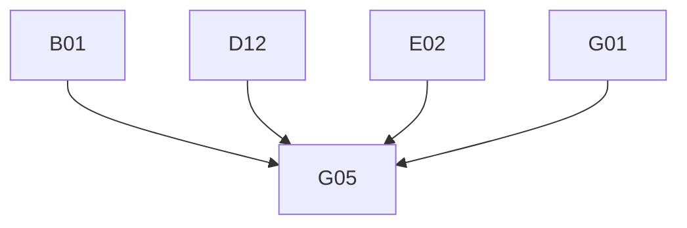

# Phase 4: Migration Plan & Stories — Discussion

> **Domain:** `discussion` · **Target DGS:** `DiscussionService` (+ V3) → separate `plm-discussion` subgraph
> **Pipeline Version:** 2.0 · **Generated:** 2026-06-27
> **Depends on:** [02-resolver-analysis.md](./02-resolver-analysis.md), [03-schema.graphql](./03-schema.graphql), [03-schema-analysis.md](./03-schema-analysis.md), [05-attribute-inventory.md](./05-attribute-inventory.md)
> **Index:** `04-stories-index.yaml`

Each story is self-contained. Full pseudo-logic in [02-resolver-analysis.md](./02-resolver-analysis.md).
- **ACL is context-only.** `discussion` is its **own subgraph** (V2 + V3). `core*` mutations are paired with
their public twin per story.

## 1. Phases Overview
| Phase | Name | Stories |
|---|---|---|
| B | Core Reads | B01–B07 |
| C | Search & Listing | C01–C02 |
| D | Mutations (create/update/delete/reply/sample/flags/files) | D01–D13 |
| E | Participant management | E01–E02 |
| F | Federation & decisions | F01–F03 |
| G | Field Resolvers & Tests | G01–G05 |

> **Self-contained story model.** The Netflix-DGS-on-REST framework already exists, so **every operation story below is end-to-end in a single PR**: it adds the schema (query/mutation + the GraphQL type definitions it returns), the DGS data fetcher, the Kotlin REST service method (read or write) that calls the backend, and pushes the schema change to the **Hive** registry. There is **no separate service-layer story** — the former `*Service` Kotlin-port story has been dissolved into the operation stories. The `Resource` union `@DgsTypeResolver` (A04) remains a dedicated story.

## 2. Dependency Graph

---

## 3. Stories

### Phase B — Core Reads

---

### SPARK-DISC-B01 · `getDiscussionV2` (+ `coreGetDiscussionV2`)
- **Type:** Query · **Phase:** B · **Complexity:** Low · **Category:** CAT-2 · **Depends on:** —

- **In plain terms:** Fetch a single discussion (comment thread) by id.

> **Note — DGS Module Init (this PR only):** Creates `discussion.graphqls` (federation v2.3 header, scalars, owned types with `@key`, external stubs), registers scalars in `ScalarConfig.kt`, and wires the service and Feign client. Full type list: [03-schema.graphql](./03-schema.graphql).
- **Current Behaviour:** (own) `GET discussions/v2?ids={id}` → `FullDiscussion`; `core*` = system context. **Target:** `@DgsQuery → FullDiscussion` (two fields, shared impl). 

#### Acceptance Criteria

1. returns discussion; core uses system context.

---

### SPARK-DISC-B02 · `getDiscussionByIdsV2`
- **Type:** Query · **Phase:** B · **Complexity:** Low · **Category:** CAT-2 · **Depends on:** B01

- **In plain terms:** Fetch several discussions by ids.

- **Current Behaviour:** (own) `GET /v2?ids={csv}`. **Target:** `@DgsQuery → [FullDiscussion]`. 

#### Acceptance Criteria

1. returns by ids.

---

### SPARK-DISC-B03 · `getDiscussionsCount`
- **Type:** Query · **Phase:** B · **Complexity:** Low · **Category:** CAT-2 · **Depends on:** B01

- **In plain terms:** Count discussions per resource.

- **Current Behaviour:** (own) count by `resourceId`/`resourceType` → `[ResourceCount]`. **Target:** `@DgsQuery`. 

#### Acceptance Criteria

1. returns per-resource counts.

---

### SPARK-DISC-B04 · `getDiscussionOnResource`
- **Type:** Query · **Phase:** B · **Complexity:** Low · **Category:** CAT-2 · **Depends on:** B01

- **In plain terms:** List the discussions on a given resource.

- **Current Behaviour:** (own) discussions for a resource. **Target:** `@DgsQuery → [Discussion]`. 

#### Acceptance Criteria

1. returns discussions.

---

### SPARK-DISC-B05 · `getDiscussionsByThread`
- **Type:** Query · **Phase:** B · **Complexity:** Low · **Category:** CAT-2 · **Depends on:** B01

- **In plain terms:** List the discussions in a thread.

- **Current Behaviour:** (own) discussions in a thread. **Target:** `@DgsQuery → [Discussion]`. 

#### Acceptance Criteria

1. returns thread discussions.

---

### SPARK-DISC-B06 · `getUnsentDiscussions`
- **Type:** Query · **Phase:** B · **Complexity:** Low · **Category:** CAT-2 · **Depends on:** B01

- **In plain terms:** List discussions queued but not yet sent (admin view).

- **Current Behaviour:** (own) `GET /api/admin/unsent`. **Target:** `@DgsQuery → UnsentDiscussions`. 

#### Acceptance Criteria

1. returns unsent.

---

### SPARK-DISC-B07 · `getVersionedDiscussions` (+ threads)
- **Type:** Query · **Phase:** B · **Complexity:** Medium · **Category:** CAT-2 · **Depends on:** B01

- **In plain terms:** Return a discussion's version history.

- **Covers:** `getVersionedDiscussions(id)`, `getVersionedDiscussionThreads(id)` (V3). **Current Behaviour:** (own V3) version history. **Target:** `@DgsQuery`. 

#### Acceptance Criteria

1. both return version history.

---

### Phase C — Search & Listing

---

### SPARK-DISC-C01 · `getDiscussionsV2` (elastic)
- **Type:** Query · **Phase:** C · **Complexity:** Medium · **Category:** CAT-2 · **Depends on:** B01 · **EXT:** 🔴 `search`

- **In plain terms:** Search discussions for a resource via elastic (partner-filtered).

- **Current Behaviour:** (🔴 search) elastic discussions by `resourceId`/`resourceType` (partner-filtered) → `DiscussionElastic`. **Target:** `@DgsQuery`. 

#### Acceptance Criteria

1. elastic query + partner filter.

---

### SPARK-DISC-C02 · `getSampleDiscussion`
- **Type:** Query · **Phase:** C · **Complexity:** Medium · **Category:** CAT-2 · **Depends on:** B01

- **In plain terms:** List discussions scoped to a sample.

- **Current Behaviour:** (own) sample-scoped discussions. **Target:** `@DgsQuery → [Discussion]`. 

#### Acceptance Criteria

1. returns sample discussions.

---

### Phase D — Mutations

---

### SPARK-DISC-D01 · `addDiscussionV2`
- **Type:** Mutation · **Phase:** D · **Complexity:** Medium · **Category:** CAT-2 · **Depends on:** B01 · **EXT:** 🟡 `attachment`

- **In plain terms:** Post a new discussion, optionally with attachments.

- **Current Behaviour:** (own) create + (🟡 attachment) bulk attachment input. **Target:** `@DgsMutation → Discussion`. 

#### Acceptance Criteria

1. creates; attachments associated.

---

### SPARK-DISC-D02 · `addDiscussionReplyV2` + `updateDiscussionReplyV2`
- **Type:** Mutation · **Phase:** D · **Complexity:** Medium · **Category:** CAT-2 · **Depends on:** B01 · **EXT:** 🟡 `attachment`

- **In plain terms:** Add or edit a reply on a discussion.

- **Current Behaviour:** add/update reply + (🟡 attachment) input (`isAttachmentsV3` flag). **Target:** `@DgsMutation → DiscussionReply`. 

#### Acceptance Criteria

1. add + update reply; v3-attachment flag honored.

---

### SPARK-DISC-D03 · `updateDiscussionV2`
- **Type:** Mutation · **Phase:** D · **Complexity:** Low · **Category:** CAT-2 · **Depends on:** B01

- **In plain terms:** Edit a discussion's body.

- **Current Behaviour:** (own) `PUT` discussion body. **Target:** `@DgsMutation → Discussion`. 

#### Acceptance Criteria

1. updates.

---

### SPARK-DISC-D04 · `deleteDiscussionV2`
- **Type:** Mutation · **Phase:** D · **Complexity:** Low · **Category:** CAT-2 · **Depends on:** B01

- **In plain terms:** Delete a discussion.

- **Current Behaviour:** (own) delete by id → ID. **Target:** `@DgsMutation → ID`. 

#### Acceptance Criteria

1. deletes.

---

### SPARK-DISC-D05 · `deleteDiscussionReplyV2`
- **Type:** Mutation · **Phase:** D · **Complexity:** Low · **Category:** CAT-2 · **Depends on:** B01

- **In plain terms:** Delete a reply.

- **Current Behaviour:** (own) delete reply → ID. **Target:** `@DgsMutation → ID`. 

#### Acceptance Criteria

1. deletes reply.

---

### SPARK-DISC-D06 · `deleteDiscussionPartnersV2`
- **Type:** Mutation · **Phase:** D · **Complexity:** Low · **Category:** CAT-2 · **Depends on:** B01

- **In plain terms:** Remove partners from a discussion.

- **Current Behaviour:** (own) delete partners from a discussion → ID. **Target:** `@DgsMutation → ID`. 

#### Acceptance Criteria

1. removes partners.

---

### SPARK-DISC-D07 · Sample discussions (V2/V3 + bulk)
- **Type:** Mutation · **Phase:** D · **Complexity:** Medium · **Category:** CAT-2 · **Depends on:** B01

- **In plain terms:** Create sample-scoped discussions.

- **Covers:** `addSampleDiscussionV2`, `addSampleDiscussionV3`, `bulkAddSampleDiscussions`. **Current Behaviour:** (own) sample-scoped create. **Target:** `@DgsMutation → SampleDiscussion`/`[…]`. 

#### Acceptance Criteria

1. each creates sample discussion(s).

---

### SPARK-DISC-D08 · Flags (critical / editable / tag)
- **Type:** Mutation · **Phase:** D · **Complexity:** Low · **Category:** CAT-2 · **Depends on:** B01 · **EXT:** 🔵 `tag`

- **In plain terms:** Set discussion flags (critical / editable / tag).

- **Covers:** `updateAsCritical`, `updateDiscussionEditable`, `updateTagExisting` (share the `DiscussionAsCritical` input). **Target:** `@DgsMutation → DiscussionReply`. 

#### Acceptance Criteria

1. each flag updates.

---

### SPARK-DISC-D09 · `cloneFilesForBulkDiscussion`
- **Type:** Mutation · **Phase:** D · **Complexity:** Medium · **Category:** CAT-2 · **Depends on:** B01 · **EXT:** 🟡 `attachment`

- **In plain terms:** Copy attachments when bulk-creating discussions.

- **Current Behaviour:** (ACL) token → `Promise.all(attachmentIds.map(id → (🟡 attachment) cloneAttachmentV3({cloneReferences}, id)))`. **Target:** structured-concurrency fan-out. 

#### Acceptance Criteria

1. clones each id.

---

### SPARK-DISC-D10 · `discussionReadByUsers`
- **Type:** Mutation · **Phase:** D · **Complexity:** Medium · **Category:** CAT-2 · **Depends on:** B01

- **In plain terms:** Mark discussions as read for a set of users.

- **Current Behaviour:** (own) mark read across `discussionIds`/`discussionThreadIds` for `readByUserList`. **Target:** `@DgsMutation → DiscussionReadByUsers`. 

#### Acceptance Criteria

1. records read receipts.

---

### SPARK-DISC-D11 · `addDiscussionV3` (+ `coreAddDiscussionV3`)
- **Type:** Mutation · **Phase:** D · **Complexity:** Medium · **Category:** CAT-2 · **Depends on:** B01 · **EXT:** 🟡 `attachment`

- **In plain terms:** Post a new discussion (V3 model) with attachments.

- **Current Behaviour:** (own V3) create + attachments; `core*` = system context. **Target:** `@DgsMutation → Discussion` (two fields, shared impl). 

#### Acceptance Criteria

1. creates; core uses system context.

---

### SPARK-DISC-D12 · `addBulkDiscussionV3`
- **Type:** Mutation · **Phase:** D · **Complexity:** 🔶 High · **Category:** CAT-2 · **Depends on:** B01 · **EXT:** 🟡 `attachment`

- **In plain terms:** Post discussions across many resources at once (V3).

- **Current Behaviour:** (own V3) bulk create across resources + attachments → `BulkDiscussionOutputV3`.
- **Note:** `coreAddBulkDiscussionV3` is **schema-drift** (no resolver — see F03). **Target:** `@DgsMutation`. 

#### Acceptance Criteria

1. bulk creates.

#### Test Cases

- [ ] bulk
- [ ] Parity: DGS response matches spark-internal-graphql baseline

---

### SPARK-DISC-D13 · `updateDiscussionV3` (+ `coreUpdateDiscussionV3`)
- **Type:** Mutation · **Phase:** D · **Complexity:** Medium · **Category:** CAT-2 · **Depends on:** B01

- **In plain terms:** Edit a discussion (V3 model).

- **Current Behaviour:** (own V3) update; `core*` = system context. **Target:** `@DgsMutation → Discussion`. 

#### Acceptance Criteria

1. updates; core context.

---

### Phase E — Participant management

---

### SPARK-DISC-E01 · Participants V2 (`updateParticipantsV2` + `deleteParticipantV2`)
- **Type:** Mutation · **Phase:** E · **Complexity:** Medium · **Category:** CAT-2 · **Depends on:** B01 · **EXT:** 🟡 `userGroup`

- **In plain terms:** Add or remove participants on a discussion (V2).

- **Current Behaviour:** add participants (`AddParticipantInput`) / remove a participant (team/user/partner). **Target:** `@DgsMutation → Discussion`. 

#### Acceptance Criteria

1. add + remove participants.

---

### SPARK-DISC-E02 · Participants V3 (`updateParticipantsV3` + `coreUpdate` + `coreDelete` + `deleteParticipantV3`)
- **Type:** Mutation · **Phase:** E · **Complexity:** 🔶 High · **Category:** CAT-2 · **Depends on:** B01 · **EXT:** 🟡 `userGroup`

- **In plain terms:** Add / update / remove participants on a discussion with the richer V3 model.

- **Current Behaviour:** richer participant model — `updateParticipantsV3` / `coreUpdateParticipantsV3`
- (participants + relatedResources + resourceType), `coreDeleteParticipantsV3` (removedUser/team/partners/ designPartners), `deleteParticipantV3` (team/user/partner/designPartner).
- **Target:** `@DgsMutation → Discussion` (one service, four fields).

#### Acceptance Criteria

1. each path updates/removes the right participants.

#### Test Cases

- [ ] update
- [ ] coreUpdate
- [ ] coreDelete
- [ ] delete

---

### Phase F — Federation & decisions

---

### SPARK-DISC-F01 · `Discussion` federated entity fetcher
- **Type:** Field Resolver · **Phase:** F · **Complexity:** Medium · **Category:** CAT-4 · **Depends on:** B01

- **In plain terms:** Let other subgraphs resolve a Discussion by key.

- **Target:** `@DgsEntityFetcher(name="Discussion")` by `discussionId`; provides `discussionsCount`/`discussionsV2`
for product/workspace over the gateway. 

#### Acceptance Criteria

1. entity resolves by key.
2. cross-subgraph smoke.

---

### SPARK-DISC-F02 · `ResourcesCount.discussions` (TechPack — SPARK-PROD-F02)
- **Type:** Field Resolver · **Phase:** F · **Complexity:** Low · **Category:** CAT-4 · **Depends on:** B01 · **Blocked by:** product

- **In plain terms:** Contribute the discussions count to the TechPack rollup.

- **Target:** `extend type ResourcesCount @key(fields:"productId partnerId") { discussions: [ID] }` with a `@DgsEntityFetcher`; fills the TechPack `discussions` count (the discussion side of `SPARK-PROD-F02`). **BLOCKED-BY:** product TechPack facade. 

#### Acceptance Criteria

1. field resolves; parity vs facade.

---

### SPARK-DISC-F03 · Deferred drift decision (drop/undrop + coreAddBulkDiscussionV3)
- **Type:** Schema · **Phase:** F · **Complexity:** Low · **Category:** CAT-4 · **Depends on:** B01

- **In plain terms:** Decide the fate of drop/undrop + a drift bulk query that have no resolvers.

- **Current Behaviour:** `dropPartnerFromDiscussionIds`/`unDropPartnerFromDiscussionIds` (no resolver — run inside `workspaceBusinessPartnerActionsV2`); `coreAddBulkDiscussionV3` (no resolver). **Target:** delete or keep `@deprecated`; coordinate drop/undrop ownership with workspace. 

#### Acceptance Criteria

1. decision + traffic survey.

---

### Phase G — Field Resolvers & Tests

---

### SPARK-DISC-G01 · `Discussion` + `FullDiscussion` + `DiscussionContent` field resolvers
- **Type:** Field Resolver · **Phase:** G · **Complexity:** 🔶 High · **Category:** CAT-2 · **Depends on:** B01 · **EXT:** 🟡 `userAttributes` · 🔵 `tag`

- **In plain terms:** Resolve the core discussion / content fields.

- **Current Behaviour:** discussion/full/content bodies, `createdBy`/`updatedBy` (🟡 user), `tags` (🔵 tag),
`resource` (union), `replies`/`participants`/`attachments` links. 

#### Acceptance Criteria

1. each field resolves.

#### Test Cases

- [ ] bodies
- [ ] users
- [ ] resource
- [ ] replies

---

### SPARK-DISC-G02 · `DiscussionReply` + `NotificationStatus` field resolvers
- **Type:** Field Resolver · **Phase:** G · **Complexity:** Medium · **Category:** CAT-2 · **Depends on:** B01 · **EXT:** 🟡 `attachment` · 🟡 `userAttributes`

- **In plain terms:** Resolve reply and notification-status fields.

- **Current Behaviour:** reply body/author (🟡 user), `attachments` (🟡 attachment), `notificationStatus`. 

#### Acceptance Criteria

1. each resolves.

---

### SPARK-DISC-G03 · Participants + Team + Participant sub-types
- **Type:** Field Resolver · **Phase:** G · **Complexity:** Medium · **Category:** CAT-2 · **Depends on:** B01 · **EXT:** 🟡 `userAttributes` · 🔵 `vmm`

- **In plain terms:** Resolve participant / team sub-type fields.

- **Current Behaviour:** `Discussion_Participants.teams`/`users`; `Discussion_Team.businessPartner` (🔵 vmm);
`Discussion_Participant.userDetails` (🟡 user). 

#### Acceptance Criteria

1. teams/users/bp resolve.

---

### SPARK-DISC-G04 · `Resource` union members + Versioned + `DiscussionReadByUsers`
- **Type:** Field Resolver · **Phase:** G · **Complexity:** Medium · **Category:** CAT-2 · **Depends on:** B01, B01 · **EXT:** 🟡 `userAttributes`

- **In plain terms:** Resolve the resource-union, versioned and read-by fields.

- **Current Behaviour:** `Resource` union resolution (via A04); `VersionedDiscussion`/`Thread.updatedBy` (🟡 user)/`updatedAt` (parse); `DiscussionReadByUsers.discussions`/`discussionThreads` (computed). 

#### Acceptance Criteria

1. each resolves.

---

### SPARK-DISC-G05 · Tests, parity harness
- **Type:** Tests · **Phase:** G · **Complexity:** 🔶 High · **Category:** CAT-5 · **Depends on:** B01, D12, E02, G01

- **In plain terms:** Prove the discussion subgraph matches the old gateway.

- **Target:** ≥80% unit coverage; parity harness (incl. V2/V3 + core twins, participants, bulk, the `Resource`
union, read receipts); contract test (schema diff intentional-only). 

#### Acceptance Criteria

1. unit ≥80%.
2. parity green.
3. schema-diff intentional.

#### Test Cases

- [ ] Parity: DGS response matches spark-internal-graphql baseline
- [ ] contract

---

## 4. Risk Register
| Risk | Likelihood | Impact | Mitigation | Owner |
|------|-----------|--------|------------|-------|
| Three API versions (v1/v2/V3) + `core*` twins | Medium | High | Consolidate in the service port; pair twins | Tech Lead |
| Participant-management correctness (E01/E02) | Medium | Medium | Per-op parity (users/teams/partners/design-partners) | Backend Eng |
| `Resource` union correctness (A04) | Medium | Medium | `@DgsTypeResolver` + per-member tests | Backend Eng |
| Schema-drift drop/undrop owned by workspace (F03) | Medium | Low | Coordinate ownership with workspace | Product Owner |
| Attachment coupling on write | Low | Medium | Attachment client / entity refs | Product Owner |

## 5. Summary
- **Stories:** 32 (B:7 · C:2 · D:13 · E:2 · F:3 · G:5) covering 11 queries + 26 mutations (+3 drift).
- **Critical path:** A02/G01→G05; E02 + D12 for the heavy writes.
- **Highest cost:** v1/v2/V3 consolidation + participant management + the field-resolver surface (+ `Resource` union).
- **Separate subgraph:** discussion provides `discussionsCount`/`discussionsV2` + the TechPack `discussions` count.

---
- **Phase Completed:** Phase 4 — Migration Stories · **Domain:** `discussion` · **Outputs:** 04-stories.md, 04-stories-index.yaml, 04-po-summary.md.
