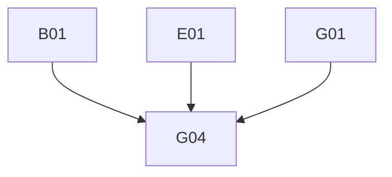

# Phase 4: Migration Plan & Stories — ProductDetails

> **Domain:** `productDetails` · **Target DGS:** `ProductDetailsService` → `plm-product`
> **Pipeline Version:** 2.0 · **Generated:** 2026-06-27
> **Depends on:** [02-resolver-analysis.md](./02-resolver-analysis.md), [03-schema.graphql](./03-schema.graphql), [03-schema-analysis.md](./03-schema-analysis.md), [05-attribute-inventory.md](./05-attribute-inventory.md)
> **Index:** `04-stories-index.yaml`

- Each story is self-contained (Current Behaviour → Target → Files → Acceptance → Tests).
- Full pseudo-logic in [02-resolver-analysis.md](./02-resolver-analysis.md).
- **ACL is context-only** — no ACL work in any story.
- Backend path is `construction/v1`.

## 1. Phases Overview
| Phase | Name | Stories |
|---|---|---|
| B | Core Reads | B01 |
| C | Search & Listing | C01 |
| D | Mutations (simple) | D01–D05 |
| E | Complex (multi-step write) | E01 |
| F | Federation (internal) | F01 |
| G | Field Resolvers & Tests | G01–G04 |

> **Self-contained story model.** The Netflix-DGS-on-REST framework already exists, so **every operation story below is end-to-end in a single PR**: it adds the schema (query/mutation + the GraphQL type definitions it returns), the DGS data fetcher, the Kotlin REST service method (read or write) that calls the backend, and pushes the schema change to the **Hive** registry. There is **no separate service-layer story** — the former `*Service` Kotlin-port story has been dissolved into the operation stories.

## 2. Dependency Graph

---

## 3. Stories

### Phase B — Core Reads

---

### SPARK-PDTL-B01 · `getProductDetailsById(ids)`
- **Type:** Query · **Phase:** B · **Complexity:** Low · **Category:** CAT-2 · **Depends on:** —

- **In plain terms:** Fetch product-detail (construction) sets by id.

> **Note — DGS Module Init (this PR only):** Creates `productDetails.graphqls` (federation v2.3 header, scalars, owned types with `@key`, external stubs), registers scalars in `ScalarConfig.kt`, and wires the service and Feign client. Full type list: [03-schema.graphql](./03-schema.graphql).
- **Current Behaviour (Q1):** (ACL context) token for `ids` → `GET construction/v1?ids={csv}` → camelCase list.
- **Target:** `@DgsQuery getProductDetailsById(ids): [ProductDetails]`. 

#### Acceptance Criteria

1. returns list for ids; empty → [].

---

### Phase C — Search & Listing

---

### SPARK-PDTL-C01 · `getProductDetailsElastic(resourceId)`
- **Type:** Query · **Phase:** C · **Complexity:** Medium · **Category:** CAT-2 · **Depends on:** B01 · **EXT:** 🔴 `search`

- **In plain terms:** Search a product's product-detail sets via elastic.

- **Current Behaviour (Q2):** (🔴 search) `search.getProductDetailsElastic.load({ q:"parentId: {resourceId}" })` → paged.
- **EXT:** 🔴 search. **Target:** `@DgsQuery → ProductDetailsPaged`. **Note:** the source resolver reads a `types` arg not in the SDL — drop (or add to schema) per [03-analysis §2](./03-schema-analysis.md).

#### Acceptance Criteria

1. `parentId:` elastic query built.
2. paged shape returned.

---

### Phase D — Mutations (simple)

---

### SPARK-PDTL-D01 · `createProductDetailsSet`
- **Type:** Mutation · **Phase:** D · **Complexity:** Medium · **Category:** CAT-2 · **Depends on:** B01

- **In plain terms:** Create a product-detail set.

- **Current Behaviour (M1):** (ACL context) token for literal capability → `POST construction/v1` (snake_case). **If response has `validationErrors` or `message` → throw.** **Target:** `@DgsMutation`; port the throw-on-error contract. 

#### Acceptance Criteria

1. creates set.
2. validation error → exception (not a partial object).

---

### SPARK-PDTL-D02 · `updateProductDetailAccess`
- **Type:** Mutation · **Phase:** D · **Complexity:** Low · **Category:** CAT-2 · **Depends on:** B01

- **In plain terms:** Change who can access a product-detail set.

- **Current Behaviour (M2):** map `managePermissionsRequest[].resourceId` → token → `PUT construction/v1/manage-permissions` (`primeKey=humanId`). **Target:** `@DgsMutation → [ProductDetails]`. 

#### Acceptance Criteria

1. updates partner access for each resource.

---

### SPARK-PDTL-D03 · `productDetailLockUnlock`
- **Type:** Mutation · **Phase:** D · **Complexity:** Low · **Category:** CAT-2 · **Depends on:** B01

- **In plain terms:** Lock or unlock a product-detail set.

- **Current Behaviour (M3):** token for `[constructionSetId]` → `PUT construction/v1/{id}/{lock|unlock}`. **Target:** `@DgsMutation`. 

#### Acceptance Criteria

1. `isLock=true`→lock path, false→unlock path.

---

### SPARK-PDTL-D04 · `cloneFilesForProductDetails`
- **Type:** Mutation · **Phase:** D · **Complexity:** Medium · **Category:** CAT-2 · **Depends on:** B01 · **EXT:** 🔴 `attachment`

- **In plain terms:** Copy attachment files for product details.

- **Current Behaviour (M5):** token → `Promise.all(attachmentIds.map((id,i) => (🔴 attachment) cloneAttachmentV3({cloneReferences:[cloneReference[i]]}, id)))`, stamp `parentResource=id`, flatten. No rollback. **EXT:** 🔴 attachment. **Target:** structured-concurrency fan-out via `AttachmentClient`. 

#### Acceptance Criteria

1. clones each id with its paired cloneReference.
2. `parentResource` stamped.

---

### SPARK-PDTL-D05 · `updateProductDetailComponentStatus`
- **Type:** Mutation · **Phase:** D · **Complexity:** Low · **Category:** CAT-2 · **Depends on:** B01

- **In plain terms:** Update component status on product-detail sets.

- **Current Behaviour (M6):** `PUT construction/v1/component_status_update`; wraps result as `{content}`. **No JWT — confirm backend-enforced.** **Target:** `@DgsMutation → ProductDetailsPaged`. 

#### Acceptance Criteria

1. updates statuses; result wrapped as `{content}`.
2. no-token behaviour documented.

---

### Phase E — Complex Operations

---

### SPARK-PDTL-E01 · `updateProductDetailsSet` (multi-step write)
- **Type:** Mutation · **Phase:** E · **Complexity:** 🔶 High · **Category:** CAT-2 · **Depends on:** B01 · **EXT:** 🔴 `attachment` · 🟡 `workspaceV2`

- **In plain terms:** Edit a product-detail set — a multi-step write (workspace + body) with no rollback today.

- **As a** DGS engineer **I want** the multi-step product-details update with a failure strategy **so that**
workspace, attachment, and body changes stay consistent.
- **Current Behaviour (M4):** 1) if `workspaceContext.{add,remove}Workspaces` non-empty →
`workspaceAssociationHelper(PRODUCT_DETAIL, id, add, remove)` (throws on error); 2) null `workspaceContext`;
3) if `deleteAttachmentIds` → (🔴 attachment) `archiveAttachmentBulkV3` (separate ACL token);
4) `PUT construction/v1/{id}`. **No rollback across steps.**
- **EXT:** 🔴 attachment · 🟡 workspaceV2. **Target:** ordered steps with a chosen failure strategy

(**PO decision** saga / compensation log / best-effort). 

#### Acceptance Criteria

1. all 4 steps in order.
2. partial-failure strategy implemented.
3. workspace assoc throws propagate.

#### Test Cases

- [ ] full path
- [ ] workspace-only
- [ ] attachment-archive
- [ ] partial-failure
- [ ] Parity: DGS response matches spark-internal-graphql baseline

---

### Phase F — Federation (internal)

---

### SPARK-PDTL-F01 · `Product.productDetails` (internal, same subgraph)
- **Type:** Field Resolver · **Phase:** F · **Complexity:** Low · **Category:** CAT-2 · **Depends on:** B01

- **In plain terms:** Expose a product's product-details on the Product type (same subgraph).

- **Current Behaviour:** Product exposes `productDetails` resolved from the co-located ProductDetails service. **Target:** **internal** `@DgsData` on `Product` calling `ProductDetailsService` in-process (not gateway federation; depends only on the `Product` type existing). 

#### Acceptance Criteria

1. `Product.productDetails` resolves in-process; no gateway hop.

---

### Phase G — Field Resolvers & Tests

---

### SPARK-PDTL-G01 · `access` + `currentUserPermissions` + `participantDetails`
- **Type:** Field Resolver · **Phase:** G · **Complexity:** Medium · **Category:** CAT-2 · **Depends on:** B01 · **EXT:** 🔵 `userGroup`

- **In plain terms:** Resolve access / permission / participant fields.

- **Current Behaviour:** `access` → `accessControl.getPermissions([humanId||id])[0]`; `currentUserPermissions`
→ `getUserAccessUnencoded(humanId||id)[0]`; `participantDetails` → `getUserGroup(humanId)`. (ACL context.) **Target:** thin `@DgsData`; ACL is context-only. 

#### Acceptance Criteria

1. each field resolves; null-safe on empty.

---

### SPARK-PDTL-G02 · `product` + `createdBy` + `updatedBy` + `businessPartners` + `workspaces`
- **Type:** Field Resolver · **Phase:** G · **Complexity:** Medium · **Category:** CAT-2 · **Depends on:** B01 · **EXT:** 🟡 `userAttributes` · 🟡 `workspaceV2` · 🔵 `vmm`

- **In plain terms:** Resolve the product, people, partner and workspace fields.

- **Current Behaviour:** `product` (internal, only if `parentId` starts `'PID'`), `createdBy`/`updatedBy`
(🟡 user-profile), `businessPartners` (🔵 vmm `loadBpsWithType`), `workspaces` (🟡 workspaceV2 by ids). **Target:** internal + federated references. 

#### Acceptance Criteria

1. each resolves; `product` null when `parentId` not `PID*`.
2. null id → null user.

---

### SPARK-PDTL-G03 · `attachment` + item `attachment`/`constructionSetAttachments` + category `subCategories`
- **Type:** Field Resolver · **Phase:** G · **Complexity:** Medium · **Category:** CAT-2 · **Depends on:** B01 · **EXT:** 🔴 `search`

- **In plain terms:** Resolve attachment and category fields on product details.

- **Current Behaviour:** `ProductDetails.attachment` → (🔴 search) `searchAttachments([humanId||id])`, find
- `relatedResources.length<=2`; `ProductDetailsItem.attachment` → `searchAttachments([templateId])[0]||{}`; `constructionSetAttachments` → `searchAttachments([id]).content||[]`; `CategoryWithSection.subCategories` → (internal `specificationsTemplate`) `getProductDetailsCategorySection()` find by `code`.
- **Target:** shared search helper + internal master-data call.

#### Acceptance Criteria

1. each field resolves to the right source.
2. `attachment` length-≤2 filter preserved.

---

### SPARK-PDTL-G04 · Tests, parity harness
- **Type:** Tests · **Phase:** G · **Complexity:** Medium · **Category:** CAT-5 · **Depends on:** B01, E01, G01

- **In plain terms:** Prove the product-details subgraph matches the old gateway.

- **Target:** ≥80% unit coverage; parity fixtures (incl. the multi-step `updateProductDetailsSet`, the
create error-contract, attachment-by-search fields); contract test (schema diff intentional-only). 

#### Acceptance Criteria

1. unit ≥80%.
2. parity fixtures green.
3. schema-diff intentional-only.

---

## 4. Risk Register
| Risk | Likelihood | Impact | Mitigation | Owner |
|------|-----------|--------|------------|-------|
| `updateProductDetailsSet` multi-step partial failure (E01) | Medium | High | Saga / compensation — PO decision | Tech Lead + PO |
| `updateProductDetailComponentStatus` no auth token (D05) | Low | Medium | Confirm backend-enforced | PO |
| Attachment-by-search field perf (G03) | Low | Medium | Shared helper; batch | Backend Eng |
| `getProductDetailsElastic.types` schema drift (C01) | Low | Low | Drop or add to schema | Backend Eng |

## 5. Summary
- **Stories:** 13 (B:1 · C:1 · D:5 · E:1 · F:1 · G:4).
- **Critical path:** A02/E01→G01→G04.
- **Highest risk:** `updateProductDetailsSet` (E01).
- **Co-located:** productDetails is in the `plm-product` monorepo; `Product.productDetails` resolves internally.

---
- **Phase Completed:** Phase 4 — Migration Stories · **Domain:** `productDetails` · **Outputs:** 04-stories.md, 04-stories-index.yaml, 04-po-summary.md.
