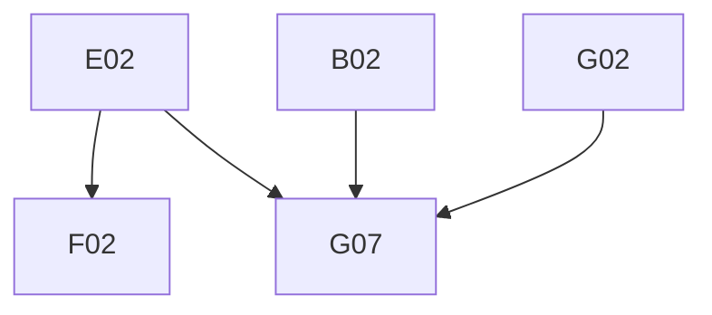

# Phase 4: Migration Plan & Stories — Sample

> **Domain:** `sample` · **Target DGS:** `SampleServiceV2` → separate `plm-sample` subgraph
> **Pipeline Version:** 2.0 · **Generated:** 2026-06-27
> **Depends on:** [02-resolver-analysis.md](./02-resolver-analysis.md), [03-schema.graphql](./03-schema.graphql), [03-schema-analysis.md](./03-schema-analysis.md), [05-attribute-inventory.md](./05-attribute-inventory.md)
> **Index:** `04-stories-index.yaml`

Each story is self-contained. Full pseudo-logic in [02-resolver-analysis.md](./02-resolver-analysis.md).
- **ACL is context-only.** `sample` is its **own subgraph** (Product/workspace/measurement/search are
cross-subgraph). Base `samples/v2`.

## 1. Phases Overview
| Phase | Name | Stories |
|---|---|---|
| B | Core Reads | B01–B08 |
| C | RFID Reads | C01–C02 |
| D | Mutations (simple) | D01–D07 |
| E | Complex (evaluation writes) | E01–E02 |
| F | Federation & decisions | F01–F02 |
| G | Field Resolvers & Tests | G01–G07 |

> **Self-contained story model.** The Netflix-DGS-on-REST framework already exists, so **every operation story below is end-to-end in a single PR**: it adds the schema (query/mutation + the GraphQL type definitions it returns), the DGS data fetcher, the Kotlin REST service method (read or write) that calls the backend, and pushes the schema change to the **Hive** registry. There is **no separate service-layer story** — the former `*Service` Kotlin-port story has been dissolved into the operation stories. The `SampleAsset` union `@DgsTypeResolver` (A04) remains a dedicated story.

## 2. Dependency Graph

---

## 3. Stories

### Phase B — Core Reads

---

### SPARK-SMPL-B01 · `getSampleById(id)`
- **Type:** Query · **Phase:** B · **Complexity:** Low · **Category:** CAT-2 · **Depends on:** —

- **In plain terms:** Fetch one sample by id.

> **Note — DGS Module Init (this PR only):** Creates `sample.graphqls` (federation v2.3 header, scalars, owned types with `@key`, external stubs), registers scalars in `ScalarConfig.kt`, and wires the service and Feign client. Full type list: [03-schema.graphql](./03-schema.graphql).
- **Current Behaviour:** (own) `getSampleById.load(id)`. **Target:** `@DgsQuery → SampleV2`. 

#### Acceptance Criteria

1. returns sample; miss→null.

---

### SPARK-SMPL-B02 · `getSamplesByIdsV2(ids)` (batched)
- **Type:** Query · **Phase:** B · **Complexity:** Medium · **Category:** CAT-2 · **Depends on:** B01 · **EXT:** 🔵 `recentlyViewed`

- **In plain terms:** Fetch several samples by ids (batched); records 'recently viewed'.

- **Current Behaviour (Q2):** `batchParallelOperation(chunk)` → (ACL) token per batch → (own) `getSamplesByIdsV2ByPost`. **Side-effect:** exactly-one → (🔵 recentlyViewed) `addRecentlyViewed`. **Target:** `@DgsQuery → [SampleV2]`; chunked. 

#### Acceptance Criteria

1. batched by chunk size.
2. single → recentlyViewed.

---

### SPARK-SMPL-B03 · `getSamplesByParentId(humanId)`
- **Type:** Query · **Phase:** B · **Complexity:** Medium · **Category:** CAT-2 · **Depends on:** B01 · **EXT:** 🟡 `relationship`

- **In plain terms:** List a product's samples.

- **Current Behaviour (Q3):** (🟡 relationship) `getByID({id, type:'sample', maxDepth:0})` → ids → (ACL) token → (own) `getSamplesByIdsV2`; empty → []. **Target:** `@DgsQuery → [SampleV2]`. 

#### Acceptance Criteria

1. relationship→ids→samples chain.

---

### SPARK-SMPL-B04 · `getColorSamplesByParentId(id)`
- **Type:** Query · **Phase:** B · **Complexity:** Low · **Category:** CAT-2 · **Depends on:** B01

- **In plain terms:** List a product's colour samples.

- **Current Behaviour:** (own) `getColorSamplesByParentId.load(id)`. **Target:** `@DgsQuery → [SampleV2]`. 

#### Acceptance Criteria

1. returns color samples.

---

### SPARK-SMPL-B05 · `getSampleRounds(humanId)`
- **Type:** Query · **Phase:** B · **Complexity:** Low · **Category:** CAT-2 · **Depends on:** B01

- **In plain terms:** List the evaluation rounds on a sample.

- **Current Behaviour:** (ACL) token → (own) `getSampleRounds`. **Target:** `@DgsQuery → [SampleV2]`. 

#### Acceptance Criteria

1. returns rounds.

---

### SPARK-SMPL-B06 · `getSampleExports`
- **Type:** Query · **Phase:** B · **Complexity:** Low · **Category:** CAT-2 · **Depends on:** B01

- **In plain terms:** List sample export jobs.

- **Current Behaviour:** (own) `getSampleExports`. **Target:** `@DgsQuery → [SampleExport]`. 

#### Acceptance Criteria

1. returns exports.

---

### SPARK-SMPL-B07 · `getSampleNotificationErrors`
- **Type:** Query · **Phase:** B · **Complexity:** Low · **Category:** CAT-2 · **Depends on:** B01 · **EXT:** 🟡 `notification`

- **In plain terms:** List failed sample notifications.

- **Current Behaviour:** (🟡 notification) `getSampleNotificationErrors`. **Target:** `@DgsQuery → [SampleNotificationError]`. 

#### Acceptance Criteria

1. returns errors.

---

### SPARK-SMPL-B08 · Master-data type/format/purpose queries (cacheable bundle)
- **Type:** Query · **Phase:** B · **Complexity:** Low · **Category:** CAT-2 · **Depends on:** B01

- **In plain terms:** Return the sample type / format / purpose lookups (cached).

- **Covers (~13):** `getSampleMaterialTypesV2`, `getSampleTypesV2(resourceTypes)`, `getFabricSampleTypesV2`,
- `getSampleProductTypesV2`, `getSampleTrackingTypesV2`, `getSampleLateReasonTypesV2`, `getColorSamplePurposesV2`, `getMaterialSampleEvaluationTypesV2`, `getProductSampleEvaluationTypesV2`, `getWashSampleTypesV2`, `getSampleFormats(type)`, `getMaterialSampleFormats(type)`, `getSampleEvaluationPurposes`, `getSampleTypeFormatMappings`.
- **Current Behaviour:** thin (own) master-data loads.
- **Target:** `@DgsQuery` each → `@Cacheable`.

#### Acceptance Criteria

1. each returns its list; cached.

---

### Phase C — RFID Reads

---

### SPARK-SMPL-C01 · `getSampleLocationByIds(ids)`
- **Type:** Query · **Phase:** C · **Complexity:** 🔶 High · **Category:** CAT-2 · **Depends on:** B01 · **EXT:** 🔴 `search`

- **In plain terms:** Find each sample's latest physical location via its RFID tags.

- **Current Behaviour (Q6):** batched samples → for each with `rfidTagIds` → (🔴 search) `searchLatestRfidLocations({q: tagIds OR-joined})` → reduce to latest `lastSeen` → `{id, locationDescription, lastSeen}`; flatten. **Target:** `@DgsQuery → [RfidSampleLocation]`; batch tag queries. 

#### Acceptance Criteria

1. latest-location reduce correct.
2. no tags → [].

#### Test Cases

- [ ] latest reduce
- [ ] no-tags
- [ ] Parity: DGS response matches spark-internal-graphql baseline

---

### SPARK-SMPL-C02 · `getSamplesByRfidTagIds(ids)`
- **Type:** Query · **Phase:** C · **Complexity:** Medium · **Category:** CAT-2 · **Depends on:** B01

- **In plain terms:** Find samples by their RFID tag ids.

- **Current Behaviour:** (ACL) token → (own) `getSamplesByRfidTagIds`. **Target:** `@DgsQuery → [SampleRfidTagPair]`. 

#### Acceptance Criteria

1. returns tag→sample pairs.

---

### Phase D — Mutations (simple)

---

### SPARK-SMPL-D01 · `createSamplesV2`
- **Type:** Mutation · **Phase:** D · **Complexity:** Medium · **Category:** CAT-2 · **Depends on:** B01 · **EXT:** 🟡 `relationship` · 🟡 `attachment`

- **In plain terms:** Create samples (and link any attachment files).

- **Current Behaviour (M1):** (own) `createSamplesV2`; **if first new sample has files** → (🟡 relationship) `createSampleAttachmentRelationship` + (ACL) token + (🟡 attachment) `bulkUpdateAttributes` (stamp resource/related). No rollback. **Target:** `@DgsMutation → [SampleV2]`. 

#### Acceptance Criteria

1. creates.
2. file-relationship + attribute side-effects when files present.

---

### SPARK-SMPL-D02 · `createSampleRoundV2`
- **Type:** Mutation · **Phase:** D · **Complexity:** Low · **Category:** CAT-2 · **Depends on:** B01

- **In plain terms:** Create a new evaluation round on a sample.

- **Current Behaviour (M4):** (ACL) token `[sampleId, SAMPLE_EVALUTION]` → (own) `createSampleRoundV2`. **Target:** `@DgsMutation → SampleV2`. 

#### Acceptance Criteria

1. creates a round.

---

### SPARK-SMPL-D03 · `updateSampleWorkspaceAssociation`
- **Type:** Mutation · **Phase:** D · **Complexity:** Low · **Category:** CAT-2 · **Depends on:** B01

- **In plain terms:** Add / remove a sample's workspace links.

- **Current Behaviour (M3):** (ACL) token `[sampleId, workspaceId]` → (own) `updateSampleWorkspaceAssociation`. **Target:** `@DgsMutation → SampleV2`. 

#### Acceptance Criteria

1. associates sample to workspace.

---

### SPARK-SMPL-D04 · `requestSampleExport`
- **Type:** Mutation · **Phase:** D · **Complexity:** Low · **Category:** CAT-2 · **Depends on:** B01

- **In plain terms:** Kick off a sample export.

- **Current Behaviour (M6):** (own) `requestSampleExport`. **Target:** `@DgsMutation → String`. 

#### Acceptance Criteria

1. returns request id.

---

### SPARK-SMPL-D05 · `retrySampleNotificationError`
- **Type:** Mutation · **Phase:** D · **Complexity:** Low · **Category:** CAT-2 · **Depends on:** B01 · **EXT:** 🟡 `notification`

- **In plain terms:** Retry one failed sample notification.

- **Current Behaviour (M7):** (🟡 notification) `retrySampleNotificationError(failedMessageId)`. **Target:** `@DgsMutation`. 

#### Acceptance Criteria

1. retries one.

---

### SPARK-SMPL-D06 · `retryAllSampleNotificationErrors`
- **Type:** Mutation · **Phase:** D · **Complexity:** Low · **Category:** CAT-2 · **Depends on:** B01 · **EXT:** 🟡 `notification`

- **In plain terms:** Retry all failed sample notifications.

- **Current Behaviour (M8):** (🟡 notification) `retryAllSampleNotificationErrors`. **Target:** `@DgsMutation → [...]`. 

#### Acceptance Criteria

1. retries all.

---

### SPARK-SMPL-D07 · `bulkCloneFilesForEvaluate`
- **Type:** Mutation · **Phase:** D · **Complexity:** Medium · **Category:** CAT-2 · **Depends on:** B01 · **EXT:** 🟡 `attachment`

- **In plain terms:** Copy attachment files for sample evaluation.

- **Current Behaviour (M9):** (ACL) token → `Promise.all(attachmentIds.map(id => (🟡 attachment) cloneAttachmentV3({cloneReferences}, id)))`, flatten. **Target:** structured-concurrency fan-out. 

#### Acceptance Criteria

1. clones each id.

---

### Phase E — Complex Operations

---

### SPARK-SMPL-E01 · `updateSamplesV2`
- **Type:** Mutation · **Phase:** E · **Complexity:** 🔶 High · **Category:** CAT-2 · **Depends on:** B01

- **In plain terms:** Update samples (the evaluation write).

- **Current Behaviour (M2):** (ACL) token for all `updateSamples[].id` + `SAMPLE_EVALUTION` → (own) `updateSamplesV2`. **Target:** `@DgsMutation → [SampleV2]`. 

#### Acceptance Criteria

1. bulk-updates samples (eval-scoped token).

#### Test Cases

- [ ] update
- [ ] Parity: DGS response matches spark-internal-graphql baseline

---

### SPARK-SMPL-E02 · `bulkEvaluateSamples`
- **Type:** Mutation · **Phase:** E · **Complexity:** 🔶 High · **Category:** CAT-2 · **Depends on:** B01 · **EXT:** 🟡 `attachment`

- **In plain terms:** Apply evaluations to many samples and create new rounds.

- **As a** DGS engineer **I want** the bulk-evaluate orchestration **so that** evaluations + new rounds apply
consistently.
- **Current Behaviour (M5):** delegates to `bulkEvaluateSampleUtil(ctx, updateSamples, newSampleRounds)` —
applies evaluations and creates new sample rounds. **Target:** port the util as a service; choose a
failure strategy if partial. 

#### Acceptance Criteria

1. evaluations + new rounds applied.
2. partial-failure handling decided.

#### Test Cases

- [ ] evaluate
- [ ] new rounds
- [ ] partial
- [ ] Parity: DGS response matches spark-internal-graphql baseline

---

### Phase F — Federation & decisions

---

### SPARK-SMPL-F01 · `SampleV2` federated entity fetcher
- **Type:** Field Resolver · **Phase:** F · **Complexity:** Medium · **Category:** CAT-4 · **Depends on:** B01

- **In plain terms:** Let other subgraphs resolve a Sample by key.

- **Target:** `@DgsEntityFetcher(name="SampleV2")` resolving by `id`, so product (`Product.samples`/`sampleIds`),
measurement (`SampleV2.sampleMeasurement` — `SPARK-MEAS-F02`), and workspace resolve sample over the gateway. 

#### Acceptance Criteria

1. entity resolves by key.
2. `Product { samples { id } }` cross-subgraph smoke test.

---

### SPARK-SMPL-F02 · Deferred drift mutation decision
- **Type:** Schema · **Phase:** F · **Complexity:** Low · **Category:** CAT-4 · **Depends on:** E02

- **In plain terms:** Decide the fate of superseded / drift sample mutations.

- **Current Behaviour:** `updateSampleEvaluations` (no resolver — superseded by `bulkEvaluateSamples`),
`dropSamples`/`undropSamples` (no resolver — run inside `workspaceBusinessPartnerActionsV2`). **Target:** Product Owner decides delete vs keep `@deprecated`; coordinate drop/undrop ownership with workspace. 

#### Acceptance Criteria

1. decision + traffic survey.

---

### Phase G — Field Resolvers & Tests

---

### SPARK-SMPL-G01 · Users (created/updated/evaluated + evaluators + primary roles)
- **Type:** Field Resolver · **Phase:** G · **Complexity:** Medium · **Category:** CAT-2 · **Depends on:** B01 · **EXT:** 🟡 `userAttributes` · 🔵 `role`

- **In plain terms:** Resolve the created / updated / evaluated-by people and evaluator roles.

- **Current Behaviour:** `createdBy`/`updatedBy`/`evaluatedBy` (🟡 user; `systemGenerated` → `systemUser`),
`designEvaluators`/`technicalEvaluators` (🟡 user map), `createdByInternalPrimaryRole`/`evaluatedByInternalPrimaryRole` (🔵 role). 

#### Acceptance Criteria

1. each resolves; system-user branch preserved.

---

### SPARK-SMPL-G02 · Prefix-gated parents + `SampleAsset` union
- **Type:** Field Resolver · **Phase:** G · **Complexity:** 🔶 High · **Category:** CAT-2 · **Depends on:** B01, B01 · **EXT:** 🟡 `product` · 🟡 `trim` · 🟡 `colorArchroma` · 🟡 `combination` · 🟡 `fabric` · 🟡 `artwork` · 🟡 `material`

- **In plain terms:** Resolve a sample's parent (product / colour / fabric…) by id-prefix into the right type.

- **Current Behaviour:** prefix-gated hydration — `product` (PID, 🟡 product), `colorArchroma` (ARCCLR/TARARCCLR/REFARCCLR, 🟡 colorArchroma), `fabricSpecCombo` (FSC, 🟡 combination), `fabricSpec` (FAS, 🟡 fabric), `artwork` (ART, 🟡 artwork), `trim` (🟡 trim), `asset` (union via 🟡 material). **Target:** central prefix→loader table; `asset` resolves via the `SampleAsset` `@DgsTypeResolver` (A04). 

#### Acceptance Criteria

1. each prefix routes to the right loader.
2. `asset` union resolves.
3. non-matching → null.

#### Test Cases

- [ ] each prefix
- [ ] union
- [ ] null

---

### SPARK-SMPL-G03 · Partners (`businessPartner`/`fabricSupplier`/`merchandiseVendors`/`brand`/`designPartnerId`)
- **Type:** Field Resolver · **Phase:** G · **Complexity:** Medium · **Category:** CAT-2 · **Depends on:** B01 · **EXT:** 🔵 `vmm` · 🔵 `brand`

- **In plain terms:** Resolve the business / fabric / vendor / brand partner fields.

- **Current Behaviour:** `businessPartner`/`fabricSupplier`/`merchandiseVendors` (🔵 vmm), `brand` (🔵 brand), `designPartnerId` (computed from `dpPartnerId`). 

#### Acceptance Criteria

1. each resolves; empty → [].

---

### SPARK-SMPL-G04 · `workspace` + `sampleMeasurementSet` + `designCycle` + `clmPackage`
- **Type:** Field Resolver · **Phase:** G · **Complexity:** Medium · **Category:** CAT-2 · **Depends on:** B01 · **EXT:** 🟡 `workspaceV2` · 🟡 `measurement` · 🔵 `tag` · 🔵 `tgtColorEvaluator`

- **In plain terms:** Resolve workspace, measurement, design-cycle and package fields.

- **Current Behaviour:** `workspace` (🟡 workspace `getWorkspaceV2`), `sampleMeasurementSet` (🟡 measurement `getSampleMeasurement` — F02; gated on `sampleMeasurementSetId`), `sampleMeasurementSetAssociation` (computed), `designCycle` (🔵 tag), `clmPackage` (🔵 tgtColorEvaluator). 

#### Acceptance Criteria

1. each resolves; gates preserved.

---

### SPARK-SMPL-G05 · `attachments` + `rfidLocationInfo` + `currentLocations`
- **Type:** Field Resolver · **Phase:** G · **Complexity:** Medium · **Category:** CAT-2 · **Depends on:** B01 · **EXT:** 🔴 `search`

- **In plain terms:** Resolve attachment and RFID-location fields.

- **Current Behaviour:** `attachments` (🔴 search `searchAttachmentsByRelatedResource`); `rfidLocationInfo`/`currentLocations` (🔴 search `searchLatestRfidLocations` + latest reduce). 

#### Acceptance Criteria

1. attachments via elastic.
2. rfid latest-location preserved.

---

### SPARK-SMPL-G06 · participants + sub-types (+ library color + department)
- **Type:** Field Resolver · **Phase:** G · **Complexity:** Medium · **Category:** CAT-2 · **Depends on:** B01 · **EXT:** 🔵 `userGroup` · 🔵 `vmm` · 🟡 `color` · 🔵 `ig`

- **In plain terms:** Resolve participant and related sub-type fields (library colour, department).

- **Current Behaviour:** `discussionParticipants` (computed default), `participants` (🔵 userGroup, `isParticipantsFromUserGroup` branch); `SampleDiscussionParticipantTeamInfoV2.businessPartner` (🔵 vmm, Target-0); `SampleDiscussionParticipantUserInfoV2.userDetails` (🟡 user/systemUser); `SampleDiscussionsParticipantsV2.teams`/`users` (computed); `SampleLibraryColorsV2.color` (🟡 color); `SampleDepartment.department` (🔵 ig). 

#### Acceptance Criteria

1. each resolves; Target-0 + system-user preserved.

---

### SPARK-SMPL-G07 · Tests, parity harness, load test
- **Type:** Tests · **Phase:** G · **Complexity:** 🔶 High · **Category:** CAT-5 · **Depends on:** B02, E02, G02

- **In plain terms:** Prove the sample subgraph matches the old gateway (incl. load test).

- **Target:** ≥80% unit coverage; parity harness (incl. batched by-ids, bulkEvaluate, prefix-gated parents +
the `SampleAsset` union, rfid latest-location); load test p95 for `getSamplesByIdsV2`/parents; contract test
(schema diff intentional-only). 

#### Acceptance Criteria

1. unit ≥80%.
2. parity green.
3. load p95 parity.
4. schema-diff intentional.

#### Test Cases

- [ ] Parity: DGS response matches spark-internal-graphql baseline
- [ ] Load: p95 latency is within spark-internal-graphql baseline
- [ ] contract

---

## 4. Risk Register
| Risk | Likelihood | Impact | Mitigation | Owner |
|------|-----------|--------|------------|-------|
| Wide entity + prefix-gated parent hydration (G02) | Medium | High | DataLoader batch; central prefix→loader table | Backend Eng |
| `bulkEvaluateSamples` / `updateSamplesV2` orchestration (E01/E02) | Medium | High | Port the util carefully; failure strategy | Tech Lead |
| `SampleAsset` union correctness (A04) | Medium | Medium | `@DgsTypeResolver` + per-member tests | Backend Eng |
| `createSamplesV2` file-relationship side-effect (D01) | Low | Medium | Compensation/best-effort decision | Tech Lead |
| Schema-drift drop/undrop owned by workspace (F02) | Medium | Low | Coordinate ownership with workspace | Product Owner |
| RFID `searchLatestRfidLocations` perf (C01/G05) | Low | Medium | Batch tag queries; cache latest reduce | Backend Eng |

## 5. Summary
- **Stories:** 28 (B:8 · C:2 · D:7 · E:2 · F:2 · G:7).
- **Critical path:** A02/G02→G07; E02 for evaluation.
- **Highest cost:** the wide `SampleV2` type + prefix-gated polymorphic parents; the evaluation writes.
- **Separate subgraph:** `SampleV2` is the entity product/measurement/workspace reference.

---
- **Phase Completed:** Phase 4 — Migration Stories · **Domain:** `sample` · **Outputs:** 04-stories.md, 04-stories-index.yaml, 04-po-summary.md.
