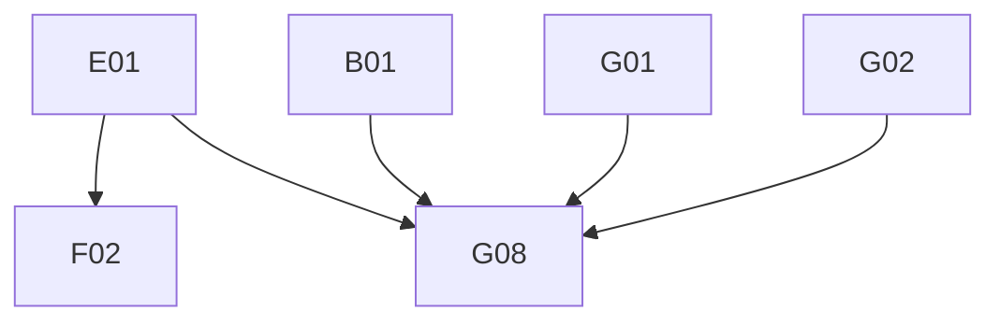

# Phase 4: Migration Plan & Stories — Workspace

> **Domain:** `workspace` · **Target DGS:** `WorkspaceServiceV2` → separate `plm-workspace` subgraph
> **Pipeline Version:** 2.0 · **Generated:** 2026-06-27
> **Depends on:** [02-resolver-analysis.md](./02-resolver-analysis.md), [03-schema.graphql](./03-schema.graphql), [03-schema-analysis.md](./03-schema-analysis.md), [05-attribute-inventory.md](./05-attribute-inventory.md)
> **Index:** `04-stories-index.yaml`

Each story is self-contained. Full pseudo-logic in [02-resolver-analysis.md](./02-resolver-analysis.md).
- **ACL is context-only**, but the drop/undrop **resource bookkeeping** in E01 IS build work. `workspace` is
its **own subgraph** (Product/search/etc. are cross-subgraph).

## 1. Phases Overview
| Phase | Name | Stories |
|---|---|---|
| B | Core Reads | B01–B06 |
| C | Search & Listing | C01–C02 |
| D | Mutations (simple) | D01–D09 |
| E | Complex (partner-action dispatcher) | E01 |
| F | Federation & decisions | F01–F02 |
| G | Field Resolvers & Tests | G01–G08 |

> **Self-contained story model.** The Netflix-DGS-on-REST framework already exists, so **every operation story below is end-to-end in a single PR**: it adds the schema (query/mutation + the GraphQL type definitions it returns), the DGS data fetcher, the Kotlin REST service method (read or write) that calls the backend, and pushes the schema change to the **Hive** registry. There is **no separate service-layer story** — the former `*Service` Kotlin-port story has been dissolved into the operation stories.

## 2. Dependency Graph

---

## 3. Stories

### Phase B — Core Reads

---

### SPARK-WS-B01 · `getWorkspaceV2(id, metric)`
- **Type:** Query · **Phase:** B · **Complexity:** Low · **Category:** CAT-2 · **Depends on:** —

- **In plain terms:** Fetch one workspace by id.

> **Note — DGS Module Init (this PR only):** Creates `workspace.graphqls` (federation v2.3 header, scalars, owned types with `@key`, external stubs), registers scalars in `ScalarConfig.kt`, and wires the service and Feign client. Full type list: [03-schema.graphql](./03-schema.graphql).
- **Current Behaviour (Q1):** (own) `getWorkspaceByIdV2.load(id)` `GET {base}?ids={id}`. **Target:** `@DgsQuery → WorkspaceV2`. 

#### Acceptance Criteria

1. returns workspace; miss→null.

---

### SPARK-WS-B02 · `getWorkspacesByIdsV2(ids)`
- **Type:** Query · **Phase:** B · **Complexity:** Low · **Category:** CAT-2 · **Depends on:** B01

- **In plain terms:** Fetch several workspaces by ids.

- **Current Behaviour (Q2):** (ACL) token → (own) `getWorkspacesByIdsV2(jwt).load({ids})`. **Target:** `@DgsQuery → [WorkspaceV2]`. 

#### Acceptance Criteria

1. returns list for ids.

---

### SPARK-WS-B03 · `getWorkspaceTypeCount`
- **Type:** Query · **Phase:** B · **Complexity:** Low · **Category:** CAT-2 · **Depends on:** B01 · **EXT:** 🔴 `search`

- **In plain terms:** Count workspaces by type.

- **Current Behaviour (Q7):** (🔴 search) `getWorkspaceTypeCount({})`. **Target:** `@DgsQuery → WorkspaceTypeCount`. 

#### Acceptance Criteria

1. returns products/combinations/research counts.

---

### SPARK-WS-B04 · `findWorkspaceProductAndSampleIds(workspaceId, q, filter)`
- **Type:** Query · **Phase:** B · **Complexity:** Medium · **Category:** CAT-2 · **Depends on:** B01 · **EXT:** 🔴 `product`

- **In plain terms:** List the product and sample ids in a workspace.

- **Current Behaviour (Q5):** (🔴 product) `getWorkspaceProducts({workspaceId, filter, q, page:0, size:10000})` → map `{id:humanId, sampleIds:[sample.humanId]}`. **Target:** `@DgsQuery → WorkspaceContentResult`. 

#### Acceptance Criteria

1. maps products + their sample human ids.

---

### SPARK-WS-B05 · `findWorkspaceClaims(workspaceId, q, filter)`
- **Type:** Query · **Phase:** B · **Complexity:** Low · **Category:** CAT-2 · **Depends on:** B01 · **EXT:** 🔴 `search`

- **In plain terms:** List a workspace's claims (via elastic).

- **Current Behaviour (Q6):** (🔴 search) `getClaimsElastic({ q:"workspaceContext:{workspaceId}", page:0, size:10000 })` → `.content`. **Target:** `@DgsQuery → [Claims]` (federated). 

#### Acceptance Criteria

1. elastic query exact.

---

### SPARK-WS-B06 · `getWorkspacePackagingAttachments(workspaceId, bpId)`
- **Type:** Query · **Phase:** B · **Complexity:** Medium · **Category:** CAT-2 · **Depends on:** B01 · **EXT:** 🔴 `search`

- **In plain terms:** Find a workspace's packaging attachments by tag.

- **Current Behaviour (Q8):** env `WORKSPACE_PACKAGING_TAG_ID` (**throws if unset**) → (🔴 search) `searchAttachments({ q:"tags:{tag}[ AND security.bps:{bpId}]", relatedIds:[workspaceId], size:500, sort:"createdAt,desc" })` → `.content`. **Target:** `@DgsQuery`; tag id from config. 

#### Acceptance Criteria

1. throws if tag config missing.
2. bp filter appended when present.

---

### Phase C — Search & Listing

---

### SPARK-WS-C01 · `getWorkspacesPagedV2(...)`
- **Type:** Query · **Phase:** C · **Complexity:** Medium · **Category:** CAT-2 · **Depends on:** B01 · **EXT:** 🔴 `search`

- **In plain terms:** List workspaces with paging / filters (V2).

- **Current Behaviour (Q3):** (🔴 search) `getWorkspacesPagedV2` — array params CSV-joined (except page/size); `omitBy` drops empties. **Target:** `@DgsQuery → WorkspacesPagedV2`. 

#### Acceptance Criteria

1. array→CSV; empties omitted.

---

### SPARK-WS-C02 · `getWorkspacesPagedV3(...)`
- **Type:** Query · **Phase:** C · **Complexity:** Medium · **Category:** CAT-2 · **Depends on:** B01 · **EXT:** 🔴 `search`

- **In plain terms:** List workspaces with paging / filters (V3).

- **Current Behaviour (Q4):** (🔴 search) `getWorkspacesPagedV3` — CSV-join except `q`/`designPartnerIds`; `omitBy`. **Target:** `@DgsQuery → WorkspacesPagedV3`. 

#### Acceptance Criteria

1. CSV-join rules preserved (q/designPartnerIds passthrough).

---

### Phase D — Mutations (simple)

---

### SPARK-WS-D01 · `createWorkspaceV2`
- **Type:** Mutation · **Phase:** D · **Complexity:** Medium · **Category:** CAT-2 · **Depends on:** B01

- **In plain terms:** Create a workspace (rejects duplicates).

- **Current Behaviour (M1):** default `workspaceType=103`; (own) `POST {base}` (`validateUnique`). **Throw `GraphQLError('Workspace already exists')`** if the response message starts with the dup text. **Target:** `@DgsMutation → WorkspaceV2`. 

#### Acceptance Criteria

1. creates; default type
103. 2. dup → GraphQLError.

---

### SPARK-WS-D02 · `updateWorkspaceV2`
- **Type:** Mutation · **Phase:** D · **Complexity:** Medium · **Category:** CAT-2 · **Depends on:** B01

- **In plain terms:** Edit a workspace (rejects duplicates).

- **Current Behaviour (M2):** (ACL) token for `workspace.id`; default type 103; (own) `PUT {base}/{id}?validateUnique=` → same dup-check throw. **Target:** `@DgsMutation`. 

#### Acceptance Criteria

1. updates; dup→throw.

---

### SPARK-WS-D03 · `changeWorkspace`
- **Type:** Mutation · **Phase:** D · **Complexity:** Medium · **Category:** CAT-2 · **Depends on:** B01

- **In plain terms:** Move resources from one workspace to another.

- **Current Behaviour (M3):** (ACL) token for `Attr-{newWs}-resources` → (own) `PUT {base}/{newWs}/change_resource` with `{newWorkspaceId, oldWorkspaceId, productHumanId, teams, removeWorkspaceOnly}`. **Throw on validationErrors/message.** **Target:** `@DgsMutation`. 

#### Acceptance Criteria

1. moves product between workspaces.
2. error→throw.

---

### SPARK-WS-D04 · `addResourcesToWorkspaceV2`
- **Type:** Mutation · **Phase:** D · **Complexity:** Medium · **Category:** CAT-2 · **Depends on:** B01 · **EXT:** 🔴 `product`

- **In plain terms:** Add products / samples to a workspace.

- **Current Behaviour (M4):** (ACL) token; **if single product** → (🔴 product) read `Product.workspaces` + `updateViewToggle` (init workspace attrs; `firstWorkspace` adds designCycle/setDates); (own) `POST {base}/{workspaceId}/resources/bulk`. **Target:** `@DgsMutation`; the product side-effect via a product client/entity. 

#### Acceptance Criteria

1. adds resources.
2. single-product init side-effect preserved.

---

### SPARK-WS-D05 · `removeWorkspaceResourcesV2`
- **Type:** Mutation · **Phase:** D · **Complexity:** Medium · **Category:** CAT-2 · **Depends on:** B01 · **EXT:** 🔴 `product`

- **In plain terms:** Remove resources from a workspace.

- **Current Behaviour (M5):** (ACL) token; **if single product** → (🔴 product) `deletePartnerWorkspaceStatuses` cleanup; (own) `DELETE {base}/{workspaceId}/resources/delete/bulk?resourceType=&resourceIds=`. **Target:** `@DgsMutation`. 

#### Acceptance Criteria

1. removes resources.
2. single-product status cleanup.

---

### SPARK-WS-D06 · `addTeamsToWorkspaceV3`
- **Type:** Mutation · **Phase:** D · **Complexity:** Low · **Category:** CAT-2 · **Depends on:** B01

- **In plain terms:** Add teams to a workspace.

- **Current Behaviour (M6):** (ACL) token → (own) `POST {base}/{workspaceId}/teams/bulk`. **Target:** `@DgsMutation`. 

#### Acceptance Criteria

1. adds teams.

---

### SPARK-WS-D07 · `exportWorkspace`
- **Type:** Mutation · **Phase:** D · **Complexity:** Low · **Category:** CAT-2 · **Depends on:** B01 · **EXT:** 🔴 `search`

- **In plain terms:** Kick off a workspace export.

- **Current Behaviour (M8):** (🔴 search) `requestBulkAttachmentExport({parentResourceId, exportType, includedAttachmentIds, includeOnlyPrimaryThumbnails}, {q, filter})`. **Target:** `@DgsMutation → WorkspaceExportReceipt`. 

#### Acceptance Criteria

1. returns receipt.

---

### SPARK-WS-D08 · `exportWorkspaceExcel`
- **Type:** Mutation · **Phase:** D · **Complexity:** Low · **Category:** CAT-2 · **Depends on:** B01 · **EXT:** 🔵 `exportHub`

- **In plain terms:** Export a workspace to Excel.

- **Current Behaviour (M9):** (🔵 exportHub) `exportWorkspaceExcel(workspaceExportOptions)`. **Target:** `@DgsMutation`. 

#### Acceptance Criteria

1. returns receipt.

---

### SPARK-WS-D09 · `exportPackagingFiles`
- **Type:** Mutation · **Phase:** D · **Complexity:** Low · **Category:** CAT-2 · **Depends on:** B01 · **EXT:** 🔴 `search`

- **In plain terms:** Export a workspace's packaging files.

- **Current Behaviour (M10):** (🔴 search) `requestPackagingExport({workspaceId, workspaceDescription, exportContext, exportType}, {q, filter})`. **Target:** `@DgsMutation`. 

#### Acceptance Criteria

1. returns receipt.

---

### Phase E — Complex Operations

---

### SPARK-WS-E01 · `workspaceBusinessPartnerActionsV2` (5-case drop/undrop dispatcher)
- **Type:** Mutation · **Phase:** E · **Complexity:** ⚠️ Very High · **Category:** CAT-2 · **Depends on:** B01 · **EXT:** 🟡 `relationship` · 🟡 `discussion` · 🟡 `sampleV2` · 🔵 `favorite`

- **In plain terms:** Drop / undrop a partner (or remove team/partner) across a workspace — a 5-case orchestrated write.

- **As a** DGS engineer **I want** the partner-action dispatcher with a failure strategy **so that** drop/undrop
stays consistent across workspace/discussion/sample/claim + ACL + user-profile.
- **Current Behaviour (M7 / helper):** ~310-line switch — `REMOVE_TEAM`, `REMOVE_PARTNER`, `DROP_PARTNER`,
- `UNDO_DROP_PARTNER`, `DROP_UNDROP_PARTNER`.
- Builds a relationship tree (🟡 relationship), ACL-filters resources, drops/undrops workspace + (🟡 discussion) + (🟡 sampleV2, skipped for DESIGN_PARTNER) in parallel, then (accessControl) `dropPartnerFromResources`/`unDropPartnerFromResources` + user-profile cleanup, with
**manual compensation** on ACL failure. **⚠ the DROP/UNDO_DROP `Promise.all().then()` chains are not awaited.**
- **Target:** `WorkspacePartnerActionService` with 5 strategy methods; **PO decision** saga/compensation; **fix
the un-awaited chains**; preserve the design-partner sample-skip. 

#### Acceptance Criteria

2. chains awaited; compensation on ACL failure.
3. design-partner skips samples.

#### Test Cases

- [ ] REMOVE_TEAM
- [ ] REMOVE_PARTNER
- [ ] DROP
- [ ] UNDO_DROP
- [ ] DROP_UNDROP
- [ ] partial-failure
- [ ] Parity: DGS response matches spark-internal-graphql baseline

---

### Phase F — Federation & decisions

---

### SPARK-WS-F01 · `WorkspaceV2` federated entity fetcher
- **Type:** Field Resolver · **Phase:** F · **Complexity:** Medium · **Category:** CAT-4 · **Depends on:** B01

- **In plain terms:** Let other subgraphs resolve a Workspace by key.

- **Target:** `@DgsEntityFetcher(name="WorkspaceV2")` resolving by `id`, so the product-family subgraphs
(product/bom/measurement/impression/productDetails/packaging/claims/watchlist) resolve their `workspaces`
fields over the gateway. 

#### Acceptance Criteria

1. entity resolves by key from `_entities`.
2. a cross-subgraph `Product { workspaces { id description } }` smoke test passes.

---

### SPARK-WS-F02 · Deferred drop/undrop wrapper decision (drift mutations)
- **Type:** Schema · **Phase:** F · **Complexity:** Low · **Category:** CAT-4 · **Depends on:** E01

- **In plain terms:** Decide the fate of the drop/undrop drift wrappers.

- **Current Behaviour:** `dropWorkspaceBusinessPartnerV2`/`unDropWorkspaceBusinessPartnerV2` are schema-drift wrappers; traffic routes through `workspaceBusinessPartnerActionsV2`. **Target:** PO decides delete vs keep `@deprecated`. 

#### Acceptance Criteria

1. traffic survey complete.
2. decision implemented.

---

### Phase G — Field Resolvers & Tests

---

### SPARK-WS-G01 · `WorkspaceV2.attachmentsWithMetaData`
- **Type:** Field Resolver · **Phase:** G · **Complexity:** ⚠️ Very High · **Category:** CAT-2 · **Depends on:** B01 · **EXT:** 🟡 `relationship` · 🔴 `attachment` · 🟡 `discussion`

- **In plain terms:** Resolve a workspace's attachments, enriched with discussion metadata.

- **Current Behaviour (~75 ln):** (🟡 relationship) tree (attachments_v3/discussions/discussionThreads) →
- (🔴 attachment) `getAttachmentsV3` (ACL) → (🟡 discussion) batch discussions/threads → merge → order by `resource.type,created_at desc` → **draft filter** (discussion attachments w/o link or draft removed).
- **Target:** Kotlin enrichment service; keep the "ACL should do draft filter" TODO.

#### Acceptance Criteria

1. parity for mixed attachment/discussion/thread.
2. ordering + draft filter preserved.

#### Test Cases

- [ ] merge
- [ ] ordering
- [ ] draft filter
- [ ] Parity: DGS response matches spark-internal-graphql baseline

---

### SPARK-WS-G02 · `WorkspaceV2.counts` (product dashboard rollup)
- **Type:** Field Resolver · **Phase:** G · **Complexity:** ⚠️ Very High · **Category:** CAT-2 · **Depends on:** B01 · **EXT:** 🔴 `search` · 🔴 `product` · 🟡 `discussion`

- **In plain terms:** Roll up a workspace's product / sample / discussion counts for the dashboard.

- **Current Behaviour (~85 ln):** (🔴 search) `getFilteredProductsWithSummary` → (🔴 product) `getPage` →
- (🟡 discussion) product discussion counts + (🔴 search) sample counts + sample-discussion roll-up into product discussion counts → assemble `WorkspaceCountsV2` (+ dashboard, nonEvaluated count).
- Empty product set → zeros.
- **Target:** Kotlin counts service; batch.

#### Acceptance Criteria

1. parity for the full rollup incl. sample-discussion increment.
2. empty → zeros.

#### Test Cases

- [ ] rollup
- [ ] sample-discussion
- [ ] empty
- [ ] Parity: DGS response matches spark-internal-graphql baseline

---

### SPARK-WS-G03 · `WorkspaceV2.attachmentsV3`
- **Type:** Field Resolver · **Phase:** G · **Complexity:** 🔶 High · **Category:** CAT-2 · **Depends on:** B01 · **EXT:** 🟡 `relationship` · 🔴 `attachment`

- **In plain terms:** Resolve a workspace's attachments (with / without per-partner counts).

- **Current Behaviour:** with args → `getProductOrWorkSpaceAttachments` (per-BP counts via `initialCountsByBp`);
without args → relationship tree → `resolveRelationIds` → filter. **Target:** shared attachment helper. 

#### Acceptance Criteria

1. both arg/no-arg paths.
2. per-BP counts.

#### Test Cases

- [ ] with args
- [ ] no args
- [ ] counts

---

### SPARK-WS-G04 · `products` + `productsCount` + `combinations` + `sampleReport` (cross-subgraph)
- **Type:** Field Resolver · **Phase:** G · **Complexity:** 🔶 High · **Category:** CAT-2 · **Depends on:** B01 · **EXT:** 🔴 `product` · 🔴 `search` · 🟡 `combination` · 🟡 `sampleV2`

- **In plain terms:** Resolve a workspace's cross-subgraph product / combination fields.

- **Current Behaviour:** `products` → (🔴 product) `getProducts(resourceType:'workspaces', resourceId, include*: true)`; `productsCount` → (🔴 product) `getPage` totalElements; `combinations` → (🔴 search) `searchCombinations` → (🟡 combination) `getByIds`; `sampleReport` → (🔴 search) samples-by-parent + (🟡 sampleV2) `getSamplesByIdsV2` + round filtering. **Target:** product/combination/sample clients (replace direct resolver calls). 

#### Acceptance Criteria

1. each resolves; include flags forwarded.
2. sampleReport round counts correct.

#### Test Cases

- [ ] products
- [ ] count
- [ ] combinations
- [ ] sampleReport

---

### SPARK-WS-G05 · partners (`businessPartners`/`droppedPartners`/`notRemovablePartnerIds`/`unDroppablePartners`)
- **Type:** Field Resolver · **Phase:** G · **Complexity:** Medium · **Category:** CAT-2 · **Depends on:** B01 · **EXT:** 🔵 `vmm`

- **In plain terms:** Resolve a workspace's business / dropped / not-removable partner lists.

- **Current Behaviour:** `businessPartners`/`droppedPartners` → (🔵 vmm) `loadBpsWithType`; `notRemovablePartnerIds` → `getWorkspacePartnersNotRemovable`; `unDroppablePartners` (isDesignPartner) → `getUnDroppablePartners` else `[]`. 

#### Acceptance Criteria

1. each resolves; unDroppable gated on `isDesignPartner`.

---

### SPARK-WS-G06 · hierarchy/tags (`divisions`/`brands`/`clazzes`/`designCycles`/`tags` + `WorkspaceDepartmentV2`)
- **Type:** Field Resolver · **Phase:** G · **Complexity:** Medium · **Category:** CAT-2 · **Depends on:** B01 · **EXT:** 🔵 `ig` · 🔵 `brand` · 🟡 `tag`

- **In plain terms:** Resolve a workspace's division / brand / class / design-cycle / tag fields.

- **Current Behaviour:** `divisions` (🔵 ig), `brands` (🔵 brand), `clazzes` (🔵 ig by dept+class), `designCycles`/`tags` (🟡 tag); `WorkspaceDepartmentV2.node`/`clazzes` (🔵 ig). 

#### Acceptance Criteria

1. each resolves; empty → [].

---

### SPARK-WS-G07 · users/computed (`createdBy`/`updatedBy`/`status`/`id` + `discussionsV2`/`teams` + paged)
- **Type:** Field Resolver · **Phase:** G · **Complexity:** Medium · **Category:** CAT-2 · **Depends on:** B01 · **EXT:** 🟡 `userAttributes` · 🔴 `search`

- **In plain terms:** Resolve a workspace's people, status and discussion / team fields.

- **Current Behaviour:** `id` (workspaceHumanId||humanId), `status` ({id:status, name:statusName}), `workspaceTypeElastic`, `createdAt`/`updatedAt` (from ts) — computed; `createdBy`/`updatedBy` (🟡 user-profile); `discussionsV2`/`teams` (🔴 search elastic); `WorkspacesPagedV2/V3` paging/content/pageable (computed). 

#### Acceptance Criteria

1. computed mappings correct.
2. users/discussions/teams resolve.

---

### SPARK-WS-G08 · Tests, parity harness, load test
- **Type:** Tests · **Phase:** G · **Complexity:** 🔶 High · **Category:** CAT-5 · **Depends on:** B01, E01, G01, G02

- **In plain terms:** Prove the workspace subgraph matches the old gateway (incl. load test).

- **Target:** ≥80% unit coverage; parity harness (incl. all 5 partner-action cases, attachmentsWithMetaData, counts, paged search, dup-check); load test p95 for `getWorkspaceV2`/`counts`/`attachmentsWithMetaData`; contract test (schema diff intentional-only). 

#### Acceptance Criteria

1. unit ≥80%.
2. parity green.
3. load p95 parity.
4. schema-diff intentional.

#### Test Cases

- [ ] Parity: DGS response matches spark-internal-graphql baseline
- [ ] Load: p95 latency is within spark-internal-graphql baseline
- [ ] contract

---

## 4. Risk Register
| Risk | Likelihood | Impact | Mitigation | Owner |
|------|-----------|--------|------------|-------|
| Partner-action dispatcher partial failure + un-awaited chains (E01) | High | High | Saga/compensation; await; parity per case | Tech Lead + PO |
| `attachmentsWithMetaData` / `counts` perf (G01/G02) | Medium | High | Parallel + cached relationship/ACL; batch | Backend Eng |
| Cross-subgraph coupling to product (G04/D04) | Medium | Medium | Entity refs / product client | Product Owner |
| Schema-drift drop/undrop wrappers may have live consumers (F02) | Medium | Medium | Traffic survey before delete | PO |
| `WORKSPACE_PACKAGING_TAG_ID` env dependency (B06) | Low | Medium | Move to config; fail-fast | Platform |

## 5. Summary
- **Stories:** 28 (B:6 · C:2 · D:9 · E:1 · F:2 · G:8).
- **Critical path:** A02/E01→G01/G02→G08.
- **Highest risk:** `workspaceBusinessPartnerActionsV2` (E01), `attachmentsWithMetaData`/`counts` (G01/G02).
- **Separate subgraph:** `WorkspaceV2` is the entity every product-family subgraph references for `workspaces`.

---
- **Phase Completed:** Phase 4 — Migration Stories · **Domain:** `workspace` · **Outputs:** 04-stories.md, 04-stories-index.yaml, 04-po-summary.md.
