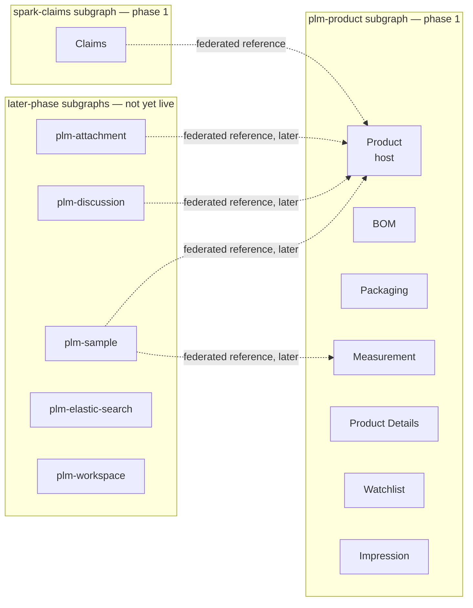
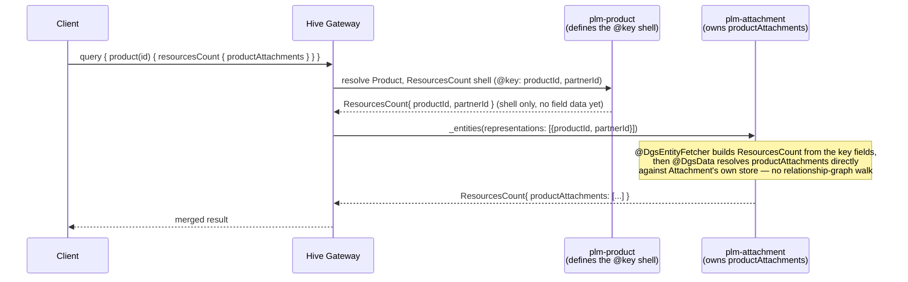

# Architecture Diagrams

> Visual companion to [`00-program-overview.md`](./00-program-overview.md). Three diagrams: the
> subgraph/domain map, the Phase H entity-resolution flow (how a federated field actually resolves at
> request time), and the consolidated cross-domain dependency graph. All three are derived from real
> source (`be-04-stories.md` dependency fields, `cross-domain-dependencies.md`) — see each section's
> source note if you need to re-derive after a story changes.

---

## 1. Subgraph / domain map

Which domains compile into which DGS subgraph, phase 1 vs later phase.

**Reading this:** solid subgraph boxes are one deployable DGS service; a domain inside one shares that
service's scaffold (Product's `B-01` one-time DGS module setup). Dashed arrows are federated entity
references — the arrow points at who's being extended. Only Claims is federated among phase-1 domains;
everything else co-locates in `plm-product`.

---

## 2. How a Phase H field resolves at request time

Phase H exists because some fields on `Product` (the TechPack rollup counts) are genuinely owned by a
*different* subgraph. This is the mechanical shape every Phase H story shares — shown here once using
the attachment count as the worked example (`PRODUCT-BE-H-01`); `H-02`–`H-05` are identical, just a
different owning subgraph and field.

**Why this replaces the old path:** before federation, `plm-product`'s TechPack facade walked the
*entire* relationship graph itself to compute this count (full subtree traversal + serial ACL checks
per node). After `H-01` ships, Attachment answers the question about its own data directly — no graph
walk, no cross-domain function. The facade (`PRODUCT-BE-E-03`/`E-04`) stays as a behavior-frozen
fallback until every Phase H slice reports parity, then retires (`PRODUCT-BE-F-09`). Full narrative:
[`output/complexStories/techpack/`](../complexStories/techpack/).

---

## 3. Cross-domain dependency graph

Every `Blocked by:` edge in the program, in one picture. Solid arrows are the 6 "shared infrastructure"
blocks (all six wait on product's `WriteSaga` module); dashed arrows are the 9 "not-yet-live subgraph"
blocks. Source of truth: [`output/analysis/program/cross-domain-dependencies.md`](../analysis/program/cross-domain-dependencies.md)
— regenerate this diagram by hand if that table changes.

```mermaid
graph TD
  E00[PRODUCT-BE-E-00<br/>shared WriteSaga module]
  E00-->BOME1[BOM-BE-E-01]
  E00-->CLAIME1[CLAIM-BE-E-01]
  E00-->MSTE1[MST-BE-E-01]
  E00-->PKGE1[PKG-BE-E-01]
  E00-->PDTLE1[PDTL-BE-E-01]
  E00-->WATCHE1[WATCHLIST-BE-E-01]

  ATTACH[plm-attachment<br/>later phase]-.->H01[PRODUCT-BE-H-01]
  DISC[plm-discussion<br/>later phase]-.->H02[PRODUCT-BE-H-02]
  SAMPLE[plm-sample<br/>later phase]-.->H03[PRODUCT-BE-H-03]
  SAMPLE-.->MSTH01[MST-BE-H-01]
  CLAIMSUB[spark-claims<br/>phase 1]-.->H04[PRODUCT-BE-H-04]
  PRODSUB[plm-product<br/>H-06 entity fetcher]-.->CLAIMH01[CLAIM-BE-H-01]
  PRODSUB-.->CLAIMH02[CLAIM-BE-H-02]
  CONSTR[construction<br/>no subgraph yet]-.->H05[PRODUCT-BE-H-05]
  PRODB01[PRODUCT-BE-B-01]-.->IMPF01[IMPRESSION-BE-F-01]
```

**Reading this:** every node this graph points *at* is blocked; every node it points *from* is what it's
waiting on. None of these edges are enforced by the wave scheduler — they're the human-tracked sequencing
constraints a tech lead or PO has to honor when scheduling sprints across domains (see
[`docs/instructions_po.md`](../../docs/instructions_po.md) §2 for how to read this when prioritizing).

---

## Regeneration note

All three diagrams are hand-authored from the current dependency data, not generator output. If you add
or change a `Depends on:` / `Blocked by:` field in any domain's `be-04-stories.md`, re-run
`generate_cross_domain_deps.py` (via `generate_all.py`) first, then update diagram 3 here to match its
new table. Diagrams 1 and 2 change only when a domain's subgraph assignment or the Phase H mechanism
itself changes — rare, and worth a manual re-check rather than a mechanical regen.

---
*Architecture diagrams · output/overview/01-architecture-diagrams.md*
