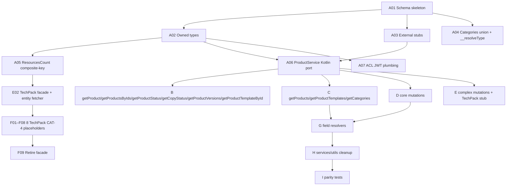

# Product — Migration Plan & Stories

> **Domain:** `product`
> **Target DGS:** `ProductService` (repo: `plm-product`, url: `https://spark-product.dev.target.com`)
> **Pipeline Version:** 1.1
> **Generated:** 2026-05-18
> **Depends on:** [02-resolver-analysis.md](output/product/02-resolver-analysis.md), [02-resolver-analysis-mutations.md](output/product/02-resolver-analysis-mutations.md), [02-resolver-analysis-fields.md](output/product/02-resolver-analysis-fields.md), [02-resolver-analysis-services.md](output/product/02-resolver-analysis-services.md), [03-schema.graphql](output/product/03-schema.graphql), [03-schema-analysis.md](output/product/03-schema-analysis.md)
> **DGS Target Status:** Green-field (no existing DGS schema)

---

## 1. Migration Phases Overview

| Phase | Name | Story Count | Effort (raw d) | +20% buffer |
|---|---|---|---|---|
| A | Foundation & Schema | 7 | 14–22 | 17–27 |
| B | Core CRUD Queries | 6 | 7–13 | 9–16 |
| C | Search & Listing Queries | 4 | 14–24 | 17–29 |
| D | Core Mutations | 9 | 16–28 | 20–34 |
| E | Complex Mutations + TechPack stub | 6 | 27–46 | 33–56 |
| F | Federation / Stitching (incl. 8 TechPack CAT-4 placeholders) | 13 | 22–39 | 27–47 |
| G | Field Resolvers (incl. 3 X-Large) | 14 | 71–119 | 86–143 |
| H | Services + Utils + Cleanup | 6 | 18–30 | 22–36 |
| I | Test Coverage (parity / load / contract) | 5 | 16–24 | 20–29 |
| **Total** | | **70** | **205–345** | **246–414** |

> Phase 2 grand-total (Resolvers + Services + Utils, see 02-resolver-analysis-services.md §D5) was **267–463 days**. The story-level total above is lower because (a) ProductService REST methods collapse into internal Kotlin service calls in plm-product (no new HTTP layer), and (b) several utility modules are shared with sibling subgraphs and tracked in their own files. The framework's +20% buffer is applied per the [USAGE.md §7](fedMigrationScripts/USAGE.md) guidance.

---

## 2. Dependency Graph (high level)



---

## 3. Story List

> Conventions: story IDs follow `SPARK-PROD-{Phase}{NN}`. Each story tagged with category (`CAT-1..5`) and complexity tier (`Small 1–2d`, `Medium 3–5d`, `Large 5–8d`, `X-Large 8–13d`). Effort uses the [USAGE.md §7](fedMigrationScripts/USAGE.md) tiers.

---

## Phase A — Foundation & Schema

### SPARK-PROD-A01 · CAT-1 · Small (1–2d)

**Title:** Schema skeleton + DGS project structure + DateTime scalar

**Type:** Story · **Complexity:** Small · **Category:** CAT-1 · **Phase:** A

**As a** DGS migration engineer
**I want** to create the `product.graphqls` skeleton with federation v2.3 header and wire `DateTime` to `Instant`
**so that** all subsequent type and resolver work has a stable foundation.

**Current Behavior (from Phase 1):** No DGS exists. Source schema lives in `spark-internal-graphql/.../schemas/SPARK_Product.graphql` (800 lines).

**Target DGS Implementation:**
- Create `plm-product/apps/app/src/main/resources/schema/product.graphqls` with `@link(url:"https://specs.apollo.dev/federation/v2.3", import:["@key","@extends","@external","@requires","@shareable"])`, `scalar DateTime`, `extend type Query`, `extend type Mutation`.
- Create `ProductDataFetcher.kt`, `ScalarConfig.kt` stubs.

**Files to Create / Modify:** `schema/product.graphqls`, `config/ScalarConfig.kt`, `dataFetcher/ProductDataFetcher.kt`

**Acceptance Criteria:**
1. `./gradlew generateJava` passes
2. `DateTime` round-trips ISO-8601 (UTC)
3. PR passes lint + schema validation

---

### SPARK-PROD-A02 · CAT-1 · Medium (3–5d)

**Title:** Add all owned types + input types from derived schema

**As a** DGS migration engineer
**I want** to define all owned `Product`-domain types and 30+ input types
**so that** resolver work is unblocked.

**Current Behavior (from Phase 3):** All types catalogued in [03-schema-analysis.md §3.1](output/product/03-schema-analysis.md).

**Target DGS Implementation:**
- Port 40+ owned types from [03-schema.graphql](output/product/03-schema.graphql) §4–§5
- Apply `@shareable` to: `Paging`, `Pageable`, `CodeDescription`, `CodeDescriptionOrder`, `AccessV3`, `WorkspaceStatus`, `ResourcePermissions`, `PermissionEntry`, `SpgFileLibrary`
- Apply `@key(fields: "id")` to `Product` and `ProductRules` only

**Dependencies:** A01

**Acceptance Criteria:**
1. All owned types from `03-schema.graphql` present
2. All input types present (BulkCarryForwardProductInput renamed from `Bulk_CarryForwardProductInput`)
3. `@shareable` correctly applied; `@key` only on entities
4. Schema validates

---

### SPARK-PROD-A03 · CAT-1 · Small (1–2d)

**Title:** Add all external stubs (platform + co-located subgraphs)

**As a** DGS migration engineer
**I want** to define all 20+ external-stub types with `@extends @external`
**so that** field resolvers can reference gateway-stitched and sibling-DGS types.

**Target:** Per [03-schema.graphql §1](output/product/03-schema.graphql) — platform: `VMM_*`, `IG_*`, `DopplerCapacityType`, `CORONA_ItemDetails`; co-located: `Attachment`, `SampleV2`, `Tag`, `WorkspaceV2`, `TeamV2`, `UserProfileAttributes`, `Discussion`, `DiscussionThread`, `FileLibrary`, `Bom`, `Claim`, `Measurement`, `ProductDetail`, `Packaging`, `ProductAsk`, `ProductVariation`.

**Dependencies:** A01

**Acceptance Criteria:** All stubs compile; Hive Gateway composes without conflict.

---

### SPARK-PROD-A04 · CAT-1 + CAT-2 · Medium (3–5d)

**Title:** `Categories` union + `__resolveType` mapping

**As a** DGS migration engineer
**I want** to define the `Categories` union and implement `@DgsTypeResolver`
**so that** the polymorphic right-rail facets (Q5 `getCategories`) work end-to-end.

**Current Behavior (from Phase 2C §C8):** Source `SPARK_Categories.__resolveType` is a switch over 12 `type` tags with default → `IG_Clazz_Filter`.

**Target:**
- `union Categories = VMM_Brand | IG_Department | IG_Division | IG_Clazz_Filter | ProductStatus | VMM_BusinessPartnerCategory | Tag_Elastic | Filter_SetDates | Status | FilterSampleType | FilterSampleFormat | Packaging_Field`
- `@DgsTypeResolver(name = "Categories")` mirroring the 12-case switch + default branch

**Dependencies:** A02, A03

**Acceptance Criteria:**
1. Unknown `type` returns `IG_Clazz_Filter` (preserves source behavior)
2. Parity unit test for all 12 known tags

---

### SPARK-PROD-A05 · CAT-1 · Small (1–2d)

**Title:** Define `ResourcesCount @key(fields: "productId partnerId")` (TechPack composite-key)

**Per [federation-patterns.md §9](fedMigrationScripts/reference/federation-patterns.md)**. Schema-only story; Product subgraph owns the type and stub resolver, 8 sibling subgraphs extend later (see Phase F).

**Target:** Add the type from [03-schema.graphql §3](output/product/03-schema.graphql) with all 10 stub fields and `workspaceContext`/`parentProductId` as carried context.

**Dependencies:** A01

**Acceptance Criteria:**
1. `@key` uses `productId partnerId`; context fields are not in the key but available for `@requires`
2. Schema comments mark each stub field with its owning subgraph

---

### SPARK-PROD-A06 · CAT-3 · Medium (3–5d)

**Title:** `ProductService` Kotlin port — internal service skeleton (no Feign for co-located ops)

**As a** DGS migration engineer
**I want** to port `ProductService` (42 methods, [02-resolver-analysis-services.md §D1.2](output/product/02-resolver-analysis-services.md)) as internal Kotlin service interfaces
**so that** DGS data fetchers can delegate to native service calls instead of HTTP-via-Feign.

**Current Behavior:** 42 REST wrappers (`loadOne`/`loadListing`/`postOne`/`putOne`/`deleteOne`) against `enterprise_product_development_products/v{1,2}`.

**Target:**
- Split into Kotlin interfaces per group: `ProductReadService`, `ProductWriteService`, `ProductElasticSearchService`, `ProductCopyService`, `ProductRuleService`, `ProductComponentStatusService`, `ProductVersionService`, `RatingClient` (Feign — external), `RelationshipClient`, `ApexClient`
- Same-JVM calls in plm-product → direct method invocation; only `getRatingByTcin` and 3 `spark_rules` searches stay as Feign clients
- Preserve `primeKey: getByID` semantics via shared `@DgsDataLoader` registry

**Dependencies:** A01, A02

**Acceptance Criteria:**
1. All 43 method signatures present
2. Co-located methods do **not** make outbound HTTP
3. JWT-curried methods accept a capability-token parameter (header forwarding)
4. `throwOnError: true` on `linkProduct` ports as checked exception (only mutation that throws)

---

### SPARK-PROD-A07 · CAT-3 · Small (1–2d)

**Title:** ACL JWT plumbing + capability-token forwarding

**As a** DGS migration engineer
**I want** to plumb the `SPARK-Capability-Token` header through `@DgsContext`
**so that** JWT-curried calls (M11 drop/undrop, M7 copyProduct, M21–M23 deprecated wrappers, several field resolvers) work without per-call signing.

**Current Behavior (from [02-resolver-analysis-services.md §D2.10](output/product/02-resolver-analysis-services.md)):** `getUserPermissionsJWT(ids, ctx)` and `getUserPermissionsJWTHelper` (switches to POST when ids > 50) used by `teams`, `attachments`, `associateProductsAsks`, `variations`, `attachmentsWithMetaData`.

**Target:** Spring Web filter extracts header → `RequestContextHolder` → injected via `@DgsContext`. POST-vs-GET threshold preserved.

**Dependencies:** A01

**Acceptance Criteria:**
1. Header forwarded on every JWT-protected service call
2. Empty id list short-circuits to `''` (matches source)
3. ids > 50 routes via POST

---

## Phase B — Core CRUD Queries (6 stories, all Small)

> One story per simple query. Each uses the same pattern: `@DgsQuery` → `ProductReadService.method`. All depend on A02 + A06.

### SPARK-PROD-B01 · CAT-2 · Small (1–2d) — `getProduct(id)`
Calls `productReadService.getById(id)` via DataLoader (`ProductDataLoader` keyed on `id`, max batch 200 matching Phase 1 service config). 404 → null. Test cases: happy path, 404, DataLoader batching of 5 IDs in 1 REST call.

### SPARK-PROD-B02 · CAT-2 · Small (1–2d) — `getProductTemplateById(id)`
Delegates to same DataLoader as B01.

### SPARK-PROD-B03 · CAT-2 · Small (1–2d) — `getProductsByIds(ids)`
Calls `productReadService.getByIdList(ids)`. Returns `ProductsPaged` wrapper.

### SPARK-PROD-B04 · CAT-2 · Small (1–2d) — `getProductStatus`
Master data; cached for 1h via `@Cacheable("productStatusMaster")`. Test: cache hit on second call.

### SPARK-PROD-B05 · CAT-2 · Small (1–2d) — `getCopyStatus(id)`
Non-batched GET to `${v2}/count/resource-type?copyId={id}`.

### SPARK-PROD-B06 · CAT-2 · Small (1–2d) — `getProductVersions(id)`
GET `${v1}/{id}/versions?page=0&size=10000`.

---

## Phase C — Search & Listing Queries (4 stories)

### SPARK-PROD-C01 · CAT-2 · Large (5–8d) — `getProducts(page, size, q, filter, resourceType, resourceId, includeBoms, includeClaims, includeMeasurementSets, includeProductDetails)`

**As per [02-resolver-analysis.md §1](output/product/02-resolver-analysis.md):** dual elastic + REST. 8-step pseudo-logic; preserve hot-path branches.

**Target:** `ProductElasticSearchService.getFilteredProductsListing(...)` → if hydration flags set, return elastic content directly; else REST-hydrate by id list.

**Acceptance:** parity test for 4 representative arg combinations (no flags, all flags, resourceType=workspaces, filter array).

### SPARK-PROD-C02 · CAT-2 · Medium (3–5d) — `getProductTemplates(page, size, q, ...10 includes)`

Elastic-only; `types: [Int]` filter. Preserves all 7 `includeXxxTemplates` flags.

### SPARK-PROD-C03 · CAT-2 · Medium (3–5d) — `getCategories(type, resourceId, resourceType, productType)`

Returns `ProductsCategories`. Wires into A04 (`Categories` union). Source uses `snakeCase(type)` in endpoint path — preserve exactly.

### SPARK-PROD-C04 · CAT-2 · Medium (3–5d) — `getRatingByTcin(tcin)`

External Bazaarvoice call via `RatingClient` Feign. Preserve `skipJsonParse + JSON.parse` (text/plain response). Silent null-on-error.

---

## Phase D — Core Mutations (9 stories)

### SPARK-PROD-D01 · CAT-2 · Medium (3–5d) — `addProduct(workspaceId, sparkProduct, copyProduct)`
Per [02-resolver-analysis-mutations.md M1](output/product/02-resolver-analysis-mutations.md). POST `${v1}` + optional copy + workspace association.

### SPARK-PROD-D02 · CAT-2 · Medium (3–5d) — `addProducts(workspaceId, products)`
Bulk POST `${v1}/bulk` + attachment-link side-effects (no rollback today — preserve, flag in PO summary).

### SPARK-PROD-D03 · CAT-2 · Medium (3–5d) — `bulkUpdateProducts(products)`
PUT `${v1}/mass_update`.

### SPARK-PROD-D04 · CAT-2 · Medium (3–5d) — `updateProduct(input, copyProduct)`
PUT `${v1}/{id}` + optional copy + archive removed-template attachments (template branch).

### SPARK-PROD-D05 · CAT-2 · Small (1–2d) — `addTeamsToProduct(productId, teamIds, workspaceIds, newPartners)`
POST `${v1}/{productId}/resources/bulk` + manage_workspace_teams.

### SPARK-PROD-D06 · CAT-2 · Small (1–2d) — `addBusinessPartnersToProductWithType(productId, partners)`
POST `${v1}/{productId}/partners-add/bulk`.

### SPARK-PROD-D07 · CAT-2 · Small (1–2d) — `removeProductResources(productId, resourceIds)`
DELETE `${v1}/{productId}/resources/bulk`.

### SPARK-PROD-D08 · CAT-2 · Small (1–2d) — `updateBusinessPartnerStatuses(productId, statusInput)`
PUT `${v1}/{productId}/status_update/bulk`.

### SPARK-PROD-D09 · CAT-2 · Small (1–2d) — `updateViewToggle(toggleInput)` + `updateWorkspaceAttributes(productId, workspaceAttributesInput)` + `updateProductTeamsWorkspaceContext(...)` + `linkProduct(parent, child)` + `unlinkProduct(parent, child)`
Five thin PUT wrappers grouped (each Trivial). `linkProduct` ports the `throwOnError: true` semantic as a Kotlin checked exception. Five separate `@DgsMutation` methods, single PR.

---

## Phase E — Complex Mutations + TechPack stub (6 stories)

### SPARK-PROD-E01 · CAT-2 · X-Large (8–13d) — `productBusinessPartnerActions(actionType, values)`

**Per [02-resolver-analysis-mutations.md M11](output/product/02-resolver-analysis-mutations.md):** 220-line dispatcher with 3 cases (`REMOVE_PARTNER`, `DROP_PARTNER`, `UNDROP_PARTNER`). JWT-curried writes. No rollback today.

**Target:**
- Kotlin `ProductBusinessPartnerActionService` with 3 strategy methods
- Use Spring `@Transactional` where remote-side rollback isn't possible (saga or best-effort with compensation log — **decision required**, flagged in PO summary)

**Acceptance:**
1. All 3 action paths reach REST parity (recorded fixtures)
2. Partial-failure log emitted with compensation hints
3. JWT header forwarded; empty-ids short-circuit

**Dependencies:** A06, A07

### SPARK-PROD-E02 · CAT-2 · Large (5–8d) — `updateComponentStatuses(productId, ids, status)`

**Per Phase 2B M17:** 5-loader parallel fan-out (`bom`, `measurement`, `productDetail`, `packaging` co-located + `claim` EXT). Shadow-var bug noted — fix during port.

**Target:** `coroutineScope { launch { ... } }` × 5 with structured concurrency; claim call goes via `ClaimClient` Feign.

**Acceptance:** Per-loader failures don't fail siblings; shadow var fixed; parity test.

### SPARK-PROD-E03 · CAT-2 · Small (1–2d) — `updateComponentStatus(productComponents)`
Bulk PUT `${v1}/component_status_update/bulk`.

### SPARK-PROD-E04 · CAT-2 · Medium (3–5d) — `carryForwardProduct(productId, carryForwardProductInput)`
PUT `${v1}/{productId}/carry_forward/{workspaceId}`. Source uses every field on `CarryForwardProductInput` — verify mapping.

### SPARK-PROD-E05 · CAT-2 + CAT-3 · Large (5–8d) — `getProductTechPackCountV1` stub + Aggregation Facade (Option D Phase 1)

**Per [federation-patterns.md §9](fedMigrationScripts/reference/federation-patterns.md) + [techpack-migration-options.md](fedMigrationScripts/reference/techpack-migration-options.md):**

**Current Behavior (Phase 2A §0.2):** `getTechPackResourceCountMap` — 17-step orchestration: ACL tree traversal × 2 (product + parentProduct), attachment hydration, 8 parallel elastic queries, critical-discussion → attachment join, build `ResourcesCount`.

**Target (Option D Phase 1):**
- `@DgsQuery getProductTechPackCountV1(...)` returns `ResourcesCount` from `TechPackAggregatorClient` (Feign to facade service)
- `@DgsEntityFetcher(name = "ResourcesCount")` rebuilds entity from key + context fields
- **Facade service:** Node.js extract recommended (1–2d): cut `getTechPackResourceCountMap` out of `SPARK_Product.js` into standalone Express microservice with `POST /techpack/count`

```kotlin
@DgsComponent
class TechPackDataFetcher(val client: TechPackAggregatorClient) {
  @DgsQuery suspend fun getProductTechPackCountV1(
    @InputArgument productId: String,
    @InputArgument partnerId: String,
    @InputArgument workspaceContext: String?,
    @InputArgument parentProductId: String?
  ): ResourcesCount = client.getCount(productId, partnerId, workspaceContext, parentProductId)

  @DgsEntityFetcher(name = "ResourcesCount")
  fun resolve(values: Map<String, Any>) = ResourcesCount(
    productId = values["productId"] as String,
    partnerId = values["partnerId"] as String,
    workspaceContext = values["workspaceContext"] as? String,
    parentProductId  = values["parentProductId"] as? String,
  )
}
```

**Acceptance:** Parity for `(productId, partnerId, workspaceContext, parentProductId)` against spark-internal-graphql for 5 representative inputs; entity fetcher reconstructs from `_entities` map.

**Dependencies:** A05

### SPARK-PROD-E06 · CAT-2 · Medium (3–5d) — `getProductTechPackBulkCountV1(bulk)`

Wraps E05 via aggregation facade bulk endpoint `POST /techpack/count/bulk`. **Fix the known ordering bug** (Phase 2A finding) during port. Parity: bulk(P1..Pn) == [single(P1)..single(Pn)] in **input order**.

---

## Phase F — Federation & Stitching (13 stories)

### SPARK-PROD-F01–F08 · CAT-4 · BLOCKED placeholders

Per [federation-patterns.md §9](fedMigrationScripts/reference/federation-patterns.md) — full stories written in each owning domain's `04-stories.md`. Each subgraph adds `extend type ResourcesCount @key(fields: "productId partnerId") { ... }` with `@DgsEntityFetcher` + `@DgsData` for its fields.

| Story | Subgraph | Fields | Effort | BLOCKED-BY |
|---|---|---|---|---|
| F01 | Attachment | `productAttachments`, `discussionAttachments` | Medium 3–5d | attachment domain Phase 3 |
| F02 | Discussion | `discussions` | Small 1–2d | discussion domain Phase 3 |
| F03 | Sample | `sample` | Small 1–2d | sample domain Phase 3 |
| F04 | Measurement | `measurementSets` | Small 1–2d | measurement domain Phase 3 |
| F05 | Claim | `claims` | Small 1–2d | claim domain Phase 3 |
| F06 | BOM | `productBoms`, `packagingBoms`, `boms` | Small 1–2d | bom domain Phase 3 |
| F07 | Construction | `constructions` | Small 1–2d | construction domain Phase 3 |
| F08 | Watchlist | `watchlists` | Small 1–2d | watchlist domain Phase 3 |

### SPARK-PROD-F09 · CAT-4 · Small (1–2d) — Retire TechPack aggregation facade

After F01–F08 complete: remove `TechPackAggregatorClient` from plm-product; decommission Node.js facade; `TechPackDataFetcher` returns key + context only.

### SPARK-PROD-F10 · CAT-4 · Small (1–2d) — Hive Gateway supergraph composition

Add `plm-product` subgraph URL to gateway config; verify composition with VMM/IG stubs; smoke test cross-subgraph query.

### SPARK-PROD-F11 · CAT-4 · Small (1–2d) — VMM_BusinessPartner / VMM_Brand entity fetcher verification

Stub-key returns are produced by Product field resolvers; confirm gateway resolves full type via VMM platform.

### SPARK-PROD-F12 · CAT-4 · Small (1–2d) — IG_Department / IG_Division / IG_Clazz / IG_Clazz_Filter verification

Same as F11 for Item Groups.

### SPARK-PROD-F13 · CAT-4 · Small (1–2d) — Schema-drift mutations decision (M21–M23)

`removeProductBusinessPartner`, `dropProductBusinessPartner`, `unDropProductBusinessPartner` — confirm with PO whether to (a) delete from schema, or (b) keep `@deprecated`. Implement per decision.

---

## Phase G — Field Resolvers (14 stories)

### SPARK-PROD-G01 · CAT-2 · X-Large (8–13d) — `Product.attachmentsWithMetaData`

**Per [02-resolver-analysis-fields.md §C2](output/product/02-resolver-analysis-fields.md):** ~150-line resolver — `relationship.searchByIds` → 5-bucket partition → 2× ACL JWT → v2+v3 attachment hydration → discussions/threads/samples batched → 5-source merge → draft filter → `orderProductAttachments`.

**Target:** `AttachmentEnrichmentService` Kotlin port; preserve TODO comment for "ACL should be doing draft filter" as a follow-up ticket.

**Acceptance:** Parity for product with mixed attachment/discussion/thread/sample mix; ordering rank preserved (product=0, discussion=1, sample=2; createdAt DESC tiebreak).

### SPARK-PROD-G02 · CAT-2 · X-Large (8–13d) — `Product.components`

**Per Phase 2C §C2:** ~190-line resolver. 4 parallel elastic queries (measurement/claim/bom/productDetail) + packaging + per-claim N+1 ACL + 5-type merge + count rollups.

**Target:** Refactor N+1 ACL into batched `getAccessControlBatch` (single chunked call). Preserve type tagging and `cloneDeep(initialCountsByBp)` semantics.

**Acceptance:** Parity for product with 50+ components; `archivedCount`, `countByComponents` match source byte-for-byte.

### SPARK-PROD-G03 · CAT-2 · Large (5–8d) — `Product.attachmentsV3` + `Product.attachments` + `Product.attachmentSummary` + `ProductTemplate.attachmentsData`

Four related resolvers; share underlying `AttachmentEnrichmentService` from G01.

### SPARK-PROD-G04 · CAT-2 · Large (5–8d) — `ProductsCategories.categories` (17-case dispatcher) + DopplerDepartment fields

17-branch dispatcher per Phase 2C §C7. One Kotlin dispatcher → 17 helper methods. `DopplerDepartment.primary/secondaryCapacityTypeName` share a single Doppler call (DataLoader memoization preserves request-scope cache).

### SPARK-PROD-G05 · CAT-2 · Medium (3–5d) — `Product.samples` + `Product.sampleIds` + `Product.elasticSamplesList`

**Key change:** Stop reading `info.variableValues`. Pass explicit args from query layer. Document the contract change.

### SPARK-PROD-G06 · CAT-2 · Medium (3–5d) — `Product.teams` + `Product.discussionsV2` + `Product.discussionsCount` + `Product.workspaces`

JWT-curried elastic/teamV2 calls.

### SPARK-PROD-G07 · CAT-2 · Medium (3–5d) — `Product.vendorAttributes` + `Product.businessPartners` + `Product.droppedPartners` + `Product.unDroppablePartners`

All use `loadBps`/`loadBpsWithType` (VMM platform stubs). Preserve `int-parse` normalization.

### SPARK-PROD-G08 · CAT-2 · Medium (3–5d) — `Product.measurementSets` + `Product.claims` + `Product.bom` + `Product.productBom` + `Product.packagingBom`

Sibling-subgraph passthroughs with `includeXxx` boolean branches. 5 thin resolvers, single PR.

### SPARK-PROD-G09 · CAT-2 · Medium (3–5d) — `Product.productWorkspaceAttributes(elasticVerify)` + `Product.productWorkspaceInfo`

Both produce shapes with **deferred `designCycle: async ()=>...`** field-on-value. DGS: model `designCycle` as a nested `@DgsData` on the wrapper type, not as an inline closure.

### SPARK-PROD-G10 · CAT-2 · Medium (3–5d) — `Product.ancestryProducts` + `Product.rating` + `Product.reservedDpcis`

`rating` uses `RatingClient` Feign. `reservedDpcis` uses `ApexClient` Feign (`getReservedDpcisFromApex`).

### SPARK-PROD-G11 · CAT-2 · Medium (3–5d) — `Product.notRemovablePartnerIds` + `Product.notRemovableWorkspaceIds` + `Product.associateProductsAsks` + `Product.variations`

**Refactor:** Source utils (`getProductPartnersNotRemovable`, `getNotRemovableWorkspaceIds`) call into 4–5 sibling field resolvers reflectively. **Replace with direct service-method calls** in Kotlin port. Same logical union, no reflective resolver invocation.

### SPARK-PROD-G12 · CAT-2 · Small (1–2d) — `Product.division` resolver **bug fix**

Source `SPARK_Product.division` (and `DopplerDepartment.division`) call `ig.department.getByID` instead of `ig.division.getByID` — **latent bug**. In DGS, wire correctly to `DivisionService`. Document under-test parity expectation (some clients may have been depending on department-shaped result).

**Acceptance:**
1. Returns true division shape from IG
2. Decision logged with PO whether to feature-flag the fix during cutover

### SPARK-PROD-G13 · CAT-2 · Medium (3–5d) — `SPARK_ProductRules.*` + `Product.tags` + `Product.tcins` + `SPARK_Tcin.itemDetails` + `SPARK_PackagingAttribute.spg` + `ProductComponentStatus.updatedBy` + `VMM_BusinessPartnerCategory.*` + `SPARK_MasterProductStatus.*` + Template fields

Trivial pass-through grouping per [USAGE.md §9](fedMigrationScripts/USAGE.md). 15+ field resolvers grouped into one PR.

### SPARK-PROD-G14 · CAT-2 · Small (1–2d) — Other simple/single-loader fields

`createdBy`, `updatedBy`, `versionCreatedBy`, `status`, `department`, `clazz`, `brand`, `brands`, `divisions`, `productTemplateDepartments`, `productBom`, `packagingBom`, `productTemplateStatus`. Trivial-field grouping.

---

## Phase H — Services + Utils + Cleanup (6 stories)

### SPARK-PROD-H01 · CAT-3 · Medium (3–5d) — Port `attachmentUtils` to Kotlin
`createAttachmentPaged`, `resolveRelationIds`, `addPartnersToCountObject`, `filterAttachmentsOrComponents`, `getProductOrWorkSpaceAttachments`. Single normalization layer for camelCase/snake_case at Feign boundary (Jackson naming strategy) — eliminates dual-name fallbacks. Parallelize the inner discussion-reply loop.

### SPARK-PROD-H02 · CAT-3 · Small (1–2d) — Port `partnerUtils`, `teamUtils`, `productUtils`, `componentStatusUtils`, `resolvePaging`, `BusinessPartnerRole` enum
All pure utilities — direct Kotlin ports. Fix the `incrementAllContextCounter` logic in `componentStatusUtils` (never reset to true) — verify intent first.

### SPARK-PROD-H03 · CAT-3 · Medium (3–5d) — Port `vmmUtils` (`loadBps`, `loadBpsWithType`, `handleMissingBp`)
Backed by request-scoped `@DgsDataLoader` keyed on `bpId`. `MISSING_PARTNER` fallback preserved.

### SPARK-PROD-H04 · CAT-3 · Medium (3–5d) — Port `accessControlUtils.getAccessControlBatch` with parallel chunking
**Perf improvement vs source.** Use `Flow.flatMapMerge(concurrency = 4)` for batches of 250.

### SPARK-PROD-H05 · CAT-3 · Small (1–2d) — Replace hardcoded status tables with enums
`getStatusName`, `getTrackingStatusName`, `getEvalStatusName` — source has standing "must be removed" TODOs. Replace with sealed Kotlin enums sourced from Elasticsearch labels where available.

### SPARK-PROD-H06 · CAT-4 · Small (1–2d) — `USE_NEW_RULES_API` flag — delete legacy branch
Confirm in PO summary that `USE_NEW_RULES_API` is `true` everywhere; delete the 3 conditionally-registered legacy `searchProduct*Rules` service methods + 3 GraphQL queries (Q15–Q17 if no longer needed) or keep the unified path only.

---

## Phase I — Test Coverage (5 stories)

### SPARK-PROD-I01 · CAT-5 · Medium (3–5d) — Unit + integration coverage for all data fetchers (target ≥ 80%)

### SPARK-PROD-I02 · CAT-5 · Medium (3–5d) — Parity test harness: ≥ 50 query/mutation fixtures recorded from spark-internal-graphql; replay against plm-product; diff JSON

### SPARK-PROD-I03 · CAT-5 · Medium (3–5d) — Load test: 95th-percentile latency parity for `getProduct`, `getProducts`, `attachmentsWithMetaData`, `components`, `getProductTechPackCountV1`

### SPARK-PROD-I04 · CAT-5 · Small (1–2d) — Contract test: schema diff vs source schema must show only intentional changes (drift mutations, division-bug fix, etc.)

### SPARK-PROD-I05 · CAT-5 · Medium (3–5d) — Cut-over rehearsal: shadow-traffic mirror at gateway, side-by-side comparison, rollback drill

---

## 4. Risk Register

| Risk | Likelihood | Impact | Mitigation | Owner |
|---|---|---|---|---|
| `productBusinessPartnerActions` (E01) partial failure leaves products inconsistent | Medium | High | Saga or compensation log; PO decision required | Tech Lead |
| `components` N+1 ACL regression if ported naively | Medium | Medium | G02 mandates batch refactor | Backend Eng |
| `attachmentsWithMetaData` (G01) performance regression | Medium | High | Parallel reply fetch; cached relationship walk | Backend Eng |
| `division` bug fix (G12) breaks unknown clients | Medium | Medium | Feature flag during cutover; client survey first | PO |
| TechPack 8 CAT-4 placeholders block on 8 different domain migrations | High | Medium | Aggregation facade (E05) keeps Day-1 functionality; F09 retirement only when all live | Tech Lead |
| `spark_rules` service placement (own DGS vs co-located) | Medium | Low | Decide at Phase 4 kickoff; if separate, add CAT-4 stories | Architects |
| `samples` reads `info.variableValues` (fragile) | Low | Medium | G05 changes contract — document for clients | Backend Eng |
| Schema-drift mutations (M21–M23) may have live consumers | Medium | Medium | F13 surveys traffic before delete | PO |
| `USE_NEW_RULES_API` legacy delete (H06) hits a missed env | Low | High | Verify all envs `true`; staged rollout | PO |
| Hive Gateway federation v2.3 support gap | Medium | High | Confirm with platform pre-Phase F | Platform |
| Parity test fixtures incomplete for edge cases | High | Medium | I02 mandates ≥ 50 fixtures + edge-case checklist | QA |
| `incrementAllContextCounter` bug in `componentStatusUtils` (H02) | Low | Low | Verify intent before "fixing"; may be expected | Backend Eng |

---

## Summary

- **Total stories:** 70
- **Total effort:** 246–414 days (+20% buffer) ≈ **49–83 sprints** for one engineer
- **Critical path:** A → A02/A06 → E05 (TechPack facade) → G01 → G02 → I05
- **Parallelism opportunity:** Phases B, C, D, F (placeholders), and most of G can run in parallel after A complete
- **Highest risk:** `productBusinessPartnerActions` (E01) — partial-failure semantics + rollback strategy required

---

**Phase Completed:** Phase 4 — Migration Story Generation
**Domain:** `product`
**Skills Applied:** migration-story-generation, stitching-pattern-analysis
**EXT Service Calls Referenced:** 29 (per Phase 2 totals)
**Output Files:**
- [04-stories.md](output/product/04-stories.md)
- [04-po-summary.md](output/product/04-po-summary.md)
